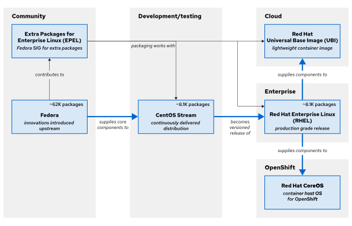
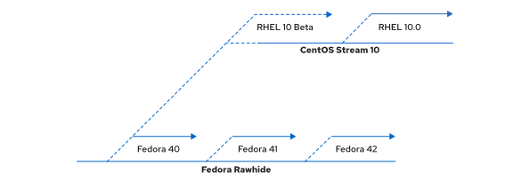

Quản trị hệ thống Red Hat I
---------------------------

# Chương 1. Giới thiệu về Red Hat Enterprise Linux
## Bắt đầu với Red Hat Enterprise Linux
### Mục tiêu
Định nghĩa và giải thích mục đích của Linux, mã nguồn mở, các bản phân phối Linux và Red Hat Enterprise Linux.

### Tại sao bạn nên tìm hiểu về Linux?
Linux là một công nghệ quan trọng mà các chuyên gia CNTT cần nắm vững.

Linux được sử dụng rộng rãi trên toàn thế giới. Người dùng Internet tương tác với các ứng dụng Linux và hệ thống máy chủ web hàng
ngày thông qua việc duyệt World Wide Web cũng như sử dụng các trang web thương mại điện tử để mua bán sản phẩm.

Linux được ứng dụng trong nhiều lĩnh vực vượt xa phạm vi Internet. Hệ điều hành này quản lý các hệ thống điểm bán hàng (POS) và thị
trường chứng khoán toàn cầu, vận hành TV thông minh cùng hệ thống giải trí trên máy bay, đồng thời là nền tảng cho phần lớn trong số
500 siêu máy tính hàng đầu thế giới. Linux cung cấp các công nghệ cốt lõi thúc đẩy cuộc cách mạng điện toán đám mây, cũng như các
công cụ để xây dựng những thế hệ ứng dụng mới nhất dựa trên kiến trúc microservices và container, công nghệ lưu trữ dựa trên phần mềm
và các giải pháp dữ liệu lớn (big data).

Trong các trung tâm dữ liệu hiện đại, Linux và Microsoft Windows là những hệ điều hành chiếm ưu thế. Việc sử dụng Linux vẫn đang tiếp
tục mở rộng trong các lĩnh vực doanh nghiệp, điện toán đám mây và thiết bị. Nhờ sự phổ biến rộng rãi đó, bạn có rất nhiều lý do để
học Linux:

* Người dùng Windows cần tương tác với các hệ thống và ứng dụng Linux.
* Trong phát triển ứng dụng, Linux thường là nền tảng lưu trữ ứng dụng và môi trường thực thi của chúng.
* Trong lĩnh vực điện toán đám mây, cả các instance trên đám mây riêng (private cloud) và đám mây công cộng (public cloud)
đều sử dụng Linux làm hệ điều hành.
* Các ứng dụng di động và thiết bị Internet vạn vật (IoT) thường chạy trên nền tảng Linux.
* Khi tìm kiếm cơ hội nghề nghiệp mới trong ngành CNTT, các kỹ năng về Linux luôn có nhu cầu tuyển dụng cao.

### Điều gì làm nên sự tuyệt vời của Linux?
Nếu ai đó hỏi bạn "Điều gì làm nên sự tuyệt vời của Linux?", thì bạn có rất nhiều câu trả lời để lựa chọn:

#### Linux là phần mềm mã nguồn mở.
Việc là mã nguồn mở đồng nghĩa với việc bạn có thể thấy cách thức hoạt động của một chương trình hoặc hệ thống. Bạn cũng có thể thử
nghiệm các thay đổi và chia sẻ chúng một cách tự do để người khác cùng sử dụng. Mô hình mã nguồn mở giúp việc thực hiện các cải tiến
trở nên dễ dàng hơn, từ đó thúc đẩy đổi mới nhanh chóng hơn.

#### Linux cung cấp giao diện dòng lệnh (CLI) giúp truy cập dễ dàng và hỗ trợ viết tập lệnh mạnh mẽ.
Linux được xây dựng dựa trên triết lý thiết kế cơ bản là người dùng có thể thực hiện mọi tác vụ quản trị thông qua giao diện dòng lệnh (CLI).
Việc sử dụng CLI giúp đơn giản hóa quy trình tự động hóa, triển khai và cấp phát tài nguyên, đồng thời tạo thuận lợi cho
công tác quản trị hệ thống cả ở phạm vi cục bộ lẫn từ xa. Khác với nhiều hệ điều hành khác, các khả năng này đã được tích hợp ngay
trong kiến trúc hệ thống ngay từ đầu, mang lại sự ổn định và tính dễ sử dụng.

#### Linux là một hệ điều hành dạng mô-đun, được thiết kế để có thể dễ dàng thay thế hoặc loại bỏ các thành phần.
Các thành phần của hệ thống có thể được nâng cấp và cập nhật khi cần thiết. Một hệ thống Linux có thể đóng vai trò là máy trạm phát
triển đa năng hoặc là thiết bị phần mềm chuyên dụng đã được tinh giản tối đa.

### Phần mềm mã nguồn mở là gì?
Phần mềm mã nguồn mở là phần mềm có mã nguồn mà bất kỳ ai cũng có thể sử dụng, nghiên cứu, sửa đổi và chia sẻ.

Mã nguồn là tập hợp các chỉ dẫn có thể đọc được bởi con người, được sử dụng để tạo ra một chương trình. Mã nguồn có thể tồn tại dưới
dạng thông dịch (chẳng hạn như tập lệnh - script) hoặc được biên dịch thành tệp nhị phân thực thi để máy tính chạy trực tiếp. Mã
nguồn được bảo hộ bản quyền ngay khi được tạo ra, và chủ sở hữu bản quyền là người quy định các điều kiện về việc sao chép, chỉnh sửa
và phân phối phần mềm đó. Người dùng có thể sử dụng phần mềm theo các điều khoản trong giấy phép phần mềm.

Một số phần mềm sử dụng mã nguồn đóng hoặc mã nguồn độc quyền mà chỉ cá nhân, nhóm hoặc tổ chức tạo ra chúng mới có thể xem, sửa đổi
hoặc phân phối. Các giấy phép độc quyền thường chỉ cho phép người dùng chạy chương trình, đồng thời hạn chế hoặc không cho phép truy
cập vào mã nguồn.

Phần mềm mã nguồn mở có những đặc điểm khác biệt. Khi chủ sở hữu bản quyền cung cấp phần mềm theo giấy phép mã nguồn mở, họ trao cho
người dùng quyền chạy chương trình cũng như quyền xem, sửa đổi, biên dịch và phân phối lại mã nguồn cho người khác mà không phải trả
phí bản quyền. Giấy phép mã nguồn mở thúc đẩy sự hợp tác, chia sẻ, tính minh bạch và đổi mới nhanh chóng, bởi nó khuyến khích nhiều
người cùng sửa đổi, cải tiến phần mềm và chia sẻ rộng rãi các bản nâng cấp đó.

Phần mềm mã nguồn mở vẫn có thể được cung cấp cho mục đích thương mại. Mã nguồn mở là một phần quan trọng trong hoạt động thương mại
của nhiều tổ chức. Một số giấy phép mã nguồn mở cho phép tái sử dụng mã nguồn trong các sản phẩm độc quyền (proprietary products).
Bất kỳ ai cũng có thể bán mã nguồn mở, nhưng các giấy phép mã nguồn mở thường cho phép khách hàng phân phối lại mã nguồn đó. Các nhà
cung cấp giải pháp mã nguồn mở như Red Hat cung cấp dịch vụ hỗ trợ thương mại cho việc triển khai, quản lý và xây dựng các giải pháp
dựa trên các sản phẩm mã nguồn mở.

Mã nguồn mở mang lại nhiều lợi ích cho người dùng:
* Kiểm soát: Hiểu cách mã hoạt động và cải tiến nó.
* Đào tạo: Học hỏi từ mã nguồn thực tế và phát triển thêm các ứng dụng hữu ích.
* Bảo mật: Kiểm tra các đoạn mã nhạy cảm và khắc phục lỗi ngay cả khi không có sự hỗ trợ từ các nhà phát triển ban đầu.
* Tính ổn định: Dựa vào mã nguồn vẫn có thể duy trì hoạt động ngay cả khi không còn nhà phát triển ban đầu.

#### Các loại giấy phép mã nguồn mở
Các nhà phát triển phần mềm mã nguồn mở có thể cấp phép cho phần mềm của họ theo nhiều cách khác nhau. Các điều khoản cấp phép phần
mềm quy định cách thức mã nguồn có thể được tái sử dụng hoặc kết hợp với các đoạn mã khác. Để được coi là mã nguồn mở, các giấy phép
phải cho phép người dùng tự do sử dụng, xem, sửa đổi, biên dịch và phân phối mã nguồn.

Có hai nhóm giấy phép mã nguồn mở phổ biến đặc biệt quan trọng:
* Các giấy phép Copyleft được thiết kế để khuyến khích việc duy trì mã nguồn mở.
* Các giấy phép cho phép (permissive licenses) được thiết kế để tối đa hóa khả năng tái sử dụng mã nguồn.

Copyleft, hay các giấy phép "chia sẻ tương tự" (share-alike), quy định rằng bất kỳ ai phân phối mã nguồn – dù có sửa đổi hay không
– đều phải duy trì quyền tự do cho người khác trong việc sao chép, sửa đổi và phân phối lại mã nguồn đó. Ưu điểm của các giấy phép
copyleft là chúng giúp giữ cho mã nguồn hiện có cũng như các bản cải tiến của nó luôn ở trạng thái mở, đồng thời gia tăng lượng mã
nguồn mở sẵn có. Các giấy phép copyleft phổ biến bao gồm GNU General Public License (GPL) và Lesser GNU Public License (LGPL).

Các giấy phép có tính chất cho phép (permissive licenses) tối đa hóa khả năng tái sử dụng mã nguồn. Bạn có thể sử dụng mã nguồn cho
bất kỳ mục đích nào miễn là vẫn giữ nguyên các thông báo về bản quyền và giấy phép, bao gồm cả việc tái sử dụng mã nguồn đó trong các
sản phẩm áp dụng giấy phép hạn chế hơn hoặc giấy phép độc quyền. Mặc dù việc cấp phép theo hướng này giúp việc tái sử dụng mã nguồn
trở nên dễ dàng, nhưng nó cũng tiềm ẩn nguy cơ khuyến khích các cải tiến chỉ dành cho phần mềm độc quyền. Các ví dụ về loại giấy phép
này bao gồm giấy phép MIT/X11, giấy phép BSD giản lược (Simplified BSD license) và giấy phép Apache Software License 2.0.

#### Ai là người phát triển phần mềm mã nguồn mở?
Ngày nay, hoạt động phát triển mã nguồn mở đã trở nên chuyên nghiệp ở mức độ cao. Mã nguồn mở không còn chỉ được phát triển bởi các
tình nguyện viên nữa. Hiện nay, phần lớn các nhà phát triển mã nguồn mở làm việc cho các tổ chức chi trả thù lao để họ tham gia vào
các dự án mã nguồn mở, nhằm xây dựng và đóng góp những cải tiến mà chính tổ chức đó và khách hàng của họ cần đến.

Các tình nguyện viên và cộng đồng học thuật vẫn đóng vai trò quan trọng và có những đóng góp thiết yếu, đặc biệt là trong lĩnh
vực công nghệ mới nổi. Sự kết hợp giữa quá trình phát triển chính thức và phi chính thức tạo nên một môi trường vô cùng năng động
và hiệu quả.

#### Bản phân phối Linux là gì?
Một bản phân phối Linux là hệ điều hành có thể cài đặt được, được xây dựng từ nhân Linux và hỗ trợ các chương trình cũng như thư viện
người dùng. Một hệ thống Linux hoàn chỉnh được phát triển bởi nhiều cộng đồng độc lập cùng hợp tác thực hiện các thành phần riêng lẻ.
Bản phân phối cung cấp một phương thức thuận tiện để cài đặt và quản lý một hệ thống Linux hoàn chỉnh và hoạt động tốt.

Vào năm 1991, nghiên cứu sinh Linus Torvalds đã phát triển một nhân (kernel) giống UNIX mang tên Linux và cấp phép nó dưới dạng phần
mềm mã nguồn mở theo giấy phép GPL. Nhân hệ điều hành đóng vai trò cốt lõi, chịu trách nhiệm quản lý phần cứng, bộ nhớ và việc điều
phối các chương trình đang chạy. Nhân Linux được bổ sung thêm các phần mềm mã nguồn mở khác—bao gồm các tiện ích và chương trình từ Dự
án GNU cũng như nền tảng đồ họa Wayland—và tích hợp thêm những thành phần mã nguồn mở khác như máy chủ thư điện tử Sendmail và máy chủ
HTTP Apache để tạo thành một hệ điều hành mã nguồn mở hoàn chỉnh mang phong cách UNIX.

Một thách thức lớn đối với người dùng Linux là phải tập hợp tất cả các thành phần phần mềm này từ nhiều nguồn khác nhau. Các nhà phát
triển Linux thời kỳ đầu đã cung cấp các bản phân phối (distribution) bao gồm những công cụ đã được biên dịch sẵn và kiểm thử, cho phép
người dùng tải về và cài đặt để nhanh chóng triển khai hệ thống Linux.

Hiện có rất nhiều bản phân phối Linux, mỗi bản đều có mục tiêu và tiêu chí hỗ trợ riêng. Tuy nhiên, nhìn chung, các bản phân phối này
đều có một số đặc điểm chung:
* Các bản phân phối bao gồm nhân Linux và các chương trình hỗ trợ chạy ở không gian người dùng.
* Các bản phân phối có thể có quy mô nhỏ và phục vụ một mục đích duy nhất, hoặc có thể bao gồm hàng nghìn chương trình mã nguồn mở.
* Các bản phân phối cung cấp phương thức để cài đặt và cập nhật phần mềm cùng các thành phần của nó.
* Nhà cung cấp bản phân phối chịu trách nhiệm hỗ trợ phần mềm và, lý tưởng nhất là, tham gia vào cộng đồng phát triển.

#### Red Hat là ai?
Red Hat là nhà cung cấp giải pháp phần mềm mã nguồn mở hàng đầu thế giới, áp dụng phương thức dựa vào sức mạnh cộng đồng để phát triển
các công nghệ đáng tin cậy và hiệu suất cao trong các lĩnh vực điện toán đám mây, Linux, phần mềm trung gian (middleware), lưu trữ và
ảo hóa. Sứ mệnh của Red Hat là đóng vai trò chất xúc tác kết nối cộng đồng khách hàng, người đóng góp và đối tác nhằm kiến tạo những
công nghệ ưu việt hơn theo tinh thần mã nguồn mở.

Vai trò của Red Hat là hỗ trợ khách hàng kết nối với cộng đồng mã nguồn mở và các đối tác để sử dụng hiệu quả các giải pháp phần mềm
mã nguồn mở. Red Hat tích cực tham gia và hỗ trợ cộng đồng mã nguồn mở. Với bề dày kinh nghiệm, công ty nhận thức rõ tầm quan trọng
của mã nguồn mở đối với tương lai của ngành công nghệ thông tin.

Red Hat được biết đến nhiều nhất nhờ sự tham gia vào cộng đồng Linux và bản phân phối Red Hat Enterprise Linux. Hãng cũng tích cực
hoạt động trong các cộng đồng mã nguồn mở khác, bao gồm các dự án phần mềm trung gian (middleware) xoay quanh cộng đồng nhà phát triển
JBoss. Ngoài ra, Red Hat còn cung cấp các giải pháp ảo hóa, công nghệ đám mây như OpenStack và OpenShift, dự án lưu trữ dựa trên phần
mềm Ceph, cùng nhiều giải pháp khác.

#### Hệ sinh thái Red Hat Enterprise Linux
Red Hat Enterprise Linux (RHEL) là bản phân phối Linux thương mại cấp độ sản xuất của Red Hat. Red Hat phát triển và tích hợp phần mềm
mã nguồn mở vào RHEL thông qua một quy trình gồm nhiều giai đoạn.
* Red Hat tham gia hỗ trợ các dự án mã nguồn mở riêng lẻ. Hãng đóng góp mã nguồn, thời gian của đội ngũ phát triển, các nguồn lực cũng
như sự hỗ trợ, đồng thời thường xuyên hợp tác với các nhà phát triển từ những bản phân phối Linux khác nhằm nâng cao chất lượng phần
mềm nói chung vì lợi ích của cộng đồng.
* Red Hat tài trợ và tích hợp các dự án mã nguồn mở vào Fedora – bản phân phối được phát triển dựa trên cộng đồng. Fedora cung cấp một
môi trường làm việc miễn phí, đóng vai trò là phòng thí nghiệm phát triển và nơi thử nghiệm các tính năng trước khi chúng được đưa vào
CentOS Stream cũng như các sản phẩm RHEL.
* Red Hat đảm bảo tính ổn định cho phần mềm CentOS Stream để sẵn sàng cho việc hỗ trợ dài hạn và chuẩn hóa, sau đó tích hợp nó vào
RHEL – bản phân phối đã sẵn sàng cho môi trường vận hành thực tế (production).

**Hình 1.1: Hệ sinh thái Red Hat Enterprise Linux**  

#### Fedora
Fedora là một dự án cộng đồng chuyên phát triển và phát hành hệ điều hành dựa trên Linux miễn phí và toàn diện. Red Hat tài trợ và hợp
tác với cộng đồng Fedora để tích hợp các phần mềm mới nhất từ nguồn gốc (upstream) vào một bản phân phối an toàn và có tốc độ phát
triển nhanh chóng. Dự án Fedora đóng góp cho cộng đồng mã nguồn mở, và bất kỳ ai cũng có thể tham gia.

Fedora ưu tiên sự đổi mới và chất lượng vượt trội hơn là tính ổn định dài hạn. Các bản cập nhật lớn được phát hành sáu tháng một lần
và mang lại những thay đổi đáng kể. Fedora hỗ trợ các phiên bản trong khoảng một năm—tức là duy trì hai bản cập nhật gần nhất—do đó ít
phù hợp hơn cho các môi trường vận hành thực tế (production) đòi hỏi sự hỗ trợ dài hạn. Tuy nhiên, Fedora vẫn là nguồn khởi nguồn cho
sự đổi mới của toàn bộ hệ sinh thái Enterprise Linux. Thông thường, các gói phần mềm sẽ bắt đầu tại Fedora và chỉ được đưa vào CentOS
Stream khi đã đạt độ chín muồi về tính ổn định, bảo mật, hiệu năng và nhu cầu của khách hàng.

#### Các gói bổ sung cho Enterprise Linux
Một Nhóm Quan tâm Đặc biệt (SIG) thuộc dự án Fedora xây dựng và duy trì một kho gói phần mềm do cộng đồng hỗ trợ có tên là Extra
Packages for Enterprise Linux (EPEL). Các phiên bản EPEL tương thích với các bản phát hành chính của RHEL, cho phép khách hàng sử dụng
RHEL triển khai các khối lượng công việc đòi hỏi những phần mềm phụ thuộc không được hỗ trợ trong RHEL. Các gói EPEL không nằm trong
phạm vi hỗ trợ của Red Hat nhưng có chất lượng tương đương với các gói của Fedora.

Thông thường, các gói EPEL được xây dựng dựa trên các bản phát hành RHEL. EPEL Next là một kho lưu trữ bổ sung cho phép người duy
trì gói xây dựng dựa trên CentOS Stream. Kho lưu trữ này rất hữu ích khi CentOS Stream chứa một bản cập nhật thư viện (rebase) dự
kiến sẽ có trong RHEL, hoặc khi một gói EPEL có yêu cầu về phiên bản tối thiểu mà phiên bản đó đã có trong CentOS Stream nhưng chưa
có trong RHEL.

#### CentOS Stream
CentOS Stream là dự án thượng nguồn (upstream) của RHEL. Quá trình phát triển phiên bản RHEL tiếp theo diễn ra minh bạch và cởi mở với
các đóng góp từ cộng đồng, những đóng góp có thể tác động trực tiếp đến bản phát hành kế tiếp. Các bản vá được gửi tới CentOS Stream
sẽ nhanh chóng được tích hợp vào RHEL, cho phép thực hiện những thay đổi đáng kể ngay trong vòng đời của phiên bản RHEL hiện tại.
CentOS Stream là bản phân phối hỗ trợ quy trình tích hợp và chuyển giao liên tục (CI/CD), cung cấp các bản dựng hàng đêm (nightly
builds) đã qua kiểm thử và đảm bảo tính ổn định.

Dự án CentOS hoan nghênh các cộng tác viên trên toàn thế giới, tạo cơ hội cho các bản phân phối phái sinh từ RHEL đóng góp vào CentOS
Stream nhằm mang lại lợi ích cho chính họ. Dự án cũng hướng tới việc thúc đẩy phần mềm mã nguồn mở bền vững, có khả năng phản ứng 
nhanh chóng trước các lỗ hổng bảo mật, công nghệ mới nổi và những thay đổi trong nhu cầu của khách hàng.

> **Lưu ý**:  
> Trước năm 2019, CentOS Linux là một bản phân phối miễn phí và không có dịch vụ hỗ trợ chính thức; nó được cộng đồng xây dựng dựa
> trên mã nguồn của Red Hat sau mỗi đợt phát hành phiên bản RHEL lớn. Mặc dù cộng đồng CentOS rất ưa chuộng việc có một bản sao RHEL
> miễn phí, mô hình này vẫn tồn tại những hạn chế. Thông thường, các đóng góp của nhà phát triển cho CentOS Linux không được đưa ngược
> lại (backport) vào Fedora hay RHEL nếu không tốn nhiều công sức trùng lặp. Ngoài ra, còn có độ trễ đáng kể giữa thời điểm phát hành
> RHEL và thời điểm xây dựng bản phân phối CentOS tương ứng; tình trạng chậm trễ tương tự cũng xảy ra đối với các bản vá lỗi quan trọng
> của RHEL liên quan đến bảo mật, trình điều khiển (driver) và tinh chỉnh hệ thống. Red Hat đã chuyển sang mô hình CentOS Stream để
> giải quyết các vấn đề này.  
> Một ưu điểm của CentOS Stream là do đóng vai trò là nguồn phát triển cho RHEL, nó hỗ trợ các kiến trúc phần cứng tương tự như RHEL,
> bao gồm Intel/AMD x86_64, ARM64, IBM Power và IBM Z.

Nhiều tổ chức công nghệ tiên phong đã chứng minh rằng CentOS Stream là giải pháp thay thế khả thi cho phiên bản CentOS Linux truyền
thống (vốn là bản phân phối hạ nguồn). CentOS Stream có thể được tải xuống và cài đặt miễn phí cho nhiều mục đích sử dụng, bao gồm cả
phát triển và triển khai sản xuất ở quy mô nhỏ. Đối với những người dùng trong cộng đồng có nhu cầu không phù hợp với mô hình phân
phối liên tục kèm các bản vá lỗi không đồng bộ, Red Hat cung cấp gói đăng ký RHEL dành cho nhà phát triển cá nhân miễn phí để phục vụ
các mục đích quy mô nhỏ, chẳng hạn như trình diễn, tạo mẫu, đảm bảo chất lượng và triển khai sản xuất ở mức độ hạn chế.

#### Red Hat Enterprise Linux
Red Hat Enterprise Linux (RHEL) là bản phân phối Linux của Red Hat, được thiết kế cho môi trường vận hành thực tế (production-ready)
và đi kèm dịch vụ hỗ trợ thương mại. Trong ngành công nghiệp điện toán, RHEL được công nhận là nền tảng hàng đầu cho điện toán mã
nguồn mở. RHEL trải qua quy trình kiểm thử nghiêm ngặt và sở hữu hệ sinh thái đối tác hỗ trợ toàn cầu, cung cấp các dịch vụ chứng nhận
phần cứng và phần mềm, tư vấn, đào tạo, cũng như các cam kết hỗ trợ và bảo trì dài hạn.

Red Hat xây dựng các phiên bản chính của RHEL trực tiếp từ dự án phát triển liên tục CentOS Stream – dự án vốn bắt nguồn từ Fedora.
Mô hình phát triển CentOS Stream có tính mở và cho phép mọi người cùng tham gia đóng góp cũng như phản hồi; mã nguồn của dự án này
được chuẩn bị để trở thành phiên bản chính tiếp theo của RHEL.

RHEL áp dụng mô hình hỗ trợ dựa trên đăng ký (subscription) và không thu phí bản quyền đối với phần mềm mã nguồn mở. Các gói đăng ký
của Red Hat bao gồm dịch vụ hỗ trợ sản phẩm, bảo trì, cập nhật, bản vá bảo mật, cũng như quyền truy cập vào kho kiến thức
(Knowledgebase) trên Cổng thông tin Khách hàng, các tiện ích và tệp cài đặt của các sản phẩm Red Hat.

Bảng dưới đây liệt kê một số điểm khác biệt chính giữa Fedora, CentOS Stream và RHEL.

|                                       | Fedora      | CentOS Stream    | RHEL    |
|---------------------------------------|-------------|------------------|---------|
| Vòng đời dự kiến                      | 12-18 tháng | 5 năm            | 10 năm  |
| Nhà cung cấp phần mềm được chứng nhận | Không       | Thường là không. | Có      |
| Tài liệu được cung cấp bởi            | Cộng đồng   | Cộng đồng        | Red Hat |
| Có sẵn sự hỗ trợ từ chuyên gia        | Không       | Không            | Có      |
| Nhóm bảo mật sản phẩm                 | Không       | Không            | Có      |
| Các chứng chỉ bảo mật                 | Không       | Không            | Có      |
| Các tùy chọn miễn phí                 | Có          | Có               | Có      |
| Các công cụ quản lý                   | Không       | Không            | Có      |

#### Image dựa trên RHEL được tối ưu hóa cho Edge
Red Hat cung cấp một tập hợp các sản phẩm và dịch vụ được tối ưu hóa cho các trường hợp sử dụng tại biên (edge), bao gồm cả image tùy
chỉnh dựa trên RHEL.

RHEL cung cấp khả năng tạo các image hệ điều hành chuyên dụng thông qua công cụ Red Hat Enterprise Linux image builder. Nhờ cơ chế
này, các đội ngũ CNTT có thể xây dựng, triển khai và duy trì những image RHEL này trong thời gian ngắn hơn trong suốt vòng đời của hệ
thống. Các quy trình triển khai dựa trên image được tối ưu hóa cho nhiều kiến trúc biên (edge architecture) khác nhau và có thể tùy
chỉnh để phù hợp với các yêu cầu triển khai tại biên cụ thể.

Các tính năng dành cho môi trường biên (edge) trong RHEL bao gồm khả năng quản lý và mở rộng an toàn, chẳng hạn như triển khai tự
động (zero-touch provisioning), khả năng giám sát tình trạng hệ thống và khắc phục sự cố bảo mật nhanh chóng, tất cả được thực hiện
thông qua một giao diện duy nhất.

#### Red Hat Enterprise Linux CoreOS
Red Hat Enterprise Linux CoreOS (RHCOS) không phải là một hệ điều hành độc lập. CoreOS được xây dựng từ các thành phần của RHEL, sau
đó được phát hành, nâng cấp và quản lý như một phần của Red Hat OpenShift Container Platform (RHOCP) dành cho các ứng dụng
cloud-native (được thiết kế riêng cho môi trường đám mây). Về cơ bản, RHCOS là một máy chủ chứa (container host) chạy RHEL dựa trên
cơ chế image, sử dụng công cụ quản lý container tuân thủ chuẩn CRI-O (Container Runtime Interface) vốn được tích hợp sẵn trong RHOCP.
Để tìm hiểu thêm về Red Hat Enterprise Linux CoreOS, trước tiên bạn nên làm quen với OpenShift và công nghệ container.

#### Red Hat Universal Base Image
Red Hat Universal Base Image (UBI) về cơ bản là một sản phẩm phái sinh của RHEL được phép phân phối lại miễn phí. UBI được thiết kế
làm nền tảng cho các ứng dụng web và ứng dụng cloud-native (được phát triển dưới dạng container). Toàn bộ nội dung của UBI là một tập
con của RHEL với các gói phần mềm có nguồn gốc từ những kênh RHEL an toàn; đồng thời, UBI cũng nhận được sự hỗ trợ tương tự như RHEL
khi vận hành trên các nền tảng được Red Hat hỗ trợ, chẳng hạn như OpenShift và các máy chủ chạy RHEL.

Với UBI, các nhà phát triển có thể tập trung vào ứng dụng của mình bên trong image container. UBI bao gồm các image nền tảng (base
image) và các image ứng dụng (chẳng hạn như Python, Ruby, Node.js, httpd hoặc nginx). UBI cũng bao gồm các kho lưu trữ RPM, cho phép
bạn cập nhật bất kỳ image nền tảng UBI nào để bổ sung các gói phụ thuộc mà ứng dụng của bạn yêu cầu.

#### Phát triển liên tục Red Hat Enterprise Linux
Trong cộng đồng nguồn (upstream) của Fedora, Fedora Rawhide đóng vai trò là môi trường phát triển liên tục phục vụ cho các đợt phát
hành công khai định kỳ của Fedora. Cộng đồng thực hiện thử nghiệm và chuẩn bị các phiên bản nhân Linux, trình điều khiển thiết bị,
tiện ích và ứng dụng mới cho bản phân phối Fedora tiếp theo. Quá trình phát triển các phiên bản chính của RHEL bắt đầu bằng việc chọn
phiên bản Fedora mới nhất làm nền tảng cho CentOS Stream – bản phân phối phát triển liên tục hiện tại.

Trước khi một gói phần mềm được chính thức đưa vào CentOS Stream, nó phải trải qua quá trình kiểm thử nghiêm ngặt để đáp ứng các tiêu
chuẩn dành cho gói phần mềm được đưa vào RHEL. Các bản cập nhật được phát hành trên CentOS Stream cũng chính là các bản cập nhật dành
cho phiên bản phụ của RHEL đang trong quá trình phát triển và chưa được phát hành chính thức.

**Hình 1.2: Quá trình phát triển liên tục của Red Hat Enterprise Linux**  

Fedora 40 được sử dụng làm nền tảng mã nguồn ban đầu cho RHEL 10 và CentOS Stream 10. Khi các gói phần mềm được cập nhật, chúng sẽ
được đưa vào CentOS Stream và bản dựng hàng đêm (nightly build) của RHEL. Các đường liền nét biểu thị các bản phân phối hoặc bản dựng
đã có sẵn cho công chúng sử dụng.

Tương tự như mối quan hệ giữa Fedora Rawhide và Fedora, CentOS Stream là môi trường phát triển liên tục nhằm chuẩn bị cho phiên bản
phụ (minor-version) tiếp theo của RHEL. Red Hat thực hiện các quy trình kiểm thử toàn diện về phần cứng, khả năng tích hợp, các thành
phần phụ thuộc và hiệu năng trước khi phát hành bản phân phối RHEL công khai tiếp theo.

#### Nhận Red Hat Enterprise Linux
Red Hat Enterprise Linux thường được cung cấp kèm theo gói đăng ký hỗ trợ có trả phí, tuy nhiên Red Hat cũng cung cấp nhiều phương
thức để tiếp cận RHEL và các sản phẩm khác trong hệ sinh thái RHEL, trong đó có nhiều lựa chọn hoàn toàn miễn phí.

* Fedora Linux và các bản phân phối phái sinh được cung cấp miễn phí bởi dự án Fedora tại https://fedoraproject.org/, bao gồm cả
phiên bản mới nổi Fedora CoreOS.
* Các gói EPEL và EPEL Next được cung cấp miễn phí từ các kho lưu trữ của dự án EPEL. Hãy tìm hiểu cách sử dụng EPEL tại
https://docs.fedoraproject.org/en-US/epel/.
* CentOS Stream được cung cấp miễn phí tại https://www.centos.org/centos-stream/.

#### Tải xuống bản dùng thử RHEL
Bạn có thể tải bản dùng thử của RHEL tại địa chỉ
https://www.redhat.com/en/technologies/linux-platforms/enterprise-linux/server/trial. Để truy cập và tải xuống các sản phẩm dùng thử,
bạn cần có tài khoản Customer Portal (miễn phí) tại https://access.redhat.com. Các bản dùng thử sản phẩm cho phép bạn nhận các bản
cập nhật và hỗ trợ trong một khoảng thời gian nhất định. Dịch vụ hỗ trợ sẽ kết thúc khi thời hạn dùng thử hết hiệu lực, tuy nhiên
phần mềm dùng thử vẫn sẽ tiếp tục hoạt động. Bạn có thể tìm thêm thông tin về nhiều sản phẩm dùng thử khác nhau trên các trang dành
cho bản dùng thử tại Customer Portal.

#### Gói đăng ký dành cho nhà phát triển Red Hat
Red Hat cung cấp gói đăng ký miễn phí cho nhiều sản phẩm thông qua chương trình Red Hat Developer tại địa chỉ
https://developer.redhat.com. Với gói đăng ký Red Hat Developer, các nhà phát triển có thể nhanh chóng tạo, xây dựng nguyên mẫu,
thử nghiệm và trình diễn ứng dụng của mình trên cùng loại phần mềm Red Hat được sử dụng trong các hệ thống thực tế (production).

Hãy tạo tài khoản cá nhân tại https://access.redhat.com, sau đó đăng ký tham gia chương trình Red Hat Developer Subscription. Bạn có
thể sử dụng tài khoản cá nhân hiện có, nhưng không được dùng tài khoản đã liên kết với gói đăng ký hỗ trợ của bất kỳ tổ chức nào. Red
Hat Developer Subscription là gói dịch vụ tự hỗ trợ nhưng vẫn cung cấp các bản cập nhật sản phẩm định kỳ. Red Hat khuyến nghị những
cá nhân muốn tích lũy kinh nghiệm với RHEL và các sản phẩm dành cho nhà phát triển nên tham gia chương trình Red Hat Developer.

#### Các nền tảng đám mây công cộng
Các nhà cung cấp dịch vụ đám mây công cộng quy mô lớn (hyperscale) hàng đầu như Amazon Web Services, Google Cloud Platform và
Microsoft Azure đều cung cấp các image chính thức để triển khai các instance Red Hat Enterprise Linux, đi kèm với khả năng quản lý
gói đăng ký thông qua dịch vụ Red Hat Cloud Access. Các gói đăng ký đầy đủ quyền lợi dành cho RHEL và các sản phẩm của Red Hat có thể
được mua trực tiếp từ nhà cung cấp dịch vụ đám mây và có tính linh hoạt, cho phép sử dụng trên các môi trường đám mây lai (hybrid
cloud) cũng như môi trường đa nhà cung cấp (multivendor cloud).

#### Container
Bạn có thể sử dụng Red Hat Universal Base Images (UBI) và các nội dung đi kèm cho mục đích phát triển và triển khai mà không cần gói
đăng ký dịch vụ của Red Hat. Tuy nhiên, để được hỗ trợ vận hành và sử dụng các công cụ không thuộc UBI, các container được xây dựng
trên nền tảng UBI cần được triển khai trên một nền tảng được Red Hat hỗ trợ, chẳng hạn như OpenShift hoặc Red Hat Enterprise Linux.
Việc truy cập vào các nội dung không thuộc UBI đòi hỏi phải có gói đăng ký dịch vụ của Red Hat.

#### Chế độ Image cho Red Hat Enterprise Linux
Image mode dành cho Red Hat Enterprise Linux 10 là một phương pháp triển khai và quản lý mới, sử dụng các công cụ native-container để
xây dựng, triển khai và quản lý hệ điều hành. Với phương pháp này, bạn có thể triển khai hệ điều hành từ một image container có khả
năng khởi động (bootc).

Bạn có thể thêm phần mềm hoặc các thành phần phụ thuộc để xây dựng image, sau đó đẩy nó lên registry. Chế độ Image trên RHEL giúp hạn
chế tình trạng sai lệch cấu trúc hạ tầng (infrastructure drift), hỗ trợ khả năng mở rộng và đơn giản hóa quá trình khắc phục sự cố.
