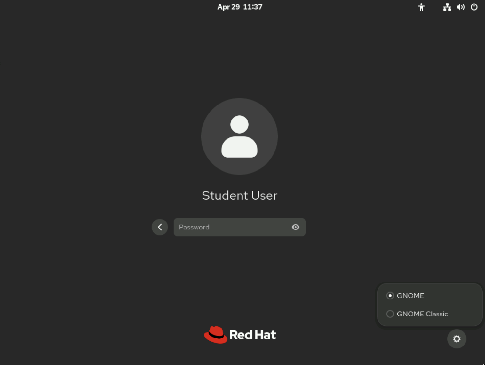
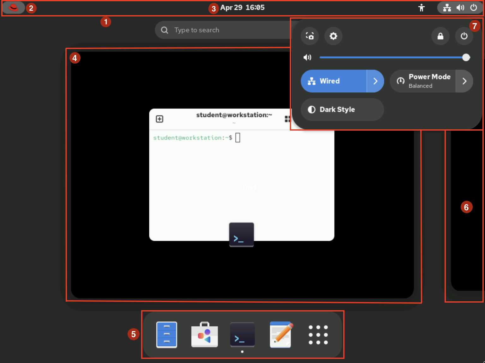
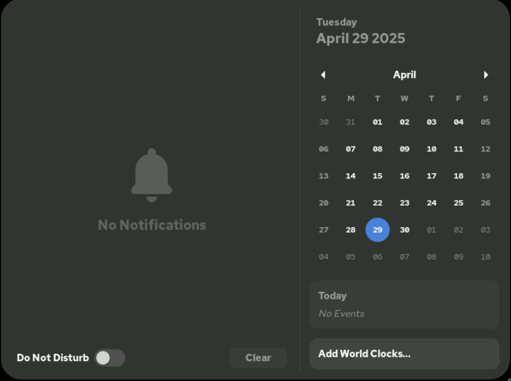
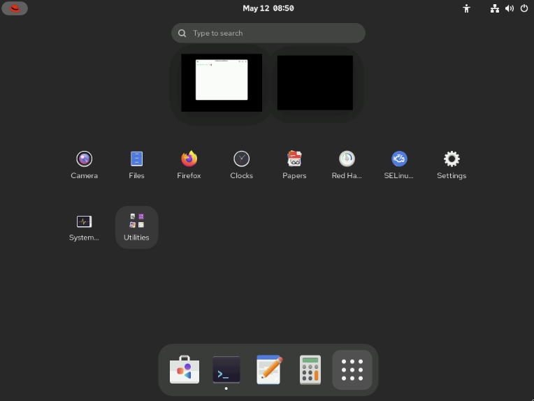

Quản trị hệ thống Red Hat I
---------------------------

# Chương 2. Truy cập dòng lệnh
## Truy cập dòng lệnh trong giao diện văn bản
### Mục tiêu
Đăng nhập vào hệ thống Linux và chạy các lệnh đơn giản bằng cách sử dụng shell.

### Giới thiệu về Bash Shell
Dòng lệnh là giao diện dựa trên văn bản được sử dụng để nhập các chỉ dẫn vào hệ thống máy tính. Dòng lệnh Linux được cung cấp bởi một
chương trình có tên là shell. Nhiều biến thể của chương trình shell đã được phát triển qua nhiều năm. Mỗi người dùng có thể sử dụng một
loại shell khác nhau, nhưng Red Hat khuyến nghị sử dụng shell mặc định cho công tác quản trị hệ thống.

Shell người dùng mặc định trong Red Hat Enterprise Linux (RHEL) là GNU Bourne-Again Shell (Bash). Bash shell là phiên bản cải tiến của
Bourne shell (sh) nguyên bản trên các hệ thống UNIX.

Shell hiển thị một chuỗi ký tự khi đang chờ người dùng nhập liệu; chuỗi này được gọi là dấu nhắc shell (shell prompt). Khi một người 
dùng thông thường khởi động shell, dấu nhắc sẽ có ký tự đô la (`$`) ở cuối:

```
user@host:~$
```

Khi shell đang chạy với quyền siêu người dùng (người dùng root), dấu nhắc lệnh sẽ kết thúc bằng ký tự thăng (`#`):

```
root@host:~#
```
Ký hiệu dấu thăng (`#`) biểu thị shell của người dùng cấp cao (superuser). Việc nhận biết shell của người dùng cấp cao giúp bạn tránh
được các sai sót có thể ảnh hưởng đến toàn bộ hệ thống.

Việc sử dụng Bash để thực thi các lệnh mang lại sức mạnh to lớn. Bash shell cung cấp một ngôn ngữ kịch bản hỗ trợ tự động hóa tác vụ.
Shell này sở hữu các tính năng cho phép thực hiện hoặc đơn giản hóa những thao tác vốn khó triển khai trên quy mô lớn nếu chỉ sử dụng
các công cụ đồ họa.

#### Những điều cơ bản về Shell
Các lệnh được nhập tại dấu nhắc shell bao gồm ba phần cơ bản:

* Lệnh cần thực thi.
* Các tùy chọn để điều chỉnh cách thức hoạt động của lệnh.
* Các đối số, thường là đối tượng tác động của lệnh.

Lệnh là tên của chương trình cần thực thi. Theo sau lệnh có thể là một hoặc nhiều tùy chọn giúp điều chỉnh cách thức hoạt động của lệnh
đó. Các tùy chọn thường bắt đầu bằng một hoặc hai dấu gạch ngang (ví dụ: `-a` hoặc `--all`) để phân biệt chúng với các đối số. Lệnh
cũng có thể đi kèm với một hoặc nhiều đối số; các đối số này thường xác định đối tượng mà lệnh sẽ tác động lên.

Ví dụ, trong chuỗi lệnh `usermod -L user01`, `usermod` là lệnh, `-L` là tùy chọn và `user01` là đối số. Lệnh này khóa mật khẩu của tài
khoản người dùng `user01`.

### Đăng nhập vào hệ thống cục bộ
Terminal là giao diện dựa trên văn bản dùng để nhập lệnh vào và hiển thị kết quả đầu ra từ hệ thống máy tính. Để chạy shell, bạn cần
đăng nhập vào máy tính thông qua terminal.

Bàn phím và màn hình có thể được kết nối trực tiếp với máy tính để thực hiện các thao tác nhập và xuất dữ liệu; đây chính là bảng điều
khiển vật lý (physical console) của máy tính chạy Linux. Bảng điều khiển vật lý này hỗ trợ nhiều bảng điều khiển ảo (virtual console),
cho phép chạy trên các phiên làm việc đầu cuối (terminal) riêng biệt. Mỗi bảng điều khiển ảo hỗ trợ một phiên đăng nhập độc lập. Bạn có
thể chuyển đổi giữa các bảng điều khiển ảo bằng cách nhấn đồng thời tổ hợp phím Ctrl+Alt và một phím chức năng (từ F1 đến F6). Hầu hết
các bảng điều khiển ảo này đều chạy một trình mô phỏng đầu cuối cung cấp giao diện đăng nhập dạng văn bản; khi nhập đúng tên người dùng
và mật khẩu, bạn sẽ đăng nhập thành công và nhận được dấu nhắc lệnh (shell prompt).

Máy tính có thể hiển thị giao diện đăng nhập đồ họa trên một trong các bảng điều khiển ảo. Bạn có thể sử dụng giao diện này để đăng
nhập vào môi trường đồ họa; môi trường đồ họa cũng hoạt động trên một bảng điều khiển ảo. Để có được dấu nhắc lệnh (shell prompt), bạn
cần khởi chạy một chương trình giả lập thiết bị đầu cuối (terminal) trong môi trường đồ họa đó. Dấu nhắc lệnh sẽ xuất hiện trong cửa sổ
của chương trình giả lập thiết bị đầu cuối này.

Trong Red Hat Enterprise Linux 10, nếu có sẵn môi trường đồ họa, màn hình đăng nhập sẽ chạy trên giao diện điều khiển ảo (virtual
console) đầu tiên, có tên là tty1. Năm giao diện đăng nhập dạng văn bản bổ sung cũng có sẵn trên các giao diện điều khiển ảo từ số 2 
(`tty2`) đến số 6 (`tty6`).

Môi trường đồ họa sẽ khởi động trên console ảo đầu tiên chưa bị phiên đăng nhập nào sử dụng. Thông thường, phiên làm việc đồ họa của
bạn sẽ thay thế lời nhắc đăng nhập trên console ảo thứ hai (`tty2`). Tuy nhiên, nếu console đó đang được sử dụng bởi một phiên đăng
nhập văn bản đang hoạt động (chứ không chỉ là lời nhắc đăng nhập), thì console ảo trống tiếp theo sẽ được sử dụng thay thế.

Màn hình đăng nhập đồ họa vẫn tiếp tục chạy trên console ảo đầu tiên (`tty1`). Nếu bạn đã đăng nhập vào một phiên làm việc đồ họa và
chuyển sang người dùng khác trong môi trường đồ họa mà không đăng xuất, thì một môi trường đồ họa khác sẽ được khởi động cho người dùng
đó trên console ảo khả dụng tiếp theo.

Khi bạn đăng xuất khỏi môi trường đồ họa, hệ thống sẽ thoát khỏi console ảo, và console vật lý sẽ tự động chuyển về màn hình đăng nhập
đồ họa trên console ảo đầu tiên.

Máy chủ không màn hình (headless server) là loại máy chủ không được kết nối cố định với bàn phím hay màn hình hiển thị. Một trung tâm
dữ liệu có thể chứa rất nhiều tủ rack gồm các máy chủ loại này; việc không trang bị bàn phím và màn hình riêng cho từng máy giúp tiết
kiệm không gian và chi phí. Để quản trị viên có thể đăng nhập, máy chủ này thường cung cấp giao diện đăng nhập thông qua cổng console
nối tiếp (serial console); cổng này kết nối với một thiết bị console server có hỗ trợ mạng để cho phép truy cập từ xa.

Console nối tiếp (serial console) thường được sử dụng để truy cập máy chủ trong trường hợp card mạng bị cấu hình sai, khiến việc đăng
nhập vào máy chủ qua kết nối mạng thông thường trở nên bất khả thi. Tuy nhiên, phần lớn thời gian, các máy chủ không có màn hình 
headless server) được truy cập thông qua các phương thức khác qua mạng; chẳng hạn như sử dụng Giao thức Máy tính Từ xa (RDP) để chạy
giao diện đồ họa trên máy đích.

### Đăng nhập vào hệ thống từ xa
Người dùng và quản trị viên Linux thường cần truy cập vào giao diện dòng lệnh (shell) của một hệ thống từ xa thông qua kết nối mạng.
Trong môi trường điện toán hiện đại, nhiều máy chủ không có màn hình và bàn phím gắn trực tiếp (headless server) thực chất là các máy
ảo hoặc các instance chạy trên nền tảng đám mây công cộng hay riêng tư. Các hệ thống này không tồn tại dưới dạng vật lý và không có
bảng điều khiển phần cứng (console) thực; thậm chí, chúng có thể không cung cấp quyền truy cập vào bảng điều khiển vật lý (được mô
phỏng) hay cổng giao tiếp nối tiếp (serial console).

Trên Linux, phương thức phổ biến nhất để truy cập vào giao diện dòng lệnh của một hệ thống từ xa là sử dụng Secure Shell (SSH). Hầu hết
các hệ thống Linux (bao gồm cả Red Hat Enterprise Linux) và macOS đều cung cấp chương trình dòng lệnh `ssh` thuộc bộ OpenSSH để thực
hiện tác vụ này.

Trong ví dụ dưới đây, một người dùng đang thao tác tại giao diện dòng lệnh trên máy chủ cục bộ (host machine) sẽ sử dụng lệnh `ssh` để
đăng nhập vào hệ thống Linux từ xa có tên là `remotehost` với tư cách là người dùng `remoteuser`:

```
user@host:~$ ssh remoteuser@remotehost
remoteuser@remotehost's password: password
remoteuser@remotehost:~$
```

Lệnh ssh mã hóa kết nối để bảo vệ quá trình truyền thông tin, ngăn chặn việc nghe lén hoặc đánh cắp mật khẩu và nội dung.

Để tăng cường bảo mật, một số hệ thống — chẳng hạn như các instance đám mây mới — không cho phép người dùng đăng nhập bằng mật khẩu khi sử
dụng giao thức SSH. Một phương thức khác để xác thực với máy chủ từ xa mà không cần nhập mật khẩu là sử dụng xác thực bằng khóa công
khai (public key authentication).

Với phương thức xác thực này, người dùng sở hữu một tệp định danh đặc biệt chứa khóa bí mật (private key) — thứ đóng vai trò tương
đương mật khẩu và cần được giữ bí mật. Tài khoản của họ trên máy chủ được cấu hình với khóa công khai (public key) tương ứng; khóa này
không cần phải giữ bí mật. Khi đăng nhập, người dùng có thể thêm một tham số vào lệnh `ssh` để chỉ định tệp khóa bí mật. Nếu khóa công
khai tương ứng đã được cài đặt cho tài khoản đó trên máy chủ từ xa, hệ thống sẽ cho phép đăng nhập mà không yêu cầu nhập mật khẩu.

Trong ví dụ dưới đây, một người dùng đang thao tác tại dòng lệnh (shell prompt) trên máy cục bộ sẽ sử dụng phương thức xác thực bằng
khóa công khai để đăng nhập vào hệ thống từ xa có tên `remotehost` với tư cách là người dùng `remoteuser`. Tùy chọn `-i` của lệnh `ssh`
được sử dụng để chỉ định tệp khóa bí mật của người dùng, cụ thể là `mylab.pem`. Khóa công khai tương ứng đã được thiết lập sẵn dưới
dạng khóa được ủy quyền (authorized key) trong tài khoản `remoteuser`.

```
user@host:~$ ssh -i mylab.pem remoteuser@remotehost
remoteuser@remotehost:~$
```

Vì lý do bảo mật, chỉ người dùng sở hữu tệp mới được phép đọc tệp khóa riêng (private key). OpenSSH sẽ chặn việc sử dụng khóa riêng
nếu quyền truy cập tệp không chính xác, nhằm cảnh báo người dùng rằng khóa riêng của họ đang ở trạng thái không an toàn. Trong ví dụ
trước, khi khóa riêng nằm trong tệp `mylab.pem`, bạn có thể sử dụng lệnh `chmod 600 mylab.pem` để đảm bảo rằng chỉ chủ sở hữu mới có
thể đọc tệp này.

Người dùng cũng có thể đã cấu hình các khóa riêng để hệ thống tự động thử sử dụng, nhưng chủ đề đó nằm ngoài phạm vi của phần này.
Để biết thêm thông tin về OpenSSH và cơ chế xác thực bằng khóa công khai (public key authentication), hãy tham khảo mục
[Sử dụng giao tiếp bảo mật giữa hai hệ thống với OpenSSH](https://docs.redhat.com/en/documentation/red_hat_enterprise_linux/10/html-single/securing_networks/index)
trong tài liệu hướng dẫn *Securing Networks* (Bảo mật mạng) của Red Hat Enterprise Linux 10.

### Đăng nhập lần đầu vào hệ thống từ xa
Mỗi khi bạn kết nối với một máy chủ từ xa bằng lệnh `ssh`, máy chủ đó sẽ gửi khóa máy chủ (host key) của nó để xác thực danh tính và
hỗ trợ thiết lập kênh giao tiếp được mã hóa. Lệnh `ssh` sẽ so sánh khóa máy chủ này với danh sách các khóa đã được lưu trước đó để đảm
bảo rằng khóa chưa bị thay đổi.

Khi bạn đăng nhập vào một máy lần đầu tiên, máy chủ từ xa chưa biết các khóa của bạn, do đó SSH sẽ hiển thị cảnh báo rằng nó không thể
xác thực máy chủ đó:

```
user@host:~$ ssh -i mylab.pem remoteuser@remotehost
The authenticity of host 'remotehost (192.0.2.42)' can't be established.
ECDSA key fingerprint is 47:bf:82:cd:fa:68:06:ee:d8:83:03:1a:bb:29:14:a3.
Are you sure you want to continue connecting (yes/no)? yes
remoteuser@remotehost:~$
```

Bạn sẽ nhận được thông báo này khi máy cục bộ chưa lưu khóa máy chủ (host key) của máy chủ từ xa. Nếu bạn chọn "yes", khóa máy chủ do
máy chủ từ xa gửi đến sẽ được chấp nhận và lưu lại để sử dụng cho các lần kết nối sau. Quá trình đăng nhập sẽ tiếp tục và bạn sẽ không
còn thấy thông báo này nữa khi kết nối với máy chủ đó. Nếu bạn chọn "no", khóa máy chủ sẽ bị từ chối và kết nối sẽ bị đóng lại.

Nếu máy cục bộ đã lưu khóa máy chủ nhưng khóa này không khớp với khóa do máy chủ từ xa gửi đến, kết nối sẽ tự động bị đóng kèm theo
một cảnh báo.

### Đăng xuất khỏi hệ thống từ xa
Khi đã hoàn tất công việc trong shell và muốn thoát, bạn có thể chọn một trong số các cách để kết thúc phiên làm việc. Bạn có thể nhập
lệnh `exit` để chấm dứt phiên shell hiện tại. Ngoài ra, bạn cũng có thể kết thúc phiên làm việc bằng cách nhấn tổ hợp phím `Ctrl+D`.

Ví dụ dưới đây minh họa việc người dùng đăng xuất khỏi một phiên SSH:

```
remoteuser@remotehost:~$ exit
logout
Connection to remotehost closed.
user@host:~$
```

## Truy cập dòng lệnh từ môi trường máy tính để bàn
### Mục tiêu
Đăng nhập vào hệ thống Linux sử dụng môi trường máy tính để bàn GNOME và thực thi các lệnh từ dấu nhắc shell trong một chương trình
terminal.

### Môi trường làm việc GNOME
Môi trường máy tính để bàn là giao diện người dùng đồ họa trên hệ thống Linux. GNOME 47 là môi trường máy tính để bàn mặc định trong
Red Hat Enterprise Linux 10. GNOME cung cấp một môi trường làm việc tích hợp cho người dùng và một nền tảng phát triển thống nhất,
hoạt động trên nền tảng khung đồ họa được vận hành bởi Wayland.

GNOME Shell – thành phần có khả năng tùy biến cao – đảm nhiệm các chức năng giao diện người dùng cốt lõi cho môi trường máy tính để
bàn. Trong RHEL 10, giao diện mặc định của GNOME Shell là chủ đề GNOME tiêu chuẩn; đây cũng là giao diện được sử dụng trong phần này.
Bạn có thể chuyển từ chủ đề mặc định sang chủ đề GNOME Classic – giao diện có phong cách gần gũi hơn với các phiên bản GNOME trước
đây. Bạn có thể thiết lập chủ đề này một cách cố định bằng cách nhấp vào biểu tượng Cài đặt (Settings) tại màn hình đăng nhập. Biểu
tượng Cài đặt sẽ xuất hiện sau khi bạn chọn tài khoản người dùng nhưng trước khi nhập mật khẩu.

**Hình 2.1: Màn hình đăng nhập RHEL 10**  


Trong lần đầu tiên đăng nhập với tư cách là người dùng mới, chương trình giới thiệu (Tour) sẽ tự động khởi chạy để cung cấp cái nhìn
tổng quan nhanh về các tính năng mới trên giao diện desktop của RHEL 10. Chương trình này hoàn toàn không bắt buộc và bạn có thể đóng
cửa sổ để bỏ qua.

#### Các thành phần của GNOME Shell
Giao diện người dùng GNOME Shell bao gồm một số thành phần chính, như được hiển thị trong ảnh chụp màn hình dưới đây.

**Môi trường máy tính để bàn GNOME**  


* 1 - Thanh trên cùng: Thanh chạy dọc theo phần trên cùng của màn hình luôn hiển thị, ngay cả khi bạn vào chế độ Tổng quan Hoạt động
(Activities Overview) hoặc chuyển đổi không gian làm việc. Thanh này cho phép truy cập thuận tiện vào chế độ Tổng quan Hoạt động,
khay thông báo và menu hệ thống.
* 2 - Tổng quan Hoạt động (Activities Overview): Chế độ này giúp sắp xếp các cửa sổ và khởi động ứng dụng. Bạn có thể truy cập Tổng
quan Hoạt động bằng cách nhấp vào biểu tượng Red Hat ở góc trên bên trái của thanh công cụ phía trên, hoặc nhấn phím Super. Phím Super
(đôikhi còn được gọi là phím Windows hoặc phím Command) thường nằm gần góc dưới bên trái trên hầu hết các loại bàn phím phổ biến. Ba
khuvực chính của Tổng quan Hoạt động bao gồm: bộ chọn không gian làm việc nằm ở bên phải khu vực hiển thị tổng quan cửa sổ, khu vực
hiển thị tổng quan cửa sổ ở chính giữa, và thanh Dash nằm ở cuối màn hình.
* 3 - Khay thông báo: Khay thông báo hiển thị các thông báo từ ứng dụng hoặc các thành phần hệ thống. Thông thường, thông báo sẽ xuất
hiện thoáng qua dưới dạng một dòng đơn ở phía trên cùng màn hình, đồng thời một biểu tượng chỉ báo sẽ hiện diện trên thanh phía trên
(cạnh đồng hồ) để báo hiệu các thông báo mới nhận. Bạn có thể mở khay thông báo để xem lại các thông báo này bằng cách nhấp vào đồng
hồ trên thanh phía trên hoặc nhấn tổ hợp phím Super+M. Để đóng khay thông báo, hãy nhấp vào đồng hồ trên thanh phía trên, hoặc nhấn
phím Esc hay tổ hợp phím Super+M một lần nữa. Khay thông báo cũng hiển thị lịch và thông tin về các sự kiện trong lịch.

**Hình 2.2: Khay tin nhắn**  


* 4 - Tổng quan về cửa sổ: Khu vực nằm ở giữa giao diện Tổng quan Hoạt động (Activities Overview), hiển thị hình ảnh thu nhỏ của các
cửa sổ đang mở trong không gian làm việc hiện tại. Bạn có thể đưa các cửa sổ lên phía trước khi không gian làm việc đang bị rối, hoặc
di chuyển chúng sang một không gian làm việc khác.
* 5 - Dash: Danh sách các biểu tượng có thể tùy chỉnh này hiển thị các ứng dụng yêu thích, các ứng dụng đang chạy và biểu tượng "Hiển
thị ứng dụng" (Show Applications) để chọn thêm các ứng dụng khác. Bạn có thể khởi chạy ứng dụng bằng cách nhấp vào biểu tượng của ứng
dụng đó hoặc sử dụng tính năng "Hiển thị ứng dụng" để tìm các ứng dụng ít được sử dụng hơn. Dash còn được gọi là dock.
* 6 - Bộ chọn không gian làm việc: Một khu vực trong Tổng quan Hoạt động (Activities Overview), nằm ở bên phải phần tổng quan các cửa
sổ. Bộ chọn không gian làm việc hiển thị các không gian làm việc đang hoạt động và cho phép bạn chuyển đổi giữa chúng.
* 7 - Menu hệ thống: Menu nằm ở góc trên bên phải của thanh công cụ phía trên cung cấp quyền truy cập vào nhiều chức năng và cài đặt
khác nhau. Bạn có thể quay màn hình, truy cập cài đặt tài khoản, khóa màn hình, đăng xuất khỏi hệ thống và tắt hệ thống. Ngoài ra, bạn
còn có thể điều chỉnh độ sáng màn hình cũng như bật hoặc tắt kết nối mạng. Bạn cũng có thể kích hoạt chế độ Giao diện tối (Dark
Style); chế độ này áp dụng cho tất cả các cửa sổ ngoại trừ các ứng dụng cũ (legacy applications). Menu hệ thống cũng cho phép bạn bật
hoặc tắt các kết nối mạng và VPN.

#### Phím tắt
GNOME Shell cho phép bạn tùy chỉnh các phím tắt để điều hướng trong môi trường máy tính để bàn. Hãy mở menu hệ thống ở góc trên bên
phải và nhấp vào biểu tượng Cài đặt (Settings). Trong cửa sổ ứng dụng vừa mở, hãy chọn mục Bàn phím (Keyboard) ở khung bên trái. Khung
bên phải sẽ hiển thị các cài đặt phím tắt hiện tại của bạn tại mục Phím tắt Bàn phím (Keyboard Shortcuts) → Xem và Tùy chỉnh Phím tắt 
View and Customize Shortcuts).

Một số phím tắt, chẳng hạn như các phím chức năng hoặc phím Super, có thể khó truyền tải đến máy ảo. Các tổ hợp phím đặc biệt mà những
phím tắt này sử dụng có thể bị hệ điều hành cục bộ hoặc ứng dụng mà bạn đang dùng để truy cập giao diện đồ họa của máy ảo "bắt" lấy
(xử lý) trước.

**Quan trọng**

* Trong một số môi trường đào tạo của Red Hat, trình duyệt web của bạn có thể không chuyển phím Super (phím Windows) tới máy ảo trong
môi trường lớp học. Để khắc phục vấn đề này, bạn có thể sử dụng bàn phím ảo trên màn hình.
* Tại phần trên cùng của cửa sổ trình duyệt hiển thị giao diện máy ảo, hãy nhấp vào biểu tượng bàn phím ở phía bên phải. Một bàn phím
ảo trên màn hình sẽ xuất hiện. Hãy nhấp lại vào biểu tượng đó để đóng bàn phím ảo.
* Bàn phím ảo coi phím Super là một phím bổ trợ, thường được giữ trong khi nhấn một phím khác. Nếu bạn nhấp vào phím này một lần, nó
sẽ chuyển sang màu vàng để biểu thị rằng phím đang được giữ. Ví dụ: để nhập tổ hợp phím Super+M trên bàn phím ảo, hãy nhấp vào phím
Super, sau đó nhấp vào phím M.
* Để nhấn và nhả phím Super trên bàn phím ảo, hãy nhấp vào phím đó hai lần. Lần nhấp đầu tiên sẽ giữ phím Super, và lần nhấp thứ hai
sẽ nhả phím này ra.
* Các phím khác được bàn phím ảo coi là phím bổ trợ bao gồm Shift, Ctrl, Alt và Caps. Các phím Esc và Menu được coi là phím thông
thường chứ không phải phím bổ trợ.

#### Truy cập Không gian làm việc
Không gian làm việc (workspace) là các màn hình desktop riêng biệt hiển thị cửa sổ của nhiều ứng dụng khác nhau. Bạn có thể sử dụng
không gian làm việc để tổ chức môi trường làm việc bằng cách nhóm các cửa sổ ứng dụng đang mở theo từng tác vụ. Ví dụ: bạn có thể nhóm
các cửa sổ phục vụ một hoạt động bảo trì hệ thống cụ thể (như thiết lập máy chủ từ xa mới) vào một không gian làm việc, và nhóm các
ứng dụng email cùng các công cụ liên lạc khác vào một không gian làm việc khác.

Để chuyển đổi giữa các không gian làm việc, bạn có thể chọn một trong hai cách sau. Cách thứ nhất là nhấn tổ hợp phím **Ctrl+Alt+Mũi
tên Trái** hoặc **Ctrl+Alt+Mũi tên Phải** để chuyển đổi tuần tự giữa các không gian làm việc.

Cách thứ hai là truy cập vào chế độ Tổng quan Hoạt động (Activities Overview) bằng cách nhấp vào biểu tượng Red Hat ở góc trên bên
trái, sau đó nhấp chọn không gian làm việc mong muốn.

**Quan trọng**

* Tương tự như khi sử dụng phím Super, tại một số môi trường đào tạo của Red Hat, trình duyệt web thường không chuyển tiếp các tổ hợp
phím Ctrl+Alt tới máy ảo trong môi trường lớp học.
* Bạn có thể sử dụng bàn phím ảo để nhập các tổ hợp phím chuyển đổi không gian làm việc. Cần có ít nhất hai không gian làm việc đang
hoạt động. Hãy mở bàn phím ảo, nhấn phím Ctrl, nhấn phím Alt, rồi nhấn phím Mũi tên Trái hoặc Mũi tên Phải.
* Tuy nhiên, trong các môi trường huấn luyện đó, thường thì việc tránh sử dụng các phím tắt và bàn phím ảo sẽ đơn giản hơn. Thay vào
đó, hãy sử dụng công cụ chọn không gian làm việc trong phần Tổng quan Hoạt động (Activities Overview).

Một ưu điểm của việc sử dụng chế độ Tổng quan Hoạt động (Activities Overview) để chọn không gian làm việc là bạn có thể nhấp và kéo
các cửa sổ giữa các không gian làm việc với nhau. Bạn có thể xem các không gian làm việc đang hoạt động bằng cách nhấp vào mục Hiển
thị Ứng dụng (Show Applications) trên thanh Dash; các không gian làm việc này sẽ hiển thị bên dưới thanh tìm kiếm.

**Hình 2.3: Hiển thị các không gian làm việc đang hoạt động**  


Các không gian làm việc có thể được thiết lập ở chế độ động hoặc cố định. Chế độ không gian làm việc động là cài đặt mặc định. Với chế
độ này, bạn tạo không gian làm việc bằng cách kéo các cửa sổ từ không gian này sang không gian khác, và các không gian làm việc trống
sẽ tự động bị loại bỏ. Ngoài ra, bạn có thể thiết lập một số lượng không gian làm việc cố định luôn hiển thị, bao gồm cả những không
gian đang trống.

Để cấu hình cài đặt không gian làm việc, hãy vào menu Hệ thống (System) → Cài đặt (Settings) → Đa nhiệm (Multitasking). Tại đây, bạn
có thể chọn Không gian làm việc động (Dynamic Workspaces) hoặc Số lượng không gian làm việc cố định (Fixed Number of Workspaces).

#### Khởi động Terminal
Trong RHEL 10, trình giả lập terminal Ptyxis thay thế cho GNOME Terminal. Hãy sử dụng một trong các phương pháp sau để khởi động
terminal:

* Từ màn hình Tổng quan Hoạt động (Activities Overview), hãy chọn Terminal từ thanh Dash bằng cách nhấp vào biểu tượng của nó hoặc sử
dụng mục Hiển thị Ứng dụng (Show Applications).
* Tìm kiếm từ khóa "terminal" trong ô tìm kiếm ở phía trên cùng của màn hình tổng quan cửa sổ.
* Nhấn tổ hợp phím Alt+F2 để mở màn hình chạy lệnh (Run a Command), sau đó nhập "ptyxis" để khởi động terminal.

Khi bạn mở một cửa sổ terminal, dấu nhắc shell sẽ hiển thị cho người dùng đã khởi chạy chương trình terminal giao diện đồ họa.
Dấu nhắc shell và thanh tiêu đề của cửa sổ terminal cho biết tên người dùng, tên máy chủ và thư mục làm việc hiện tại.

#### Khóa màn hình và Đăng xuất
Hãy khóa màn hình hoặc đăng xuất hoàn toàn bằng cách sử dụng menu hệ thống ở góc trên bên phải.

Để khóa màn hình, hãy vào menu hệ thống và nhấp vào biểu tượng Khóa (Lock) ở phía bên phải của menu, hoặc nhấn tổ hợp phím **Super+L**
(có thể dễ nhớ hơn là **Windows+L**). Màn hình cũng sẽ tự động khóa nếu phiên làm việc đồ họa không có hoạt động nào trong vài phút.

Một màn hình khóa sẽ xuất hiện, hiển thị thời gian hệ thống và tên người dùng đang đăng nhập. Để mở khóa màn hình, bạn có thể nhấn
phím Enter, phím Space hoặc nhấp chuột trái. Sau đó, hãy nhập mật khẩu của người dùng đó trên màn hình khóa.

Để đăng xuất và kết thúc phiên làm việc đồ họa hiện tại, hãy vào menu hệ thống ở góc trên bên phải, nhấp vào biểu tượng Nguồn (Power),
rồi chọn Đăng xuất (Log Out). Hộp thoại xác nhận sẽ hiển thị tùy chọn để hủy bỏ hoặc xác nhận hành động đăng xuất.

#### Tắt nguồn hoặc Khởi động lại hệ thống
Để tắt hệ thống, hãy truy cập menu hệ thống ở góc trên bên phải, nhấp vào biểu tượng Nguồn (Power), sau đó chọn Tắt máy (Power Off).
Ngoài ra, bạn có thể nhấn tổ hợp phím Ctrl+Alt+Del. Hộp thoại xác nhận sẽ hiển thị tùy chọn hủy hoặc xác nhận việc tắt máy. Nếu bạn
không thực hiện lựa chọn nào, hệ thống sẽ tự động tắt sau 60 giây.

Để khởi động lại hệ thống, hãy truy cập menu hệ thống ở góc trên bên phải, nhấp vào biểu tượng Nguồn (Power), sau đó chọn Khởi động
lại (Restart). Hộp thoại xác nhận sẽ hiển thị tùy chọn hủy hoặc xác nhận việc khởi động lại. Nếu bạn không thực hiện lựa chọn nào, hệ
thống sẽ tự động khởi động lại sau 60 giây.

Trong RHEL 10, khi khởi động lại hoặc tắt máy, GNOME có thể hiển thị tùy chọn cài đặt các bản cập nhật phần mềm đang chờ xử lý nếu có
bản cập nhật mới. Bạn có thể bỏ chọn mục này để không thực hiện cập nhật trong quá trình tắt máy hoặc khởi động lại.

## Thực thi các lệnh với Bash Shell
### Mục tiêu
Tiết kiệm thời gian khi thực thi các lệnh từ dấu nhắc Bash shell bằng cách tận dụng một số tính năng giúp tăng hiệu suất của nó.

### Cú pháp lệnh cơ bản
GNU Bourne-Again Shell (Bash) là một chương trình có chức năng thông dịch các lệnh do người dùng nhập vào. Các lệnh này chính là tên
của những chương trình đã được cài đặt trên hệ thống. Mỗi lệnh được nhập vào shell có thể bao gồm tối đa ba phần:

* Lệnh cần thực thi.
* Các tùy chọn, thường bắt đầu bằng một dấu gạch ngang (-) hoặc hai dấu gạch ngang (--).
* Các đối số, thường là đối tượng tác động của lệnh.

Mỗi lệnh đều có các tùy chọn và đối số riêng. Các từ được nhập vào shell được phân tách với nhau bằng dấu cách.

Hãy nhập mỗi lệnh trên một dòng riêng biệt. Khi đã sẵn sàng thực thi lệnh, hãy nhấn phím Enter. Sau khi lệnh được thực thi, hệ thống
sẽ hiển thị kết quả đầu ra, rồi một dấu nhắc shell mới sẽ xuất hiện.

```
user@host:~$ whoami
user
user@host:~$
```

Để nhập nhiều lệnh trên cùng một dòng, hãy sử dụng dấu chấm phẩy (;) làm ký tự phân cách lệnh. Dấu chấm phẩy thuộc nhóm ký tự được gọi
là "metacharacter" (ký tự đặc biệt), mang ý nghĩa riêng đối với Bash. Trong trường hợp này, kết quả của cả hai lệnh sẽ được hiển thị
trước khi dấu nhắc lệnh (shell prompt) tiếp theo xuất hiện.

Ví dụ dưới đây minh họa cách kết hợp hai lệnh (command1 và command2) trên cùng một dòng lệnh.

```
user@host:~$ command1 ; command2
command1 output
command2 output
user@host:~$
```

### Viết các lệnh đơn giản
Lệnh `date` hiển thị ngày và giờ hiện tại. Người dùng siêu cấp (superuser) hoặc người dùng có đặc quyền cũng có thể sử dụng lệnh `date`
để thiết lập đồng hồ hệ thống. Hãy sử dụng dấu cộng (+) làm đối số để chỉ định chuỗi định dạng cho lệnh `date`.

```
user@host:~$ date
Tue Apr 29 17:58:22 UTC 2025
user@host:~$ date +%R
17:58
user@host:~$ date +%x
04/29/25
```

Lệnh `passwd` khi không có tùy chọn sẽ thay đổi mật khẩu của người dùng hiện tại. Để thay đổi mật khẩu, trước tiên bạn cần nhập mật
khẩu hiện tại của tài khoản. Theo mặc định, lệnh `passwd` được cấu hình để yêu cầu mật khẩu mạnh, bao gồm chữ thường, chữ hoa, chữ số
và ký tự đặc biệt, đồng thời không được là một từ có trong từ điển.

```
user@host:~$ passwd
Current password: old_password
New password: new_password
Retype new password: new_password
passwd: password updated successfully
```

Người dùng siêu cấp (superuser) hoặc người dùng có đặc quyền có thể sử dụng lệnh `passwd` để thay đổi mật khẩu của người dùng khác.

Linux không yêu cầu phần mở rộng tên tệp để phân loại tệp theo kiểu dữ liệu. Lệnh `file` sẽ quét phần đầu (header) đã biên dịch của
tệp để tìm "số ma thuật" (magic number) gồm 2 chữ số và hiển thị loại tệp đó. Các tệp văn bản được nhận diện nhờ vào việc chúng không
được biên dịch.

```
user@host:~$ file /etc/passwd
/etc/passwd: ASCII text
user@host:~$ file /bin/passwd
/bin/passwd: setuid ELF 64-bit LSB pie executable, x86-64, version 1 (SYSV), dynamically linked, interpreter /lib64/ld-linux-x86-64.so.2, BuildID[sha1]=631f3ed767f58db446ce1551a762a859721edf1d, for GNU/Linux 3.2.0, stripped
user@host:~$ file /home
/home: directory
```

#### Xem nội dung của các tệp
Lệnh `cat` thường được sử dụng trong Linux. Bạn có thể dùng lệnh này để tạo một hoặc nhiều tệp, xem nội dung tệp, nối nội dung từ
nhiều tệp lại với nhau, cũng như chuyển hướng nội dung tệp sang cửa sổ dòng lệnh (terminal) hoặc sang các tệp khác.

Ví dụ dưới đây minh họa cách xem nội dung của tệp `/etc/passwd`:

```
user@host:~$ cat /etc/passwd
root:x:0:0:root:/root:/bin/bash
bin:x:1:1:bin:/bin:/sbin/nologin
daemon:x:2:2:daemon:/sbin:/sbin/nologin
adm:x:3:4:adm:/var/adm:/sbin/nologin
...output omitted...
```

Để hiển thị nội dung của nhiều tệp, hãy thêm tên các tệp đó vào lệnh `cat` dưới dạng các đối số:

```
user@host:~$ cat file1 file2
Hello World!!
Introduction to Linux commands.
```

Một số tệp có nội dung dài và có thể cần nhiều không gian hiển thị hơn mức mà cửa sổ terminal cung cấp. Lệnh `cat` không hiển thị nội
dung tệp theo từng trang. Trong khi đó, lệnh `less` hiển thị nội dung tệp theo từng trang một, cho phép bạn cuộn xem tùy ý.

Hãy sử dụng lệnh `less` để di chuyển tới hoặc lùi lại giữa các trang của những tệp có độ dài vượt quá kích thước cửa sổ terminal. Sử
dụng các phím mũi tên Lên và Xuống để cuộn nội dung. Nhấn phím Q để thoát khỏi lệnh.

Các lệnh `head` và `tail` lần lượt hiển thị phần đầu và phần cuối của tệp. Theo mặc định, các lệnh này hiển thị 10 dòng của tệp, nhưng
cả hai đều hỗ trợ tùy chọn `-n` để chỉ định số lượng dòng khác.

```
user@host:~$ head /etc/passwd
root:x:0:0:Super User:/root:/bin/bash
bin:x:1:1:bin:/bin:/usr/sbin/nologin
daemon:x:2:2:daemon:/sbin:/usr/sbin/nologin
adm:x:3:4:adm:/var/adm:/usr/sbin/nologin
lp:x:4:7:lp:/var/spool/lpd:/usr/sbin/nologin
sync:x:5:0:sync:/sbin:/bin/sync
shutdown:x:6:0:shutdown:/sbin:/sbin/shutdown
halt:x:7:0:halt:/sbin:/sbin/halt
mail:x:8:12:mail:/var/spool/mail:/usr/sbin/nologin
operator:x:11:0:operator:/root:/usr/sbin/nologin

user@host:~$ tail -n 3 /etc/passwd
libstoragemgmt:x:981:981:daemon account for libstoragemgmt:/:/usr/sbin/nologin
gnome-initial-setup:x:980:979::/run/gnome-initial-setup/:/sbin/nologin
dnsmasq:x:979:978:Dnsmasq DHCP and DNS server:/var/lib/dnsmasq:/usr/sbin/nologin
```

Lệnh `wc` đếm số dòng, từ và ký tự trong một tệp. Hãy sử dụng các tùy chọn `-l`, `-w` hoặc `-m` để chỉ hiển thị số lượng dòng,
từ hoặc ký tự tương ứng.

```
user@host:~$ wc /etc/passwd
  45  113 2738 /etc/passwd

user@host:~$ wc -l /etc/passwd ; wc -l /etc/group
45 /etc/passwd
70 /etc/group

user@host:~$ wc -m /etc/group /etc/hosts
 991 /etc/group
 348 /etc/hosts
1339 total
```

#### Hiểu về tính năng tự động hoàn thành bằng phím Tab
Với tính năng tự động hoàn tất bằng phím Tab, người dùng có thể nhanh chóng hoàn thiện các lệnh hoặc tên tệp sau khi nhập đủ ký tự tại
dấu nhắc để xác định duy nhất mục tiêu đó. Nếu các ký tự đã nhập không tạo ra sự duy nhất, việc nhấn phím Tab hai lần sẽ hiển thị tất
cả các lệnh bắt đầu bằng những ký tự đó.

```
user@host:~$ pasTab+Tab (1)
passt         passt.avx2    pasta       paste
passt-repair  passwd        pasta.avx2
user@host:~$ passTab+Tab (2)
passt         passt-repair  passt.avx2  passwd
user@host:~$ passwTab (3)
Current password:
```

1. Nhấn phím Tab hai lần.
2. Nhấn phím Tab hai lần.
3. Nhấn phím Tab một lần.

Tính năng tự động hoàn tất bằng phím Tab giúp điền nốt tên tệp khi bạn nhập chúng làm đối số cho các lệnh. Hãy nhấn phím Tab để hoàn
tất phần tên tệp nhiều nhất có thể. Nếu nhấn phím Tab lần thứ hai, shell sẽ liệt kê tất cả các tệp khớp với mẫu hiện tại. Hãy nhập
thêm các ký tự cho đến khi tên tệp trở nên duy nhất, sau đó sử dụng tính năng tự động hoàn tất bằng phím Tab để hoàn thiện lệnh.

```
user@host:~$ ls /etc/pasTab (1)
user@host:~$ ls /etc/passwdTab (2)
passwd   passwd-
```

1. Nhấn phím Tab một lần.
2. Nhấn phím Tab một lần.

Hãy sử dụng lệnh `useradd` để tạo người dùng trên hệ thống. Lệnh `useradd` có nhiều tùy chọn có thể khó ghi nhớ. Bằng cách sử dụng
tính năng tự động hoàn tất (tab completion), bạn có thể hoàn thiện tên tùy chọn mà không cần gõ nhiều.

```
root@host:~# useradd --Tab+Tab (1)
--badnames              --gid                   --no-log-init           --shell
--base-dir              --groups                --non-unique            --skel
--btrfs-subvolume-home  --help                  --no-user-group         --system
--comment               --home-dir              --password              --uid
--create-home           --inactive              --prefix                --user-group
--defaults              --key                   --root
--expiredate            --no-create-home        --selinux-user
```

1. Nhấn phím Tab hai lần.

#### Viết một lệnh dài trên nhiều dòng
Các lệnh có nhiều tùy chọn và đối số có thể nhanh chóng trở nên dài và tự động bị ngắt dòng trong cửa sổ dòng lệnh khi con trỏ chạm
đến lề phải. Thay vào đó, bạn có thể nhập một lệnh dài trên nhiều dòng để dễ đọc hơn.

Để viết một lệnh trên nhiều dòng, hãy sử dụng ký tự gạch chéo ngược (\), còn được gọi là ký tự thoát (escape character). Ký tự gạch
chéo ngược có tác dụng vô hiệu hóa ý nghĩa của ký tự ngay sau nó.

Trước đó, bạn đã biết rằng để hoàn tất việc nhập lệnh, bạn cần nhấn phím Enter (tương ứng với ký tự xuống dòng). Bằng cách sử dụng ký
tự thoát cho ký tự xuống dòng, shell sẽ chuyển sang dòng lệnh mới mà không thực thi lệnh hiện tại. Khi đó, shell sẽ xác nhận yêu cầu
bằng cách hiển thị một dấu nhắc tiếp nối trên dòng mới trống — được gọi là dấu nhắc phụ (secondary prompt) — và mặc định sử dụng ký tự
lớn hơn (>). Các lệnh có thể được viết trải dài trên nhiều dòng.

Một vấn đề nảy sinh khi dấu nhắc phụ sử dụng ký tự lớn hơn (>) là người mới học có thể vô tình nhập ký tự này như một phần của lệnh.
Khi đó, shell sẽ hiểu ký tự lớn hơn được nhập vào là lệnh chuyển hướng đầu ra (output redirection), điều mà người dùng không hề mong
muốn. Để tránh nhầm lẫn, bài học này không hiển thị các dấu nhắc phụ trong phần kết quả đầu ra của hệ thống. Người dùng vẫn sẽ thấy
dấu nhắc phụ trong cửa sổ shell của mình, nhưng tài liệu khóa học cố ý chỉ hiển thị các ký tự cần nhập, như được minh họa trong ví dụ
dưới đây.

```
user@host:~$ head -n 3 \
/usr/share/dict/words \
/usr/share/dict/linux.words
==> /usr/share/dict/words <==
1080
10-point
10th

==> /usr/share/dict/linux.words <==
1080
10-point
10th
```

#### Hiển thị lịch sử lệnh
Lệnh `history` hiển thị danh sách các lệnh đã thực thi trước đó, kèm theo số thứ tự của từng lệnh.

Ký tự dấu chấm than (!) là một ký tự đặc biệt dùng để gọi lại các lệnh trước đó mà không cần phải nhập lại. Lệnh `!number` sẽ mở rộng
thành lệnh tương ứng với số thứ tự đã chỉ định. Lệnh `!string` sẽ mở rộng thành lệnh gần nhất bắt đầu bằng chuỗi ký tự đã chỉ định.

```
user@host:~$ history
...output omitted...
   23  clear
   24  who
   25  pwd
   26  ls /etc
   27  uptime
   28  ls -l
   29  date
   30  history

user@host:~$ !ls
ls -l
total 0
drwxr-xr-x. 2 student student 6 Feb  5 13:21 Desktop
...output omitted...

user@host:~$ !26
ls /etc
abrt                     hosts                     pulse
adjtime                  hosts.allow               purple
aliases                  hosts.deny                qemu-ga
...output omitted...
```

Các phím mũi tên giúp di chuyển qua lại giữa các lệnh đã thực thi trước đó trong lịch sử của shell. Phím Mũi tên Lên cho phép chỉnh
sửa lệnh ngay trước đó trong danh sách lịch sử, trong khi phím Mũi tên Xuống cho phép chỉnh sửa lệnh kế tiếp. Các phím Mũi tên Trái và
Phải giúp di chuyển con trỏ sang trái hoặc phải trong lệnh đang được chọn từ danh sách lịch sử, cho phép bạn chỉnh sửa lệnh đó trước
khi thực thi.

Bạn có thể sử dụng tổ hợp phím `Esc` + `.` hoặc `Alt` + `.` để chèn từ cuối cùng của lệnh trước đó vào vị trí hiện tại của con trỏ.
Việc nhấn tổ hợp phím này nhiều lần sẽ thay thế văn bản hiện tại bằng từ cuối cùng của các lệnh cũ hơn trong lịch sử. Tổ hợp phím
`Alt` + `.` đặc biệt tiện lợi vì bạn có thể giữ phím `Alt` và nhấn phím `.` liên tục để nhanh chóng duyệt qua các lệnh trước đó.

#### Chỉnh sửa dòng lệnh
Khi được sử dụng ở chế độ tương tác, Bash cung cấp tính năng chỉnh sửa dòng lệnh. Bạn có thể sử dụng các lệnh của trình soạn thảo văn
bản để di chuyển và sửa đổi lệnh đang nhập. Việc sử dụng các phím mũi tên để di chuyển trong lệnh hiện tại và duyệt qua lịch sử lệnh
đã được đề cập ở phần trước. Bảng dưới đây giới thiệu thêm các lệnh chỉnh sửa mạnh mẽ khác.

**Bảng 2.1. Các phím tắt hữu ích để chỉnh sửa dòng lệnh**

| Phím tắt        | Mô tả                                              |
|-----------------|----------------------------------------------------|
| Ctrl+A          | Di chuyển đến đầu dòng lệnh.                       |
| Ctrl+E          | Di chuyển đến cuối dòng lệnh.                      |
| Ctrl+U          | Xóa từ vị trí con trỏ đến đầu dòng lệnh.           |
| Ctrl+K          | Xóa từ vị trí con trỏ đến cuối dòng lệnh.          |
| Ctrl+LeftArrow  | Di chuyển đến đầu từ trước đó trên dòng lệnh.      |
| Ctrl+RightArrow | Di chuyển đến cuối từ tiếp theo trên dòng lệnh.    |
| Ctrl+R          | Tìm kiếm một mẫu trong danh sách lịch sử các lệnh. |

Các lệnh chỉnh sửa dòng lệnh này hữu ích nhất đối với người dùng mới. Để biết thêm về các lệnh khác, hãy tham khảo trang hướng dẫn
(man page) của bash(1).
