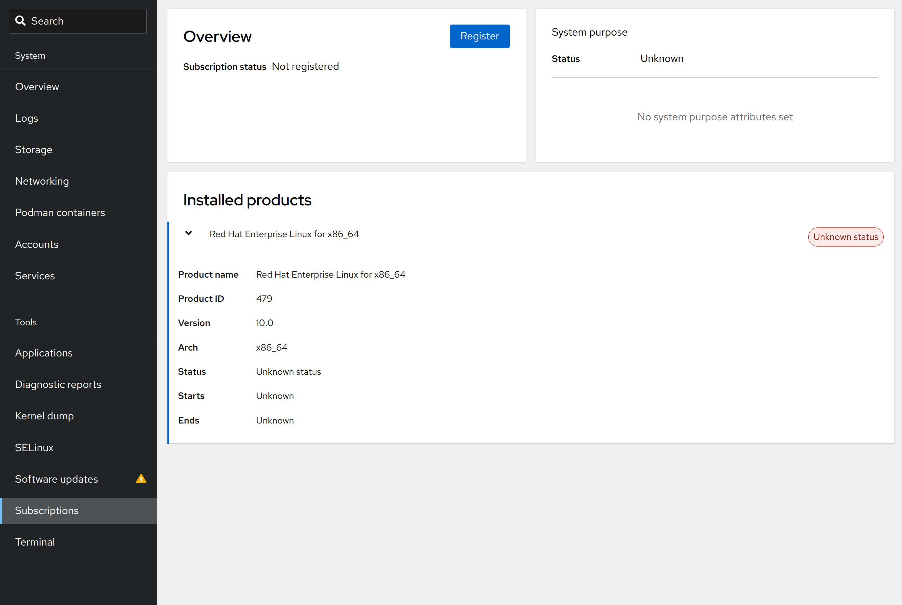
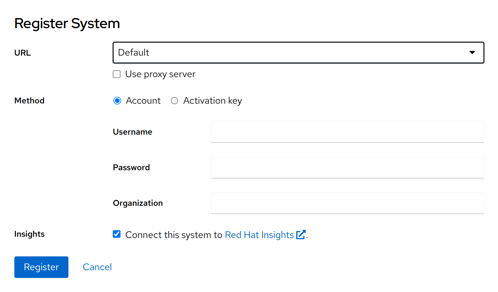
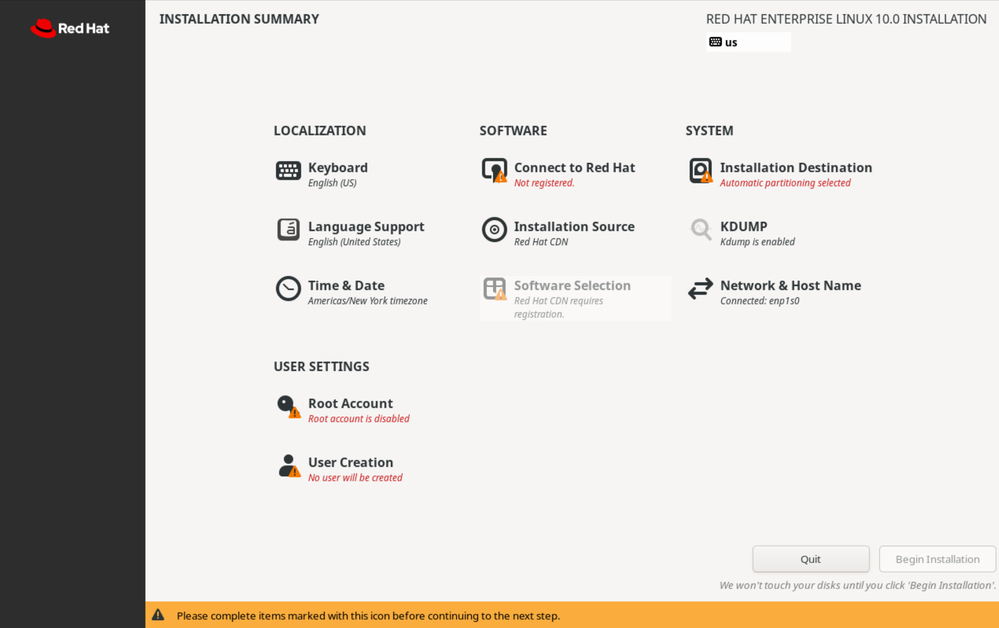
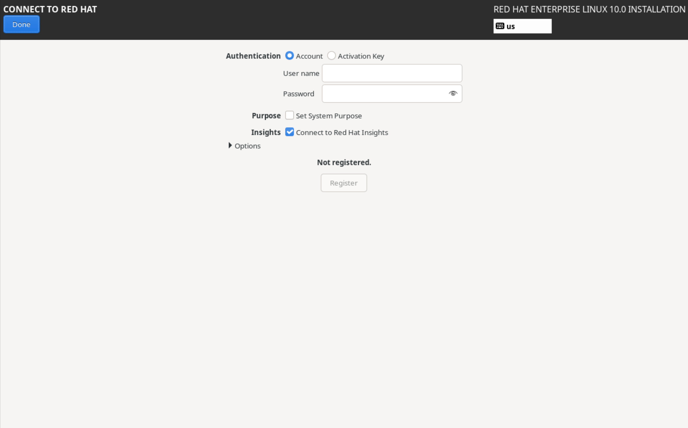

Quản trị hệ thống Red Hat I
---------------------------

# Chương 4. Đăng ký hệ thống để nhận hỗ trợ từ Red Hat
## Đăng ký hệ thống để nhận hỗ trợ từ Red Hat
### Mục tiêu
Đăng ký hệ thống bằng tài khoản Red Hat của bạn.

### Lợi ích của gói đăng ký Red Hat
Red Hat cung cấp quyền truy cập vào các kho phần mềm thông qua Mạng lưới Phân phối Nội dung (CDN) của Red Hat theo mô hình đăng ký dịch
vụ. Các kho phần mềm này cung cấp các gói phần mềm được cập nhật thường xuyên, bao gồm các bản vá bảo mật, bản sửa lỗi và các tính năng
cải tiến.

Khách hàng có gói đăng ký còn hiệu lực có thể truy cập các kho nội dung của Red Hat để cài đặt các gói phần mềm mới và cập nhật các
phiên bản mới nhất. Ngoài việc cập nhật phần mềm, gói đăng ký còn cung cấp cho khách hàng các nguồn lực kỹ thuật như Customer Portal
Labs, các giải pháp trong Cơ sở Kiến thức (Knowledgebase), tài liệu hướng dẫn, Red Hat Insights và sự hỗ trợ từ các chuyên gia.

Vào năm 2024, Red Hat đã chuyển sang mô hình đăng ký có tên là Simple Content Access (SCA). Mô hình đăng ký dựa trên quyền truy cập này
yêu cầu tổ chức phải có gói đăng ký hợp lệ, thay vì phải gắn gói đăng ký cho từng hệ thống riêng lẻ như trước đây. Mô hình mới giúp
giảm bớt sự phức tạp trong công tác quản lý đăng ký và các công cụ hỗ trợ. Trong quá trình chuyển đổi này, các dịch vụ đăng ký dành cho
khách hàng đã được chuyển từ Red Hat Customer Portal (https://access.redhat.com) sang Red Hat Hybrid Cloud Console
(https://console.redhat.com). Hybrid Cloud Console mang lại trải nghiệm thống nhất trong việc quản lý hệ thống và tăng cường khả năng
tích hợp với Red Hat Insights.

### Đăng ký hệ thống RHEL
Bạn có thể sử dụng các tùy chọn khác nhau để đăng ký hệ thống với dịch vụ đăng ký (subscription service) của Red Hat. Ví dụ: bạn có thể
sử dụng giao diện web RHEL (RHEL web console) hoặc các công cụ dòng lệnh như rhc (remote host configuration) hay subscription-manager.

Bạn có thể sử dụng các công cụ này để thực hiện những thao tác sau trên hệ thống của mình:

* Đăng ký hệ thống để liên kết hệ thống đó với một tài khoản Red Hat có gói đăng ký (subscription) đang hoạt động. Trong quá trình đăng
ký, hệ thống sẽ nhận được các chứng chỉ định danh duy nhất để xác thực với dịch vụ đăng ký của Red Hat.
* Kích hoạt thêm các kho lưu trữ (repository) để truy cập vào các gói phần mềm khi cần thiết. Các kho lưu trữ mặc định sẽ tự động được
kích hoạt cho những sản phẩm đã cài đặt, cho phép truy cập ngay lập tức vào nội dung.
* Xem và theo dõi các quyền sử dụng (entitlement) hiện có hoặc đã sử dụng trên trang Subscription Inventory (Danh mục Đăng ký) của
Hybrid Cloud Console.
* Tùy chọn đăng ký sử dụng Red Hat Insights để thực hiện phân tích dự đoán và chủ động giải quyết các vấn đề.

### Đăng ký hệ thống bằng công cụ rhc
Công cụ dòng lệnh `rhc` có sẵn để đăng ký các hệ thống chạy RHEL 8.8 trở lên. Theo mặc định, công cụ `rhc` kích hoạt ba tính năng: nội
dung (content), phân tích (analytics) và quản lý từ xa (remote-management). Các tính năng này cho phép hệ thống của bạn truy cập vào
các kho lưu trữ nội dung, đồng thời kích hoạt các dịch vụ phân tích và khắc phục sự cố của Red Hat Insights chỉ với một lệnh duy nhất.

Để sử dụng công cụ `rhc`, bạn cần xác thực bằng tài khoản Red Hat có gói đăng ký (subscription) hợp lệ. Ngoài ra, bạn cần có quyền truy
cập root trên hệ thống để thực hiện việc đăng ký.

```console
root@host:~# rhc connect
Connecting host.example.com to Red Hat.
This might take a few seconds.

Features preferences: [✓]content, [✓]analytics, [✓]remote-management

Username: red-hat-username
Password: red-hat-password

 [✓] Connected to Red Hat Subscription Management
  [✓] Content ... Red Hat repository file generated
  [✓] Analytics ... Connected to Red Hat Insights
  [✓] Remote Management ... Activated the yggdrasil service

Successfully connected to Red Hat!

Manage your connected systems: https://red.ht/connector
```

Lệnh `rhc` kích hoạt cả ba tính năng chính theo mặc định. Nếu bạn chỉ muốn cho phép truy cập vào các kho lưu trữ nội dung mà không đăng
ký sử dụng Red Hat Insights, bạn có thể tắt các tính năng phân tích và quản lý từ xa trong quá trình đăng ký. Bạn có thể tắt các tính
năng này bằng cách sử dụng lệnh `rhc connect` với tùy chọn `--disable-feature`.

```console
root@host:~# rhc connect --disable-feature=analytics,remote-management
...output omitted...
Features preferences: [✓]content, [ ]analytics, [ ]remote-management

Username: red-hat-username
Password: red-hat-password

 [✓] Connected to Red Hat Subscription Management
  [✓] Content ... Red Hat repository file generated
  [ ] Analytics ... Connecting to Red Hat Insights disabled
  [ ] Management .... Starting yggdrasil service disabled (required feature "analytics" is disabled)
...output omitted...
```

Khi truy cập Hybrid Cloud Console để kiểm tra hệ thống này, bạn sẽ thấy bảng điều khiển hiển thị cảnh báo "Your insights-client is not
reporting" (Client Insights của bạn không gửi báo cáo). Thông tin kiểm kê về hệ thống này bị hạn chế do không có dữ liệu được thu thập.

#### Sử dụng Khóa Kích hoạt với công cụ rhc
Để đăng ký hệ thống một cách an toàn và tự động hơn, hãy sử dụng lệnh `rhc connect` kết hợp với khóa kích hoạt (activation key) và mã
định danh tổ chức (dạng số) của bạn. Phương pháp này an toàn hơn so với việc cung cấp tên người dùng và mật khẩu cá nhân.

Khóa kích hoạt là một mã xác thực được chia sẻ trước mà bạn có thể tạo và quản lý trong Hybrid Cloud Console. Trên bảng điều khiển
(dashboard), hãy nhấp vào **Insights for RHEL**, sau đó chọn **Inventory** → **System Configuration** → **Activation Keys**.

Khi tạo khóa kích hoạt, bạn có thể chọn liên kết khóa đó với phiên bản RHEL mới nhất hoặc cố định khóa vào một bản phát hành cụ thể
trước đó. Bạn cũng có thể tùy chọn xác định mục đích sử dụng hệ thống (system purpose) – một cơ chế gắn thẻ giúp nhận diện các máy chủ
trong danh sách quản lý (inventory) sau này. Ngoài ra, bạn có thể thiết lập thêm các kho lưu trữ (repository) cho khóa kích hoạt, giúp
đơn giản hóa hơn nữa quá trình cấu hình hệ thống trong khi đăng ký.

Ví dụ dưới đây minh họa cách sử dụng khóa kích hoạt với lệnh `rhc`.

```console
root@host:~# rhc connect --activation-key=<activation_key_name> \
--organization=<organization_ID>
...output omitted...
Successfully connected to Red Hat!

Manage your connected systems: https://red.ht/connector
```

#### Hủy đăng ký hệ thống bằng công cụ rhc
Để hủy đăng ký hệ thống của bạn, hãy sử dụng lệnh `rhc disconnect`:

```console
root@host:~# rhc disconnect
Disconnecting host.example.com from Red Hat.
This might take a few seconds.

 [✓] Deactivated the yggdrasil service
 [✓] Disconnected from Red Hat Insights
 [✓] Disconnected from Red Hat Subscription Management

Manage your connected systems: https://red.ht/connector
```

### Đăng ký hệ thống bằng công cụ subscription-manager
Lệnh `rhc` là công cụ được ưu tiên để đăng ký hệ thống, tuy nhiên lệnh này không khả dụng trên RHEL 8.7 hoặc các phiên bản cũ hơn.
Thay vào đó, bạn có thể sử dụng lệnh `subscription-manager` để đăng ký hệ thống của mình. Công cụ `subscription-manager` cũng hữu ích
trong trường hợp bạn muốn kích hoạt quyền truy cập kho phần mềm (repository) mà không cần kết nối với Red Hat Insights.

Trong RHEL 10, một số mô-đun của `subscription-manager` liên quan đến việc gắn gói đăng ký (subscription) cho từng hệ thống riêng lẻ
đã bị loại bỏ. Tuy nhiên, công cụ `subscription-manager` không bị thay thế hay ngừng hỗ trợ trong RHEL 10 và vẫn hoạt động tương tự
như các phiên bản trước đó.

Do quá trình chuyển đổi sang cơ chế Simple Content Access, việc đăng ký hệ thống bằng công cụ `subscription-manager` hiện được thực
hiện chỉ trong một bước duy nhất:

```console
root@host:~# subscription-manager register
Registering to: subscription.rhsm.redhat.com:443/subscription
Username: red-hat-username
Password: red-hat-password
The system has been registered with ID: 686c73e1-3780...
The registered system name is: host.example.com
```

Nếu bạn đã tạo khóa kích hoạt trong Hybrid Cloud Console, bạn có thể sử dụng khóa này để đăng ký hệ thống mà không cần dùng tên người
dùng và mật khẩu:

```console
root@host:~# subscription-manager register \
--activationkey <activation_key_name> --org <organization_ID>
The system has been registered with ID: 361d5774-76e0...
The registered system name is: host.example.com
```

Để xác minh trạng thái đăng ký của hệ thống, bạn có thể sử dụng lệnh `subscription-manager status`:

```console
root@host:~# subscription-manager status
+-------------------------------------------+
   System Status Details
+-------------------------------------------+
Overall Status: Registered
```

Để xác minh việc sử dụng gói đăng ký, bạn phải truy cập Hybrid Cloud Console vì công cụ subscription-manager không còn báo cáo mức sử
dụng quyền đăng ký theo từng hệ thống nữa.

Lệnh subscription-manager không thể kết nối hệ thống của bạn với Red Hat Insights. Sau khi đăng ký, bạn có thể sử dụng lệnh
insights-client để kích hoạt Red Hat Insights:

```console
root@host:~# insights-client --register
Successfully registered host host.example.com
Automatic scheduling for Insights has been enabled.
Starting to collect Insights data for host.example.com
Writing RHSM facts to /etc/rhsm/facts/insights-client.facts ...
Uploading Insights data.
Successfully uploaded report from host.example.com to account 606...
View the Red Hat Insights console at https://console.redhat.com/insights/
```

#### Thiết lập các thuộc tính mục đích của hệ thống
Mục đích hệ thống (system purpose) là một cơ chế gắn thẻ tùy chọn giúp lọc danh sách tài nguyên (inventory) của bạn. Bạn có thể thiết
lập các thuộc tính và giá trị sau đây bằng cách sử dụng lệnh `subscription-manager`:

**Vai trò**

* Máy chủ Red Hat Enterprise Linux
* Máy trạm Red Hat Enterprise Linux
* Nút tính toán Red Hat Enterprise Linux

**Thỏa thuận Mức độ Dịch vụ**

* Cao cấp - Premium
* Tiêu chuẩn - Standard
* Tự hỗ trợ - Self-Support

**Sử dụng**

* Sản xuất - Production
* Phát triển/Kiểm thử - Development/Test
* Khôi phục sau thảm họa - Disaster Recovery

Sử dụng lệnh `subscription-manager syspurpose` để thiết lập các thuộc tính mục đích hệ thống có liên quan:

```console
root@host:~# subscription-manager syspurpose role \
--set 'Red Hat Enterprise Linux Workstation'
role set to "Red Hat Enterprise Linux Workstation".

root@host:~# subscription-manager syspurpose service-level \
--set 'Premium'
service_level_agreement set to "Premium".

root@host:~# subscription-manager syspurpose usage \
--set 'Development/Test'
usage set to "Development/Test".
```

Lệnh con `syspurpose` cũng hỗ trợ tùy chọn `--list` để liệt kê các giá trị khả dụng cho từng thuộc tính. Ví dụ, lệnh sau đây kiểm tra
danh sách các giá trị khả dụng cho thuộc tính `usage`:

```console
root@host:~# subscription-manager syspurpose usage --list
+-------------------------------------------+
               Available usage
+-------------------------------------------+
 - Development/Test
```

#### Hủy đăng ký hệ thống bằng công cụ subscription-manager
Với công cụ `subscription-manager`, việc xóa đăng ký là một quy trình chỉ gồm một bước:

```console
root@host:~# subscription-manager unregister
Unregistering from: subscription.rhsm.redhat.com:443/subscription
System has been unregistered.
```

### Đăng ký hệ thống với RHEL Web Console
Nếu bạn thích giao diện người dùng đồ họa hơn các công cụ dòng lệnh, thì bảng điều khiển web của RHEL là một giải pháp thay thế phù
hợp. Để đăng ký hệ thống với bảng điều khiển web, bạn cần đăng nhập bằng tài khoản có đặc quyền. Hãy nhấp vào mục Subscriptions (Đăng
ký) để xem trạng thái đăng ký hiện tại và danh sách các sản phẩm đã cài đặt.

**Hình 4.1: Tổng quan về bảng điều khiển web**  


Để bắt đầu quy trình đăng ký, hãy nhấp vào `Register` trong phần `Overview`.

**Hình 4.2: Đăng ký trên bảng điều khiển web**  


Trong hộp thoại Register System, hãy nhập tên người dùng và mật khẩu cho tài khoản Red Hat của bạn, sau đó nhấp vào Register để đăng
ký hệ thống. Ngoài ra, thay vì nhập tên người dùng và mật khẩu, bạn có thể cung cấp khóa kích hoạt cùng với mã định danh tổ chức.
Theo mặc định, tùy chọn đăng ký với Red Hat Insights đã được chọn sẵn.

### Đăng ký hệ thống trong quá trình cài đặt
Nếu bạn đang triển khai RHEL 10 trên máy chủ vật lý (bare-metal) hoặc máy ảo, trình cài đặt Anaconda có thể đăng ký hệ thống đích
trước khi quá trình cài đặt gói bắt đầu. Trong giao diện tương tác của Anaconda, hãy nhấp vào **Connect to Red Hat** để mở hộp thoại
đăng ký.

**Hình 4.3: Tóm tắt trình cài đặt Anaconda**  


Bạn có thể xác thực bằng tên người dùng và mật khẩu, hoặc bằng khóa kích hoạt. Ngoài ra, bạn cũng có thể tùy chọn thiết lập mục đích
sử dụng hệ thống và đăng ký với Red Hat Insights.

**Hình 4.4: Đăng ký trình cài đặt Anaconda**  


Nếu bạn muốn đăng ký hệ thống của mình như một phần của quy trình cài đặt Kickstart tự động, bạn có thể sử dụng lệnh Kickstart `rhsm`.
Lưu ý rằng lệnh Kickstart `rhsm` yêu cầu khóa kích hoạt và mã định danh tổ chức.

### Kiểm tra Chứng chỉ Định danh
Một hệ thống đã đăng ký sẽ lưu trữ một số chứng chỉ trong thư mục /etc/pki.

Các chứng chỉ /etc/pki/product-default

Xác định các sản phẩm Red Hat được cài đặt trên hệ thống.
Cặp chứng chỉ và khóa /etc/pki/consumer

Xác định hệ thống.
Cặp chứng chỉ và khóa /etc/pki/entitlement

Xác thực hệ thống với các kho lưu trữ (repository).

Bạn có thể sử dụng lệnh rct cat-cert để kiểm tra chi tiết hơn các chứng chỉ này:

```console
root@host:~# rct cat-cert /etc/pki/product-default/479.pem

+-------------------------------------------+
       Product Certificate
+-------------------------------------------+

Certificate:
       Path: /etc/pki/product-default/479.pem
       Version: 1.0
       Serial: 271555466504741450059712551000979178078433728276
       Start Date: 2024-08-15 06:16:49+00:00
       End Date: 2044-08-15 06:16:49+00:00

...output omitted...

Product:
       ID: 479
       Name: Red Hat Enterprise Linux for x86_64
       Version: 10.0
       Arch: x86_64
       Tags: rhel-10,rhel-10-x86_64
       Brand Type:
       Brand Name:
```
