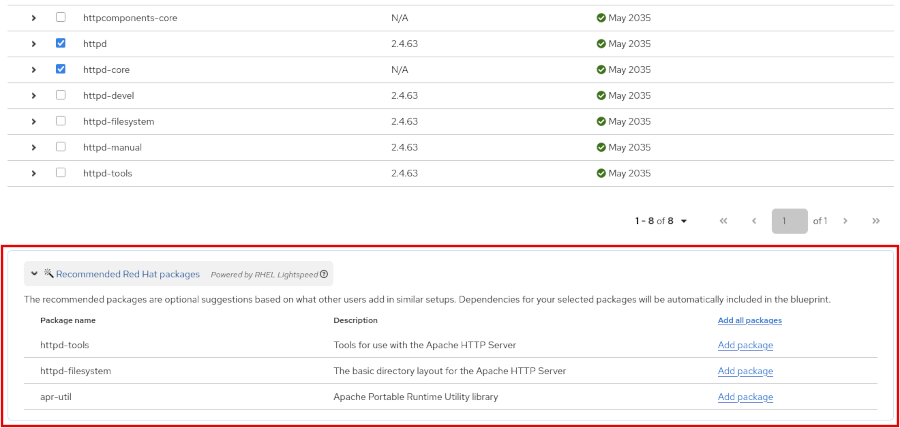

Quản trị hệ thống Red Hat I
---------------------------

# Chương 5. Nhận hỗ trợ có sự trợ giúp của AI với Red Hat Enterprise Linux Lightspeed

## Đặt câu hỏi và đánh giá câu trả lời từ trợ lý dòng lệnh
### Mục tiêu
Khắc phục sự cố bằng cách đặt ra các câu hỏi hiệu quả và đánh giá những câu trả lời mà RHEL Lightspeed cung cấp.

### Red Hat Enterprise Linux Lightspeed
Red Hat Enterprise Linux Lightspeed kết hợp bề dày kinh nghiệm hàng thập kỷ về Red Hat Enterprise Linux với các công nghệ AI, nhằm chủ
động cung cấp thông tin và đơn giản hóa quy trình xây dựng, triển khai cũng như quản lý Red Hat Enterprise Linux (RHEL) cho cả những
chuyên gia Linux mới vào nghề lẫn những người đã dày dạn kinh nghiệm.

Các thành phần được vận hành bởi RHEL Lightspeed cho phép khách hàng tập trung nhiều thời gian và nguồn lực hơn vào công tác đổi mới
sáng tạo, thay vì dành quá nhiều công sức cho việc bảo trì. Công nghệ RHEL Lightspeed được thiết kế để cung cấp các hướng dẫn, kiến
thức và khuyến nghị mang tính chủ động, qua đó giúp việc sử dụng RHEL trở nên trực quan và dễ dàng hơn. Công nghệ RHEL Lightspeed đã
được bao gồm trong gói đăng ký dịch vụ Red Hat Enterprise Linux của bạn.

Hai thành phần được vận hành bởi RHEL Lightspeed sẽ ra mắt đồng thời cùng với sự kiện phát hành RHEL 10:

#### Trợ lý dòng lệnh
Trợ lý dòng lệnh mới dành cho Red Hat Enterprise Linux (RHEL) – được vận hành bởi RHEL Lightspeed – cho phép bạn đặt câu hỏi bằng tiếng
Anh ngay trong giao diện dòng lệnh (terminal) để nhận được câu trả lời, đề xuất và hướng dẫn tức thì, dựa trên kho tàng kiến thức và
chuyên môn tích lũy qua nhiều thập kỷ của RHEL. Trợ lý này giúp đơn giản hóa các tác vụ phức tạp cho những quản trị viên Linux mới vào
nghề, đồng thời nâng cao hiệu suất làm việc cho các quản trị viên dày dạn kinh nghiệm, mang đến sự hỗ trợ từ trí tuệ nhân tạo (AI) ngay
tại giao diện dòng lệnh trong RHEL 10.

#### Các đề xuất gói từ trình tạo ảnh cho Red Hat Lightspeed
Red Hat Lightspeed image builder đưa ra các đề xuất gói phần mềm nhằm giúp bạn đưa ra quyết định sáng suốt ngay từ giai đoạn đầu của
quá trình tạo image. Khi bạn chọn các gói, công cụ này sẽ cung cấp thêm những gợi ý bổ sung để giúp giảm thiểu rủi ro bỏ sót các thành
phần quan trọng, từ đó cho phép bạn tạo ra các image hoàn chỉnh và đầy đủ chức năng ngay từ đầu.

**Hình 5.1: Các gói phần mềm được đề xuất trong Red Hat Lightspeed image builder**  


RHEL Lightspeed được thiết kế dành cho các quản trị viên hệ thống, kỹ sư nền tảng và nhà phát triển chịu trách nhiệm quản lý hệ thống
RHEL, bất kể trình độ kinh nghiệm về Linux của họ ra sao. Các công nghệ của RHEL Lightspeed hướng tới mục tiêu nâng cao năng suất, cải
thiện trải nghiệm người dùng và tối ưu hóa quy trình quản trị hệ thống.

Bài học này chỉ đề cập đến thành phần đầu tiên trong hai thành phần kể trên: trợ lý dòng lệnh được vận hành bởi RHEL Lightspeed.

### Trợ lý dòng lệnh vận hành bởi RHEL Lightspeed
Trợ lý dòng lệnh vận hành bởi RHEL Lightspeed là một công cụ AI tạo sinh tùy chọn, được thiết kế để giúp bạn nâng cao năng suất làm
việc. Công cụ này cung cấp sự hỗ trợ theo ngữ cảnh bằng cách diễn giải các câu hỏi bằng ngôn ngữ tự nhiên của bạn và đưa ra các câu trả
lời, gợi ý, lệnh, ví dụ hoặc hướng dẫn do AI tạo ra.

> **Cảnh báo**  
> Trợ lý dòng lệnh là một công cụ AI tạo sinh. Do đó, mặc dù kết quả đầu ra thường hữu ích, một số đề xuất của công cụ này
> có thể chưa đầy đủ hoặc thiếu chính xác.  
> Luôn xem xét kỹ nội dung do AI tạo ra trước khi sử dụng.

Trợ lý dòng lệnh có thể giải đáp các câu hỏi liên quan đến RHEL, hỗ trợ khắc phục sự cố, hỗ trợ diễn giải các mục nhật ký (log) và
giúp  thực hiện nhiều tác vụ khác. Bằng cách giảm thời gian tra cứu tài liệu bên ngoài, trợ lý dòng lệnh giúp bạn giải quyết vấn đề và
hoàn thành công việc hiệu quả hơn.

> **Quan trọng**:  
> Trợ lý dòng lệnh không thể truy cập thông tin cụ thể về hệ thống mà nó đang chạy trên đó.  
> Ví dụ: trợ lý dòng lệnh không thể cung cấp câu trả lời về dung lượng bộ nhớ khả dụng của hệ thống mà nó đang hoạt động. Thay vào đó,
> trợ lý dòng lệnh sẽ cung cấp thông tin về một lệnh mà bạn có thể chạy để xác định dung lượng bộ nhớ khả dụng của hệ thống.

Ban đầu, trợ lý dòng lệnh chỉ được hỗ trợ dưới dạng trải nghiệm có kết nối, mặc dù Red Hat đang nghiên cứu các phương án hỗ trợ cho
các giải pháp triển khai tại chỗ (on-premise) không kết nối mạng. Do đó, trợ lý dòng lệnh hiện cần có kết nối Internet để hoạt động
chính xác.

### Mô hình ngôn ngữ lớn
RHEL Lightspeed sử dụng một mô hình ngôn ngữ lớn (LLM) được lưu trữ bên ngoài và cung cấp dưới dạng Phần mềm như một Dịch vụ (SaaS) cho
tất cả các hệ thống RHEL đã đăng ký.

Mô hình LLM vận hành trợ lý dòng lệnh này được huấn luyện dựa trên nhiều nguồn tài nguyên khác nhau của Red Hat, bao gồm các bài viết
thuộc Knowledge Center Service (KCS), tài liệu hướng dẫn RHEL và nhiều nguồn khác.

#### Cài đặt Trợ lý dòng lệnh
Để sử dụng công cụ hỗ trợ dòng lệnh, hệ thống của bạn cần phải có đăng ký dịch vụ hợp lệ. Bạn có thể sử dụng công cụ
`subscription-manager` để quản lý các đăng ký hệ thống. Công cụ này hỗ trợ RHEL 10.0, RHEL 9.6 và các phiên bản mới hơn.

Trong lần đầu tiên sử dụng công cụ hỗ trợ dòng lệnh, hãy cài đặt gói `command-line-assistant`:

```console
root@host:~# dnf install command-line-assistant
...output omitted...
Is this ok [y/N]: y
...output omitted...
Complete!
```

Gói này cung cấp lệnh `c`, đóng vai trò là giao diện người dùng chính cho công cụ hỗ trợ dòng lệnh. Hãy chạy lệnh `c` để xác minh rằng
quá trình cài đặt đã thành công:

```console
user@host:~$ c chat "How do I list running services?"
⁺₊+ Asking RHEL Lightspeed
This feature uses AI technology. Do not include any personal information or other sensitive information in your input. Interactions may be used to improve Red Hat's products or services.
To list all running services on a Red Hat Enterprise Linux system, you can use the systemctl command with the --type=service option. Here's how you can do it:

[bash] Snippet ────────────────
systemctl list-units --type=service --state=running
────────────────────────

This command will display a list of all service units that are currently running.

For more detailed information about system services, you can use the systemctl status command followed by the name of the service unit. For example, to check the status of the gdm service, you would run:

[bash] Snippet ────────────────
systemctl status gdm.service
────────────────────────

This will provide you with detailed information about the service, including its current state, whether it's enabled to start at boot, and more.

Remember to replace gdm.service with the name of the service unit you're interested in. You can find the names of service units by running systemctl list-units --type=service.
Always review AI-generated content prior to use.
```

> **Lưu ý**: Kết quả đầu ra của bạn có thể khác so với các ví dụ.

### Khắc phục sự cố với Trợ lý dòng lệnh
Trợ lý dòng lệnh có thể là một công cụ đắc lực giúp bạn khắc phục sự cố. Mặc dù công cụ này hữu ích cho những người có kiến thức hạn
chế về Linux, nhưng nó cũng rất giá trị đối với những ai có khả năng nhanh chóng nắm bắt và xử lý các phản hồi mà trợ lý cung cấp.

Để sử dụng trợ lý dòng lệnh hiệu quả, hãy bắt đầu bằng cách đặt những câu hỏi rõ ràng và có cấu trúc mạch lạc. Cách tiếp cận này đặc
biệt quan trọng khi khắc phục sự cố, bởi vì cách diễn đạt rõ ràng, chính xác sẽ mang lại các phản hồi sát với vấn đề hơn, từ đó giúp
bạn nhận diện và giải quyết sự cố nhanh chóng hơn.

Cách đơn giản nhất để tương tác với trợ lý dòng lệnh là đặt câu hỏi trực tiếp bằng ngôn ngữ tự nhiên. Ví dụ: để hỏi cách kiểm tra
trạng thái của tiến trình nền (daemon) SSH trên hệ thống, bạn có thể nhập nội dung sau:

```console
user@host:~$ c chat "How do I check the status of the sshd service?"
```

#### Chế độ tương tác
Đối với các tình huống phức tạp hơn, bạn có thể thực hiện cuộc hội thoại theo từng lượt. Cách tiếp cận này giúp cung cấp thêm ngữ cảnh
để trợ lý dòng lệnh sử dụng khi giải đáp các câu hỏi của bạn. Trong những trường hợp như vậy, bạn có thể khởi chạy trợ lý ở chế độ
tương tác:

```console
user@host:~$ c chat --interactive
Welcome to the interactive mode for command line assistant! To exit, press Ctrl + C or type '.exit'.
>>>
```

#### Phân tích kết quả đầu ra của lệnh
Bối cảnh đóng vai trò thiết yếu trong quá trình khắc phục sự cố, và trợ lý dòng lệnh sẽ trở nên hữu ích hơn nhiều khi có dữ liệu cụ
thể để phân tích. Một trong những tính năng mạnh mẽ nhất là khả năng chuyển trực tiếp đầu ra của lệnh vào trợ lý dòng lệnh.

Ví dụ: nếu bạn đang xem xét các tệp nhật ký (log) từ Apache HTTP Server và cần hỗ trợ chẩn đoán các lỗi gần đây, bạn có thể chạy
lệnh sau:

```console
user@host:~$ sudo journalctl -u httpd.service --since "1 hour ago" | \
c chat "What could be causing errors in these logs?"
```

Một tình huống phổ biến và phức tạp khác là khắc phục sự cố nghi ngờ rò rỉ bộ nhớ. Bạn có thể chuyển (pipe) dữ liệu đầu ra từ các công
cụ như `top`, `ps` hoặc thậm chí `smem` sang trợ lý dòng lệnh và yêu cầu nó phân tích các kết quả đó.

Ví dụ: bạn có thể cung cấp cho trợ lý thông tin về mức sử dụng bộ nhớ hiện tại của các tiến trình đang chạy, để nó có thể xác định các
trường hợp tiêu thụ bộ nhớ cao bất thường hoặc đang tăng lên.

```console
user@host:~$ ps aux --sort=-%mem | \
head -n 20 | \
c chat "Is there a possible memory leak in one of these processes?"
```

#### Phân tích nội dung tệp
Bạn cũng có thể gửi nội dung tệp đến trợ lý dòng lệnh để phân tích. Tính năng này đặc biệt hữu ích khi xem xét các tệp cấu hình hoặc
tệp nhật ký dài, chẳng hạn như:

```console
user@host:~$ cat /var/log/messages | \
c chat "Look for critical errors in this log file."
```

> **Quan trọng**: Trợ lý dòng lệnh không truy cập vào các tệp hoặc dữ liệu của bạn trừ khi bạn cung cấp chúng.

#### Phân tích dữ liệu
Bạn cũng có thể đính kèm dữ liệu trực tiếp bằng cách sử dụng cờ `--attachment` hoặc `-a`. Ví dụ, để phân tích nhật ký khởi động
hệ thống, bạn có thể chạy lệnh sau:

```console
user@host:~$ c chat -a /var/log/boot.log "Why did the last boot take so long?"
```
