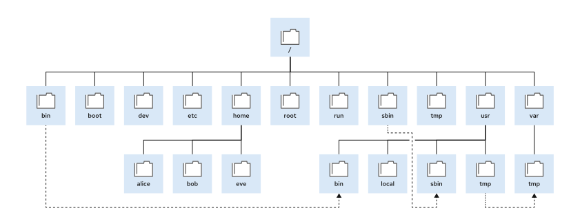

Quản trị hệ thống Red Hat I
---------------------------

# Chương 6. Điều hướng hệ thống phân cấp tập tin

## Cấu trúc phân cấp hệ thống tập tin Linux
### Mục tiêu
Mô tả cách tổ chức các tệp tin trong Linux và mục đích của các thư mục khác nhau trong hệ thống phân cấp tệp tin.

### Cấu trúc phân cấp hệ thống tập tin
Hệ thống Linux lưu trữ tất cả các tập tin trên các hệ thống tập tin; các hệ thống này được tổ chức thành một cấu trúc cây ngược duy
nhất, được gọi là hệ thống phân cấp tập tin. Cấu trúc này được gọi là cây ngược vì gốc của cây nằm ở trên cùng, còn các nhánh thư mục
và thư mục con thì trải rộng xuống phía dưới gốc.

**Hình 6.1: Các thư mục hệ thống tập tin quan trọng trong Red Hat Enterprise Linux 10**  


Thư mục gốc, được ký hiệu bằng dấu gạch chéo (`/`), nằm ở cấp cao nhất trong hệ thống phân cấp tệp tin. Dấu gạch chéo (`/`) cũng được
sử dụng làm ký tự phân cách thư mục trong tên tệp. Ví dụ: nếu `etc` là một thư mục con của thư mục `/`, thì thư mục đó được gọi là
`/etc`. Tương tự, nếu thư mục `/etc` chứa một tệp có tên là `issue`, thì tệp đó được gọi là `/etc/issue`.

Các thư mục con của thư mục `/` được sử dụng theo các quy chuẩn nhất định để sắp xếp tệp tin dựa trên loại và mục đích sử dụng, giúp
việc tìm kiếm tệp trở nên dễ dàng hơn. Ví dụ, trong thư mục gốc, thư mục con `/boot` được dùng để lưu trữ các tệp tin cần thiết cho quá
trình khởi động hệ thống.

> **Lưu ý**: Các thuật ngữ sau đây mô tả các loại nội dung thư mục hệ thống tệp khác nhau:

* Nội dung tĩnh không thay đổi cho đến khi được chỉnh sửa hoặc cấu hình lại một cách rõ ràng.
* Nội dung động hoặc biến đổi có thể bị sửa đổi hoặc bổ sung bởi các tiến trình đang hoạt động.
* Nội dung bền vững vẫn được lưu giữ sau khi khởi động lại, chẳng hạn như các thiết lập cấu hình.
* Nội dung trong thời gian thực (runtime) từ một tiến trình hoặc từ hệ thống sẽ bị xóa khi khởi động lại.

Bảng dưới đây liệt kê một số thư mục quan trọng trên hệ thống theo tên và mục đích sử dụng.

**Bảng 6.1. Các thư mục quan trọng của Red Hat Enterprise Linux**

| Vị trí | Mục đích                                                                                                                                                                                                                                                                                                                                                     |
|--------|--------------------------------------------------------------------------------------------------------------------------------------------------------------------------------------------------------------------------------------------------------------------------------------------------------------------------------------------------------------|
| /boot  | Các tệp tin để bắt đầu quá trình khởi động.                                                                                                                                                                                                                                                                                                                  |
| /dev   | Các tệp thiết bị đặc biệt mà hệ thống sử dụng để truy cập phần cứng.                                                                                                                                                                                                                                                                                         |
| /etc   | Các tệp cấu hình dành riêng cho hệ thống.                                                                                                                                                                                                                                                                                                                    |
| /home  | Thư mục chính (home directory), nơi người dùng thông thường lưu trữ dữ liệu và các tệp cấu hình của họ.                                                                                                                                                                                                                                                      |
| /root  | Thư mục chính của người dùng quản trị tối cao (superuser), root.                                                                                                                                                                                                                                                                                             |
| /run   | Dữ liệu thời gian thực dành cho các tiến trình đã khởi động kể từ lần khởi động hệ thống gần nhất.<br>Dữ liệu này bao gồm các tệp chứa ID tiến trình và các tệp khóa.<br>Nội dung của thư mục này sẽ được tạo lại khi khởi động lại hệ thống.<br>Thư mục này hợp nhất các thư mục /var/run và /var/lock từ các phiên bản Red Hat Enterprise Linux trước đây. |
| /tmp   | Một không gian lưu trữ các tệp tạm thời mà mọi người dùng đều có quyền ghi vào.<br>Các tệp không được truy cập hoặc sửa đổi trong vòng 10 ngày sẽ tự động bị xóa khỏi thư mục này.<br>Thư mục /var/tmp cũng là một thư mục lưu trữ tệp tạm thời, nơi các tệp không được truy cập hoặc sửa đổi trong hơn 30 ngày sẽ tự động bị xóa.                           |
| /usr   | Bao gồm phần mềm đã cài đặt, các thư viện dùng chung, các tệp tin đi kèm và dữ liệu chương trình ở chế độ chỉ đọc.<br>Các thư mục con quan trọng trong thư mục /usr bao gồm:<br>/usr/bin (các lệnh dành cho người dùng)<br>/usr/sbin (các lệnh quản trị hệ thống)<br>/usr/local (phần mềm được tùy chỉnh cục bộ).                                            |
| /var   | Dữ liệu biến đổi đặc thù của hệ thống cần được duy trì qua các lần khởi động.<br>Các tệp tin thay đổi linh hoạt—chẳng hạn như cơ sở dữ liệu, thư mục bộ nhớ đệm (cache), tệp nhật ký (log), tài liệu chờ in và nội dung trang web—thường nằm trong thư mục /var.                                                                                             |

>  **Quan trọng**  
> Trong Red Hat Enterprise Linux 7 và các phiên bản sau này, bốn thư mục nằm trong thư mục gốc chứa các tệp tin giống hệt như các
> thư mục tương ứng trong thư mục /usr:  
> * /bin và /usr/bin
> * /sbin và /usr/sbin
> * /lib và /usr/lib
> * /lib64 và /usr/lib64

Các phiên bản trước đây của Red Hat Enterprise Linux có các thư mục riêng biệt chứa những tập hợp tệp tin khác nhau. Trong Red Hat
Enterprise Linux 7 và các phiên bản sau này, các thư mục nằm tại thư mục gốc (/) là các liên kết tượng trưng trỏ đến những thư mục
tương ứng trong thư mục /usr.

## Chỉ định tệp theo tên
### Mục tiêu
Xác định vị trí tuyệt đối và vị trí tương đối của các tệp so với thư mục làm việc hiện tại, xác định và thay đổi thư mục làm việc, cũng
như liệt kê nội dung của các thư mục.

### Đường dẫn tuyệt đối và đường dẫn tương đối
Đường dẫn của một tệp hoặc thư mục xác định vị trí duy nhất của nó trong hệ thống tệp. Việc đi theo đường dẫn tệp đồng nghĩa với việc
đi qua một hoặc nhiều thư mục con có tên cụ thể — được phân tách bằng dấu gạch chéo (`/`) — cho đến khi tới đích. Các thư mục
(hay còn gọi là "folder") có thể chứa các tệp và thư mục con khác. Cách tham chiếu đến thư mục cũng tương tự như đối với tệp.

> **Quan trọng**  
> Ký tự khoảng trắng được chấp nhận trong tên tệp tin trên Linux. Tuy nhiên, shell cũng sử dụng khoảng trắng để phân
> biệt các tùy chọn và đối số trên dòng lệnh. Nếu một lệnh có chứa tên tệp tin bao gồm khoảng trắng, shell có thể hiểu sai lệnh đó và
> coi tên tệp tin là nhiều đối số riêng biệt. Để tránh lỗi này, hãy đặt các tên tệp tin đó trong dấu ngoặc kép để shell hiểu tên tệp
> tin là một đối số duy nhất. Red Hat khuyến nghị nên tránh hoàn toàn việc sử dụng khoảng trắng trong tên tệp tin.

#### Đường dẫn tuyệt đối
Đường dẫn tuyệt đối là tên định danh đầy đủ, xác định chính xác vị trí của tệp trong hệ thống phân cấp tệp tin. Đường dẫn tuyệt đối bắt
đầu từ thư mục gốc (/) và bao gồm tất cả các thư mục con cần đi qua để đến được tệp tin cụ thể đó. Mỗi tệp tin trong hệ thống tệp đều
có một tên đường dẫn tuyệt đối duy nhất, được nhận diện bằng một quy tắc đơn giản: tên đường dẫn bắt đầu bằng dấu gạch chéo (`/`) là
đường dẫn tuyệt đối.

Ví dụ, tên đường dẫn tuyệt đối của tệp nhật ký thông báo hệ thống là /var/log/messages. Do tên đường dẫn tuyệt đối có thể dài và tốn
công gõ, nên người dùng cũng có thể xác định vị trí tệp tin dựa trên thư mục làm việc hiện tại của dòng lệnh (shell prompt).

#### Thư mục làm việc hiện tại và đường dẫn tương đối
Khi người dùng đăng nhập và mở cửa sổ dòng lệnh, vị trí ban đầu thường là thư mục chính (home directory) của người dùng đó. Các tiến
trình hệ thống cũng có thư mục khởi đầu riêng. Người dùng và các tiến trình có thể chuyển sang các thư mục khác khi cần thiết. Thư mục
làm việc hiện tại (current working directory) là vị trí hiện thời trong cấu trúc phân cấp hệ thống tệp mà một tiến trình—chẳng hạn như
trình thông dịch lệnh (shell) của bạn—đang sử dụng.

Tương tự như đường dẫn tuyệt đối, đường dẫn tương đối xác định một vị trí duy nhất, nhưng chỉ chỉ ra lộ trình cần thiết để đi đến vị
trí đó từ thư mục làm việc hiện tại. Tên đường dẫn tương đối tuân theo quy tắc sau: bất kỳ tên đường dẫn nào không bắt đầu bằng dấu
gạch chéo (`/`) đều được coi là đường dẫn tương đối. Ví dụ, nếu xét từ thư mục `/var`, thì tệp nhật ký có đường dẫn tuyệt đối là
`/var/log/messages` sẽ có đường dẫn tương đối là `log/messages`. Nếu tên đường dẫn tương đối không chứa dấu gạch chéo nào, nghĩa là bạn
đang tham chiếu đến một tệp hoặc thư mục nằm ngay trong thư mục làm việc hiện tại.

Các hệ thống tệp Linux, bao gồm ext4 và XFS, có tính phân biệt chữ hoa và chữ thường. Việc tạo hai tệp có tên `MyExample.txt` và 
`myexample.txt` trong cùng một thư mục sẽ tạo ra hai tệp riêng biệt.

Các hệ thống tệp không phải của Linux có thể hoạt động theo cách khác. Ví dụ: VFAT, Microsoft NTFS, cũng như các thiết lập mặc định của
Apple HFS+ và Apple File System (APFS) đều có cơ chế bảo toàn chữ hoa/chữ thường. Mặc dù các hệ thống tệp này không phân biệt chữ hoa
và chữ thường khi xử lý tệp, chúng vẫn hiển thị tên tệp đúng theo cách viết hoa/thường ban đầu. Nếu bạn tạo các tệp trong ví dụ nêu
trên trên hệ thống tệp VFAT, cả hai tên gọi này sẽ cùng trỏ đến một tệp duy nhất thay vì hai tệp khác nhau.

### Điều hướng các đường dẫn trong hệ thống tệp
Lệnh `pwd` hiển thị đường dẫn đầy đủ của thư mục làm việc hiện tại trong shell đó. Lệnh này giúp bạn xác định cú pháp để truy cập các
tập tin bằng cách sử dụng đường dẫn tương đối. Lệnh `ls` liệt kê nội dung của thư mục được chỉ định, hoặc liệt kê nội dung thư mục làm
việc hiện tại nếu không có thư mục nào được chỉ định.

```console
user@host:~$ pwd
/home/user
user@host:~$ ls
Desktop  Documents  Downloads  Music  Pictures  Public  Templates  Videos
user@host:~$
```

Dấu nhắc lệnh hiển thị ký tự tilde (~) khi thư mục làm việc hiện tại của bạn là thư mục home. Khi di chuyển bên trong thư mục home,
dấu nhắc lệnh hiển thị ký tự tilde (đóng vai trò là đường dẫn tắt đến thư mục home) cùng với đường dẫn đến thư mục làm việc hiện tại.
Khi thư mục làm việc hiện tại của shell nằm ngoài thư mục home, dấu nhắc lệnh sẽ hiển thị đường dẫn tuyệt đối đến vị trí hiện tại.

Hãy sử dụng lệnh `cd` để thay đổi thư mục làm việc hiện tại của shell. Nếu bạn không cung cấp đối số nào cho lệnh này, shell sẽ chuyển
đến thư mục home của bạn.

Ví dụ dưới đây minh họa việc thay đổi thư mục làm việc hiện tại bằng cách kết hợp sử dụng đường dẫn tuyệt đối và đường dẫn tương đối
với lệnh `cd`.

```console
user@host:~$ pwd
/home/user
user@host:~$ cd Videos
user@host:~/Videos$ pwd
/home/user/Videos
user@host:~/Videos$ cd /home/user/Documents
user@host:~/Documents$ pwd
/home/user/Documents
user@host:~/Documents$ cd
user@host:~$ pwd
/home/user
user@host:~$
```

Trong ví dụ trước, dấu nhắc lệnh mặc định hiển thị ký tự ngã (đại diện cho thư mục chính của người dùng) cùng với đường dẫn đến thư
mục làm việc hiện tại. Chẳng hạn, sau khi chuyển đến thư mục `/home/user/Videos`, dấu nhắc lệnh sẽ hiển thị đường dẫn `~/Videos`.

Lệnh `touch` cập nhật dấu thời gian của tệp tin thành ngày giờ hiện tại mà không làm thay đổi nội dung tệp. Lệnh này rất hữu ích để
tạo các tệp trống và có thể dùng để thực hành, vì khi bạn sử dụng lệnh `touch` với một tên tệp chưa tồn tại, tệp đó sẽ được tạo mới.
Trong ví dụ dưới đây, lệnh `touch` tạo ra các tệp thực hành trong các thư mục con `Documents` và `Videos`.

```console
user@host:~$ touch Videos/blockbuster1.ogg
user@host:~$ touch Videos/blockbuster2.ogg
user@host:~$ touch Documents/thesis_chapter1.txt
user@host:~$ touch Documents/thesis_chapter2.txt
user@host:~$
```

Lệnh `ls` có nhiều tùy chọn để hiển thị các thuộc tính của tệp tin. Các tùy chọn phổ biến nhất là `-l` (định dạng liệt kê chi tiết),
`-a` (hiển thị tất cả các tệp, bao gồm cả tệp ẩn) và `-R` (đệ quy, bao gồm cả nội dung của tất cả các thư mục con).

```console
user@host:~$ ls -l
total 0
drwxr-xr-x. 2 user user 6 Mar  2 02:45 Desktop
drwxr-xr-x. 2 user user 6 Mar  2 02:45 Documents
drwxr-xr-x. 2 user user 6 Mar  2 02:45 Downloads
drwxr-xr-x. 2 user user 6 Mar  2 02:45 Music
drwxr-xr-x. 2 user user 6 Mar  2 02:45 Pictures
drwxr-xr-x. 2 user user 6 Mar  2 02:45 Public
drwxr-xr-x. 2 user user 6 Mar  2 02:45 Templates
drwxr-xr-x. 2 user user 6 Mar  2 02:45 Videos
user@host:~$ ls -la
total 40
drwx------. 17 user user 4096 Mar  2 03:07 .
drwxr-xr-x.  4 root root   35 Feb 10 10:48 ..
drwxr-xr-x.  4 user user   27 Mar  2 03:01 .ansible
-rw-------.  1 user user  444 Mar  2 04:32 .bash_history
-rw-r--r--.  1 user user   18 Aug  9  2021 .bash_logout
-rw-r--r--.  1 user user  141 Aug  9  2021 .bash_profile
-rw-r--r--.  1 user user  492 Aug  9  2021 .bashrc
drwxr-xr-x.  9 user user 4096 Mar  2 02:45 .cache
drwxr-xr-x.  9 user user 4096 Mar  2 04:32 .config
drwxr-xr-x.  2 user user    6 Mar  2 02:45 Desktop
drwxr-xr-x.  2 user user    6 Mar  2 02:45 Documents
...output omitted...
```

Ở đầu danh sách hiển thị là hai thư mục đặc biệt. Một dấu chấm (.) đại diện cho thư mục hiện tại, còn hai dấu chấm (..) đại diện cho
thư mục cha. Các thư mục đặc biệt này tồn tại trong mọi thư mục trên hệ thống và rất hữu ích khi sử dụng các lệnh quản lý tệp tin.

> **Quan trọng**  
> Các tên tệp bắt đầu bằng dấu chấm (.) biểu thị tệp ẩn; chúng không xuất hiện trong kết quả hiển thị thông thường của
> lệnh `ls` và các lệnh khác. Cơ chế này không phải là một tính năng bảo mật. Tệp ẩn giúp ngăn các tệp cấu hình người dùng cần thiết
> làm lộn xộn thư mục chính (home directory). Nhiều lệnh chỉ xử lý tệp ẩn khi có các tùy chọn dòng lệnh cụ thể, đồng thời ngăn chặn
> việc vô tình sao chép cấu hình của người dùng này sang các thư mục hoặc người dùng khác.  
> Việc bảo vệ nội dung tệp khỏi sự truy cập trái phép đòi hỏi phải sử dụng các quyền truy cập tệp.

Bạn cũng có thể sử dụng ký tự đặc biệt dấu ngã (~) kết hợp với các lệnh khác để tương tác hiệu quả hơn với thư mục home.

```console
user@host:~$ cd /var/log/
user@host:/var/log$ ls -l ~
total 0
drwxr-xr-x. 2 user user 6 Mar  2 02:45 Desktop
drwxr-xr-x. 2 user user 6 Mar  2 02:45 Documents
drwxr-xr-x. 2 user user 6 Mar  2 02:45 Downloads
drwxr-xr-x. 2 user user 6 Mar  2 02:45 Music
drwxr-xr-x. 2 user user 6 Mar  2 02:45 Pictures
drwxr-xr-x. 2 user user 6 Mar  2 02:45 Public
drwxr-xr-x. 2 user user 6 Mar  2 02:45 Templates
drwxr-xr-x. 2 user user 6 Mar  2 02:45 Videos
user@host:~$
```

Lệnh `cd` có nhiều tùy chọn. Một số tùy chọn rất hữu ích để bạn tập làm quen và sử dụng thường xuyên.

Ví dụ, tùy chọn `cd -` sẽ đưa dấu nhắc lệnh (shell prompt) của bạn trở lại thư mục trước đó—tức là thư mục làm việc mà bạn đã sử dụng
ngay trước thư mục hiện tại. Ví dụ dưới đây minh họa cơ chế này và cách chuyển đổi qua lại giữa hai thư mục; thao tác này rất hữu ích
khi bạn cần thực hiện một loạt các tác vụ tương tự nhau.

```console
user@host:~$ cd Videos
user@host:~/Videos$ pwd
/home/user/Videos
user@host:~/Videos$ cd /home/user/Documents
user@host:~/Documents$ pwd
/home/user/Documents
user@host:~/Documents$ cd -
user@host:~/Videos$ pwd
/home/user/Videos
user@host:~/Videos$ cd -
user@host:~/Documents$ pwd
/home/user/Documents
user@host:~/Documents$ cd -
user@host:~/Videos$ pwd
/home/user/Videos
user@host:~/Videos$ cd
user@host:~$
```

Lệnh `cd ..` sử dụng thư mục cha ẩn (`..`) để di chuyển thư mục làm việc hiện tại của shell lên một cấp, mà không cần phải nhập đường
dẫn tuyệt đối đến thư mục cha đó. Một thư mục ẩn khác là `.` được dùng để chỉ định thư mục hiện tại trong các lệnh mà vị trí hiện tại
đóng vai trò là đối số nguồn hoặc đích, giúp tránh việc phải nhập tên đường dẫn tuyệt đối của thư mục.

```console
user@host:~/Videos$ pwd
/home/user/Videos
user@host:~/Videos$ cd .
user@host:~/Videos$ pwd
/home/user/Videos
user@host:~/Videos$ cd ..
user@host:~$ pwd
/home/user
user@host:~$ cd ..
user@host:/home$ pwd
/home
user@host:/home$ cd ..
user@host:/$ pwd
/
user@host:/$ cd
user@host:~$ pwd
/home/user
user@host:~$
```
