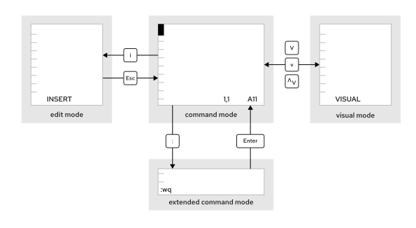

Quản trị hệ thống Red Hat I
---------------------------

# Chương 8. Chỉnh sửa tệp văn bản

## Chỉnh sửa tệp văn bản từ dòng lệnh
### Mục tiêu
Tạo, xem và chỉnh sửa các tệp văn bản bằng trình soạn thảo Vim.

### Chỉnh sửa tệp bằng Vim
Nguyên tắc thiết kế cốt lõi của Linux là hỗ trợ lưu trữ thông tin và các thiết lập cấu hình trong các tệp tin dạng văn bản. Các tệp này
tuân theo nhiều cấu trúc khác nhau, chẳng hạn như danh sách thiết lập, định dạng kiểu INI, cấu trúc XML hoặc YAML, cùng các định dạng
khác. Ưu điểm của việc lưu trữ dữ liệu dưới dạng văn bản là chúng có thể được chỉnh sửa bằng bất kỳ trình soạn thảo văn bản nào.

Vim là phiên bản cải tiến của trình soạn thảo vi, được tích hợp sẵn trong các hệ thống Linux và UNIX. Đây là một trình soạn thảo hiệu
quả và có khả năng tùy biến cao, cung cấp các tính năng như chia màn hình, định dạng màu sắc và làm nổi bật cú pháp để hỗ trợ việc soạn
thảo văn bản.

#### Lợi ích của trình soạn thảo Vim
Khi sử dụng hệ thống chỉ có giao diện dòng lệnh (text-only shell prompt), bạn cần biết cách dùng ít nhất một trình soạn thảo văn bản để
chỉnh sửa tập tin. Nhờ đó, bạn có thể chỉnh sửa các tập tin cấu hình dạng văn bản ngay từ cửa sổ dòng lệnh (terminal) hoặc thông qua
kết nối từ xa bằng lệnh ssh hay bảng điều khiển web. Ngoài ra, bạn không cần phải truy cập vào giao diện đồ họa để chỉnh sửa tập tin
trên máy chủ, và bản thân máy chủ đó cũng không nhất thiết phải chạy môi trường đồ họa.

Lý do chính để học Vim là vì nó gần như luôn được cài đặt sẵn trên máy chủ để phục vụ việc chỉnh sửa các tập tin văn bản. Tiêu chuẩn
POSIX quy định trình soạn thảo vi trên Linux, và nhiều hệ điều hành dạng UNIX khác cũng áp dụng quy định tương tự.

Vim cũng thường được sử dụng như là phiên bản thực thi của vi trên các hệ điều hành hoặc bản phân phối tiêu chuẩn khác. Ví dụ, macOS
hiện đã tích hợp sẵn một phiên bản Vim gọn nhẹ. Do đó, những kỹ năng sử dụng Vim học được trên Linux cũng có thể hữu ích trong các môi
trường khác.

#### Cài đặt Vim
Bạn có thể cài đặt trình soạn thảo Vim trên Red Hat Enterprise Linux bằng cách sử dụng một trong hai gói phần mềm. Các gói này cung cấp
những tính năng và lệnh Vim khác nhau để chỉnh sửa các tệp văn bản.

Với gói `vim-minimal`, bạn sẽ cài đặt trình soạn thảo vi cùng các tính năng cốt lõi. Bản cài đặt gọn nhẹ này chỉ bao gồm các tính năng
thiết yếu và lệnh vi cơ bản. Bạn có thể mở tệp để chỉnh sửa bằng cách sử dụng lệnh vi.

```
user@host:~$ vi filename
```

Ngoài ra, bạn có thể sử dụng gói `vim-enhanced` để cài đặt trình soạn thảo Vim. Gói này cung cấp bộ tính năng toàn diện hơn, hệ thống
trợ giúp trực tuyến và chương trình hướng dẫn. Hãy sử dụng lệnh `vim` để khởi động Vim ở chế độ nâng cao này.

```
user@host:~$ vim filename
```

Các tính năng cốt lõi của trình soạn thảo Vim đều có sẵn trong cả hai lệnh này.

Nếu gói `vim-enhanced` đã được cài đặt, một bí danh (alias) shell sẽ được thiết lập để khi người dùng thông thường chạy lệnh `vi`, hệ
thống sẽ tự động thực thi lệnh `vim` thay thế. Bí danh này không áp dụng cho người dùng `root` hoặc các người dùng khác có UID dưới 200
(những UID dành cho các dịch vụ hệ thống).

Nếu `vim-enhanced` đã được cài đặt và người dùng thông thường muốn sử dụng lệnh `vi`, họ có thể cần dùng lệnh `\vi` để tạm thời bỏ qua
bí danh này. Bạn có thể sử dụng `\vi --version` và `vim --version` để so sánh các tính năng của hai lệnh này.

#### Các chế độ hoạt động của Vim
Trình soạn thảo Vim cung cấp nhiều chế độ hoạt động khác nhau như chế độ lệnh, chế độ lệnh mở rộng, chế độ soạn thảo và chế độ trực
quan (visual mode). Là người sử dụng Vim, bạn cần luôn kiểm tra chế độ hiện tại, vì tác dụng của các thao tác phím sẽ khác nhau tùy
theo từng chế độ.

**Hình 8.1: Chuyển đổi giữa các chế độ của Vim**  


Khi mới mở Vim, chương trình sẽ bắt đầu ở chế độ lệnh (command mode); chế độ này được dùng để di chuyển, cắt/dán và thực hiện các thao
tác chỉnh sửa văn bản khác. Việc nhấn các phím tương ứng sẽ kích hoạt những chức năng chỉnh sửa cụ thể.

* Nhấn phím **`I`** để chuyển sang chế độ chèn (insert mode); tại đây, mọi nội dung bạn gõ sẽ trở thành nội dung của tệp tin. Nhấn phím
**`Esc`** để quay lại chế độ lệnh.
* Nhấn phím **`V`** để chuyển sang chế độ trực quan (visual mode); chế độ này cho phép chọn nhiều ký tự để thao tác với văn bản. Sử dụng tổ hợp phím **`Shift+V`** để chọn theo dòng và **`Ctrl+V`** để chọn theo khối. Để thoát khỏi chế độ trực quan, hãy nhấn lại phím
**`V`**, **`Shift+V`** hoặc **`Ctrl+V`**.
* Nhấn phím **`:`** để bắt đầu chế độ lệnh mở rộng (extended command mode), dùng cho các tác vụ như ghi tệp (để lưu lại) và thoát khỏi
trình soạn thảo Vim.

> **Lưu ý**: Nếu bạn không chắc Vim đang ở chế độ nào, hãy nhấn phím `Esc` vài lần để quay lại chế độ lệnh. Bạn có thể thoải mái nhấn
phím `Esc` nhiều lần khi đang ở chế độ lệnh.

#### Quy trình làm việc cơ bản với Vim
Vim sở hữu các tổ hợp phím hiệu quả và có tính phối hợp cao dành cho các tác vụ chỉnh sửa nâng cao. Mặc dù mang lại nhiều lợi ích,
nhưng các tính năng của Vim có thể khiến người dùng mới cảm thấy choáng ngợp.

> **Lưu ý**: Trước tiên, hãy dành thời gian làm quen với các tính năng cơ bản của Vim. Sau đó, hãy mở rộng vốn kiến thức về Vim bằng
cách học thêm các tổ hợp phím của chương trình này. Bài tập trong phần này sử dụng lệnh `vimtutor`. Đây là một bài hướng dẫn thuộc gói
`vim-enhanced` và là phương pháp tuyệt vời để nắm bắt các chức năng cốt lõi của Vim.

Red Hat khuyến nghị bạn nên tìm hiểu các phím và lệnh Vim sau đây.

* Phím `U` hoàn tác thao tác chỉnh sửa gần nhất.
* Phím `X` xóa một ký tự.
* Phím `H` di chuyển con trỏ sang trái.
* Phím `J` di chuyển con trỏ xuống dưới.
* Phím `K` di chuyển con trỏ lên trên.
* Phím `L` di chuyển con trỏ sang phải.
* Phím `A` thêm văn bản vào cuối dòng hiện tại.
* Lệnh `:w` ghi (lưu) tệp và giữ nguyên chế độ lệnh để tiếp tục chỉnh sửa.
* Lệnh `:wq` ghi (lưu) tệp và thoát khỏi Vim.
* Lệnh `:q!` thoát khỏi Vim và hủy bỏ mọi thay đổi đối với tệp kể từ lần lưu gần nhất.

#### Sắp xếp lại văn bản hiện có
Trong Vim, bạn có thể thực hiện thao tác "yank" và "put" (tương đương với sao chép và dán) bằng cách sử dụng các ký tự lệnh Y và P.
Hãy đặt con trỏ tại ký tự đầu tiên cần chọn, sau đó chuyển sang chế độ trực quan (visual mode). Sử dụng các phím mũi tên để mở rộng
vùng chọn. Khi đã sẵn sàng, nhấn phím Y để sao chép vùng chọn vào bộ nhớ. Cuối cùng, di chuyển con trỏ đến vị trí mới và nhấn phím P
để dán nội dung đã chọn vào vị trí đó.

#### Chế độ Visual trong Vim
Chế độ Visual rất hữu ích để bôi đen và thao tác với văn bản trên các dòng và cột khác nhau. Bạn có thể chuyển sang các chế độ Visual
khác nhau trong Vim bằng cách sử dụng các tổ hợp phím sau.

* Chế độ ký tự : `V`
* Chế độ dòng : `Shift+V`
* Chế độ khối : `Ctrl+V`

Chế độ ký tự (character mode) cho phép bôi đen các phần văn bản. Từ "VISUAL" sẽ hiển thị ở cuối màn hình. Nhấn phím V để vào chế độ
chọn ký tự. Nhấn tổ hợp phím `Shift+V` để vào chế độ chọn dòng; khi đó, dòng chữ "VISUAL LINE" sẽ hiển thị ở cuối màn hình.

Chế độ chọn khối (visual block mode) là một phương thức hiệu quả để thao tác với các tệp dữ liệu. Nhấn tổ hợp phím `Ctrl+V` để bắt đầu
chọn khối từ vị trí con trỏ; dòng chữ "VISUAL BLOCK" sẽ hiển thị ở cuối màn hình. Sử dụng các phím mũi tên để bôi đen vùng văn bản cần
thay đổi.

#### Các tệp cấu hình Vim
Các tệp cấu hình `/etc/vimrc` và `~/.vimrc` lần lượt thay đổi cách thức hoạt động của trình soạn thảo Vim trên toàn hệ thống hoặc cho
một người dùng cụ thể. Thông qua các tệp này, bạn có thể thiết lập các tùy chọn như khoảng cách tab mặc định, chế độ tô sáng cú pháp,
phối màu, v.v. Việc tùy chỉnh cách hoạt động của Vim đặc biệt hữu ích khi làm việc với các ngôn ngữ có yêu cầu cú pháp nghiêm ngặt,
chẳng hạn như YAML. Hãy xem xét tệp `~/.vimrc` dưới đây; tệp này thiết lập khoảng cách tab mặc định (được ký hiệu bằng tham số `ts`)
là hai khoảng trắng khi chỉnh sửa tệp YAML. Ngoài ra, tệp còn bao gồm tham số `set number` để hiển thị số dòng khi chỉnh sửa bất kỳ
tệp nào.

```
user@host:~$ cat ~/.vimrc
autocmd FileType yaml setlocal ts=2
set number
```

Danh sách đầy đủ các tùy chọn cấu hình vimrc có trong phần tài liệu tham khảo.
