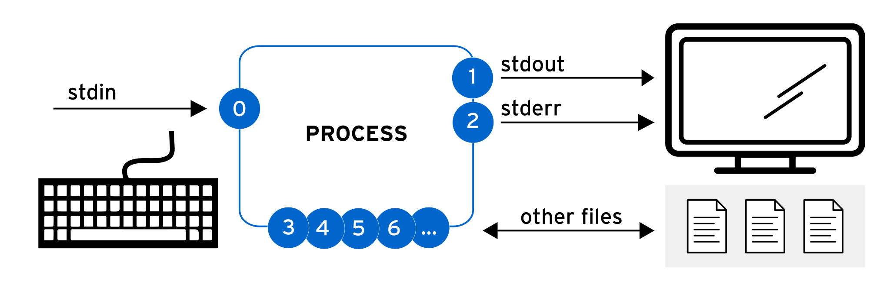
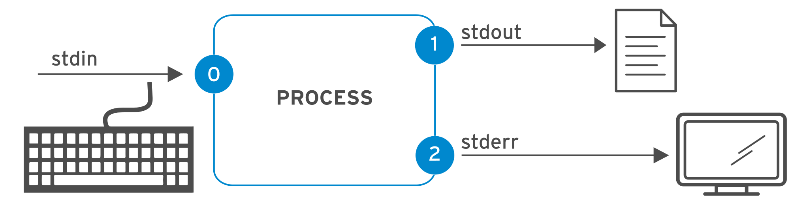
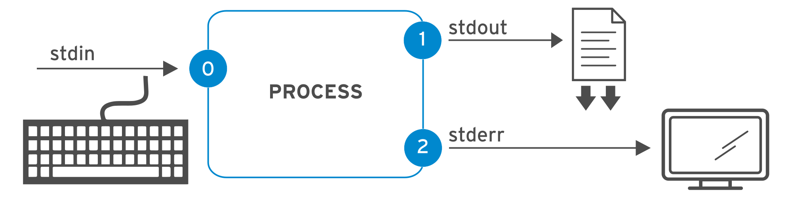
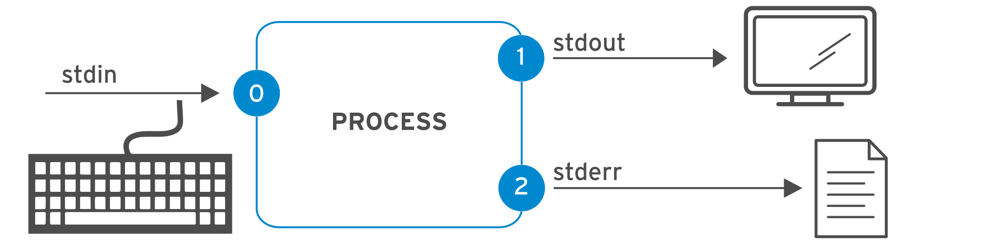
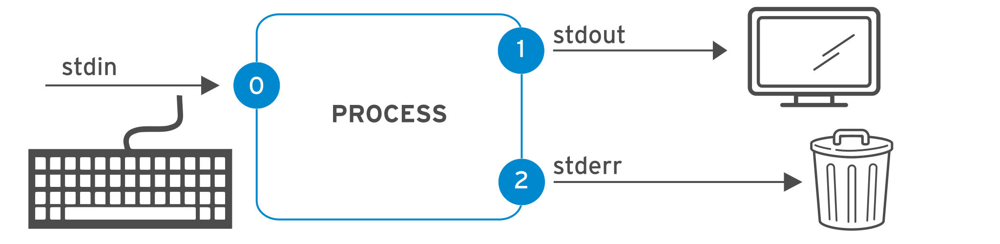
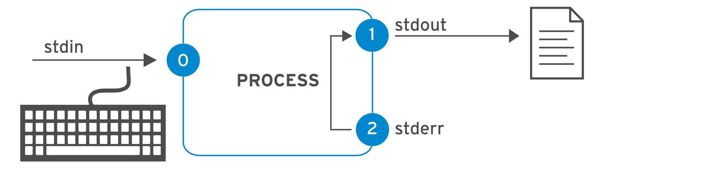
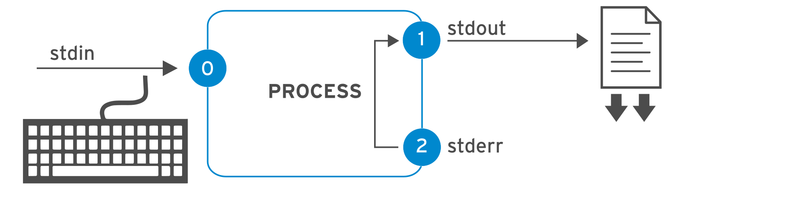
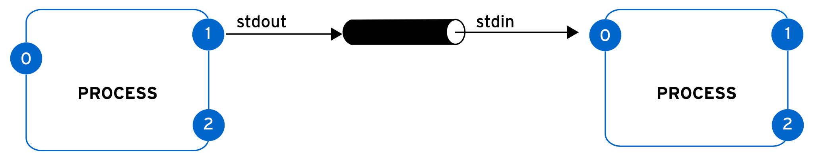
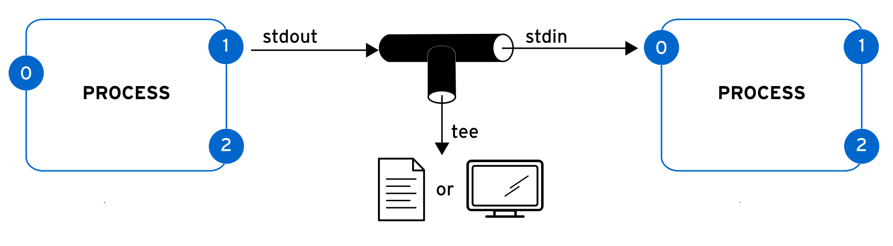

Quản trị hệ thống Red Hat I
---------------------------

# Chương 9. Chuyển hướng đầu vào và đầu ra của Shell

## Chuyển hướng đầu ra sang tệp và chương trình
### Mục tiêu
Lưu kết quả đầu ra hoặc thông báo lỗi vào tệp bằng cơ chế chuyển hướng (redirection) của shell, đồng thời xử lý kết quả đầu ra của lệnh
thông qua nhiều chương trình dòng lệnh bằng cơ chế đường ống (pipes).

### Đầu vào chuẩn, Đầu ra chuẩn và Lỗi chuẩn
Một chương trình đang chạy, hay còn gọi là tiến trình, sẽ đọc dữ liệu đầu vào và ghi dữ liệu đầu ra. Khi bạn thực thi một lệnh từ dấu
nhắc shell, lệnh đó thường đọc dữ liệu đầu vào từ bàn phím và gửi dữ liệu đầu ra đến cửa sổ terminal.

Một tiến trình sử dụng các kênh được đánh số, gọi là bộ mô tả tệp (file descriptor), để nhận dữ liệu đầu vào và gửi dữ liệu đầu ra. Mọi
tiến trình đều khởi đầu với ít nhất ba bộ mô tả tệp.

* Đầu vào chuẩn (kênh 0) đọc dữ liệu nhập từ bàn phím.
* Đầu ra chuẩn (kênh 1) gửi dữ liệu đầu ra thông thường của hệ thống đến thiết bị đầu cuối.
* Đầu ra lỗi chuẩn (kênh 2) gửi các thông báo lỗi đến thiết bị đầu cuối.

Nếu một chương trình mở các kết nối riêng biệt tới các tệp khác, thì nó có thể sử dụng các bộ mô tả tệp có số hiệu cao hơn.

**Hình 9.1: Các kênh I/O của tiến trình (bộ mô tả tệp)**  


Bảng sau đây tóm tắt thông tin về các bộ mô tả tệp:

**Bảng 9.1. Các kênh (Bộ mô tả tệp)**

| Số | Tên kênh | Mô tả            | Kết nối mặc định | Sử dụng               |
|----|----------|------------------|------------------|-----------------------|
| 0  | stdin    | Đầu vào chuẩn    | Bàn phím         | Chỉ đọc               |
| 1  | stdout   | Đầu ra chuẩn     | Terminal         | Chỉ ghi               |
| 2  | stderr   | Đầu ra lỗi chuẩn | Terminal         | Chỉ ghi               |
| 3+ | filename | Các tệp khác     | Không có         | Đọc, ghi, hoặc cả hai |

### Chuyển hướng đầu ra sang một tệp
Tính năng chuyển hướng Nhập/Xuất (I/O) thay đổi cách thức một tiến trình nhận dữ liệu đầu vào hoặc xuất dữ liệu đầu ra. Thay vì nhận dữ
liệu từ bàn phím hay gửi dữ liệu đầu ra và thông báo lỗi đến thiết bị đầu cuối (terminal), tiến trình có thể đọc từ hoặc ghi vào các
tệp tin. Với tính năng chuyển hướng, bạn có thể lưu các thông báo vào tệp tin thay vì hiển thị chúng trên thiết bị đầu cuối. Bạn cũng
có thể sử dụng tính năng này để loại bỏ dữ liệu đầu ra hoặc thông báo lỗi, giúp ngăn chúng hiển thị trên thiết bị đầu cuối hay được ghi
vào tệp tin.

Bạn có thể chuyển hướng luồng xuất chuẩn (stdout) của một tiến trình để ngăn dữ liệu đầu ra của tiến trình đó hiển thị trên thiết bị
đầu cuối. Nếu bạn chuyển hướng luồng xuất chuẩn vào một tệp tin và tệp tin đó chưa tồn tại, hệ thống sẽ tạo mới tệp tin này. Nếu tệp
tin đã tồn tại và thao tác chuyển hướng không sử dụng chế độ ghi nối tiếp (append), thì nội dung cũ của tệp tin sẽ bị ghi đè. Để loại
bỏ dữ liệu đầu ra của tiến trình, bạn có thể chuyển hướng nó đến tệp tin đặc biệt `/dev/null`; tệp tin này sẽ loại bỏ mọi dữ liệu được
chuyển hướng tới nó.

Như được minh họa trong bảng dưới đây, việc chỉ chuyển hướng luồng xuất chuẩn sẽ không ngăn được các thông báo lỗi (stderr) hiển thị
trên thiết bị đầu cuối.

#### Các toán tử chuyển hướng đầu ra
* Chuyển hướng stdout để ghi đè lên một tệp: **> FILE**.


* Chuyển hướng stdout để ghi nối tiếp vào một tệp: **>> FILE**.


* Chuyển hướng stderr để ghi đè lên một tệp: **2> FILE**. 


* Loại bỏ các thông báo lỗi stderr bằng cách chuyển hướng chúng đến /dev/null: **2> /dev/null**.


* Chuyển hướng stdout và stderr để ghi đè lên cùng một tệp: **> FILE 2>&1 hoặc &> FILE**.


* Chuyển hướng stdout và stderr để ghi nối tiếp vào cùng một tệp: **>> FILE 2>&1 hoặc &>> FILE**.


Bạn có thể kết hợp các toán tử khác nhau trong một lệnh duy nhất để tùy chỉnh việc chuyển hướng theo nhu cầu. Tính năng này đặc biệt
hữu ích khi bạn chạy các lệnh tạo ra kết quả hỗn hợp bao gồm cả đầu ra tiêu chuẩn (standard output) và lỗi tiêu chuẩn (standard error)
với khối lượng lớn.

Ví dụ, lệnh `find` sẽ trả về các tệp tin khớp với tiêu chí tìm kiếm đã định. Tuy nhiên, lệnh này có thể không có quyền truy cập vào một
số thư mục phù hợp với tiêu chí tìm kiếm, dẫn đến việc phát sinh lỗi. Bạn có thể theo dõi cả danh sách tệp tin tìm được lẫn các lỗi gặp
phải từ cùng một lệnh bằng cách chuyển hướng mỗi bộ mô tả (descriptor) sang một tệp riêng biệt.

Ví dụ dưới đây chuyển hướng danh sách tệp tin tìm được vào tệp `my-results.txt` và chuyển hướng các thông báo lỗi vào tệp `errors.txt`.

```
user@host:~$ find /etc > my-results.txt 2> errors.txt
```

Phần `> my-results.txt` của lệnh này chuyển kết quả tìm kiếm vào tệp `my-result.txt`.

```
user@host:~$ cat my-results.txt
/etc
/etc/NetworkManager
/etc/NetworkManager/NetworkManager.conf
/etc/NetworkManager/conf.d
/etc/NetworkManager/conf.d/30-cloud-init-ip6-addr-gen-mode.conf
/etc/NetworkManager/dispatcher.d
/etc/NetworkManager/dispatcher.d/no-wait.d
...output omitted...
```

Phần `2> errors.txt` của lệnh này chuyển hướng các lỗi vào tệp `errors.txt`.

```
user@host:~$ cat errors.txt
find: '/etc/audit': Permission denied
find: '/etc/credstore': Permission denied
find: '/etc/ssh/sshd_config.d': Permission denied
find: '/etc/credstore.encrypted': Permission denied
find: '/etc/polkit-1/rules.d': Permission denied
find: '/etc/polkit-1/localauthority': Permission denied
...output omitted...
```

**Quan trọng**: Thứ tự của các thao tác chuyển hướng rất quan trọng. Chuỗi thao tác sau đây chuyển hướng đầu ra chuẩn (standard
output) vào tệp `output.log`, sau đó chuyển hướng các thông báo lỗi chuẩn (standard error) đến cùng đích với đầu ra chuẩn
(`output.log`).

```
 > output.log 2>&1
```

Chuỗi lệnh tiếp theo thực hiện chuyển hướng theo thứ tự ngược lại. Chuỗi này chuyển hướng các thông báo lỗi chuẩn đến vị trí mặc định
của đầu ra chuẩn (cửa sổ terminal, do đó không có thay đổi gì), rồi sau đó chỉ chuyển hướng đầu ra chuẩn vào tệp `output.log`.

```
 2>&1 > output.log
```

Vì lý do này, một số người thích sử dụng các toán tử chuyển hướng gộp:

* `&> output.log` thay vì `> output.log 2>&1`
* `&>> output.log` thay vì >> `output.log 2>&1` (trong Bash 4 hoặc RHEL 6 trở về sau)

Tuy nhiên, các quản trị viên hệ thống và lập trình viên thường tránh sử dụng các toán tử chuyển hướng gộp (merging redirection
operators) mới hơn khi dùng các shell thay thế cho bash (được gọi là các shell tương thích với Bourne) để viết tập lệnh. Các toán tử
chuyển hướng mới này không được chuẩn hóa hay triển khai trong những shell đó, đồng thời còn có các hạn chế khác.

#### Các ví dụ về chuyển hướng đầu ra
Đơn giản hóa nhiều tác vụ quản trị thường quy bằng cách sử dụng tính năng chuyển hướng. Hãy xem lại bảng trước đó và cân nhắc các ví
dụ sau.

Lưu dấu thời gian vào tệp `/tmp/saved-timestamp` để tham khảo sau này.

```
user@host:~$ date > /tmp/saved-timestamp
```

Sao chép 100 dòng cuối cùng từ tệp /var/log/secure sang tệp /tmp/last-100-log-secure.

```
user@host:~$ tail -n 100 /var/log/secure > /tmp/last-100-log-secure
```

Nối tất cả bốn tệp STEP thành một tệp duy nhất trong thư mục tmp.

```
user@host:~$ cat step1.sh step2.log step3 step4 > /tmp/all-four-steps-in-one
```

Liệt kê tên các tệp ẩn và tệp thường trong thư mục chính, rồi lưu kết quả vào tệp my-file-names.

```
user@host:~$ ls -a > my-file-names
```

Thêm một dòng vào tệp /tmp/many-lines-of-information hiện có.

```
user@host:~$ echo "new line of information" >> /tmp/many-lines-of-information
```

Các lệnh tiếp theo sẽ tạo ra thông báo lỗi do người dùng thông thường không thể truy cập một số thư mục hệ thống. Hãy quan sát cách
chuyển hướng thông báo lỗi.

Chuyển hướng lỗi từ lệnh `find` sang tệp `/tmp/errors` trong khi vẫn hiển thị kết quả đầu ra thông thường của lệnh trên cửa sổ dòng
lệnh (terminal).

```
user@host:~$ find /etc -name passwd 2> /tmp/errors
```

Lưu đầu ra của tiến trình vào tệp /tmp/output và các thông báo lỗi vào tệp /tmp/errors.

```
user@host:~$ find /etc -name passwd > /tmp/output 2> /tmp/errors
```

Lưu đầu ra của tiến trình vào tệp /tmp/output và loại bỏ các thông báo lỗi.

```
user@host:~$ find /etc -name passwd > /tmp/output 2> /dev/null
```

Lưu cả đầu ra và lỗi vào tệp /tmp/all-message-output.

```
user@host:~$ find /etc -name passwd &> /tmp/all-message-output
```

Ghi nối tiếp đầu ra và các lỗi vào tệp /tmp/all-message-output.

```
user@host:~$ find /etc -name passwd >> /tmp/all-message-output 2>&1
```

#### Xây dựng cơ chế đường ống - Pipeline
Pipeline là một chuỗi gồm một hoặc nhiều lệnh được ngăn cách bởi ký tự pipe (|). Pipeline kết nối đầu ra tiêu chuẩn của lệnh trước đó
với đầu vào tiêu chuẩn của lệnh tiếp theo.

**Hình 9.8: Process I/O piping**  

Với cơ chế đường ống (pipeline), một tiến trình có thể xử lý và định dạng dữ liệu đầu ra của một tiến trình khác trước khi dữ liệu đó
được gửi đến thiết bị đầu cuối (terminal). Hãy hình dung dữ liệu di chuyển qua đường ống từ tiến trình này sang tiến trình khác và bị
thay đổi bởi từng lệnh mà nó đi qua trong đường ống đó.

> **Lưu ý**: Cả cơ chế đường ống (pipeline) và chuyển hướng nhập/xuất (I/O redirection) đều tác động đến đầu ra chuẩn (standard
output) và đầu vào chuẩn (standard input). Đường ống truyền đầu ra chuẩn từ một tiến trình này sang đầu vào chuẩn của một tiến trình
khác. Chuyển hướng thực hiện việc gửi đầu ra chuẩn đến các tệp tin hoặc lấy đầu vào chuẩn từ các tệp tin.

##### Ví dụ về cơ chế đường ống
Ví dụ sau đây chuyển hướng đầu ra của lệnh `ls` sang lệnh `less` để hiển thị trên terminal theo từng màn hình một.

```
user@host:~$ ls -l /usr/bin | less
```

Chuyển hướng đầu ra của lệnh `ls` sang lệnh `wc -l`; lệnh này sẽ đếm số dòng nhận được từ lệnh `ls` và in giá trị đó ra màn hình
terminal.

```
user@host:~$ ls | wc -l
```

Chuyển hướng đầu ra của lệnh `ls -t` sang lệnh `head` để hiển thị 10 dòng đầu tiên, với kết quả cuối cùng được chuyển hướng vào tệp
`/tmp/first-ten-changed-files`.

```
user@host:~$ ls -t | head -n 10 > /tmp/first-ten-changed-files
```

#### Đường ống, Chuyển hướng và Ghi nối tiếp vào tệp
Khi kết hợp chuyển hướng (redirection) với đường ống (pipeline), shell sẽ thiết lập toàn bộ đường ống trước, sau đó mới thực hiện
chuyển hướng đầu vào/đầu ra. Nếu bạn sử dụng chuyển hướng đầu ra ở giữa đường ống, dữ liệu đầu ra sẽ được ghi vào tệp thay vì được
chuyển đến lệnh tiếp theo trong đường ống.

Trong ví dụ dưới đây, đầu ra của lệnh `ls` được chuyển hướng đến tệp `/tmp/saved-output`, và lệnh `less` không hiển thị bất kỳ nội
dung nào trên terminal.

```
user@host:~$ ls > /tmp/saved-output | less
```

Lệnh `tee` giúp khắc phục hạn chế này. Trong một đường ống (pipeline), lệnh `tee` sao chép dữ liệu từ đầu vào chuẩn (standard input)
sang đầu ra chuẩn (standard output), đồng thời chuyển hướng đầu ra đó vào các tệp tin được chỉ định làm tham số cho lệnh. Nếu coi dữ
liệu như dòng nước chảy qua đường ống, bạn có thể hình dung lệnh `tee` giống như một khớp nối hình chữ T giúp dẫn luồng dữ liệu theo
hai hướng khác nhau.

**Hình 9.9: Process I/O piping với tee**  


##### Các ví dụ về đường ống (pipeline) sử dụng lệnh tee
Ví dụ sau đây chuyển hướng đầu ra của lệnh `ls` sang tệp `/tmp/saved-output` và chuyển nó cho lệnh `less`, nhờ đó nội dung được hiển
thị trên terminal theo từng màn hình một.

```
user@host:~$ ls -l | tee /tmp/saved-output | less
```

Nếu bạn sử dụng lệnh `tee` ở cuối một đường ống (pipeline), terminal sẽ hiển thị đầu ra của các lệnh trong đường ống đó, đồng thời lưu
kết quả vào một tệp tin.

```
user@host:~$ ls -t | head -n 10 | tee /tmp/ten-last-changed-files
```

Sử dụng tùy chọn -a của lệnh tee để nối nội dung vào tệp thay vì ghi đè lên tệp đó.

```
user@host:~$ ls -l | tee -a /tmp/append-files
```

**Quan trọng**: Bạn có thể chuyển hướng luồng lỗi chuẩn (standard error) qua một đường ống (pipeline), nhưng không thể sử dụng các
toán tử chuyển hướng gộp (`&>` và `&>>`). Ví dụ sau đây minh họa cách chính xác để chuyển hướng cả luồng xuất chuẩn (standard output)
và luồng lỗi chuẩn qua một đường ống:

```
user@host:~$ find / -name passwd 2>&1 | less
```
