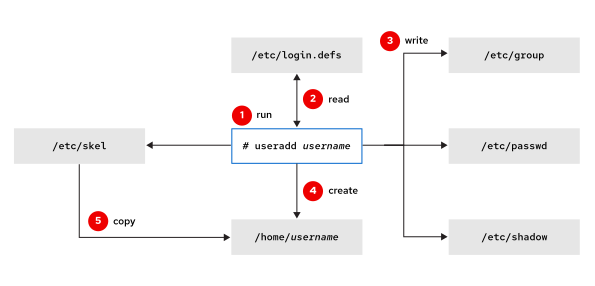
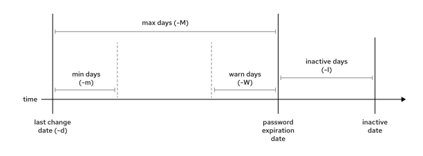

Quản trị hệ thống Red Hat I
---------------------------

# Chương 10. Quản lý người dùng và nhóm cục bộ

## Người dùng và Nhóm trong Linux
### Mục tiêu
Mô tả mục đích của người dùng và nhóm trên hệ thống Linux.

### Người dùng Linux
Tài khoản người dùng thiết lập ranh giới bảo mật giữa con người và các chương trình có khả năng thực thi lệnh.

Người dùng có tên đăng nhập để định danh bản thân với những người dùng khác và để thuận tiện cho quá trình làm việc. Ở cấp độ hệ thống,
các tài khoản người dùng được phân biệt bằng một mã định danh duy nhất được gán cho chúng, gọi là ID người dùng (UID). Trong hầu hết
các trường hợp, nếu tài khoản được sử dụng bởi một người thật, hệ thống sẽ cấp một mật khẩu bí mật để người đó chứng minh quyền truy
cập hợp lệ khi đăng nhập.

Tài khoản người dùng đóng vai trò nền tảng đối với bảo mật hệ thống. Mọi tiến trình (chương trình đang chạy) trên hệ thống đều hoạt
động dưới danh nghĩa một người dùng cụ thể. Mỗi tệp tin đều có một người dùng cụ thể là chủ sở hữu. Thông qua cơ chế sở hữu tệp tin, hệ
thống thực thi việc kiểm soát quyền truy cập đối với người dùng. Người dùng gắn liền với một tiến trình đang chạy sẽ quyết định những
tệp tin và thư mục nào mà tiến trình đó có thể truy cập.

#### Các loại người dùng trong hệ thống Linux
Ba loại tài khoản người dùng chính là siêu người dùng (superuser), người dùng hệ thống và người dùng thông thường.

* Tài khoản superuser (người dùng đặc quyền) chịu trách nhiệm quản trị hệ thống. Tên của superuser là `root` và UID của tài khoản này
là 0. Superuser có quyền truy cập toàn bộ hệ thống.
* Các tài khoản người dùng hệ thống được sử dụng bởi các tiến trình cung cấp dịch vụ hỗ trợ. Những tiến trình này — hay còn gọi là các
daemon — thường không cần chạy với quyền siêu người dùng (superuser) và không có phiên làm việc trên thiết bị đầu cuối (terminal
session) để điều khiển. Chúng thường được gán các tài khoản người dùng hệ thống không có đặc quyền nhằm bảo vệ tập tin và các tài
nguyên khác, tách biệt chúng khỏi nhau cũng như khỏi những người dùng thông thường trên hệ thống. Người dùng không đăng nhập trực tiếp
(tương tác) bằng tài khoản người dùng hệ thống.
* Người dùng thông thường: Hầu hết người dùng đều có tài khoản người dùng thông thường để phục vụ công việc hàng ngày. Giống như người
dùng hệ thống, người dùng thông thường có quyền truy cập hạn chế vào hệ thống.

Sử dụng lệnh `id` để hiển thị thông tin về người dùng đang đăng nhập:

```
user01@host:~$ id
uid=1000(user01) gid=1000(user01) groups=1000(user01) context=unconfined_u:unconfined_r:unconfined_t:s0-s0:c0.c1023
```

Để xem thông tin về một người dùng khác (ví dụ: user02), hãy truyền tên người dùng làm đối số cho lệnh `id`:

```
user01@host:~$ id user02
uid=1002(user02) gid=1001(user02) groups=1001(user02) context=unconfined_u:unconfined_r:unconfined_t:s0-s0:c0.c1023
```

##### Các ví dụ về lệnh hiển thị thông tin người dùng
Sử dụng lệnh `ls -l` để hiển thị người dùng sở hữu tệp tin. Sử dụng lệnh `ls -ld` để hiển thị người dùng sở hữu thư mục thay vì nội
dung bên trong thư mục đó. Trong kết quả hiển thị dưới đây, cột thứ ba cho biết tên người dùng của chủ sở hữu.

```
user01@host:~$ ls -l mytextfile.txt
-rw-rw-r--. 1 user01 user01 0 Feb  5 11:10 mytextfile.txt

user01@host:~$ ls -ld Documents
drwxrwxr-x. 2 user01 user01 6 Feb  5 11:10 Documents
```

Sử dụng lệnh `ps` để xem thông tin về tiến trình. Theo mặc định, lệnh `ps` chỉ hiển thị các tiến trình đang chạy với cùng UID như người
dùng hiện tại và gắn liền với thiết bị đầu cuối (terminal) nơi lệnh `ps` được thực thi.

Bạn có thể thêm các tùy chọn khác nhau để thay đổi cách thức hoạt động này. Nếu sử dụng kết hợp các tùy chọn `awwu`, lệnh `ps` sẽ liệt
kê các tiến trình thuộc sở hữu của bất kỳ người dùng nào có gắn kết với thiết bị đầu cuối (`a`), cung cấp thêm thông tin chi tiết về
người dùng cho mỗi tiến trình (`u`), và không cắt bớt nội dung hiển thị trên mỗi dòng (`ww`).

Trong phần kết quả hiển thị dưới đây, cột đầu tiên cho biết tên người dùng sở hữu mỗi tiến trình.

```
user01@host:~$ ps awwu
USER     PID %CPU %MEM    VSZ   RSS TTY    STAT START  TIME COMMAND
root    1690  0.0  0.0 220984  1052 ttyS0  Ss+  22:43  0:00 /sbin/agetty -o -- \u --noreset --noclear --keep-baud 115200,57600,38400,9600 - vt220
user01  1769  0.0  0.1 454012  5556 tty2   Ssl+ 22:45  0:00 /usr/libexec/gdm-wayland-session /usr/bin/gnome-session
user01  1800  0.0  0.3 521412 19824 tty2   Sl+  22:45  0:00 /usr/libexec/gnome-session-binary
user01  3072  0.0  0.0 224152  5756 pts/1  Ss   22:48  0:00 /usr/bin/bash
user01  3122  0.0  0.0 225556  3652 pts/1  R+   22:49  0:00 ps awwu
```

> **Lưu ý**: Lệnh `ps` có hai nhóm tùy chọn tương tự nhau: các tùy chọn kiểu UNIX bắt đầu bằng dấu gạch ngang và các tùy chọn kiểu BSD
không có dấu gạch ngang. Mỗi nhóm tùy chọn có cách hoạt động hơi khác nhau. Hãy tham khảo trang hướng dẫn (man page) `ps(1)` để biết
thêm chi tiết.

##### Tài khoản người dùng cục bộ
Kết quả đầu ra của hầu hết các lệnh thường hiển thị người dùng theo tên, nhưng ở cấp độ nội bộ, hệ điều hành sử dụng UID để quản lý
người dùng. Việc ánh xạ giữa tên người dùng và UID được quy định trong các cơ sở dữ liệu chứa thông tin tài khoản. Theo mặc định, hệ
thống sử dụng tệp `/etc/passwd` để lưu trữ thông tin về người dùng cục bộ.

Mỗi dòng trong tệp `/etc/passwd` chứa thông tin về một người dùng. Tệp này được chia thành bảy trường dữ liệu, ngăn cách với nhau bằng
dấu hai chấm.

Dưới đây là một dòng ví dụ trong tệp `/etc/passwd` cung cấp thông tin về người dùng `user01`:

```
user01@host:~$ cat /etc/passwd
...output omitted...
user01:x:1000:1000:User One:/home/user01:/bin/bash
```

Hãy xem xét từng phần của khối mã, được phân tách bằng dấu hai chấm:

* `user01`: Tên đăng nhập của người dùng này.
* `x`: Trước đây, mật khẩu đã mã hóa của người dùng được lưu tại đây; hiện tại nó chỉ đóng vai trò là một ký tự giữ chỗ.
* `1000`: Số UID của tài khoản người dùng này.
* `1000`: Số GID của nhóm chính thuộc tài khoản người dùng này. Các nhóm sẽ được đề cập ở phần sau của mục này.
* `User One`: Một ghi chú ngắn, mô tả hoặc tên thật của người dùng này.
* `/home/user01`: Thư mục nhà (home directory) của người dùng, đồng thời là thư mục làm việc ban đầu khi shell đăng nhập khởi chạy.
* `/bin/bash`: Chương trình shell mặc định cho người dùng này, chạy khi đăng nhập. Một số tài khoản sử dụng shell `/sbin/nologin`
để ngăn chặn việc đăng nhập tương tác bằng tài khoản đó.

#### Các nhóm Linux
Nhóm là tập hợp các người dùng cần chia sẻ quyền truy cập vào các tệp và tài nguyên hệ thống khác. Bằng cách sử dụng nhóm, bạn có thể
cấp quyền truy cập tệp cho một tập hợp người dùng thay vì cấp cho từng người dùng riêng lẻ.

Cũng giống như người dùng, các nhóm đều có tên gọi để dễ nhận biết. Ở cấp độ hệ thống, các nhóm được phân biệt bằng một mã định danh
duy nhất được gán cho chúng, gọi là ID nhóm (GID). Việc ánh xạ giữa tên nhóm và GID được quy định trong các cơ sở dữ liệu quản lý danh
tính chứa thông tin về tài khoản nhóm. Theo mặc định, hệ thống sử dụng tệp `/etc/group` để lưu trữ thông tin về các nhóm cục bộ.

Mỗi dòng trong tệp `/etc/group` chứa thông tin về một nhóm. Mỗi mục thông tin nhóm được chia thành bốn trường, ngăn cách nhau bằng dấu
hai chấm.

Dưới đây là một dòng ví dụ từ tệp `/etc/group` cung cấp thông tin về nhóm `group01`:

```
user01@host:~$ cat /etc/group
...output omitted...
group01:x:10000:user01,user02,user03
```

Hãy xem xét từng phần của khối mã, được phân tách bằng dấu hai chấm:

* `group01`: Tên của nhóm này.
* `x`: Trường mật khẩu nhóm đã lỗi thời; hiện chỉ đóng vai trò giữ chỗ.
* `10000`: Số GID của nhóm này (10000).
* `user01,user02,user03`: Danh sách người dùng thuộc nhóm này dưới dạng nhóm bổ sung.

##### Các nhóm chính và các nhóm bổ sung
Mỗi người dùng có duy nhất một nhóm chính (primary group). Đối với người dùng cục bộ, nhóm này được xác định bởi GID trong tệp
`/etc/passwd`. Nhóm chính là nhóm sở hữu các tệp tin do người dùng đó tạo ra.

Khi một người dùng thông thường được tạo mới, một nhóm có cùng tên với người dùng đó cũng được tạo ra để đóng vai trò là nhóm chính
cho người dùng này. Người dùng đó là thành viên duy nhất của nhóm riêng này (thường được gọi là User Private Group). Thiết kế phân
chia nhóm như vậy giúp đơn giản hóa việc quản lý quyền truy cập tệp tin nhờ cơ chế tách biệt các nhóm người dùng theo mặc định.

Người dùng cũng có thể thuộc các nhóm bổ sung (supplementary groups). Thông tin về việc tham gia các nhóm bổ sung được lưu trữ trong
tệp `/etc/group`. Quyền truy cập tệp tin của người dùng được xác định dựa trên quyền của bất kỳ nhóm nào mà họ tham gia, bất kể đó là
nhóm chính hay nhóm bổ sung. Ví dụ: nếu người dùng `user01` có nhóm chính là `user01` và các nhóm bổ sung là `wheel` và `webadmin`,
thì người dùng đó có thể đọc được các tệp tin mà bất kỳ nhóm nào trong số ba nhóm kể trên có quyền đọc.

Lệnh `id` có thể hiển thị thông tin về các nhóm mà người dùng tham gia. Trong ví dụ dưới đây, người dùng `user01` có nhóm `user01` là
nhóm chính (gid). Mục `groups` liệt kê tất cả các nhóm mà người dùng này tham gia; cụ thể, người dùng này còn thuộc các nhóm bổ sung
là `wheel` và `group01`.

```
user01@host:~$ id
uid=1001(user01) gid=1003(user01) groups=1003(user01),10(wheel),10000(group01) context=unconfined_u:unconfined_r:unconfined_t:s0-s0:c0.c1023
```

## Có được quyền truy cập Superuser
### Mục tiêu
Chuyển sang tài khoản siêu người dùng (superuser) để quản lý hệ thống Linux và cấp quyền truy cập siêu người dùng cho các người dùng
khác bằng cách sử dụng Sudo.

### Siêu người dùng
Hầu hết các hệ điều hành đều có một tài khoản siêu người dùng (superuser) nắm giữ toàn quyền kiểm soát hệ thống. Trong Red Hat
Enterprise Linux, siêu người dùng này được gọi là người dùng root. Tài khoản này có quyền vượt qua các giới hạn đặc quyền thông thường
trên hệ thống tập tin, cho phép bạn thực hiện các tác vụ quản lý và quản trị hệ thống. Đối với các công việc như cài đặt hoặc gỡ bỏ
phần mềm, cũng như quản lý các tập tin và thư mục hệ thống, người dùng cần nâng quyền của mình lên thành người dùng root.

Thông thường, chỉ người dùng root mới có quyền kiểm soát hầu hết các thiết bị, tuy nhiên vẫn có một số ngoại lệ. Ví dụ, người dùng
thông thường có thể điều khiển các thiết bị lưu trữ rời như ổ đĩa USB. Nhờ đó, họ có thể thêm, xóa tập tin hoặc thực hiện các thao tác
quản lý khác trên thiết bị rời, nhưng theo mặc định, chỉ người dùng root mới có quyền quản lý các ổ cứng.

Tuy nhiên, đi kèm với đặc quyền không giới hạn này là trách nhiệm tương ứng. Người dùng root nắm giữ quyền lực tuyệt đối và có thể gây
hại cho hệ thống: họ có khả năng xóa tập tin và thư mục, xóa tài khoản người dùng, tạo cửa hậu (backdoor), v.v. Nếu tài khoản root bị
xâm nhập, hệ thống sẽ rơi vào tình trạng nguy hiểm và bạn có thể mất quyền kiểm soát quản trị. Red Hat khuyến nghị các quản trị viên
hệ thống luôn đăng nhập bằng tài khoản người dùng thông thường và chỉ nâng quyền lên root khi thực sự cần thiết.

> **Quan trọng**: Trong RHEL 10, theo mặc định, tài khoản root không có mật khẩu hợp lệ, do đó bạn không thể đăng nhập trực tiếp với
tư cách là người dùng root bằng mật khẩu.

Tài khoản root trên Linux tương tự như tài khoản Administrator cục bộ trên Microsoft Windows. Trong Linux, hầu hết các quản trị viên
hệ thống đều đăng nhập vào hệ thống với tư cách là người dùng không có đặc quyền và sử dụng các công cụ khác nhau để tạm thời có được
quyền root.

> **Cảnh báo**: Người dùng Microsoft Windows có thể đã quen với việc đăng nhập bằng tài khoản Administrator cục bộ để thực hiện các
tác vụ quản trị hệ thống. Tuy nhiên, cách làm này hiện không còn được khuyến nghị; thay vào đó, người dùng sẽ có quyền quản trị thông
qua việc là thành viên của nhóm Administrators. Tương tự đối với RHEL, Red Hat khuyến nghị các quản trị viên hệ thống không nên đăng
nhập trực tiếp bằng tài khoản root. Thay vào đó, họ nên đăng nhập bằng tài khoản người dùng thông thường và sử dụng các cơ chế để tạm
thời có được quyền siêu người dùng (ví dụ: su, sudo hoặc PolicyKit). Khi đăng nhập bằng tài khoản root, toàn bộ môi trường làm việc 
desktop environment) sẽ chạy với quyền quản trị một cách không cần thiết. Một lỗ hổng bảo mật – vốn thường chỉ ảnh hưởng đến tài khoản
người dùng thông thường – khi đó có nguy cơ gây hại cho toàn bộ hệ thống.

### Chuyển đổi tài khoản người dùng
Với lệnh `su`, người dùng có thể chuyển sang một tài khoản người dùng khác. Nếu bạn chạy lệnh `su` từ một tài khoản người dùng thông
thường với một tài khoản khác làm tham số, bạn phải cung cấp mật khẩu của tài khoản mà mình muốn chuyển sang. Khi người dùng root chạy
lệnh `su`, bạn không cần phải nhập mật khẩu của người dùng đó.

Ví dụ này sử dụng lệnh `su` từ tài khoản `user01` để chuyển sang tài khoản `user02`:

```
user01@host:~$ su - user02
Password: user02_password
user02@host:~$
```

Nếu bạn bỏ qua tên người dùng, lệnh `su` hoặc `su -` sẽ mặc định cố gắng chuyển sang người dùng root.

```
user01@host:~$ su -
Password: root_password
root@host:~#
```

Lệnh `su` khởi động một shell tương tác không yêu cầu đăng nhập (non-login shell), trong khi lệnh `su -` (với tùy chọn dấu gạch ngang)
khởi động một shell tương tác yêu cầu đăng nhập (login shell). Sự khác biệt giữa hai lệnh này nằm ở cách thức shell được khởi tạo khi
bắt đầu, tùy thuộc vào việc đó là login shell hay non-login shell.

`su -` bắt đầu một phiên đăng nhập tương tác mới với tư cách là người dùng mà bạn chuyển sang, đồng thời sử dụng các thiết lập môi
trường của người dùng đích đó.

`su` khởi động một trình shell tương tác với tư cách người dùng mà bạn đang chuyển sang, nhưng vẫn sử dụng một phần các thiết lập môi
trường của người dùng ban đầu.

Thông thường, quản trị viên nên chạy lệnh `su -` để có được một shell với các thiết lập môi trường của người dùng đích. Cách làm này
đảm bảo rằng shell thu được được khởi tạo theo cùng cách thức như khi người dùng đó đăng nhập theo quy trình thông thường. Để biết
thêm thông tin, hãy tham khảo trang hướng dẫn (man page) của `bash(1)`.

### Chạy lệnh với Sudo
Trong RHEL 10, theo mặc định, tài khoản root không có mật khẩu hợp lệ. Nói cách khác, không có mật khẩu nào cho phép người dùng xác
thực và truy cập vào tài khoản root, dù là khi cố gắng đăng nhập trực tiếp với tư cách là root hay khi cố gắng sử dụng lệnh su.

> **Quan trọng**: Quản trị viên hệ thống có thể đặt mật khẩu cho tài khoản root; nếu biết mật khẩu này, bạn có thể chuyển sang quyền
người dùng root bằng lệnh `su`.

Vì lý do bảo mật, các quản trị viên hệ thống thường không thiết lập mật khẩu hợp lệ cho tài khoản root. Trong trường hợp đó, để truy
cập tài khoản root, người dùng phải đăng nhập vào một tài khoản người dùng thông thường bằng mật khẩu của chính họ, sau đó sử dụng
lệnh `sudo` để chuyển sang quyền root hoặc thực thi các lệnh với tư cách là người dùng root.

Khác với lệnh `su`, lệnh `sudo` thường yêu cầu người dùng nhập mật khẩu của chính mình để xác thực, thay vì mật khẩu của tài khoản mà
họ đang muốn truy cập. Nghĩa là, người dùng sử dụng lệnh `sudo` để thực thi lệnh với quyền root không cần phải biết mật khẩu root;
thay vào đó, họ sử dụng mật khẩu của chính mình để xác thực quyền truy cập.

> **Quan trọng**: Theo mặc định, lệnh sudo sẽ lưu mật khẩu của bạn vào bộ nhớ đệm trong năm phút sau khi xác thực thành công. Do đó,
bạn không cần nhập mật khẩu nhiều lần nếu chạy một loạt lệnh sudo nhanh. Bạn có thể chạy lệnh sudo -k để xóa ngay mật khẩu khỏi bộ đệm.

Ngoài ra, bạn có thể cấu hình lệnh `sudo` để cho phép những người dùng cụ thể chạy bất kỳ lệnh nào dưới quyền của một người dùng khác,
hoặc chỉ chạy một số lệnh nhất định dưới quyền người dùng đó. Ví dụ: nếu bạn cấu hình lệnh `sudo` để cho phép người dùng `user01` chạy
lệnh `usermod` dưới quyền `root`, thì bạn có thể chạy lệnh sau để khóa hoặc mở khóa tài khoản người dùng:

```
user01@host:~$ sudo usermod -L user02
[sudo] password for user01: user01_password
user01@host:~$ su - user02
Password: user02_password
su: Authentication failure
user01@host:~$
```

Nếu người dùng cố gắng thực thi một lệnh với tư cách là người dùng khác mà cấu hình Sudo không cho phép, thì Sudo sẽ chặn lệnh đó, ghi
lại nỗ lực thực hiện và mặc định gửi email cho người dùng root.

```
user02@host:~$ sudo tail /var/log/secure
[sudo] password for user02: user02_password
user02 is not in the sudoers file.  This incident will be reported.
user02@host:~$
```

Một lợi ích khác của lệnh sudo là nó tự động ghi lại tất cả các lệnh đã thực thi vào tệp /var/log/secure.

```
user01@host:~$ sudo tail /var/log/secure
...output omitted...
Mar  9 20:45:46 host sudo[2577]:  user01 : TTY=pts/0 ; PWD=/home/user01 ; USER=root ; COMMAND=/sbin/usermod -L user02
...output omitted...
```

Trong Red Hat Enterprise Linux 7 và các phiên bản sau này, tất cả các thành viên của nhóm `wheel` đều có thể sử dụng `sudo` để chạy
lệnh với tư cách là bất kỳ người dùng nào (bao gồm cả `root`) bằng cách sử dụng mật khẩu của chính họ.

> **Cảnh báo**: Theo truyền thống, các hệ thống UNIX sử dụng tư cách thành viên của nhóm `wheel` để cấp hoặc kiểm soát quyền truy cập
siêu người dùng (superuser). Theo mặc định, RHEL 6 và các phiên bản cũ hơn không cấp bất kỳ đặc quyền nào cho nhóm `wheel`. Các quản
trị viên hệ thống từng sử dụng nhóm này cho mục đích phi tiêu chuẩn cần cập nhật cấu hình cũ để ngăn chặn những người dùng không được
phép hoặc không mong muốn có được quyền quản trị trên các hệ thống RHEL 7 và các phiên bản mới hơn.

#### Lấy quyền truy cập shell root tương tác bằng Sudo
Để truy cập tài khoản root bằng lệnh sudo, hãy sử dụng lệnh `sudo -i`. Lệnh này chuyển sang tài khoản root, đồng thời khởi chạy shell
mặc định của người dùng đó (thường là bash) cùng các tập lệnh đăng nhập tương tác đi kèm. Để khởi chạy shell mà không thực thi các tập
lệnh tương tác, hãy sử dụng lệnh `sudo -s`.

Ví dụ: quản trị viên có thể truy cập shell tương tác với quyền root trên một instance AWS Elastic Compute Cloud (EC2) bằng cách sử
dụng phương thức xác thực khóa công khai SSH để đăng nhập dưới tên người dùng thường là `ec2-user`. Sau đó, thực thi lệnh `sudo -i` để
truy cập vào shell của người dùng root.

```
ec2-user@host:~$ sudo -i
[sudo] password for ec2-user: ec2-user_password
root@host:~#
```

> **Lưu ý**: Vì lý do bảo mật, lệnh `sudo` sẽ sửa đổi môi trường shell mà nó thiết lập trước khi thực thi các lệnh hoặc bắt đầu các
phiên làm việc tương tác, dựa trên các cài đặt trong tệp cấu hình của nó. Với cấu hình mặc định, môi trường thu được sẽ tương tự như
môi trường bạn có được khi đăng nhập bằng người dùng đó để bắt đầu một phiên làm việc mới.

#### Cấu hình Sudo
Tệp /etc/sudoers là tệp cấu hình chính cho lệnh sudo. Để tránh các sự cố khi nhiều quản trị viên cùng chỉnh sửa tệp này, bạn chỉ có
thể chỉnh sửa nó bằng lệnh đặc biệt visudo. Trình soạn thảo visudo cũng thực hiện kiểm tra tệp để đảm bảo không có lỗi cú pháp.

Ví dụ, dòng sau đây trong tệp /etc/sudoers cho phép các thành viên thuộc nhóm wheel sử dụng quyền sudo:

```
%wheel        ALL=(ALL:ALL)       ALL
```

* Chuỗi `%wheel` đại diện cho người dùng hoặc nhóm mà quy tắc này áp dụng. Dấu phần trăm (%) đứng trước từ `wheel`
xác định đây là một nhóm.
* Lệnh `ALL=(ALL:ALL)` quy định rằng trên bất kỳ máy chủ nào có chứa tệp này (vị trí `ALL` đầu tiên), người dùng thuộc nhóm `wheel`
có thể thực thi lệnh với tư cách là bất kỳ người dùng nào khác (vị trí `ALL` thứ hai) và bất kỳ nhóm nào khác (vị trí `ALL` thứ ba)
trên hệ thống.
* Thành phần `ALL` cuối cùng quy định rằng người dùng thuộc nhóm `wheel` có thể thực thi bất kỳ lệnh nào.

Theo mặc định, tệp /etc/sudoers cũng bao gồm nội dung của các tệp nằm trong thư mục /etc/sudoers.d như một phần của tệp cấu hình.
Với cấu trúc phân cấp này, bạn có thể cấp quyền truy cập sudo cho người dùng bằng cách đặt một tệp thích hợp vào thư mục đó.

> **Quan trọng**: Bạn có thể bật hoặc tắt quyền truy cập sudo bằng cách sao chép một tệp vào thư mục hoặc xóa tệp đó khỏi thư mục.
Trong khóa học này, bạn sẽ tạo và xóa các tệp trong thư mục /etc/sudoers.d để cấu hình quyền truy cập sudo cho người dùng và nhóm.

Để cấp quyền sudo đầy đủ cho người dùng user01, bạn có thể tạo tệp /etc/sudoers.d/user01 với nội dung sau:

```
user01        ALL=(ALL)       ALL
```

Để cấp quyền sudo đầy đủ cho nhóm group01, bạn có thể tạo tệp /etc/sudoers.d/group01 với nội dung sau:

```
%group01        ALL=(ALL)       ALL
```

Để cho phép người dùng thuộc nhóm `games` chạy lệnh `id` với tư cách là người dùng `operator`, bạn có thể tạo tệp
`/etc/sudoers.d/games` với nội dung sau:

```
%games ALL=(operator) /bin/id
```

Bạn cũng có thể cấu hình sudo để cho phép người dùng chạy các lệnh dưới quyền một người dùng khác mà không cần nhập mật khẩu, bằng
cách sử dụng lệnh `NOPASSWD: ALL`:

```
ansible        ALL=(ALL)       NOPASSWD: ALL
```

Mặc dù việc cấp quyền truy cập ở mức độ này cho người dùng hoặc nhóm người dùng tiềm ẩn những rủi ro bảo mật rõ ràng, các quản trị
viên hệ thống vẫn thường áp dụng phương thức này đối với các instance trên đám mây, máy ảo và hệ thống cấp phát tài nguyên dùng để cấu
hình máy chủ. Bạn cần bảo vệ tài khoản có quyền truy cập này và bắt buộc sử dụng cơ chế xác thực bằng khóa công khai (public-key
authentication) qua SSH để người dùng từ hệ thống từ xa có thể truy cập vào tài khoản đó.

Ví dụ, hình ảnh máy ảo (AMI) chính thức dành cho Red Hat Enterprise Linux trên Amazon Web Services Marketplace được cung cấp với các
mật khẩu của tài khoản `root` và `ec2-user` ở trạng thái bị khóa. Tài khoản `ec2-user` được thiết lập để cho phép truy cập tương tác
từ xa thông qua xác thực bằng khóa công khai SSH. Người dùng `ec2-user` cũng có thể thực thi bất kỳ lệnh nào với quyền `root` mà không
cần mật khẩu, do dòng cuối cùng trong tệp `/etc/sudoers` của AMI được cấu hình như sau:

```
ec2-user        ALL=(ALL)       NOPASSWD: ALL
```

Bạn có thể kích hoạt lại yêu cầu nhập mật khẩu khi sử dụng sudo, hoặc thực hiện các thay đổi khác để tăng cường bảo mật như một phần
của quá trình cấu hình hệ thống.

## Quản lý tài khoản người dùng cục bộ
### Mục tiêu
Tạo, sửa đổi và xóa các tài khoản người dùng cục bộ.

### Quản lý người dùng cục bộ từ dòng lệnh
Bạn có thể sử dụng các công cụ dòng lệnh để quản lý tài khoản người dùng cục bộ. Phần này giới thiệu một số công cụ quan trọng dùng để
tạo và xóa tài khoản người dùng, cũng như thiết lập mật khẩu cho người dùng.

#### Tạo người dùng
Lệnh `useradd username` tạo một tài khoản người dùng có tên là `username`. Lệnh này thực hiện các tác vụ sau để thiết lập và cấu hình
tài khoản mới:



1. Chạy lệnh `useradd` với quyền siêu người dùng (superuser).
2. Lệnh `useradd` đọc cấu hình tạo người dùng từ tệp `/etc/login.defs`.
3. Lệnh `useradd` ghi một mục vào các tệp `/etc/group`, `/etc/passwd` và `/etc/shadow` với các thông tin được gán cho người dùng (ID người dùng và ID nhóm).
4. Lệnh `useradd` tạo thư mục chính (home directory) cho người dùng tại đường dẫn `/home/username`.
5. Lệnh `useradd` sao chép các tệp cấu hình người dùng từ thư mục `/etc/skel` vào thư mục chính của người dùng (tại `/home/username`).

Ngoài ra, lệnh useradd thực hiện các thao tác sau:

* Nó tham chiếu tệp cấu hình /etc/default/useradd để xác định các giá trị mặc định cho tài khoản người dùng mới.
* Nó thêm một mục vào tệp /etc/gshadow khi một người dùng mới được tạo.
* Nó tạo một hộp thư cho người dùng mới tại tệp /var/spool/mail/username.
* Nó cập nhật các tệp /etc/subuid và /etc/subgid để cấp phát các dải ID phụ cho người dùng mới.

Tại thời điểm này, tài khoản chưa được thiết lập mật khẩu hợp lệ và người dùng không thể đăng nhập cho đến khi mật khẩu được thiết lập.

Lệnh `useradd --help` hiển thị các tùy chọn cơ bản để thay đổi các thiết lập mặc định. Thông thường, bạn có thể sử dụng các tùy chọn
tương tự với lệnh `usermod` để sửa đổi thông tin người dùng hiện có.

Theo mặc định, lệnh `useradd` sẽ gán cho người dùng mới mã UID khả dụng đầu tiên có giá trị từ 1000 trở lên, trừ khi bạn chỉ định cụ
thể UID bằng tùy chọn `-u`.

#### Chỉnh sửa người dùng hiện có
Lệnh `usermod --help` hiển thị các tùy chọn để sửa đổi tài khoản. Bảng dưới đây liệt kê một số tùy chọn phổ biến để quản lý tài khoản
người dùng.

**Bảng 10.1. Các tùy chọn của lệnh usermod để sửa đổi người dùng**

| Tùy chọn usermod      | Sử dụng                                                                                                                                                              |
|-----------------------|----------------------------------------------------------------------------------------------------------------------------------------------------------------------|
| -a, --append          | Hãy sử dụng nó với tùy chọn -G để thêm các nhóm bổ sung vào tập hợp các nhóm hiện tại của người dùng, thay vì thay thế tập hợp nhóm bổ sung cũ bằng một tập hợp mới. |
| -c, --comment COMMENT | Thêm văn bản COMMENT vào trường bình luận.                                                                                                                           |
| -d, --home HOME-DIR   | Chỉ định thư mục chính cho tài khoản người dùng.                                                                                                                     |
| -g, --gid GROUP       | Chỉ định nhóm chính cho tài khoản người dùng.                                                                                                                        |
| -G, --groups GROUPS   | Chỉ định danh sách các nhóm bổ sung cho tài khoản người dùng, được phân tách bằng dấu phẩy.                                                                          |
| -L, --lock            | Khóa tài khoản người dùng.                                                                                                                                           |
| -m, --move-home       | Di chuyển thư mục chính của người dùng sang một vị trí mới. Bạn phải sử dụng tùy chọn -d kèm theo.                                                                   |
| -s, --shell SHELL     | Chỉ định một shell đăng nhập cụ thể cho tài khoản người dùng.                                                                                                        |
| -U, --unlock          | Mở khóa tài khoản người dùng.                                                                                                                                        |

#### Xóa người dùng
Lệnh `userdel username` loại bỏ người dùng khỏi tệp `/etc/passwd` nhưng vẫn giữ nguyên thư mục nhà (home directory) của người dùng đó.
Lệnh `userdel -r username` loại bỏ người dùng khỏi tệp `/etc/passwd`, đồng thời xóa thư mục nhà của người dùng và tệp lưu trữ thư 
mail spool file) tương ứng trong thư mục `/var/spool/mail/`.

##### Cảnh báo
Khi bạn xóa một người dùng mà không sử dụng tùy chọn `userdel -r`, các tập tin của người dùng đó sẽ thuộc quyền sở hữu của một UID
không còn được gán cho ai. Nếu bạn tạo một người dùng mới và gán cho họ chính UID của người dùng đã bị xóa, thì tài khoản mới này sẽ
sở hữu các tập tin đó; đây là một rủi ro về bảo mật. Thông thường, các chính sách bảo mật của tổ chức không cho phép xóa tài khoản
người dùng mà thay vào đó sẽ khóa tài khoản để ngăn chặn việc sử dụng, nhằm tránh tình huống này.

Ví dụ dưới đây minh họa cách tình huống này có thể dẫn đến rò rỉ thông tin:

```
root@host:~# useradd user01
root@host:~# ls -l /home
drwx------.  4 user01     user01       93 May  9 17:40 user01
root@host:~# userdel user01
root@host ~# ls -l /home
drwx------.  4       1000       1000   93 May  9 17:40 user01
root@host:~# useradd -u 1000 user02
root@host:~# ls -l /home
drwx------.  4 user02     user02       93 May  9 17:40 user01
drwx------.  4 user02     user02       93 May  9 17:41 user02
```

Hãy lưu ý rằng người dùng user02 hiện sở hữu tất cả các tệp tin mà trước đây thuộc quyền sở hữu của người dùng user01. Người dùng root
có thể sử dụng lệnh `find / -nouser -o -nogroup` để tìm kiếm tất cả các tệp tin và thư mục không có chủ sở hữu.

#### Thiết lập mật khẩu
Lệnh `passwd username` dùng để thiết lập mật khẩu ban đầu hoặc thay đổi mật khẩu hiện tại cho người dùng có tên là `username`.

Người dùng root có thể đặt mật khẩu thành bất kỳ giá trị nào. Nếu mật khẩu không đáp ứng các tiêu chí tối thiểu được khuyến nghị, hệ
thống sẽ hiển thị thông báo trên màn hình dòng lệnh. Bạn có thể nhập lại cùng mật khẩu đó và lệnh `passwd` sẽ cập nhật mật khẩu thành
công.

```
root@host:~# passwd user01
New password: redhat
BAD PASSWORD: The password is shorter than 8 characters
Retype new password: redhat
passwd: password updated successfully
root@host:~#
```

Người dùng thông thường phải chọn mật khẩu có độ dài ít nhất tám ký tự. Không được sử dụng từ có trong từ điển, tên đăng nhập hoặc mật
khẩu cũ.

#### Các dải UID
Red Hat Enterprise Linux sử dụng các số UID và dải số UID cụ thể cho những mục đích nhất định.

* UID 0: UID của tài khoản siêu người dùng (root).
* UID 1-200: Các UID dành cho tài khoản hệ thống, được gán cố định cho các tiến trình hệ thống.
* UID 201-999: Các UID dành cho những tiến trình hệ thống không sở hữu tệp tin nào trên hệ thống này. Các phần mềm yêu cầu một UID
không có đặc quyền sẽ được cấp phát động một UID từ dải số khả dụng này.
* UID 1000 trở lên: Dải UID dùng để gán cho người dùng thông thường (không có đặc quyền).

## Quản lý tài khoản nhóm cục bộ
### Mục tiêu
Tạo, sửa đổi và xóa các tài khoản nhóm cục bộ.

### Quản lý các nhóm cục bộ
Bạn có thể quản lý các nhóm bằng cách sử dụng menu Accounts trong bảng điều khiển web RHEL (nếu đã được kích hoạt) hoặc bằng các công
cụ dòng lệnh. Phần này tập trung vào các công cụ dòng lệnh mà bạn có thể sử dụng từ dấu nhắc shell—dù là cục bộ, qua kết nối SSH hay
trong bảng điều khiển web RHEL.

#### Tạo nhóm từ dòng lệnh
Lệnh `groupadd` được sử dụng để tạo các nhóm. Nếu không có tùy chọn nào được chỉ định, lệnh này sẽ sử dụng mã định danh nhóm (GID) khả
dụng tiếp theo trong phạm vi được xác định bởi các biến `GID_MIN` và `GID_MAX` trong tệp `/etc/login.defs`. Theo mặc định, lệnh sẽ gán
một giá trị GID lớn hơn tất cả các GID hiện có, ngay cả khi có một giá trị thấp hơn đang trống.

Tùy chọn `-g` của lệnh `groupadd` cho phép chỉ định một giá trị GID cụ thể cho nhóm.

```
root@host:~# groupadd -g 10000 group01
root@host:~# tail /etc/group
...output omitted...
group01:x:10000:
```

> **Lưu ý**: Do lệnh `useradd` tự động tạo các nhóm riêng (private group) cho người dùng với số GID bắt đầu từ 1000 trở lên, một số
quản trị viên thường dành riêng một dải số GID lớn để sử dụng khi tạo các nhóm bổ sung cho những mục đích khác. Tuy nhiên, việc quản
lý bổ sung này là không cần thiết, bởi vì UID và GID chính của người dùng không bắt buộc phải là cùng một số.

Tùy chọn `-r` của lệnh `groupadd` được sử dụng để tạo các nhóm hệ thống. Tương tự như các nhóm thông thường, nhóm hệ thống sử dụng giá
trị GID nằm trong phạm vi các GID hệ thống hợp lệ được liệt kê trong tệp `/etc/login.defs`. Các tham số cấu hình `SYS_GID_MIN` và 
SYS_GID_MAX` trong tệp `/etc/login.defs` xác định phạm vi của các GID hệ thống này.

```
root@host:~# groupadd -r group02
root@host:~# tail /etc/group
...output omitted...
group01:x:10000:
group02:x:988:
```

#### Chỉnh sửa các nhóm hiện có từ dòng lệnh
Lệnh groupmod thay đổi các thuộc tính của một nhóm hiện có. Tùy chọn -n của lệnh groupmod chỉ định tên mới cho nhóm.

```
root@host:~# groupmod -n group0022 group02
root@host:~# tail /etc/group
...output omitted...
group0022:x:988:
```

Lưu ý rằng tên nhóm được cập nhật từ group02 thành group0022.

Tùy chọn -g của lệnh groupmod gán lại tên nhóm cho một GID mới.

```
root@host:~# groupmod -g 20000 group0022
root@host:~# tail /etc/group
...output omitted...
group0022:x:20000:
```

Lưu ý rằng GID thay đổi từ 988 thành 20000.

#### Xóa các nhóm từ dòng lệnh
Lệnh `groupdel` dùng để xóa các nhóm.

```
root@host:~# groupdel group0022
```

> **Quan trọng**: Bạn không thể xóa một nhóm nếu đó là nhóm chính mặc định của một người dùng hiện có. Tương tự như khi sử dụng lệnh
`userdel`, hãy đảm bảo bạn xác định trước các tệp tin thuộc sở hữu của nhóm đó để ngăn ngừa các rủi ro bảo mật tiềm ẩn.

#### Tư cách thành viên nhóm chính và nhóm bổ sung
Nhóm chính (primary group) mặc định của người dùng là nhóm được liệt kê trên dòng định nghĩa tài khoản người dùng trong tệp
`/etc/passwd`. Một người dùng chỉ có thể thuộc về một nhóm chính tại một thời điểm.

Các nhóm bổ sung (supplementary groups) của người dùng là những nhóm phụ được cấu hình cho người dùng đó trong tệp `/etc/group`.
Một người dùng có thể thuộc về nhiều nhóm bổ sung.

Khi cấu hình quyền truy cập tệp dựa trên nhóm, không có sự khác biệt nào giữa nhóm chính và nhóm bổ sung của người dùng. Nếu người
dùng thuộc bất kỳ nhóm nào được cấp quyền truy cập vào các tệp cụ thể, thì người dùng đó sẽ có quyền truy cập vào các tệp đó.

Sự khác biệt duy nhất giữa tư cách thành viên nhóm chính và nhóm bổ sung xuất hiện khi người dùng tạo tệp mới. Các tệp mới cần có chủ
sở hữu là người dùng và chủ sở hữu là nhóm; thông tin này được xác định ngay khi tệp được tạo. Nhóm chính hiện tại của người dùng sẽ
được sử dụng làm nhóm sở hữu cho tệp mới, trừ khi các tùy chọn của lệnh ghi đè thiết lập này.

##### Thay đổi tư cách thành viên nhóm từ dòng lệnh
Sử dụng lệnh usermod -g để thay đổi nhóm chính mặc định của người dùng.

```
root@host:~# id user02
uid=1006(user02) gid=1008(user02) groups=1008(user02)
root@host:~# usermod -g group01 user02
root@host:~# id user02
uid=1006(user02) gid=10000(group01) groups=10000(group01)
```

> **Quan trọng**: Việc sử dụng tùy chọn -g để thay đổi nhóm chính mặc định của người dùng sẽ không tự động thêm nhóm chính cũ vào danh
sách các nhóm phụ của người dùng đó. Bạn có thể thấy cơ chế hoạt động này trong ví dụ trước đó. Ngoài ra, việc sử dụng tùy chọn này
không làm thay đổi quyền sở hữu nhóm đối với bất kỳ tệp tin nào hiện có trong thư mục chính (home directory) của người dùng hoặc tại
các vị trí khác trên hệ thống.

Sử dụng lệnh `groupmod -aU` để thêm danh sách gồm một hoặc nhiều người dùng vào một nhóm bổ sung. Tên nhóm là đối số cuối cùng
của lệnh này.


```
root@host:~# id user03
uid=1007(user03) gid=1009(user03) groups=1009(user03)
root@host:~# groupmod -aU user03 group01
root@host:~# id user03
uid=1007(user03) gid=1009(user03) groups=1009(user03),10000(group01)
```

> **Cảnh báo**: Tùy chọn `-a` của lệnh `groupmod` kích hoạt chế độ bổ sung (append mode). Nếu không có tùy chọn `-a`, lệnh này sẽ thay
thế danh sách người dùng hiện tại của nhóm bằng danh sách được chỉ định trong tùy chọn `-U`.

Bạn cũng có thể sử dụng lệnh `usermod -aG` để thêm người dùng vào một hoặc nhiều nhóm hiện có mà không cần loại bỏ họ khỏi các nhóm
chính hoặc nhóm phụ hiện tại. Tùy chọn `-a` giúp thêm người dùng vào nhóm mới mà không xóa họ khỏi nhóm hiện có, trong khi tùy chọn
`-G` xác định danh sách các nhóm bổ sung mà người dùng sẽ được thêm vào.

```
root@host:~# usermod -aG group01 user03
```

##### Thay đổi tạm thời nhóm chính của bạn
Nhóm chính hiện tại của người dùng sẽ quyết định nhóm nào sở hữu các tệp tin mới được tạo ra.

Tuy nhiên, bạn có thể tạm thời chuyển nhóm chính hiện tại của mình sang một trong các nhóm phụ mà bạn là thành viên. Bạn có thể thực
hiện thao tác này ngay trước khi tạo một loạt tệp tin mà bạn muốn nhóm đó (thay vì nhóm chính thông thường của bạn) đứng tên sở hữu.

Hãy sử dụng lệnh `newgrp` để chuyển đổi nhóm chính cho phiên làm việc hiện tại của shell. Thay đổi tạm thời này không ảnh hưởng đến
các phiên làm việc shell khác trên cùng hệ thống.

Bạn có thể chuyển nhóm chính hiện tại sang bất kỳ nhóm phụ nào mà mình tham gia, hoặc chuyển ngược lại nhóm chính mặc định ban đầu.
Tại một thời điểm, bạn chỉ có thể có một nhóm chính hiện tại duy nhất. Nếu bạn đăng xuất và đăng nhập lại, nhóm chính mặc định của
phiên làm việc shell đó sẽ trở lại là nhóm chính hiện tại.

Trong ví dụ này, nhóm `group01` tạm thời trở thành nhóm chính của người dùng.

```
user03@host:~$ id
uid=1007(user03) gid=1009(user03) groups=1009(user03),10000(group01)
user03@host:~$ newgrp group01
user03@host:~$ id
uid=1007(user03) gid=10000(group01) groups=1009(user03),10000(group01)
```

## Quản lý mật khẩu người dùng
### Mục tiêu
Thiết lập chính sách quản lý mật khẩu cho người dùng, cũng như khóa và mở khóa tài khoản người dùng theo cách thủ công.

### Mật khẩu Shadow và Chính sách mật khẩu
Ban đầu, các mật khẩu đã mã hóa được lưu trữ trong tệp `/etc/passwd` (tệp cho phép mọi người dùng đều có thể đọc được). Cơ chế này
được coi là đủ an toàn cho đến khi các cuộc tấn công dò mật khẩu dựa trên từ điển (dictionary attacks) nhắm vào mật khẩu đã mã hóa trở
nên phổ biến. Do đó, các mật khẩu đã được băm (hash) bằng thuật toán mật mã học đã được chuyển sang tệp `/etc/shadow` – tệp tin chỉ
người dùng root mới có quyền đọc.

Tương tự như tệp `/etc/passwd`, mỗi người dùng đều có một dòng dữ liệu tương ứng trong tệp `/etc/shadow`. Dưới đây là ví dụ về một
dòng dữ liệu trong tệp `/etc/shadow`, bao gồm chín trường được phân tách bằng dấu hai chấm:

```
root@host:~# cat /etc/shadow
...output omitted...
user03:$y$j9T$qybndwEWzHhr0uTGAwO4Q0$OuNgGC5Mx2RrCO4JOXtR2VJfTA8dLPxa7NV1tvhziHC:20222:0:99999:7:2:20282::
```

Mỗi trường của mục nhập được phân tách bằng dấu hai chấm:

* `user03`: Tên tài khoản người dùng.
* `$y$j….ziHC`: Mật khẩu của người dùng đã được mã hóa bằng hàm băm.
* `20222`: Số ngày tính từ mốc thời gian gốc (epoch) đến lần thay đổi mật khẩu gần nhất; mốc thời gian gốc là ngày 01/01/1970
theo múi giờ UTC.
* `0`: Số ngày tối thiểu phải trôi qua kể từ lần thay đổi mật khẩu gần nhất trước khi người dùng có thể đổi mật khẩu lần nữa.
* `99999`: Số ngày tối đa được phép không thay đổi mật khẩu trước khi mật khẩu hết hạn. Nếu trường này để trống, nghĩa là mật khẩu
không bao giờ hết hạn.
* `7`: Số ngày báo trước cho người dùng biết rằng mật khẩu của họ sắp hết hạn.
* `2`: Số ngày không có hoạt động (tính từ ngày mật khẩu hết hạn) trước khi tài khoản tự động bị khóa.
* `20282`: Ngày tài khoản hết hạn, được tính bằng số ngày kể từ mốc thời gian gốc. Nếu trường này để trống, nghĩa là tài khoản không
bao giờ hết hạn.
* Trường cuối cùng thường để trống và được dành cho mục đích sử dụng trong tương lai.

#### Định dạng của mật khẩu đã được băm bằng thuật toán mật mã
Trường mật khẩu đã được băm (hash) lưu trữ ba thông tin chính: thuật toán băm đang được sử dụng, giá trị salt và mã băm. Salt bổ sung
dữ liệu ngẫu nhiên vào mật khẩu để tạo ra một mã băm duy nhất, qua đó tăng cường tính bảo mật cho mật khẩu đã băm. Mỗi thành phần
thông tin được phân tách bằng ký tự đô la ($).

```
$y$j9T$qybndwEWzHhr0uTGAwO4Q0$OuNgGC5Mx2RrCO4JOXtR2VJfTA8dLPxa7NV1tvhziHC
```

* `y`: Thuật toán băm được sử dụng cho mật khẩu này. Ký tự 'y' biểu thị thuật toán băm yescrypt; '6' biểu thị SHA-512; và '5' biểu thị
SHA-256. Định dạng của phần còn lại trong chuỗi mật khẩu sẽ phụ thuộc vào thuật toán được sử dụng.
* `j9T`: Các tham số điều chỉnh cơ chế hoạt động của thuật toán băm yescrypt. Các tùy chọn này được chuẩn hóa bởi các công cụ thiết lập
mật khẩu nhằm đảm bảo việc tinh chỉnh diễn ra an toàn. Các thuật toán khác có thể không bao gồm trường thông tin này.
* `qybndwEWzHhr0uTGAwO4Q0`: Giá trị "salt" (chuỗi ngẫu nhiên bổ sung) được sử dụng để băm mật khẩu; giá trị này ban đầu được chọn một
cách ngẫu nhiên.
* `OuNgGC5Mx2RrCO4JOXtR2VJfTA8dLPxa7NV1tvhziHC`: Giá trị băm mật khẩu của người dùng. Đoạn này là kết quả của việc kết hợp giá trị
"salt" với mật khẩu dạng văn bản thuần (plain text), sau đó sử dụng thuật toán băm để tạo ra mã băm mật khẩu.

Lý do chính của việc kết hợp giá trị "salt" với mật khẩu là để chống lại các cuộc tấn công sử dụng danh sách các mã băm mật khẩu đã
được tính toán trước. Việc thêm "salt" làm tăng số lượng mã băm cần kiểm tra đối với mỗi từ có khả năng là mật khẩu, khiến cho việc sử
dụng danh sách tính toán sẵn trở nên khó khăn hơn nhiều do kích thước khổng lồ của danh sách đó. Nếu kẻ tấn công lấy được bản sao của
tệp `/etc/shadow` có sử dụng "salt", chúng sẽ buộc phải dùng phương pháp vét cạn (brute-force) để đoán mật khẩu, một quá trình đòi hỏi
nhiều thời gian và công sức hơn.

> **Lưu ý**
Thuật toán băm mặc định trong RHEL 10 là yescrypt – một hàm dẫn xuất khóa (KDF) dựa trên mật khẩu và cơ chế băm mật khẩu sử dụng các
thành phần mật mã học đã được NIST phê chuẩn, do Solar Designer phát triển.
Thuật toán băm mặc định này đánh dấu sự thay đổi so với RHEL 9 (phiên bản sử dụng thuật toán băm SHA-512 của Ulrich Drepper làm mặc
định). RHEL 10 vẫn hỗ trợ các mã băm mật khẩu SHA-512 có thể đang tồn tại trong tệp `/etc/shadow`, nhưng các mật khẩu mới hoặc mật
khẩu được cập nhật sẽ sử dụng `yescrypt` – thuật toán được Red Hat đánh giá là an toàn hơn.
Để biết thêm thông tin về các thuật toán băm mật khẩu người dùng cục bộ trong RHEL, vui lòng tham khảo trang hướng dẫn (man page) cryp
(5) và bài viết "About Local User Password Hashing Algorithms in RHEL" (Về các thuật toán băm mật khẩu người dùng cục bộ trong RHEL).

#### Xác minh mật khẩu
Khi người dùng cố gắng đăng nhập, hệ thống sẽ tra cứu thông tin của người dùng trong tệp `/etc/shadow` và kết hợp giá trị "salt" của
người dùng đó với mật khẩu dạng văn bản thuần (plain text) vừa được nhập. Sau đó, hệ thống thực hiện băm (hash) tổ hợp giữa giá trị
salt và mật khẩu văn bản thuần bằng thuật toán băm đã được chỉ định. Nếu kết quả thu được trùng khớp với giá trị băm lưu trữ, nghĩa là
người dùng đã nhập đúng mật khẩu. Ngược lại, nếu kết quả không trùng khớp, nghĩa là người dùng đã nhập sai mật khẩu và quá trình đăng
nhập sẽ thất bại. Phương thức này cho phép hệ thống xác định xem người dùng có nhập đúng mật khẩu hay không mà không cần lưu trữ mật
khẩu đó dưới dạng có thể sử dụng trực tiếp để đăng nhập.

#### Cấu hình thời hạn hiệu lực của mật khẩu
Sơ đồ dưới đây hiển thị các tham số liên quan đến thời hạn hiệu lực của mật khẩu; các tham số này có thể được điều chỉnh bằng lệnh
`chage` để triển khai chính sách về thời hạn mật khẩu. Lưu ý rằng tên lệnh là `chage` (viết tắt của "change age" – thay đổi thời hạn);
đừng nhầm lẫn lệnh này với từ "change" (thay đổi) thông thường.

**Hình 10.1: Các tham số về thời hạn hiệu lực của mật khẩu**  



Ví dụ sau đây minh họa việc sử dụng lệnh `chage` để thay đổi chính sách mật khẩu cho người dùng `sysadmin05`. Lệnh này thiết lập thời
gian tối thiểu (-m) là 0 ngày, thời gian tối đa (-M) là 90 ngày, thời gian cảnh báo (-W) là 7 ngày và thời gian không hoạt động (-I)
là 14 ngày.

```
root@host:~# chage -m 0 -M 90 -W 7 -I 14 sysadmin05
```

Giả sử bạn quản lý các chính sách mật khẩu người dùng trên một máy chủ Red Hat. Người dùng cloudadmin10 là người dùng mới trong hệ
thống và bạn muốn thiết lập một chính sách về thời hạn hiệu lực của mật khẩu (password aging policy) tùy chỉnh. Bạn muốn đặt thời hạn
hết hiệu lực của tài khoản là 30 ngày kể từ hôm nay, vì vậy bạn sử dụng các lệnh sau:

```
root@host:~# date +%F
2025-05-14
root@host:~# date -d "+30 days" +%F
2025-06-13
root@host:~# chage -E $(date -d "+30 days" +%F) cloudadmin10
root@host:~# chage -l cloudadmin10 | grep "Account expires"
Account expires     
```

1. Sử dụng lệnh `date` để lấy ngày hiện tại.
2. Sử dụng lệnh `date` để lấy ngày cách thời điểm hiện tại 30 ngày.
3. Sử dụng lệnh `chage` với tùy chọn `-E` để thay đổi ngày hết hạn cho người dùng `cloudadmin10`.
4. Sử dụng lệnh `chage` với tùy chọn `-l` để hiển thị chính sách về thời hạn mật khẩu cho người dùng `cloudadmin10`.

> **Lưu ý**: Lệnh `date` có thể tính toán một ngày trong tương lai. Tùy chọn `-u` hiển thị thời gian theo chuẩn UTC.

```
user@host:~$ date -d "+45 days" -u
Sat Jun 28 03:46:10 UTC 2025
```

Sau vài ngày, tệp nhật ký `/var/log/secure` ghi nhận hành vi bất thường từ người dùng `cloudadmin10`. Người dùng này đã cố gắng sử
dụng lệnh `sudo` để thao tác với các tệp thuộc sở hữu của người dùng khác. Bạn nghi ngờ rằng người dùng có thể đã để mở phiên SSH khi
đang làm việc trên một máy khác. Bạn muốn người dùng `cloudadmin10` phải thay đổi mật khẩu trong lần đăng nhập tiếp theo, vì vậy bạn
sử dụng lệnh sau:

```
root@host:~# chage -d 0 cloudadmin10
```

Lần tiếp theo người dùng cloudadmin10 đăng nhập, họ sẽ được yêu cầu thay đổi mật khẩu.

#### Điều chỉnh thời hạn hiệu lực mật khẩu cho người dùng mới
Để thay đổi cấu hình thời hạn mật khẩu mặc định trên toàn hệ thống, bạn có thể chỉnh sửa tệp `/etc/login.defs`. Tệp này chứa một số
tham số quan trọng:

* `PASS_MAX_DAYS`: Thiết lập số ngày tối đa mật khẩu có hiệu lực trước khi người dùng bắt buộc phải thay đổi mật khẩu.
* `PASS_MIN_DAYS`: Xác định số ngày tối thiểu phải trôi qua trước khi mật khẩu có thể được thay đổi.
* `PASS_WARN_AGE`: Xác định số ngày báo trước để người dùng nhận được cảnh báo về việc mật khẩu sắp hết hạn.

Đối với các tài khoản người dùng mới, lệnh `useradd` cũng lấy các giá trị mặc định từ tệp `/etc/default/useradd`. Đây là nơi bạn có
thể thiết lập khoảng thời gian không hoạt động mặc định và ngày hết hạn tài khoản nếu muốn áp dụng tự động các cài đặt này cho tất cả
người dùng mới được tạo bằng lệnh `useradd`.

```
[root@host ~]# cat /etc/default/useradd
...output omitted...
INACTIVE=21
EXPIRE=2025-12-31
...output omitted...
```

Mọi thay đổi đối với các cài đặt mặc định này chỉ ảnh hưởng đến những người dùng mới được tạo sau khi các thay đổi được lưu lại. Các
người dùng hiện có vẫn chịu sự chi phối của các chính sách về thời hạn hiệu lực của mật khẩu đã được áp dụng tại thời điểm tài khoản
của họ được tạo. Để điều chỉnh cài đặt về thời hạn hiệu lực của mật khẩu cho từng người dùng cụ thể, bạn phải sử dụng lệnh `chage`.

#### Hạn chế quyền truy cập của người dùng
Bạn có thể hạn chế quyền truy cập của người dùng vào hệ thống Linux bằng cách sử dụng lệnh `usermod`. Ví dụ, tùy chọn `-L` của lệnh
`usermod` sẽ khóa tài khoản người dùng bằng cách vô hiệu hóa mật khẩu của họ:

```
root@host:~# usermod -L sysadmin03
user01@host:~$ su - sysadmin03
Password: redhat
su: Authentication failure
```

Một hạn chế quan trọng của việc chỉ sử dụng tùy chọn -L là nó không ảnh hưởng đến cơ chế xác thực bằng khóa SSH. Nếu người dùng đã
được cấu hình khóa SSH hợp lệ, họ vẫn có thể đăng nhập từ xa mà không cần nhập mật khẩu. Hạn chế này tiềm ẩn rủi ro về bảo mật.

Một giải pháp toàn diện hơn là thiết lập thời hạn cho tài khoản; cách này sẽ ngăn chặn mọi hình thức đăng nhập, bao gồm cả đăng nhập
bằng khóa SSH. Tùy chọn -e của lệnh usermod được dùng để thiết lập ngày hết hạn cho tài khoản. Ngày hết hạn có thể được xác định bằng
một số nguyên (biểu thị số ngày tính từ ngày 1 tháng 1 năm 1970) hoặc theo định dạng YYYY-MM-DD.

Bạn có thể vừa khóa tài khoản vừa thiết lập ngày hết hạn chỉ bằng một lệnh usermod duy nhất với các tùy chọn phù hợp. Trong ví dụ dưới
đây, lệnh usermod thực hiện khóa và đặt ngày hết hạn cho tài khoản người dùng cloudadmin10 là ngày 1 tháng 6 năm 2025.

```
root@host:~# usermod -L -e 2025-06-01 cloudadmin10
```

Phương pháp này được khuyến nghị cao để vô hiệu hóa tài khoản của nhân viên cũ.

Để khôi phục quyền truy cập của người dùng, bạn có thể sử dụng tùy chọn -U để mở khóa mật khẩu của họ. Để xóa ngày hết hạn, hãy sử
dụng tùy chọn -e với giá trị null.

Ví dụ sau đây thực hiện mở khóa mật khẩu và xóa ngày hết hạn cho người dùng cloudadmin10:

```
root@host:~# usermod -U -e '' cloudadmin10
```

#### Shell nologin
Shell `nologin` đóng vai trò là shell thay thế cho các tài khoản người dùng không cần đăng nhập tương tác vào hệ thống. Một biện pháp
bảo mật tốt là vô hiệu hóa khả năng đăng nhập hệ thống của các tài khoản không có nhu cầu này. Ví dụ, một máy chủ thư điện tử có thể
cần một tài khoản để lưu trữ thư và một mật khẩu để người dùng xác thực với ứng dụng khách (mail client) nhằm lấy thư; trong trường
hợp này, người dùng đó không cần phải đăng nhập trực tiếp vào hệ thống.

Một giải pháp phổ biến cho tình huống này là thiết lập shell đăng nhập của người dùng thành `/sbin/nologin`. Nếu người dùng cố gắng
đăng nhập trực tiếp vào hệ thống, shell `nologin` sẽ đóng kết nối.

```
root@host:~# usermod -s /sbin/nologin newapp
root@host:~# su - newapp
Last login: Wed May 14 03:49:38 UTC 2025 on pts/0
This account is currently not available.
```

> **Quan trọng**: Shell `nologin` ngăn chặn việc sử dụng hệ thống ở chế độ tương tác nhưng không ngăn chặn hoàn toàn mọi hình
thức truy cập. Người dùng vẫn có thể xác thực và tải lên hoặc truy xuất tệp tin thông qua các ứng dụng—chẳng hạn như ứng dụng web,
chương trình truyền tải tệp hoặc trình đọc thư—nếu các ứng dụng này sử dụng mật khẩu của người dùng để xác thực và không yêu cầu
phải có shell.
