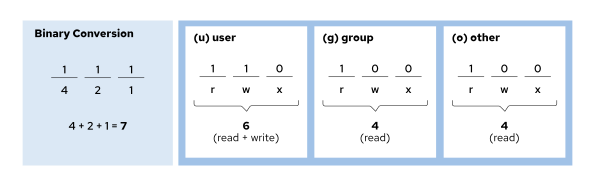
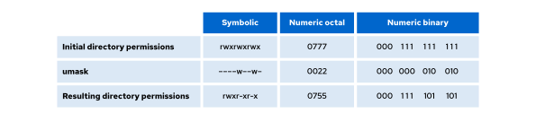

Red Hat System Administration I
-------------------------------

# Chương 11. Kiểm soát quyền truy cập tệp

## Giải mã quyền truy cập tệp tin trên Linux
### Mục tiêu
Liệt kê các quyền hệ thống tập tin đối với tập tin và thư mục, đồng thời giải thích cách các quyền này kiểm soát quyền truy cập của
người dùng và nhóm người dùng.

### Quyền hệ thống tệp Linux
Quyền truy cập tệp kiểm soát việc truy cập vào các tệp. Cơ chế phân quyền tệp trên Linux rất linh hoạt và có thể đáp ứng hầu hết các 
nhu cầu sử dụng.

Một tệp thuộc quyền sở hữu của một người dùng (thường là người tạo ra tệp đó) và một nhóm (thường là nhóm chính của người tạo tệp).
Nhóm sở hữu này cũng có thể được thay đổi.

Các quyền truy cập được áp dụng cho ba nhóm người dùng: người dùng sở hữu (quyền của người dùng), nhóm sở hữu (quyền của nhóm) và tất
cả những người dùng khác trên hệ thống không phải là người dùng sở hữu hay thành viên của nhóm sở hữu (quyền của người dùng khác).

Bạn có thể thiết lập các quyền khác nhau cho từng nhóm người dùng, nhưng các quyền cụ thể hơn sẽ được ưu tiên áp dụng. Quyền của người
dùng sở hữu sẽ ưu tiên hơn quyền của nhóm, và quyền của nhóm sẽ ưu tiên hơn quyền của người dùng khác.

Có ba loại quyền áp dụng cho mỗi nhóm người dùng: đọc (read), ghi (write) và thực thi (execute). Bảng dưới đây giải thích cách các
quyền này ảnh hưởng đến việc truy cập tệp và thư mục.

**Bảng 11.1. Tác động của các quyền đối với tệp và thư mục**

| Quyền        | Ảnh hưởng đến các tệp                      | Ảnh hưởng đến các thư mục                                                                                                                                                       |
|--------------|--------------------------------------------|---------------------------------------------------------------------------------------------------------------------------------------------------------------------------------|
| r (đọc)      | Có thể đọc được nội dung tệp.              | Có thể liệt kê nội dung của thư mục (các tên tệp).                                                                                                                              |
| w (ghi)      | Nội dung tệp có thể bị thay đổi.           | Bất kỳ tệp nào trong thư mục đều có thể được tạo hoặc xóa.                                                                                                                      |
| x (thực thi) | Các tệp có thể được thực thi như các lệnh. | Thư mục này có thể trở thành thư mục làm việc hiện tại.<br>Bạn có thể sử dụng lệnh `cd` để chuyển đến đó, nhưng cũng cần có quyền đọc để liệt kê các tệp tin trong thư mục này. |

Thông thường, người dùng có cả quyền đọc và quyền thực thi đối với các thư mục chỉ đọc, nhờ đó họ có thể liệt kê nội dung thư mục và
truy cập (ở chế độ chỉ đọc) vào tất cả các mục bên trong. Nếu người dùng chỉ có quyền đọc đối với một thư mục, họ có thể liệt kê tên
các tệp tin trong đó nhưng không thể truy cập các thông tin khác, chẳng hạn như quyền hạn hoặc dấu thời gian (time stamp). Nếu người
dùng chỉ có quyền thực thi đối với một thư mục, họ sẽ không thể liệt kê tên tệp tin trong thư mục đó. Tuy nhiên, nếu biết tên một tệp
tin mà mình có quyền đọc, họ vẫn có thể truy cập nội dung tệp tin đó từ bên ngoài thư mục bằng cách chỉ định rõ tên tệp tin (theo đường
dẫn tương đối).

Bất kỳ ai là chủ sở hữu hoặc có cả quyền ghi và quyền thực thi đối với một thư mục đều có thể xóa các tệp tin trong thư mục đó, bất kể
quyền sở hữu hay quyền hạn của chính tệp tin đó là gì. Bạn có thể thay đổi cơ chế này bằng cách sử dụng quyền "sticky bit".

> **Lưu ý**
Cơ chế phân quyền tệp tin trên Linux hoạt động khác so với cơ chế phân quyền của hệ thống tệp NTFS trên Microsoft. Trên Linux, các
quyền chỉ áp dụng cho chính tệp hoặc thư mục được thiết lập quyền đó. Các thư mục con nằm trong một thư mục sẽ không tự động kế thừa
quyền của thư mục cha. Tuy nhiên, nếu được thiết lập ở mức hạn chế, quyền của thư mục có thể ngăn chặn việc truy cập vào nội dung bên
trong thư mục đó.
Quyền đọc (read) đối với thư mục trên Linux tương đương với quyền "List folder contents" (liệt kê nội dung thư mục) trong Windows.
Quyền ghi (write) đối với thư mục trên Linux tương đương với quyền "Modify" (sửa đổi) trong Windows; quyền này bao gồm cả khả năng xóa
các tệp và thư mục con. Trên Linux, khi một thư mục được cấp quyền ghi và thiết lập thuộc tính "sticky bit", chỉ người dùng hoặc nhóm
sở hữu mới có thể xóa tệp; cơ chế này tương đồng với hành vi của quyền "Write" trong Windows.
Người dùng root trên Linux có quyền tương đương với quyền "Full Control" (toàn quyền kiểm soát) trong Windows đối với tất cả các tệp
tin. Tuy nhiên, chính sách SELinux có thể sử dụng các ngữ cảnh bảo mật của tiến trình và tệp tin để hạn chế quyền truy cập, ngay cả đối
với người dùng root. Nội dung về SELinux được đề cập trong khóa học Red Hat System Administration II (RH134).

Việc là thành viên của một nhóm cho phép người dùng cộng tác với nhau. Ví dụ, hãy tưởng tượng hệ thống của bạn có hai người dùng: alice
và bob. Người dùng alice là thành viên của các nhóm alice và web, còn người dùng bob là thành viên của các nhóm bob, wheel và web. Khi
alice và bob cùng làm việc, các tệp tin cần được gán cho nhóm web, và các quyền của nhóm phải cho phép cả hai người dùng truy cập vào
những tệp tin đó.

### Xem quyền và quyền sở hữu tệp và thư mục
Tùy chọn -l của lệnh ls hiển thị thông tin chi tiết về quyền và quyền sở hữu:

```
user@host:~$ ls -l test
-rw-rw-r--. 1 student student 0 Mar  8 17:36 test
```

Sử dụng tùy chọn `-d` của lệnh `ls` để hiển thị thông tin chi tiết về chính thư mục đó, thay vì nội dung bên trong nó.

```
user@host:~$ ls -ld /home
drwxr-xr-x. 5 root root 4096 Feb 31 22:00 /home
```

Ký tự đầu tiên của danh sách chi tiết là loại tệp:

* `-` là tệp tin thường.
* `d` là thư mục.
* `l` là liên kết tượng trưng (symbolic link).
* `c` là tệp thiết bị ký tự.
* `b` là tệp thiết bị khối.
* `p` là tệp đường ống có tên (named pipe).
* `s` là tệp socket cục bộ.

Chín ký tự tiếp theo biểu thị các quyền của tệp. Các ký tự này được hiểu là ba nhóm, mỗi nhóm gồm ba ký tự:

* Nhóm đầu tiên là các quyền áp dụng cho chủ sở hữu tệp.
* Nhóm thứ hai dành cho nhóm sở hữu tệp.
* Nhóm cuối cùng áp dụng cho tất cả người dùng khác (mọi người dùng).

Nếu một nhóm quyền được biểu diễn bằng chuỗi "rwx", thì nhóm đó có cả ba quyền: đọc (read), ghi (write) và thực thi (execute). Nếu một
ký tự được thay thế bằng dấu gạch ngang (`-`), thì nhóm đó không có quyền tương ứng.

Sau cột thứ hai (số lượng liên kết), tên đầu tiên chỉ định người dùng sở hữu tệp, và tên thứ hai là nhóm sở hữu tệp đó.

Trong ví dụ đầu tiên, các quyền dành cho người dùng "student" là nhóm ba ký tự đầu tiên: "rw-". Người dùng "student" có quyền đọc và
ghi đối với tệp kiểm tra, nhưng không có quyền thực thi. Nhóm ba ký tự thứ hai là các quyền dành cho nhóm "student": "rw-". Nhóm
"student" có quyền đọc và ghi đối với tệp kiểm tra, nhưng không có quyền thực thi. Nhóm ba ký tự thứ ba là các quyền dành cho tất cả
người dùng khác: "r--". Những người dùng khác chỉ có quyền đọc đối với tệp kiểm tra.

Quy tắc áp dụng là sử dụng nhóm quyền cụ thể nhất. Do đó, nếu người dùng "student" có các quyền khác với nhóm "student" và người dùng
này cũng là thành viên của nhóm đó, thì chỉ các quyền của người dùng sở hữu mới được áp dụng. Vì vậy, bạn có thể thiết lập các quyền
hạn chế hơn cho một người dùng so với quyền mà tư cách thành viên nhóm của họ mang lại, trong trường hợp việc loại bỏ người dùng đó
khỏi nhóm là không khả thi.

### Các kịch bản cấp quyền
Các ví dụ sau đây minh họa cách thức tương tác giữa các quyền truy cập tệp. Trong các ví dụ này, hệ thống của bạn có bốn người dùng
với các tư cách thành viên nhóm như sau:

| Người dùng  | Thành viên nhóm        |
|-------------|------------------------|
| operator1   | operator1, consultant1 |
| database1   | database1, consultant1 |
| database2   | database2, operator2   |
| contractor1 | contractor1, operator2 |

Những người dùng này làm việc với các tệp trong thư mục `dir`. Dưới đây là danh sách chi tiết các tệp trong thư mục đó:

```
database@host:dir $ ls -la
total 24
drwxrwxr-x.  2 database1 consultant1   4096 Mar  4 10:23 .
drwxr-xr-x. 10 root      root          4096 Mar  1 17:34 ..
-rw-rw-r--.  1 operator1 operator1     1024 Mar  4 11:02 app1.log
-rw-r--rw-.  1 operator1 consultant1   3144 Mar  4 11:02 app2.log
-rw-rw-r--.  1 database1 consultant1  10234 Mar  4 10:14 db1.conf
-rw-r-----.  1 database1 consultant1   2048 Mar  4 10:18 db2.conf
```

Tùy chọn `-a` của lệnh `ls` hiển thị quyền truy cập của các tệp ẩn, bao gồm cả các tệp đặc biệt đại diện cho thư mục hiện tại và thư
mục cha của nó. Trong ví dụ này, thư mục đặc biệt `.` phản ánh quyền của chính thư mục `dir`, còn thư mục đặc biệt `..` phản ánh quyền
của thư mục cha.

Đối với tệp `db1.conf`, người dùng sở hữu tệp (`database1`) có quyền đọc và ghi nhưng không có quyền thực thi. Nhóm sở hữu tệp
(`consultant1`) có quyền đọc và ghi nhưng không có quyền thực thi. Tất cả những người dùng khác chỉ có quyền đọc chứ không có quyền
ghi hay thực thi.

Bảng dưới đây xem xét một số tác động của các thiết lập quyền này đối với những người dùng kể trên:

| Tác dụng                                                                                                | Lý do                                                                                                                                                                                                                                                                               |
|---------------------------------------------------------------------------------------------------------|-------------------------------------------------------------------------------------------------------------------------------------------------------------------------------------------------------------------------------------------------------------------------------------|
| Người dùng operator1 có thể thay đổi nội dung của tệp db1.conf.                                         | Người dùng operator1 là thành viên của nhóm consultant1, và nhóm này có cả quyền đọc và quyền ghi đối với tệp db1.conf.                                                                                                                                                             |
| Người dùng database1 có thể xem và sửa đổi nội dung của tệp db2.conf.                                   | Người dùng database1 là chủ sở hữu của tệp db2.conf và có cả quyền đọc lẫn quyền ghi.                                                                                                                                                                                               |
| Người dùng operator1 có thể xem nhưng không thể sửa đổi nội dung của tệp db2.conf.                      | Người dùng operator1 là thành viên của nhóm consultant1, và nhóm này chỉ có quyền đọc đối với tệp db2.conf.                                                                                                                                                                         |
| Người dùng database2 và contractor1 không có quyền truy cập vào nội dung của tệp db2.conf.              | Các quyền khác áp dụng cho người dùng database2 và contractor1, và các quyền đó không bao gồm quyền đọc hoặc ghi.                                                                                                                                                                   |
| Người dùng operator1 là người dùng duy nhất có thể thay đổi nội dung của tệp app1.log.                  | Người dùng `operator1` và các thành viên của nhóm `operator1` có quyền ghi đối với tệp tin, trong khi các người dùng khác thì không.<br>Thành viên duy nhất của nhóm `operator1` là người dùng `operator1`.                                                                         |
| Người dùng database2 có thể thay đổi nội dung của tệp app2.log.                                         | Người dùng database2 không phải là chủ sở hữu của tệp app2.log và không thuộc nhóm consultant1, do đó các quyền khác sẽ được áp dụng.<br>Các quyền khác này cho phép ghi vào tệp.                                                                                                   |
| Người dùng database1 có thể xem nội dung của tệp app2.log nhưng không thể sửa đổi nội dung của tệp này. | Người dùng database1 là thành viên của nhóm consultant1, và nhóm này chỉ có quyền đọc đối với tệp app2.log.<br>Mặc dù các quyền khác bao gồm cả quyền ghi, nhưng quyền của nhóm được ưu tiên áp dụng.                                                                               |
| Người dùng database1 có thể xóa các tệp app1.log và app2.log.                                           | Người dùng `database1` có quyền ghi đối với thư mục `dir` (như được thể hiện qua thư mục đặc biệt `.`), và do đó có thể xóa bất kỳ tệp nào trong thư mục đó.<br>Thao tác này có thể thực hiện được ngay cả khi người dùng `database1` không có quyền ghi trực tiếp trên các tệp đó. |

## Quản lý quyền truy cập tệp từ dòng lệnh
### Mục tiêu
Thay đổi quyền và quyền sở hữu tệp bằng các công cụ dòng lệnh.

### Thay đổi quyền truy cập tệp và thư mục
Trong Linux, bạn có thể cấu hình quyền hạn cho các tệp và thư mục để xác định quyền truy cập cụ thể cho các nhóm người dùng khác nhau.
Công cụ chính để cấu hình các quyền này là lệnh `chmod`. Tên lệnh `chmod` là viết tắt của "change mode" (thay đổi chế độ), trong đó
"mode" (chế độ) đề cập đến các quyền hạn của tệp. Danh sách dưới đây trình bày một số đặc điểm chính của lệnh `chmod`:

* Công cụ này thay đổi quyền truy cập tệp và thư mục từ dòng lệnh.
* Nó nhận một lệnh cấp quyền theo sau là danh sách các tệp hoặc thư mục cần thay đổi.
* Bạn có thể đặt lệnh cấp quyền bằng ký hiệu hoặc bằng ký hiệu bát phân (số).

#### Thay đổi quyền bằng phương pháp ký tự
Phương pháp ký tự để thay đổi quyền truy cập tệp sử dụng các chữ cái để đại diện cho các nhóm người dùng và quyền hạn, đồng thời sử
dụng các ký hiệu để điều chỉnh các thiết lập quyền.

Hãy sử dụng lệnh `chmod` để thay đổi quyền truy cập tệp và thư mục. Cú pháp tổng quát như sau:

```
user@host:~$ chmod Who/What/Which file|directory
```
"Who" là nhóm người dùng, như được thể hiện trong bảng dưới đây. Nếu bạn không chỉ định nhóm người dùng, lệnh `chmod` sẽ sử dụng
nhóm "all" (tất cả) làm mặc định.

| Who | Lớp người dùng | Mô tả                                                                                         |
|-----|----------------|-----------------------------------------------------------------------------------------------|
| u   | người dùng     | Chủ sở hữu tệp.                                                                               |
| g   | nhóm           | Thành viên thuộc nhóm của tệp.                                                                |
| o   | khác           | Người dùng không phải là chủ sở hữu tệp cũng không phải là thành viên của nhóm sở hữu tệp đó. |
| a   | tất cả         | Tất cả ba nhóm trước đó.                                                                      |

"What" là toán tử dùng để sửa đổi các quyền, như được thể hiện trong bảng dưới đây.

| What | Hành động           | Mô tả                                                |
|------|---------------------|------------------------------------------------------|
| +    | thêm                | Thêm các quyền vào tệp.                              |
| -    | loại bỏ             | Xóa các quyền đối với tệp.                           |
| =    | thiết lập chính xác | Thiết lập chính xác các quyền được cung cấp cho tệp. |

"Which" là chế độ (mode), xác định các quyền cần thiết lập cho tệp hoặc thư mục, như được trình bày trong bảng dưới đây.

| Which | Chế độ            | Mô tả                                                                                                                  |
|-------|-------------------|------------------------------------------------------------------------------------------------------------------------|
| r     | đọc               | Quyền truy cập đọc tệp. Quyền liệt kê nội dung thư mục.                                                                |
| w     | ghi               | Quyền ghi đối với tệp hoặc thư mục.                                                                                    |
| x     | thực thi          | Quyền thực thi đối với tệp.<br>Cho phép đi vào thư mục, cũng như truy cập các tệp và thư mục con bên trong thư mục đó. |
| X     | thực thi đặc biệt | Quyền thực thi đối với thư mục, hoặc quyền thực thi đối với tệp nếu ít nhất một trong các bit thực thi được thiết lập. |

Phương pháp ký hiệu sử dụng các chữ cái để đại diện cho các nhóm quyền: u cho người sở hữu (user), g cho nhóm (group), o cho người
dùng khác (other) và a cho tất cả (all).

Với phương pháp ký hiệu, bạn không cần phải thiết lập lại toàn bộ nhóm quyền. Thay vào đó, bạn có thể thay đổi một hoặc nhiều quyền
hiện có. Hãy sử dụng ký tự dấu cộng (+) hoặc dấu trừ (-) để lần lượt thêm hoặc bớt quyền, hoặc sử dụng dấu bằng (=) để thay thế toàn
bộ tập hợp quyền của một nhóm.

Các chữ cái đơn lẻ đại diện cho chính các quyền: r cho quyền đọc (read), w cho quyền ghi (write) và x cho quyền thực thi (execute).
Bạn có thể sử dụng chữ X viết hoa làm cờ quyền để thêm quyền thực thi, nhưng chỉ khi tệp tin là thư mục hoặc khi quyền thực thi đã
được thiết lập cho người sở hữu, nhóm hoặc người dùng khác.

Ví dụ dưới đây minh họa cách sử dụng phương pháp ký hiệu để loại bỏ quyền đọc và ghi đối với nhóm và người dùng khác cho tệp tin
document.pdf:

```
user@host:~$ chmod go-rw document.pdf
```

Ví dụ này minh họa việc cấp quyền thực thi cho tất cả mọi người đối với tệp myscript.sh:

```
user@host:~$ chmod a+x myscript.sh
```

Bạn có thể sử dụng tùy chọn `-R` của lệnh `chmod` để thiết lập quyền truy cập theo kiểu đệ quy cho các tệp tin trong toàn bộ cây thư
mục. Ví dụ, lệnh sau đây sẽ cấp quyền đọc, ghi và thực thi theo kiểu đệ quy cho các thành viên của nhóm sở hữu thư mục `myfolder` cũng
như các tệp và thư mục nằm bên trong nó.

```
user@host:~$ chmod -R g+rwx /home/user/myfolder
```

Bạn cũng có thể sử dụng tùy chọn `-R` kết hợp với tùy chọn `-X` của lệnh `chmod` để thiết lập quyền truy cập theo dạng ký hiệu
(symbolic mode). Với tùy chọn `-X`, bạn có thể thiết lập quyền thực thi (hoặc quyền truy cập/tìm kiếm) cho các thư mục để cho phép
truy cập vào nội dung bên trong, mà không làm thay đổi quyền của hầu hết các tập tin. Tuy nhiên, cần thận trọng khi sử dụng tùy chọn
`-X`, vì nếu một tập tin đã có sẵn quyền thực thi, tùy chọn này sẽ áp dụng quyền thực thi đó cho chính tập tin đó.

Ví dụ: Lệnh dưới đây thiết lập quyền đọc và ghi cho nhóm (group) đối với thư mục `demodir` và toàn bộ nội dung bên trong theo cơ chế
đệ quy; đồng thời, nó chỉ thêm quyền thực thi cho nhóm tại những vị trí mà quyền thực thi đã được thiết lập sẵn cho chủ sở hữu (user),
nhóm (group) hoặc người dùng khác (others).

```
root@host:# chmod -R g+rwX demodir
```

#### Thay đổi quyền bằng phương pháp bát phân
Bạn có thể sử dụng lệnh chmod để thay đổi quyền của tệp tin bằng phương pháp bát phân (octal) thay vì phương pháp ký tự (symbolic).
Trong ví dụ dưới đây, ký tự dấu thăng (`#`) đại diện cho ba chữ số:

```
user@host:~$ chmod ### file|directory
```

Với phương pháp bát phân, bạn có thể biểu diễn quyền hạn dưới dạng số bát phân có 3 chữ số (hoặc 4 chữ số, khi thiết lập quyền hạn
nâng cao). Một chữ số bát phân có thể đại diện cho bất kỳ giá trị nào từ 0 đến 7.

Trong cách biểu diễn quyền hạn bằng số bát phân có 3 chữ số, mỗi chữ số đại diện cho một cấp độ truy cập, từ trái sang phải: người
dùng, nhóm và khác. Để xác định từng chữ số:

* Bắt đầu với 0.
* Để thêm quyền đọc cho cấp độ truy cập này, hãy cộng thêm 4.
* Để thêm quyền ghi, hãy cộng thêm 2.
* Để thêm quyền thực thi, hãy cộng thêm 1.

Sơ đồ dưới đây minh họa cách các hệ thống diễn giải giá trị quyền truy cập bát phân 644.

**Hình 11.1: Minh họa trực quan về phương pháp bát phân**  


Các quản trị viên giàu kinh nghiệm thường sử dụng phương pháp hệ bát phân (octal) để thiết lập quyền cho các tệp tin đơn lẻ hoặc nhóm
tệp tin, đồng thời đảm bảo khả năng kiểm soát quyền hạn một cách toàn diện.

Ví dụ dưới đây minh họa cách sử dụng phương pháp hệ bát phân để thiết lập quyền đọc và ghi cho người sở hữu (user), cũng như quyền đọc
cho nhóm (group) và người dùng khác (others) đối với tệp tin `sample.txt`:

```
user@host:~$ chmod 644 sample.txt
```

Ví dụ này minh họa việc thiết lập quyền đọc, ghi và thực thi cho người sở hữu (user), quyền đọc và thực thi cho nhóm (group), và không
cấp quyền cho người dùng khác (other) đối với thư mục `sampledir`:

```
user@host:~$ chmod 750 sampledir
```

#### Thay đổi quyền sở hữu của người dùng hoặc nhóm đối với tệp và thư mục
Người dùng là chủ sở hữu của tệp tin do chính họ tạo ra. Theo mặc định, nhóm sở hữu của một tệp tin mới chính là nhóm chính (primary
group) của người dùng đã tạo ra tệp tin đó. Trong Red Hat Enterprise Linux, nhóm chính của người dùng thường là một nhóm riêng 
private group) chỉ bao gồm duy nhất người dùng đó. Để cấp quyền truy cập vào tệp tin dựa trên tư cách thành viên nhóm, bạn có thể cần
thay đổi nhóm sở hữu tệp tin.

Chỉ người dùng root mới có thể thay đổi chủ sở hữu (người dùng) của tệp tin. Tuy nhiên, cả chủ sở hữu tệp tin và người dùng root đều
có thể thiết lập nhóm sở hữu. Người dùng root có thể chuyển quyền sở hữu tệp tin cho bất kỳ nhóm nào, trong khi người dùng thông
thường chỉ có thể thay đổi nhóm sở hữu tệp tin nếu họ là thành viên của nhóm đích đó.

Các ví dụ dưới đây minh họa cách thay đổi quyền sở hữu tệp tin và thư mục bằng lệnh chown (change owner).

Ví dụ: để chuyển quyền sở hữu tệp tin app.conf cho người dùng student, hãy sử dụng lệnh sau:

```
root@host:~# chown student app.conf
```

Tùy chọn -R của lệnh chown thay đổi quyền sở hữu của toàn bộ cây thư mục theo cơ chế đệ quy. Lệnh sau đây cấp quyền sở hữu thư mục
Pictures cùng tất cả các tệp và thư mục con bên trong nó cho người dùng `student`:

```
root@host:~# chown -R student Pictures
```

Bạn cũng có thể sử dụng lệnh `chown` để thay đổi quyền sở hữu nhóm của một tệp bằng cách đặt dấu hai chấm (:) trước tên nhóm. Ví dụ,
lệnh sau đây thay đổi quyền sở hữu nhóm của thư mục Pictures thành `admins`:

```
root@host:~# chown :admins Pictures
```

Bạn có thể sử dụng lệnh `chown` để thay đổi cả chủ sở hữu và nhóm cùng lúc bằng cách sử dụng cú pháp `chủ_sở_hữu:nhóm`. Ví dụ,
để chuyển quyền sở hữu thư mục `Pictures` cho người dùng `visitor` và nhóm `guests`, hãy sử dụng lệnh sau:

```
root@host:~# chown visitor:guests Pictures
```

Thay vì sử dụng lệnh `chown`, một số người dùng thay đổi quyền sở hữu nhóm bằng lệnh `chgrp`. Lệnh này hoạt động tương tự như lệnh
`chown`, ngoại trừ việc nó chỉ dùng để thay đổi quyền sở hữu nhóm và không yêu cầu dấu hai chấm (:) trước tên nhóm.

##### Quan trọng
Bạn có thể bắt gặp cú pháp lệnh `chown` khác, trong đó chủ sở hữu và nhóm được phân tách bằng dấu chấm thay vì dấu hai chấm:

```
root@host:~# chown owner.group filename
```

Red Hat khuyến nghị không sử dụng cú pháp này mà luôn dùng dấu hai chấm. Do dấu chấm là một ký tự hợp lệ trong tên người dùng, lệnh
`chown` có thể hiểu sai ý định của bạn; lệnh này có thể coi tên người dùng và nhóm là tên tệp tin. Thay vào đó, chỉ nên sử dụng dấu
hai chấm khi thiết lập cả người dùng và nhóm cùng lúc.

## Quản lý các quyền mặc định và quyền đặc biệt
### Mục tiêu
Kiểm soát các quyền mặc định đối với tệp tin do người dùng tạo ra và giải thích các quyền đặc biệt trên tệp tin.

### Quyền đặc biệt
Quyền đặc biệt là loại quyền thứ tư, bên cạnh các quyền dành cho người dùng (user), nhóm (group) và người khác (other). Đúng như tên
gọi, các quyền đặc biệt cung cấp thêm những tính năng liên quan đến quyền truy cập, vượt ra ngoài phạm vi của các loại quyền cơ bản.
Các quyền đặc biệt như setuid, setgid và sticky mang lại khả năng kiểm soát bổ sung đối với hành vi của tệp và thư mục. Phần này mô tả
tác động của các quyền đặc biệt, vốn được tóm tắt trong bảng dưới đây.

**Bảng 11.2. Tác động của các quyền đặc biệt đối với tệp và thư mục**

| Quyền        | Ảnh hưởng đến các tệp                                                                   | Effect on directories                                                                          |
|--------------|-----------------------------------------------------------------------------------------|------------------------------------------------------------------------------------------------|
| u+s (suid)   | Tệp được thực thi với tư cách là người sở hữu tệp, chứ không phải người đã chạy tệp đó. | Không có tác dụng.                                                                             |
| g+s (sgid)   | Tệp được thực thi với tư cách là nhóm sở hữu tệp đó.                                    | Các tệp được tạo trong thư mục sẽ có chủ sở hữu nhóm trùng với chủ sở hữu nhóm của thư mục đó. |
| o+t (sticky) | Không có tác dụng.                                                                      | Người dùng có quyền ghi vào thư mục không thể xóa hoặc đổi tên các tệp mà họ không sở hữu.     |

Quyền setuid trên một tệp thực thi có nghĩa là các lệnh sẽ được chạy dưới quyền của người dùng sở hữu tệp đó, thay vì dưới quyền của
người dùng thực thi lệnh. Một ví dụ điển hình là lệnh passwd:

```
user@host:~$ ls -l /usr/bin/passwd
-rwsr-xr-x. 1 root root 91584 Nov  4  2024 /usr/bin/passwd
```

Trong danh sách hiển thị chi tiết, bạn có thể nhận biết quyền setuid thông qua ký tự 's' viết thường tại vị trí thường dành cho ký tự
'x' (quyền thực thi của chủ sở hữu). Nếu chủ sở hữu không có quyền thực thi, ký tự này sẽ được thay thế bằng chữ 'S' viết hoa.

Quyền đặc biệt setgid trên một thư mục có nghĩa là các tệp được tạo trong thư mục đó sẽ kế thừa quyền sở hữu nhóm từ chính thư mục đó,
thay vì kế thừa từ người dùng tạo ra tệp. Tính năng này thường được sử dụng cho các thư mục làm việc chung nhằm tự động chuyển tệp từ
nhóm riêng mặc định sang nhóm dùng chung, hoặc trong các trường hợp cần một nhóm cụ thể luôn nắm quyền sở hữu các tệp trong thư mục.
Một ví dụ về cơ chế này là thư mục /run/log/journal:

```
user@host:~$ ls -ld /run/log/journal
drwxr-sr-x+ 4 root systemd-journal 80 May 29 16:55 /run/log/journal
```

Nếu thuộc tính setgid được thiết lập trên một tệp thực thi, các lệnh sẽ được thực thi với tư cách là nhóm sở hữu tệp đó, thay vì nhóm
chính của người dùng đã chạy lệnh. Cơ chế này tương tự như cách thức hoạt động của setuid.

Một ví dụ là lệnh `plocate`, một giải pháp thay thế hiện đại cho lệnh `locate`. Quyền `setgid` được thiết lập trên tệp thực thi
`/usr/bin/plocate`, như được minh họa trong ví dụ sau:

```
user@host:~$ ls -ld /usr/bin/plocate
-rwxr-sr-x. 1 root plocate 318224 Feb 14 00:00 /usr/bin/plocate
```

Trong danh sách hiển thị chi tiết, bạn có thể nhận biết quyền setgid thông qua ký tự 's' viết thường tại vị trí thường dành cho ký tự
'x' (quyền thực thi của nhóm). Nếu nhóm không có quyền thực thi, ký tự này sẽ được thay thế bằng chữ 'S' viết hoa.

Cuối cùng, sticky bit áp dụng cho thư mục sẽ thiết lập một hạn chế đặc biệt đối với việc xóa tập tin. Chỉ chủ sở hữu tập tin (và người
dùng root) mới có thể xóa các tập tin trong thư mục đó. Một ví dụ điển hình là thư mục /tmp:

```
user@host:~$ ls -ld /tmp
drwxrwxrwt. 11 root root 4096 May 29 19:57 /tmp
```

Trong danh sách hiển thị chi tiết, bạn có thể nhận biết quyền sticky thông qua ký tự 't' viết thường tại vị trí thường dành cho
ký tự 'x' (quyền thực thi dành cho nhóm 'others'). Nếu nhóm 'others' không có quyền thực thi, ký tự này sẽ được thay thế bằng
chữ 'T' viết hoa.

#### Thiết lập các quyền đặc biệt
Bạn có thể thiết lập các quyền đặc biệt bằng cách sử dụng ký hiệu tượng trưng hoặc dưới dạng chữ số thứ tư trong chế độ bát phân.

**Bảng 11.3. Thiết lập các quyền đặc biệt**

| Quyền  | Ký hiệu bát phân | Ký hiệu tượng trưng |
|--------|------------------|---------------------|
| setuid | 4                | u+s                 |
| setgid | 2                | g+s                 |
| sticky | 1                | o+t                 |

#### Các ví dụ về quyền đặc biệt
Thêm bit setgid vào thư mục ví dụ bằng cách sử dụng phương pháp ký hiệu:

```
user@host:~$ chmod g+s example
```

Loại bỏ bit dính (sticky bit) khỏi thư mục ví dụ bằng cách sử dụng phương pháp ký hiệu:

```
user@host:~$ chmod o-t example
```

Thiết lập bit setgid và cấp quyền đọc, ghi, thực thi cho chủ sở hữu và nhóm (không cấp quyền cho người dùng khác) đối với thư mục
ví dụ, sử dụng phương pháp bát phân:

```
user@host:~$ chmod 2770 example
```

Loại bỏ bit setgid, đồng thời cấp quyền đọc, ghi và thực thi cho chủ sở hữu (user) và nhóm (group) — nhưng không cấp quyền truy cập
cho người dùng khác (others) — đối với thư mục mẫu bằng cách sử dụng phương pháp bát phân (octal). Lưu ý rằng bạn cần thêm một chữ số
0 vào đầu giá trị quyền khi loại bỏ các quyền đặc biệt bằng phương pháp này:

```
user@host:~$ chmod 00770 example
```

#### Quyền mặc định
Ngoài việc thiết lập các quyền đặc biệt, bạn còn có thể quản lý quyền mặc định của các tệp và thư mục mới bằng cách sử dụng thiết lập
umask. Thiết lập umask sẽ thay đổi các quyền được áp dụng cho các tệp hoặc thư mục mới được tạo.

Các tệp mới được gán quyền ban đầu dựa trên hai yếu tố:

* Việc bạn đang tạo một tệp thông thường hay một thư mục. 
* Giá trị umask hiện tại (mặt nạ tạo tệp của người dùng).

**Bảng 11.4. Các quyền ban đầu trước khi áp dụng umask**

| Kiểu    | Bát phân ban đầu | Ký hiệu ban đầu |
|---------|------------------|-----------------|
| Tệp     | 0666             | rw-rw-rw-       |
| Thư mục | 0777             | rwxrwxrwx       |

Bạn phải luôn cấp quyền thực thi một cách tường minh cho tệp tin thông thường. Bước này gây khó khăn hơn cho kẻ tấn công trong việc
xâm nhập hệ thống, tạo tệp tin độc hại và thực thi nó.

##### Ảnh hưởng của umask đối với các tệp và thư mục
umask là một bộ lọc quyền được áp dụng lên các quyền mặc định khi một tệp hoặc thư mục được tạo. Mỗi bit được thiết lập trong umask sẽ
loại bỏ quyền tương ứng khỏi các quyền cuối cùng của tệp hoặc thư mục mới.

**Bảng 11.5. Các ví dụ về umask**

| umask | Ảnh hưởng đến tệp | Ảnh hưởng đến thư mục |
|-------|-------------------|-----------------------|
| 0022  | rw-r--r--         | rwxr-xr-x             |
| 0027  | rw-r-----         | rwxr-x---             |
| 0002  | rw-rw-r--         | rwxrwxr-x             |

Trên RHEL 9 và các phiên bản sau này, giá trị umask mặc định cho tất cả người dùng thông thường là 0022. Lệnh umask không có tham số
sẽ hiển thị giá trị umask hiện tại của shell:

```
user@host:~$ umask
0022
```

Bạn có thể tạm thời thiết lập umask mới cho shell hiện tại bằng cách chạy lệnh umask với một đối số hệ bát phân duy nhất:

```
user@host:~$ umask 0027
```

Bạn có thể bỏ qua các số 0 ở đầu trong giá trị umask. Ví dụ: umask 077 tương đương với umask 0077.

Các giá trị umask mặc định của hệ thống dành cho người dùng Bash shell được quy định trong tệp /etc/login.defs và tệp /etc/bashrc.
Người dùng có thể ghi đè các giá trị mặc định này bằng cách cấu hình trong tệp .bash_profile hoặc .bashrc nằm tại thư mục chính
(home directory) của họ.

> **Quan trọng**: Trong Red Hat Enterprise Linux 8 và các phiên bản trước đó, giá trị umask mặc định là 0002 đối với người dùng thông
thường có UID từ 200 trở lên và có tên nhóm chính trùng với tên người dùng. Giá trị umask mặc định cho các người dùng khác, bao gồm cả
người dùng root, là 0022. Red Hat Enterprise Linux 9 và các phiên bản sau này áp dụng thống nhất giá trị umask mặc định là 0022 cho
tất cả người dùng, trong cả shell đăng nhập (login shell) và shell không đăng nhập (non-login shell). RHEL 9 và các phiên bản mới hơn
không còn áp dụng các ngoại lệ đối với thiết lập umask mặc định dựa trên ID người dùng hay sự trùng khớp tên nhóm; điều này giúp tăng
tính nhất quán và đơn giản hóa các yêu cầu về bảo mật.

##### Các ví dụ về thiết lập umask
Trong ví dụ dưới đây, hệ thống cấp quyền đọc và ghi cho chủ sở hữu tệp, đồng thời cấp quyền chỉ đọc cho nhóm và những người dùng khác;
điều này phản ánh thiết lập umask 0022 điển hình, vốn hạn chế quyền ghi đối với những người không phải là chủ sở hữu.

```
user@host:~$ umask
0022
user@host:~$ touch default.txt
user@host:~$ ls -l default.txt
-rw-r--r--. 1 user user 0 May 29 22:11 default.txt
```

**Hình 11.2: Ví dụ về việc tính toán umask cho một tập tin**  


Trong ví dụ dưới đây, hệ thống cấp quyền truy cập đầy đủ cho chủ sở hữu thư mục, đồng thời cấp quyền đọc và thực thi cho nhóm và những
người dùng khác; điều này phản ánh thiết lập umask 0022 điển hình giúp hạn chế quyền ghi đối với những người không phải là chủ sở hữu.

```
user@host:~$ umask
0022
user@host:~$ mkdir default
user@host:~$ ls -ld default
drwxr-xr-x. 2 user user 6 May 29 22:14 default
```

**Hình 11.3: Ví dụ về việc tính toán umask trên một thư mục**  


Trong ví dụ sau, giá trị umask được đặt là 0; điều này thay đổi quyền truy cập tệp của nhóm "others" (người dùng khác) từ chỉ đọc sang
đọc và ghi. Quyền truy cập thư mục của nhóm này cũng thay đổi từ đọc và thực thi sang đọc, ghi và thực thi.

```
user@host:~$ umask 0
user@host:~$ touch zero.txt
user@host:~$ ls -l zero.txt
-rw-rw-rw-. 1 user user 0 May 29 22:17 zero.txt
user@host:~$ mkdir zero
user@host:~$ ls -ld zero
drwxrwxrwx. 2 user user 6 May 29 22:17 zero
```

Giá trị umask là 027 đảm bảo rằng các tệp mới có quyền đọc và ghi cho người sở hữu, cũng như quyền đọc cho nhóm. Các thư mục mới có
quyền đọc và thực thi cho nhóm, và không có quyền nào cho người dùng khác.

```
user@host:~$ umask 027
user@host:~$ touch two-seven.txt
user@host:~$ ls -l two-seven.txt
-rw-r-----. 1 user user 0 May 29 22:19 two-seven.txt
user@host:~$ mkdir two-seven
user@host:~$ ls -ld two-seven
drwxr-x---. 2 user user 6 May 29 22:20 two-seven
```
