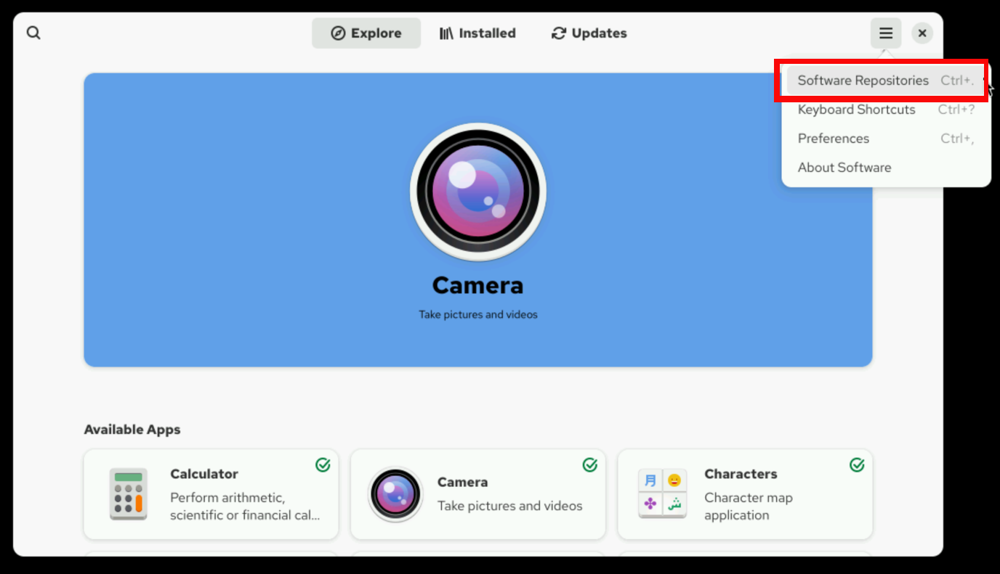
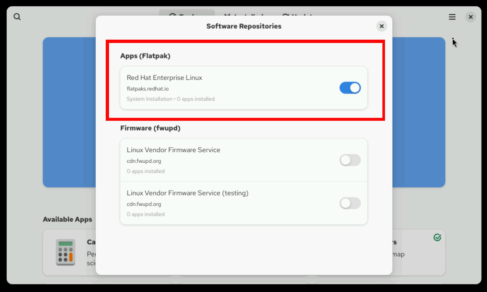
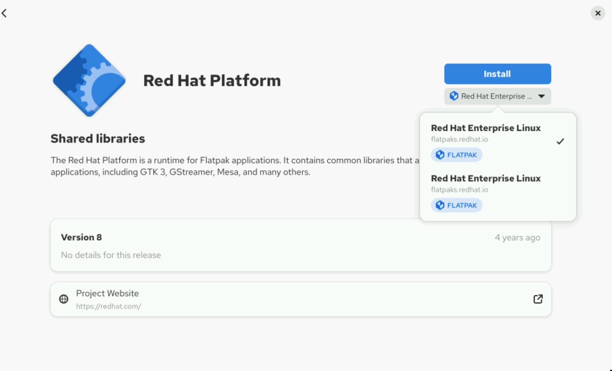

Quản trị hệ thống Red Hat I
---------------------------

# Chương 13. Cài đặt và cập nhật ứng dụng bằng Flatpak

## Cấu hình Flatpak để cài đặt ứng dụng
### Mục tiêu
Cài đặt và cấu hình các công cụ cũng như kho lưu trữ từ xa của Flatpak, đồng thời giải thích cơ chế hoạt động cơ bản của Flatpak.

### Giới thiệu về Flatpak
Mặc dù mô hình đóng gói ứng dụng trên Linux đã có những bước phát triển đáng kể qua nhiều năm, nó vẫn đặt ra nhiều thách thức:

* Các nhà phát triển phải tùy chỉnh ứng dụng cho một hệ điều hành và phiên bản Linux cụ thể. Hệ quả là họ tốn nhiều thời gian và công
sức hơn để đóng gói ứng dụng cho từng bản phân phối (distribution). 
* Người dùng có thể gặp khó khăn về mặt kỹ thuật khi triển khai một ứng dụng không được đóng gói dành riêng cho bản phân phối mà họ
đang sử dụng. 
* Quá trình phát triển và bảo trì có thể trở nên phức tạp do các thành phần phụ thuộc (dependencies) của ứng dụng có thể khác biệt
giữa môi trường triển khai thực tế (production) và nền tảng phát triển.

Flatpak giải quyết các thách thức này bằng cách áp dụng các khái niệm về container (vùng chứa) phía máy chủ và công nghệ nhân Linux
vào môi trường máy tính để bàn. Khi một ứng dụng máy tính để bàn được đóng gói dưới dạng ảnh (image) Flatpak, nó có thể hoạt động ổn
định trên hầu hết các bản phân phối và phiên bản Linux. Các ứng dụng sẽ không gặp lỗi hoặc bị treo do sự khác biệt về các thành phần
phụ thuộc (dependencies).

Với Flatpak, mỗi ứng dụng được xây dựng và chạy trong một môi trường biệt lập gọi là sandbox. Theo mặc định, ứng dụng chỉ có thể truy
cập vào nội dung bên trong sandbox của chính nó. Quyền truy cập của ứng dụng vào các tệp tin, mạng, socket đồ họa, bus hệ thống và
thiết bị phải được cấp phép một cách cụ thể. Theo thiết kế, ứng dụng không thể truy cập vào các tài nguyên khác, chẳng hạn như các
tiến trình khác.

#### Các môi trường thực thi Flatpak
Trong môi trường sandbox của Flatpak, ứng dụng sử dụng các thư viện riêng của mình thay vì các thư viện của hệ điều hành. Tuy nhiên,
việc duy trì một bản sao riêng biệt của tất cả các thư viện cho mỗi ứng dụng máy tính để bàn sẽ tốn quá nhiều dung lượng; do đó, nhiều
ứng dụng có thể cùng chia sẻ một runtime Flatpak. Runtime là một ảnh hệ thống tệp (file-system image) chứa các thư viện cấp hệ thống
cùng những tệp tin khác. Một hệ thống có thể cung cấp nhiều runtime để các ứng dụng khác nhau cùng sử dụng.

Một lợi ích quan trọng khác của việc tách biệt runtime nằm ở khâu quản lý các bản cập nhật bảo mật. Khi phát hiện lỗ hổng bảo mật
trong một thư viện hệ thống, các nhà phát triển chỉ cần cập nhật runtime mà không cần phải biên dịch lại từng ứng dụng.

Một runtime có thể không cung cấp đầy đủ mọi thư viện mà ứng dụng yêu cầu. Vì vậy, ứng dụng cũng có thể tự đóng gói các thư viện riêng
của mình.

### Quản lý các kho lưu trữ từ xa Flatpak
Các ứng dụng và runtime Flatpak được phân phối thông qua các kho lưu trữ được gọi là "remote" (kho từ xa). Red Hat đóng gói một số ứng
dụng mã nguồn mở và phân phối chúng trong một kho lưu trữ từ xa. Mặc dù không được hỗ trợ chính thức, các kho lưu trữ từ xa của bên
thứ ba cũng có sẵn; chúng bổ sung cho danh mục ứng dụng của Red Hat và mang lại nhiều lựa chọn đa dạng. Kho lưu trữ của bên thứ ba lớn
nhất và nổi tiếng nhất là Flathub, có thể truy cập tại https://flathub.org. Dự án Fedora cũng có kho lưu trữ từ xa Flatpak riêng của
mình.

> **Quan trọng**: Red Hat không hỗ trợ các ứng dụng từ kho lưu trữ từ xa của bên thứ ba.

Bạn có thể sử dụng lệnh `flatpak` hoặc công cụ đồ họa GNOME Software để quản lý các gói. Với bất kỳ công cụ nào trong số này, bạn đều
có thể cấu hình nhiều kho lưu trữ từ xa và đơn giản hóa việc quản lý Flatpak thông qua các giao diện thống nhất.

#### Thiết lập Flatpak ban đầu
Flatpak được cài đặt sẵn trên Red Hat Enterprise Linux 10 cùng với gói RPM `gnome-software`.

Nếu Flatpak chưa được cài đặt, bạn có thể cài đặt nó bằng cách sử dụng lệnh `dnf`:

```console
root@host:~# dnf install flatpak
```

Để hiển thị phiên bản Flatpak đã được cài đặt trên hệ thống của bạn, hãy sử dụng lệnh `flatpak --version`:

```console
user@host:~$ flatpak --version
Flatpak 1.16.0
```

Kho lưu trữ từ xa mặc định cho RHEL 10 là kho lưu trữ đối tượng Flatpak trong Red Hat Ecosystem Catalog. Để truy cập kho lưu trữ này, bạn cần cung cấp thông tin đăng nhập tài khoản Red Hat Customer Portal hoặc mã thông báo (token) tài khoản dịch vụ registry của mình.

Đăng nhập vào Red Hat Container Catalog bằng lệnh `podman login`:

```console
user@host:~$ podman login registry.redhat.io
Username: provide-username
Password: provide-password
Login Succeeded!
```

Theo mặc định, thông tin đăng nhập sẽ hết hạn sau phiên làm việc hiện tại. Tuy nhiên, bạn có thể lưu vĩnh viễn thông tin đăng nhập cho
người dùng hiện tại:

```console
user@host:~$ cp $XDG_RUNTIME_DIR/containers/auth.json \
$HOME/.config/flatpak/oci-auth.json
```

Bạn cũng có thể lưu thông tin xác thực trên toàn hệ thống.

```console
root@host:~# cp $XDG_RUNTIME_DIR/containers/auth.json \
/etc/flatpak/oci-auth.json
```

Nếu bạn muốn người dùng thông thường truy cập kho lưu trữ từ xa bằng cùng thông tin xác thực, thì bạn phải thay đổi quyền truy cập tệp
đối với mã thông báo xác thực:

```console
root@host:~# chmod 644 /etc/flatpak/oci-auth.json
```

Để liệt kê tất cả các kho lưu trữ từ xa được cấu hình trên hệ thống của bạn, hãy sử dụng lệnh `flatpak remotes`:

```console
user@host:~$ flatpak remotes
Name Options
rhel system,oci,no-gpg-verify
```

Để hiển thị thông tin chi tiết về các kho lưu trữ từ xa, hãy thêm tham số `-d` vào lệnh `flatpak remotes`. Các thông tin chi tiết bao
gồm tên kho lưu trữ, mã định danh duy nhất và các thuộc tính khác như URL của kho lưu trữ cùng các tùy chọn đã được cấu hình.

```console
user@host:~$ flatpak remotes -d
Name Title      URL              Collection ID     ... Priority Options   ...
rhel Red Hat... oci+https://.../ com.redhat.Stable -   1        system... ...
```

Để liệt kê các ứng dụng có sẵn trong một kho lưu trữ từ xa, hãy sử dụng lệnh `flatpak remote-ls`. Để bỏ qua các runtime và chỉ liệt kê
các ứng dụng, hãy thêm tùy chọn `--app`:

```console
user@host:~$ flatpak remote-ls --app
Name           Application ID             Version     Branch   Arch
Thunderbird    org.mozilla.Thunderbird                stable   x86_64
Firefox        org.mozilla.firefox        128.11.0    stable   x86_64
```

#### Thêm kho lưu trữ từ xa Flatpak
Từ dòng lệnh, bạn có thể cấu hình thêm các kho lưu trữ từ xa làm nguồn cài đặt và mở rộng danh mục ứng dụng Flatpak.

Ví dụ, Dự án Fedora duy trì một kho lưu trữ từ xa mà các bản phân phối khác cũng có thể sử dụng nhờ vào thiết kế đa nền tảng của
Flatpak. Để thêm kho lưu trữ từ xa này, hãy chạy lệnh `flatpak remote-add`. Tham số đầu tiên xác định tên cho bản sao cục bộ của kho
lưu trữ từ xa. Tham số thứ hai xác định vị trí của kho lưu trữ từ xa; vị trí này có thể trỏ trực tiếp đến nơi lưu trữ thực tế hoặc đến
tệp định nghĩa có phần mở rộng `.flatpakrepo`. Tùy chọn `--if-not-exists` giúp tránh ghi đè lên kho lưu trữ từ xa nếu nó đã tồn tại
trong hệ thống:

```console
user@host:~$ flatpak remote-add --if-not-exists fedora \
oci+https://registry.fedoraproject.org
```

Để xác nhận rằng kho lưu trữ Fedora đã được thêm làm nguồn cài đặt, hãy sử dụng lệnh `flatpak remotes` để liệt kê tất cả các kho lưu
trữ từ xa đã được cấu hình trên hệ thống của bạn:

```console
user@host:~$ flatpak remotes
Name   Options
fedora system,oci
rhel   system,oci,no-gpg-verify
```

Theo mặc định, lệnh `flatpak` áp dụng các thao tác cho toàn bộ hệ thống, giống như khi tùy chọn `--system` được sử dụng một cách tường
minh. Trong ví dụ trước, kho lưu trữ từ xa mới được thêm vào sẽ khả dụng cho tất cả người dùng trên hệ thống để tìm kiếm và cài đặt
các gói phần mềm.

Tuy nhiên, bạn cũng có thể cấu hình kho lưu trữ ở chế độ cài đặt dành cho người dùng bằng cách thêm tùy chọn `--user`. Ở chế độ này,
đối tượng Flatpak chỉ khả dụng đối với người dùng đã thực thi lệnh đó.

Ví dụ sau đây minh họa cách cấu hình kho lưu trữ Flathub ở chế độ người dùng:

```console
user@host:~$ flatpak remote-add --if-not-exists --user \
flathub https://dl.flathub.org/repo/flathub.flatpakrepo
```

Khi nhiều kho lưu trữ được kích hoạt, lệnh `flatpak remotes` có thể giúp xác định kho lưu trữ nào khả dụng trên toàn hệ thống và kho
lưu trữ nào chỉ dành cho người dùng hiện tại.

Liệt kê các kho lưu trữ từ xa khả dụng cho tất cả người dùng:

```console
user@host:~$ flatpak remotes --system
Name   Options
fedora oci
rhel   oci,no-gpg-verify
```

Liệt kê các kho lưu trữ từ xa khả dụng đối với người dùng hiện tại:

```console
user@host:~$ flatpak remotes --user
Name    Options
flathub
```

Sau khi thêm một kho lưu trữ từ xa, bạn có thể liệt kê nội dung của kho lưu trữ đó bằng cách sử dụng lệnh `flatpak remote-ls`:

```console
user@host:~$ flatpak remote-ls fedora --app
Name                      Application ID                 Version   Branch
Dialect                   app.drey.Dialect               2.4.2     stable
Multiplication Puzzle     app.drey.MultiplicationPuzzle  14.0      stable
pw3270                    br.app.pw3270.terminal         5.3       stable
Dconf Editor              ca.desrt.dconf-editor          45.0.1    stable
AbiWord                   com.abisource.AbiWord          3.0.5     stable
ConvertAll                com.bellz.ConvertAll           0.8.0     stable
...output omitted...
```

### Xóa kho lưu trữ từ xa Flatpak
Để xóa một kho lưu trữ từ xa (remote repository) Flatpak, hãy sử dụng lệnh `flatpak remote-delete`. Trước khi xóa kho lưu trữ từ xa,
tất cả các phần mềm được cài đặt từ kho đó phải được gỡ bỏ. Lệnh này sẽ yêu cầu bạn xác nhận việc xóa tất cả các thành phần liên quan
(ứng dụng và runtime) trước khi tiếp tục.

```console
user@host:~$ flatpak remote-delete fedora
The following refs are installed from remote 'fedora':

   1) runtime/org.fedoraproject.Platform.GL.default/x86_64/f41
   2) runtime/org.fedoraproject.Platform.Locale/x86_64/f41
   3) app/org.filezillaproject.Filezilla/x86_64/stable
   4) runtime/org.fedoraproject.Platform/x86_64/f41

Remove them? [y/n]: y
Uninstalling runtime/org.fedoraproject.Platform.GL.default/x86_64/f41
Uninstalling app/org.filezillaproject.Filezilla/x86_64/stable
Uninstalling runtime/org.fedoraproject.Platform/x86_64/f41
Uninstalling runtime/org.fedoraproject.Platform.Locale/x86_64/f41
```

Thay vì xóa vĩnh viễn một kho lưu trữ và gỡ cài đặt tất cả các phần mềm có nguồn gốc từ đó, bạn có thể vô hiệu hóa kho lưu trữ này.
Việc vô hiệu hóa kho lưu trữ không yêu cầu phải gỡ bỏ các gói Flatpak đã cài đặt trước đó. Để vô hiệu hóa một kho lưu trữ, hãy sử dụng
lệnh `flatpak remote-modify`.

```console
user@host:~$ flatpak remote-modify --disable fedora
```

Bạn cũng có thể kích hoạt lại kho lưu trữ sau này nếu, chẳng hạn, bạn cần cập nhật một trong các gói phần mềm.

```console
user@host:~$ flatpak remote-modify --enable fedora
```

### Quản lý Flatpak bằng công cụ đồ họa GNOME Software
Bạn cũng có thể quản lý các kho lưu trữ từ xa đã được cấu hình bằng công cụ giao diện đồ họa trên máy tính.

Trong môi trường desktop đồ họa Gnome, hãy nhấp vào biểu tượng Red Hat ở góc trên bên trái rồi chọn **Software** từ bảng điều khiển
(dashboard), hoặc sử dụng nút **Show Applications** để mở ứng dụng này. Nhấp vào biểu tượng menu chính (có hình ba gạch ngang) ở góc
trên bên phải cửa sổ và chọn **Software Repositories**.

**Hình 13.1: Menu chính của phần mềm**  


Trong cửa sổ bật lên Software Repositories, các ứng dụng Flatpak được liệt kê tại mục Apps (Flatpak). Từ cửa sổ này, bạn có thể bật
hoặc tắt các kho lưu trữ từ xa đã được cấu hình.

**Hình 13.2: Các kho phần mềm**  


## Quản lý ứng dụng từ Flatpak
### Mục tiêu
Sử dụng Flatpak để liệt kê, tìm kiếm, cài đặt, cập nhật, gỡ bỏ và xem thông tin siêu dữ liệu (metadata) của các ứng dụng.

### Quản lý ứng dụng bằng Flatpak CLI
Bằng cách sử dụng các lệnh CLI của Flatpak, bạn có thể liệt kê, tìm kiếm, cài đặt, cập nhật, gỡ bỏ và xem thông tin siêu dữ liệu
(metadata) của các ứng dụng Flatpak cũng như các thành phần phụ thuộc runtime của chúng. Bạn có thể sử dụng nội dung từ kho lưu trữ
của Red Hat cũng như từ các kho lưu trữ từ xa của bên thứ ba. Red Hat không hỗ trợ các ứng dụng hoặc runtime từ kho lưu trữ từ xa của
bên thứ ba.

#### Các định danh Flatpak
Các ứng dụng và runtime Flatpak sử dụng các định danh duy nhất tuân theo định dạng `domain.organization.App`. Định danh gồm ba phần
này cho phép công ty, nhà phát triển hoặc tổ chức phát hành nhiều ứng dụng có chung tiền tố, chẳng hạn như `com.company`. Phần cuối
(`.App`) xác định tên của ứng dụng. Bạn có thể sử dụng định danh đối tượng đầy đủ hoặc rút gọn cho các thao tác với Flatpak:
`com.company.App` hoặc `App`.

Trong một số trường hợp, bạn cần chỉ định kiến trúc CPU hoặc phiên bản (ví dụ: `stable` hoặc `beta`). Bạn có thể yêu cầu các thông số
bổ sung này bằng cách sử dụng bộ định danh ba thành phần (identifier triple) của đối tượng. Định dạng của bộ định danh này là
`ID/kiến_trúc/nhánh` (ví dụ: `org.organization.App/x86_64/stable`). Trong Flatpak, "nhánh" (branch) đề cập đến các phiên bản khác nhau
của cùng một đối tượng.

Bạn có thể để trống một số phần của bộ định danh ba thành phần để chỉ định một phần cụ thể của đối tượng. Ví dụ:
`org.organization.App/x86_64//` chỉ xác định kiến trúc, còn `org.organization.App//stable` chỉ xác định nhánh.

#### Truy vấn các kho lưu trữ từ xa để tìm các đối tượng khả dụng
Lệnh `flatpak search` liệt kê các ứng dụng và runtime phù hợp có sẵn trong tất cả các kho lưu trữ từ xa đang được kích hoạt trên hệ
thống. Lệnh này sử dụng dữ liệu metadata AppStream đã được tải xuống từ kho lưu trữ từ xa và lưu trong bộ nhớ đệm. Nếu dữ liệu
metadata trong bộ nhớ đệm đã cũ hơn một ngày, nó sẽ được tự động cập nhật khi lệnh được thực thi.

Lệnh này sử dụng từ khóa để tìm kiếm sự trùng khớp trong bất kỳ thuộc tính metadata nào được định nghĩa trong tệp XML của ứng dụng:

* Tên ứng dụng hoặc tên môi trường thực thi
* Mô tả
* Mã định danh ứng dụng
* Từ khóa do nhà phát triển xác định

Từ khóa không phân biệt chữ hoa chữ thường và trả về thông tin về các ứng dụng và môi trường chạy phù hợp với truy vấn.

Ví dụ sau đây cho thấy một tìm kiếm sử dụng từ khóa thunderbird để tìm các ứng dụng trong kho lưu trữ từ xa Flatpak:

```console
user@host:~$ flatpak -v search thunderbird (1)
F: No installations directory in /etc/flatpak/installations.d. Skipping
F: Opening system flatpak installation at path /var/lib/flatpak (2)
F: Opening user flatpak installation at path /home/user/.local/share/flatpak
F: fedora:x86_64 appstream age 491 is less than ttl 86400
F: rhel:x86_64 appstream age 1136 is less than ttl 86400 (3)
F: Opening system flatpak installation at path /var/lib/flatpak (4)
F: Opening user flatpak installation at path /home/user/.local/share/flatpak (5)
Thunderbird     Thunderbird is a free and open source email, newsfeed, chat, and calendaring client     net.thunderbird.Thunderbird            stable   fedora (6)
Thunderbird     Thunderbird is a free and open source email, newsfeed, chat, and calendaring client     org.mozilla.Thunderbird         stable fedora
```

1. Lệnh tìm kiếm Flatpak được thực thi với tùy chọn `-v` để hiển thị thông tin chi tiết (verbose output). Tùy chọn này được khuyến
nghị sử dụng khi cần khắc phục sự cố.
2. Trước tiên, Flatpak kiểm tra xem dữ liệu metadata appstream trong bộ nhớ đệm (cache) đã được cập nhật mới nhất hay chưa, áp dụng
cho cả đường dẫn cài đặt hệ thống và đường dẫn cài đặt của người dùng.
3. Sau khi kiểm tra, Flatpak phát hiện rằng metadata trong bộ nhớ đệm của kho lưu trữ từ xa (remote repository) `rhel` cũ hơn so với
metadata từ nguồn gốc (upstream). Tuy nhiên, vì "độ tuổi" của dữ liệu trong bộ nhớ đệm (1136) nhỏ hơn giá trị TTL - thời gian tồn tại
- là 86400, nên bộ nhớ đệm vẫn được coi là hợp lệ (đã cập nhật) và Flatpak sẽ không tải xuống metadata mới từ kho lưu trữ. Điều này
giúp quá trình tìm kiếm diễn ra nhanh hơn.
4. Flatpak bắt đầu tìm kiếm tại thư mục mặc định `/var/lib/flatpak`, nơi chứa tất cả các ứng dụng và môi trường thực thi (runtime)
được cài đặt cho mọi người dùng.
5. Flatpak kiểm tra thư mục cài đặt cục bộ của người dùng tại `/home/user/.local/share/` để tìm các ứng dụng và môi trường thực thi.
Tại đường dẫn `/home/user/.local/share/` này, Flatpak cài đặt phần mềm dành riêng cho người dùng hiện tại.
6. Sau khi tất cả các kho lưu trữ từ xa đã được kiểm tra hoặc cập nhật, Flatpak hiển thị kết quả tìm kiếm phù hợpdưới dạng các cột
được phân loại.

#### Cài đặt các đối tượng Flatpak từ kho lưu trữ từ xa
Lệnh `flatpak install` cài đặt các đối tượng được yêu cầu, bao gồm tất cả các thành phần phụ thuộc.

```console
user@host:~$ flatpak install thunderbird
Looking for matches…
Remotes found with refs similar to 'thunderbird': (1)

   1) 'fedora' (system)
   2) 'rhel' (system)

Which do you want to use (0 to abort)? [0-2]: (2)
Found ref 'app/org.mozilla.Thunderbird/x86_64/stable' in remote 'rhel' (system).
Use this ref? [Y/n]: y
Required runtime for org.mozilla.Thunderbird/x86_64/stable (runtime/com.redhat.Platform/x86_64/el10) found in remote rhel 2
Do you want to install it? [Y/n]: y

org.mozilla.Thunderbird permissions: (3)
    ipc       network       pcsc                  pulseaudio
    x11       dri           file access [1]       dbus access [2]

    [1] home:ro, xdg-download, xdg-run/dconf,
        ~/.cache/thunderbird:create, ~/.config/dconf:ro,
        ~/.mozilla:create, ~/.thunderbird:create
    [2] ca.desrt.dconf, org.a11y., org.freedesktop.Notifications


        ID                      Branch Op Remote Download (4)
 1.     com.redhat.Platform     el10   i  rhel   < 395.1 MB
 2.     org.mozilla.Thunderbird stable i  rhel   < 147.7 MB

Proceed with these changes to the system installation? [Y/n]: *y
Installing 1/2… ████████████████████ 100%  21.5 MB/s  00:00 (5)
Installing 2/2… ████████████████████ 100%  22.1 MB/s  00:00

Installation complete.
```

1. Nếu bạn không chỉ định kho lưu trữ từ xa cần tìm kiếm và người dùng thực thi lệnh đã được cấu hình với nhiều kho lưu trữ, Flatpak
sẽ tìm kiếm trong tất cả các kho lưu trữ từ xa có tham chiếu khớp với định danh được sử dụng trong thao tác. Định danh này có thể ở
dạng đầy đủ hoặc dạng rút gọn (ví dụ: org.mozilla.thunderbird hoặc thunderbird).
2. Flatpak tự động xác định các runtime cần thiết cho ứng dụng và yêu cầu cấp quyền để cài đặt. Nếu sau này có một ứng dụng khác cần
cùng loại runtime đó, hệ thống sẽ sử dụng lại thành phần đã tải xuống trước đó, giúp tránh trùng lặp và tiết kiệm băng thông.
3. Flatpak duy trì tất cả các ứng dụng trong môi trường cô lập; các ứng dụng này cần được cấp quyền để truy cập vào tài nguyên của hệ
thống máy chủ. Các tài nguyên yêu cầu quyền truy cập cụ thể sẽ được liệt kê chi tiết tại bước này của quá trình cài đặt.
4. Flatpak tóm tắt thao tác và liệt kê các thành phần sẽ được cài đặt, bao gồm thông tin về định danh đầy đủ, nhánh (branch), kho lưu
trữ từ xa và dung lượng tải xuống ước tính.
5. Sau bước này, quá trình sẽ tiếp tục diễn ra liên tục cho đến khi hoàn tất.

Bảng dưới đây liệt kê một số tùy chọn hữu ích cho lệnh `flatpak install`:

| Tùy chọn         | Mô tả                                                                                     |
|------------------|-------------------------------------------------------------------------------------------|
| --runtime        | Chỉ cài đặt các thành phần runtime                                                        |
| --app            | Chỉ cài đặt các ứng dụng                                                                  |
| --or-update      | Thực hiện cập nhật nếu ứng dụng hoặc môi trường thực thi đã được cài đặt.                 |
| --system         | Cài đặt ứng dụng hoặc môi trường thực thi vào vị trí cài đặt mặc định trên toàn hệ thống. |
| -u, --user       | Cài đặt ứng dụng hoặc môi trường thực thi chỉ dành cho người dùng hiện tại.               |
| -y, --assumeyes  | Tự động trả lời "có" cho tất cả các câu hỏi.                                              |
| --no-deploy      | Tải xuống bộ nhớ đệm cục bộ mà không cần cài đặt                                          |
| --no-pull        | Chỉ cài đặt từ bộ nhớ đệm cục bộ                                                          |
| --noninteractive | Tạo ra lượng thông tin đầu ra tối thiểu và mặc định chọn "có" cho tất cả các câu hỏi.     |

#### Truy vấn các đối tượng Flatpak cục bộ
Bạn có thể liệt kê tất cả các đối tượng Flatpak đã cài đặt bằng cách sử dụng lệnh `flatpak list`.

```console
user@host:~$ flatpak list
Name             Application ID          Version Branch Installation
Red Hat Platform com.redhat.Platform     10      el10   system
Thunderbird      org.mozilla.Thunderbird         stable system
```

Lệnh `flatpak info` hiển thị thông tin về đối tượng đã cài đặt dựa trên định danh của đối tượng đó.

```console
user@host:~$ flatpak info org.mozilla.Thunderbird
          ID: org.mozilla.Thunderbird
         Ref: app/org.mozilla.Thunderbird/x86_64/stable
        Arch: x86_64
      Branch: stable
      Origin: rhel
  Collection:
Installation: system
   Installed: 324.3 MB
     Runtime: com.redhat.Platform/x86_64/el10
         Sdk: com.redhat.Sdk/x86_64/el10

      Commit: 3dd6...1ae3
     Subject: Export org.mozilla.Thunderbird
        Date: 2025-05-27 09:39:04 +0000
      Alt-id: 3a6f...8b6f
```

#### Cài đặt các đối tượng Flatpak từ các nhánh cụ thể
Một đối tượng Flatpak có thể có nhiều phiên bản trên kho lưu trữ từ xa; các phiên bản này được định danh dưới dạng các nhánh (branch).
Các nhánh có thể được đặt tên theo số hiệu phiên bản (ví dụ: 1.1 và 1.2) hoặc theo các thuật ngữ mô tả vòng đời ứng dụng
(ví dụ: stable, beta hoặc nightly).

Hãy sử dụng lệnh `flatpak remote-info` để kiểm tra xem những nhánh nào khả dụng cho một đối tượng cụ thể. Nếu chỉ có một nhánh khả
dụng cho định danh được yêu cầu, lệnh sẽ hiển thị kết quả ngay lập tức. Nếu có nhiều hơn một nhánh cho định danh đó, lệnh sẽ báo lỗi
và yêu cầu cung cấp thêm thông tin.

```console
user@host:~$ flatpak remote-info rhel com.redhat.Platform
error: Multiple branches available for com.redhat.Platform, you must specify one of: com.redhat.Platform/x86_64/el10, com.redhat.Platform/x86_64/el9, com.redhat.Platform/x86_64/el8
```

Nếu biết nhánh cần trỏ tới, bạn có thể xác định phiên bản đối tượng bằng cách sử dụng bộ ba định danh của nó.

```console
user@host:~$ flatpak install com.redhat.Platform/x86_64/el8
...output omitted...
```

#### Cập nhật các đối tượng Flatpak
Sử dụng lệnh `flatpak update` để nâng cấp tất cả các thành phần đã cài đặt lên phiên bản mới nhất trong nhánh tương ứng của chúng.
Lệnh này cập nhật tất cả các thành phần. Để cập nhật một thành phần cụ thể, hãy thêm mã định danh của thành phần đó làm đối số.

```console
user@host:~$ flatpak update com.redhat.Platform
Looking for updates…

Nothing to do.
```

> **Lưu ý**: Lệnh cập nhật của Flatpak kiểm tra các bản cập nhật trong cùng nhánh mà ứng dụng đã được cài đặt ban đầu. Nếu có phiên
bản mới hơn nằm ở một nhánh khác, Flatpak sẽ không nhận diện được bản cập nhật đó. Cơ chế này tương tự như các nhánh trong kho lưu trữ
Git: việc chuyển sang một nhánh đồng nghĩa với việc bạn chỉ làm việc trên nhánh đó mà thôi.

Để ngăn chặn việc nâng cấp ngoài ý muốn đối với một số đối tượng nhất định, hãy sử dụng lệnh `flatpak mask`. Để chặn (mask) một đối
tượng cụ thể, hãy thêm định danh của đối tượng đó làm tham số.

```console
user@host:~$ flatpak mask com.redhat.Platform
```

Để bỏ ẩn (unmask) một đối tượng, hãy sử dụng lệnh `flatpak mask --remove` kèm theo định danh của đối tượng đó.

```console
user@host:~$ flatpak mask --remove com.redhat.Platform
```

#### Gỡ cài đặt các thành phần Flatpak
Lệnh `flatpak uninstall` dùng để gỡ bỏ các đối tượng Flatpak khỏi hệ thống.

Nếu bạn định gỡ bỏ một đối tượng runtime, bạn phải đảm bảo rằng không có ứng dụng nào đang cài đặt sử dụng đối tượng đó làm thành phần
phụ thuộc (dependency), hoặc bạn phải sử dụng tùy chọn `--force-remove` để bỏ qua bước kiểm tra sự phụ thuộc.

Khi bạn gỡ bỏ một ứng dụng, thư mục dữ liệu của ứng dụng đó vẫn sẽ tồn tại trên hệ thống, nằm trong thư mục `~/.var/app`. Để tránh
lãng phí dung lượng lưu trữ do dữ liệu cũ không còn dùng đến, bạn có thể sử dụng tùy chọn `--delete-data`.

```console
user@host:~$ flatpak uninstall --delete-data thunderbird
Found installed ref 'app/org.mozilla.Thunderbird/x86_64/stable' (system). Is this correct? [Y/n]: y
        ID                             Branch        Op
 1. [-] org.mozilla.Thunderbird        stable        r
Uninstalling…
Delete data for org.mozilla.Thunderbird? [y/n]: y
```

### Quản lý các đối tượng Flatpak bằng công cụ đồ họa GNOME Software
Bạn có thể tìm kiếm, cài đặt, gỡ cài đặt hoặc cập nhật các ứng dụng Flatpak bằng công cụ giao diện đồ họa GNOME Software.

Trong môi trường máy tính để bàn GNOME, hãy nhấp vào **Activities** (Hoạt động), sau đó chọn **Software** (Phần mềm) từ thanh công cụ
hoặc sử dụng nút **Show Applications** (Hiển thị ứng dụng) để tìm công cụ này. Bạn cũng có thể sử dụng lệnh `gnome-software` để mở
công cụ GNOME Software.

GNOME Software tích hợp liền mạch các gói DNF và Flatpak bất kể sự khác biệt về kho lưu trữ nguồn của chúng.

Bạn có thể duyệt qua các ứng dụng được đề xuất theo danh mục, xóa các thành phần đã cài đặt hoặc kiểm tra các bản cập nhật. Bạn có thể
tìm kiếm các ứng dụng cụ thể bằng cách sử dụng thanh tìm kiếm ở góc trên bên trái. Khi bạn nhập từ khóa vào thanh tìm kiếm, GNOME
Software sẽ hiển thị tất cả các kết quả phù hợp, bao gồm cả gói DNF và đối tượng Flatpak.

Sau khi bạn chọn đối tượng mong muốn, GNOME Software sẽ hiển thị thông tin chi tiết về thành phần Flatpak đó.

**Hình 13.3: Chi tiết đối tượng Flatpak**  


Để cài đặt đối tượng, hãy chọn nhánh mong muốn (nếu đối tượng có nhiều hơn một nhánh) và nhấp vào Install. Công cụ GNOME Software sẽ
tự động giải quyết mọi phần phụ thuộc và không yêu cầu xác nhận thêm.

Để gỡ cài đặt một đối tượng Flatpak, hãy nhấp vào Uninstall.
