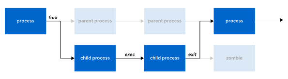
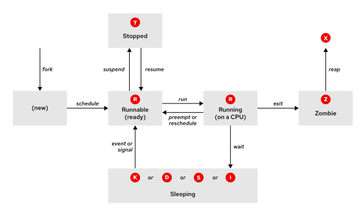

Quản trị hệ thống Red Hat I
---------------------------

# Chương 15. Giám sát và quản lý các tiến trình Linux

## Các tiến trình và vòng đời tiến trình
### Mục tiêu
Xác định các tiến trình đang chạy trên hệ thống, xác định trạng thái hiện tại của chúng và thu thập thông tin về việc sử dụng tài
nguyên hệ thống của chúng.

### Định nghĩa về tiến trình
Tiến trình là một thể hiện đang chạy của một chương trình thực thi đã được khởi chạy. Kể từ thời điểm được tạo ra, một tiến trình bao
gồm các thành phần sau:

* Không gian địa chỉ của bộ nhớ được cấp phát
* Các thuộc tính bảo mật, bao gồm thông tin xác thực quyền sở hữu và các đặc quyền
* Một hoặc nhiều luồng thực thi mã chương trình
* Trạng thái tiến trình

Môi trường của một tiến trình là tập hợp các thông tin bao gồm những thành phần sau:

* Các biến cục bộ và toàn cục
* Ngữ cảnh lập lịch hiện tại
* Các tài nguyên hệ thống đã được cấp phát, chẳng hạn như bộ mô tả tệp và cổng mạng

Một tiến trình cha hiện có sẽ sao chép không gian địa chỉ của chính nó—một thao tác được gọi là "fork" tiến trình—để tạo ra cấu trúc
của một tiến trình con. Mỗi tiến trình mới đều được gán một mã định danh tiến trình (PID) duy nhất nhằm mục đích theo dõi và bảo mật.
PID và mã định danh của tiến trình cha (PPID) là các thành phần thuộc môi trường của tiến trình mới. Bất kỳ tiến trình nào cũng có thể
tạo ra tiến trình con. Tất cả các tiến trình đều là hậu duệ của tiến trình hệ thống đầu tiên—systemd—trên hệ thống Red Hat.

**Hình 15.1: Vòng đời của tiến trình**  


Thông qua cơ chế `fork`, tiến trình con kế thừa các định danh bảo mật, các bộ mô tả tệp (cũ và hiện tại), các quyền truy cập cổng và
tài nguyên, các biến môi trường cũng như mã chương trình. Sau đó, tiến trình con có thể thực thi mã chương trình của riêng mình.

Thông thường, tiến trình cha sẽ tạm dừng (ở trạng thái chờ) trong khi tiến trình con thực thi và thiết lập yêu cầu chờ để nhận tín
hiệu thông báo khi tiến trình con hoàn tất công việc. Sau khi kết thúc, tiến trình con đóng hoặc giải phóng các tài nguyên và môi
trường của nó, đồng thời để lại một trạng thái "zombie" (tiến trình ma) – thực chất là một mục ghi trong bảng tiến trình.
Tiến trình cha – vốn nhận được tín hiệu đánh thức khi tiến trình con kết thúc – sẽ thực hiện dọn dẹp bảng tiến trình bằng cách loại
bỏ mục ghi của tiến trình con và giải phóng tài nguyên cuối cùng của tiến trình này. Tiếp đó, tiến trình cha sẽ tiếp tục thực thi mã
chương trình của chính nó.

### Các trạng thái tiến trình
Trong hệ điều hành đa nhiệm, mỗi CPU (hoặc lõi CPU) có thể xử lý một tiến trình tại một thời điểm. Khi một tiến trình đang chạy, các
yêu cầu tức thời của nó về thời gian CPU và việc cấp phát tài nguyên sẽ thay đổi. Các tiến trình được gán một trạng thái, và trạng thái
này sẽ thay đổi tùy theo tình huống thực tế.

Sơ đồ và bảng dưới đây mô tả chi tiết các trạng thái tiến trình trong Linux.

**Hình 15.2: Các trạng thái tiến trình Linux**  


##### Đang chạy
| Cờ | Tên và mô tả trạng thái do kernel định nghĩa                                                                                                                                                                                                                                            |
|----|-----------------------------------------------------------------------------------------------------------------------------------------------------------------------------------------------------------------------------------------------------------------------------------------|
| R  | TASK_RUNNING: Tiến trình đang thực thi trên CPU hoặc đang chờ để được thực thi. Tiến trình có thể đang thực thi các chương trình người dùng hoặc các chương trình nhân (lời gọi hệ thống), hoặc đang nằm trong hàng đợi và sẵn sàng hoạt động khi ở trạng thái Running (hoặc Runnable). |

##### Đang ngủ
| Cờ | Tên và mô tả trạng thái do kernel định nghĩa                                                                                                                                                                                                                                                                                                                              |
|----|---------------------------------------------------------------------------------------------------------------------------------------------------------------------------------------------------------------------------------------------------------------------------------------------------------------------------------------------------------------------------|
| S  | TASK_INTERRUPTIBLE: Tiến trình đang chờ một điều kiện nào đó: yêu cầu phần cứng, quyền truy cập tài nguyên hệ thống hoặc tín hiệu. Khi một sự kiện hoặc tín hiệu thỏa mãn điều kiện này, tiến trình sẽ quay trở lại trạng thái Running (Đang chạy).                                                                                                                       |
| D  | TASK_UNINTERRUPTIBLE: Tiến trình này cũng đang ở trạng thái ngủ, nhưng khác với trạng thái S, nó không phản hồi lại các tín hiệu. Trạng thái này chỉ được sử dụng khi việc ngắt tiến trình có thể dẫn đến trạng thái thiết bị không thể dự đoán trước.                                                                                                                    |
| K  | TASK_KILLABLE: Tương tự như trạng thái D (không thể ngắt), nhưng được sửa đổi để cho phép một tiến trình đang chờ phản hồi lại tín hiệu kết thúc (thoát hoàn toàn). Các công cụ hệ thống thường hiển thị các tiến trình ở trạng thái Killable này dưới dạng trạng thái D.                                                                                                 |
| I  | TASK_REPORT_IDLE: Một tập con của trạng thái D, được sử dụng cho các luồng nhân (kernel threads). Nhân hệ thống không tính các tiến trình này khi tính toán chỉ số tải trung bình (load average). Các cờ TASK_UNINTERRUPTIBLE và TASK_NOLOAD được thiết lập. Trạng thái này tương tự như TASK_KILLABLE và chấp nhận các tín hiệu gây kết thúc tiến trình (fatal signals). |

##### Đã dừng lại
| Cờ | Tên và mô tả trạng thái do kernel định nghĩa                                                                                                                                                                        |
|----|---------------------------------------------------------------------------------------------------------------------------------------------------------------------------------------------------------------------|
| T  | TASK_STOPPED: Tiến trình bị dừng (tạm ngưng), thường là do nhận tín hiệu từ người dùng hoặc một tiến trình khác. Tiến trình có thể được tiếp tục (khôi phục) để trở lại trạng thái đang chạy nhờ một tín hiệu khác. |
| T  | TASK_TRACED: Một tiến trình đang được gỡ lỗi cũng bị tạm dừng và chia sẻ cờ trạng thái T.                                                                                                                           |

##### Zombie
| Cờ | Tên và mô tả trạng thái do kernel định nghĩa                                                                                                                                                                  |
|----|---------------------------------------------------------------------------------------------------------------------------------------------------------------------------------------------------------------|
| Z  | EXIT_ZOMBIE: Một tiến trình con gửi tín hiệu cho tiến trình cha khi nó kết thúc. Mọi tài nguyên, ngoại trừ định danh tiến trình (PID), đều được giải phóng.                                                   |
| X  | EXIT_DEAD: Khi tiến trình cha dọn dẹp (thu hồi) cấu trúc còn lại của tiến trình con, tiến trình này sẽ được giải phóng hoàn toàn. Trạng thái này không thể quan sát được bằng các công cụ liệt kê tiến trình. |

#### Diễn giải các trạng thái tiến trình
Việc hiểu cách kernel giao tiếp với các tiến trình, cũng như cách các tiến trình giao tiếp với nhau, có thể giúp bạn khắc phục sự cố
hệ thống.

Hệ thống gán một trạng thái cho mỗi tiến trình mới. Cột S trong lệnh `top` hoặc cột STAT trong lệnh `ps` hiển thị trạng thái của từng
tiến trình. Trên hệ thống chỉ có một CPU, tại một thời điểm chỉ có một tiến trình được thực thi. Có thể có nhiều tiến trình cùng ở
trạng thái `R` (đang chạy hoặc sẵn sàng chạy). Tuy nhiên, không phải tất cả các tiến trình đều chạy liên tục; một số tiến trình có thể
đang ở trạng thái chờ.

```console
user@host:~$ top
PID USER  PR  NI    VIRT    RES    SHR S  %CPU  %MEM   TIME+    COMMAND
  1 root  20   0   49516  41072  10164 S   0.0   0.7   0:02.30  systemd
  2 root  20   0       0      0      0 S   0.0   0.0   0:00.00  kthreadd
  3 root  20   0       0      0      0 S   0.0   0.0   0:00.00  pool_workqueue_release
...output omitted...
```

```console
user@host:~$ ps aux
USER       PID %CPU %MEM    VSZ   RSS TTY      STAT START   TIME COMMAND
...output omitted...
root         2  0.0  0.0      0     0 ?        S    11:57   0:00 [kthreadd]
student   2496  0.0  0.0 231132  3872 pts/0    R+   16:45   0:00 ps aux
...output omitted...
```

Sử dụng các tín hiệu để tạm dừng, dừng, tiếp tục, chấm dứt hoặc ngắt quãng các tiến trình. Các tiến trình có thể nhận tín hiệu từ nhân
hệ điều hành, các tiến trình khác và những người dùng khác trên cùng một hệ thống.

#### Liệt kê các tiến trình
Lệnh `ps` liệt kê thông tin chi tiết về các tiến trình hiện tại:

* Định danh người dùng (UID) – yếu tố xác định các quyền hạn của tiến trình
* Định danh tiến trình duy nhất (PID)
* Mức sử dụng CPU và thời gian thực đã trôi qua
* Lượng bộ nhớ được cấp phát
* Vị trí đầu ra tiêu chuẩn (stdout) của tiến trình, còn được gọi là thiết bị đầu cuối điều khiển (controlling terminal)
* Trạng thái hiện tại của tiến trình

> **Quan trọng**: Phiên bản Linux của lệnh `ps` hỗ trợ các định dạng tùy chọn sau:
> * Các tùy chọn UNIX (POSIX): có thể nhóm lại với nhau và bắt buộc phải có dấu gạch ngang (`-`) ở phía trước. 
> * Các tùy chọn BSD: có thể nhóm lại với nhau và không được sử dụng kèm dấu gạch ngang. 
> * Các tùy chọn dài kiểu GNU: có hai dấu gạch ngang ở phía trước.
> Ví dụ: lệnh `ps -aux` không giống với lệnh `ps aux`.

Lệnh `ps aux` thường được sử dụng để hiển thị tất cả các tiến trình, bao gồm cả những tiến trình không có thiết bị đầu cuối điều
khiển. Trong các ví dụ dưới đây, các luồng nhân (kernel thread) được lập lịch hiển thị trong dấu ngoặc vuông ở đầu danh sách.

```console
user@host:~$ ps aux
USER PID %CPU %MEM    VSZ   RSS TTY STAT START  TIME COMMAND
root   1  0.1  0.2 171820 16140 ?   Ss   16:47  0:01 /usr/lib/systemd/systemd ...
root   2  0.0  0.0      0     0 ?   S    16:47  0:00 [kthreadd]
root   3  0.0  0.0      0     0 ?   I<   16:47  0:00 [rcu_gp]
root   4  0.0  0.0      0     0 ?   I<   16:47  0:00 [rcu_par_gp]
root   6  0.0  0.0      0     0 ?   I<   16:47  0:00 [kworker/0:0H-events_highpri]
...output omitted...
```

Chế độ hiển thị chi tiết (lệnh `ps lax`) cung cấp nhiều thông tin hơn và trả về kết quả nhanh hơn nhờ bỏ qua bước
tra cứu tên người dùng.

```console
user@host:~$ ps lax
F UID PID PPID PRI  NI   VSZ  RSS WCHAN STAT TTY TIME COMMAND
4   0   1    0  20   0 17820 1140 -     Ss   ?   0:01 /usr/lib/systemd/systemd ...
1   0   2    0  20   0     0    0 -     S    ?   0:00 [kthreadd]
1   0   3    2   0 -20     0    0 -     I<   ?   0:00 [rcu_gp]
1   0   4    2   0 -20     0    0 -     I<   ?   0:00 [rcu_par_gp]
1   0   6    2   0 -20     0    0 -     I<   ?   0:00 [kworker/0:0H-events_...]
...output omitted...
```

Cú pháp tương tự trên UNIX sử dụng các tùy chọn `-ef` để hiển thị tất cả các tiến trình.

```console
user@host:~$ ps -ef
UID   PID  PPID  C STIME TTY  TIME     CMD
root  1    0     0 16:47 ?    00:00:01 /usr/lib/systemd/systemd ...
root  2    0     0 16:47 ?    00:00:00 [kthreadd]
root  3    2     0 16:47 ?    00:00:00 [rcu_gp]
root  4    2     0 16:47 ?    00:00:00 [rcu_par_gp]
root  6    2     0 16:47 ?    00:00:00 [kworker/0:0H-events_highpri]
...output omitted...
```

Kết quả đầu ra mặc định của lệnh `ps` được sắp xếp theo số định danh tiến trình (PID). Ban đầu, kết quả có vẻ như được sắp xếp theo
trình tự thời gian, nhưng do nhân hệ điều hành (kernel) tái sử dụng các PID, nên thứ tự thực tế không hoàn toàn theo trình tự đó. Bạn
có thể sử dụng tùy chọn `-O` hoặc `--sort` của lệnh `ps` để sắp xếp lại kết quả đầu ra. Thứ tự hiển thị tương ứng với bảng tiến trình
của hệ thống; bảng này sẽ tái sử dụng các dòng dữ liệu khi các tiến trình kết thúc và các tiến trình mới được tạo ra.

Theo mặc định, khi chạy lệnh `ps` mà không kèm tùy chọn nào, hệ thống sẽ chọn tất cả các tiến trình có cùng ID người dùng hiệu dụng
(EUID) với người dùng hiện tại, cũng như các tiến trình gắn liền với thiết bị đầu cuối (terminal) đang thực thi lệnh. Các tiến trình
"zombie" (tiến trình ma) sẽ được liệt kê với nhãn trạng thái là "exiting" (đang thoát) hoặc "defunct"
(đã kết thúc/không còn hoạt động).

Bạn có thể sử dụng tùy chọn `--forest` của lệnh `ps` để hiển thị các tiến trình dưới dạng cây, giúp bạn quan sát mối quan hệ giữa tiến
trình cha và tiến trình con.

## Quản lý tiến trình bằng Job Control
### Mục tiêu
Kiểm soát các tiến trình chạy ở nền trước và nền sau trên cùng một terminal bằng cách sử dụng tính năng quản lý tác vụ (job control).

### Công việc và Phiên làm việc
Với tính năng quản lý tiến trình (job control) của shell, bạn có thể thực thi và quản lý nhiều lệnh trong cùng một phiên làm việc
của shell.

Một "job" (công việc/tiến trình) được gắn liền với mỗi pipeline (chuỗi lệnh) được nhập tại dấu nhắc lệnh của shell. Tất cả các tiến
trình trong pipeline đó đều thuộc về job này và là thành viên của cùng một nhóm tiến trình (process group). Một pipeline tối giản có
thể chỉ bao gồm một lệnh duy nhất được nhập tại dấu nhắc shell, tạo ra một job chỉ có một thành viên.

Tại một thời điểm, chỉ có một job duy nhất có thể đọc dữ liệu đầu vào và nhận các tín hiệu từ bàn phím của một cửa sổ terminal cụ thể.
Các tiến trình thuộc job đó được coi là các tiến trình chạy ở chế độ nền trước (foreground) của terminal điều khiển đó.

Các tiến trình chạy ở chế độ nền (background) của terminal điều khiển là những job khác có liên kết với terminal đó. Các tiến trình
nền của một terminal không thể đọc dữ liệu đầu vào hay nhận tín hiệu ngắt từ bàn phím của terminal, nhưng chúng có thể ghi dữ liệu
ra terminal. Một job chạy nền có thể đang ở trạng thái tạm dừng (suspended) hoặc đang thực thi. Nếu một job chạy nền đang thực thi
cố gắng đọc dữ liệu từ terminal, nó sẽ tự động bị kernel tạm dừng và duy trì ở trạng thái dừng cho đến khi được chuyển sang chế độ
nền trước.

Mỗi terminal hoạt động trong một phiên làm việc (session) riêng biệt và có thể bao gồm một tiến trình nền trước cùng với bất kỳ số
lượng tiến trình nền nào. Một job chạy trong phiên làm việc đó sẽ thuộc về terminal điều khiển tương ứng.

Lệnh `ps` hiển thị tên thiết bị của terminal điều khiển trong cột `TTY`.

```console
user@host:~$ ps
    PID TTY          TIME CMD
   2328 pts/0    00:00:00 bash
   8910 pts/0    00:00:00 ps
```

Một số tiến trình, chẳng hạn như các daemon hệ thống, được hệ thống khởi động chứ không phải từ một terminal điều khiển. Các tiến
trình này không thuộc về một job (công việc) nào và không thể được đưa ra chạy ở chế độ foreground (chế độ tương tác trực tiếp).
Lệnh `ps` hiển thị dấu chấm hỏi (?) trong cột TTY đối với các tiến trình này.

Hãy sử dụng lệnh `ps j` để tìm thông tin về tiến trình và phiên làm việc (session), cũng như các chi tiết về các job.

Trong ví dụ dưới đây, lệnh `sleep` hiện đang bị tạm dừng và trạng thái tiến trình là T (đã dừng).

```console
user@host:~$ ps j
PPID     PID    PGID     SID TTY    TPGID STAT   UID   TIME COMMAND
...output omitted...
8527    8528    8528    8528 pts/0   8633 Ss    1000   0:00 -bash
8528    8559    8559    8528 pts/0   8633 T     1000   0:00 sleep 10000
8528    8633    8633    8528 pts/0   8633 R+    1000   0:00 ps j
```

* `PID` là mã định danh duy nhất của tiến trình.
* `PPID` (Parent Process ID) là `PID` của tiến trình cha đã khởi tạo (thực hiện lệnh fork) tiến trình này.
* `PGID` là `PID` của tiến trình đứng đầu nhóm tiến trình (process group leader), thường là tiến trình đầu tiên trong chuỗi đường ống
(pipeline) của tác vụ.
* `SID` là `PID` của tiến trình đứng đầu phiên làm việc (session leader); đối với một tác vụ, đây thường là shell tương tác đang chạy
trên thiết bị đầu cuối (terminal) điều khiển phiên đó.

### Chạy các tác vụ ở chế độ nền
Bạn có thể chạy bất kỳ lệnh hoặc chuỗi lệnh (pipeline) nào ở chế độ nền bằng cách thêm ký tự và (`&`) vào cuối lệnh đó. Bash shell sẽ
hiển thị số hiệu tác vụ (duy nhất trong phiên làm việc hiện tại) và mã định danh tiến trình (`PID`) của tiến trình con mới được tạo ra.
Shell sẽ không chờ tiến trình con kết thúc mà sẽ hiển thị ngay dấu nhắc lệnh.

Trong ví dụ dưới đây, lệnh `sleep` được thực thi ở chế độ nền nhờ toán tử `&`, với thời gian tạm dừng là 10.000 giây. Kết quả hiển thị
số hiệu tác vụ do shell gán (`[1]`) và mã định danh tiến trình (`PID`) là 5947.

```console
user@host:~$ sleep 10000 &
[1] 5947
```

Khi một dòng lệnh có chứa toán tử pipe (`|`) được chuyển vào chạy ở chế độ nền, PID của lệnh cuối cùng trong chuỗi lệnh đó sẽ được
hiển thị. Tất cả các tiến trình trong chuỗi lệnh này đều thuộc cùng một job (công việc).

Trong ví dụ dưới đây, kết quả từ lệnh `ls` được chuyển sang lệnh `sort` thông qua pipe, và kết quả đã sắp xếp được gửi qua email bằng
lệnh `mail -s`. Toàn bộ chuỗi lệnh này chạy ở chế độ nền nhờ toán tử `&`, cho phép người dùng tiếp tục sử dụng cửa sổ dòng lệnh.

```console
user@host:~$ ls | sort | mail -s "Sort output" &
[1] 5998
```

Sử dụng lệnh `jobs` để hiển thị danh sách các tiến trình (job) của phiên làm việc trên shell.

```
user@host:~$ jobs
[1]+ Running    sleep 10000 &
```

### Đưa một tác vụ nền lên phía trước

Sử dụng lệnh `fg` để đưa một tiến trình chạy ngầm ra chạy ở chế độ nền trước (foreground). Sử dụng định dạng `(%jobNumber)` để chỉ
định tiến trình cần đưa ra nền trước.

```console
user@host:~$ fg %1
sleep 10000
```

Trong ví dụ trước, lệnh `sleep` đang chạy ở chế độ foreground (tiền cảnh) trên terminal điều khiển. Bản thân shell đang ở trạng thái
tạm dừng (sleep) và chờ tiến trình con này kết thúc.

### Chuyển tiến trình chạy ở tiền cảnh sang chạy ở nền
Để chuyển một tiến trình đang chạy ở nền trước sang chạy ở nền sau, hãy nhấn tổ hợp phím gửi yêu cầu tạm dừng (`Ctrl+Z`) trong cửa sổ
terminal. Tiến trình đó sẽ chuyển sang chạy ở nền sau và bị tạm dừng.

```console
user@host:~$ sleep 10000
^Z
[1]+  Stopped                 sleep 10000
```

### Khởi động một tiến trình đang bị tạm dừng
Để bắt đầu chạy tiến trình đang bị tạm dừng, hãy sử dụng lệnh `bg` kèm theo ID của tác vụ (job ID):

```console
user@host:~$ bg %1
[1]+ sleep 10000 &
```

Shell sẽ cảnh báo người dùng khi họ cố gắng thoát khỏi cửa sổ (phiên làm việc) terminal đang có các tiến trình (job) bị tạm dừng.
Nếu người dùng cố gắng thoát ngay lập tức một lần nữa, các tiến trình đang bị tạm dừng đó sẽ bị chấm dứt.

> **Lưu ý**: Trong các ví dụ trước, dấu cộng (`+`) biểu thị rằng đây là tiến trình mặc định hiện tại. Nếu bạn sử dụng lệnh điều khiển
> tiến trình mà không có tham số `%jobNumber`, thì thao tác sẽ được thực hiện trên tiến trình mặc định. Dấu trừ (`-`) biểu thị rằng
> tiến trình trước đó sẽ trở thành tiến trình mặc định khi tiến trình hiện tại hoàn tất.

## Gửi tín hiệu đến các tiến trình
### Mục tiêu
Gửi tín hiệu đến các tiến trình để điều khiển hoạt động hoặc chấm dứt quá trình thực thi của chúng.

### Điều khiển tiến trình bằng tín hiệu
Tín hiệu (signal) là một dạng ngắt phần mềm được gửi đến một tiến trình. Các tín hiệu có chức năng thông báo về các sự kiện cho một
chương trình đang thực thi. Các sự kiện tạo ra tín hiệu có thể là lỗi, sự kiện bên ngoài (như yêu cầu nhập/xuất hoặc hết thời gian chờ
của bộ định thời), hoặc do việc chủ động sử dụng lệnh gửi tín hiệu hay tổ hợp phím.

Bảng dưới đây liệt kê các tín hiệu cơ bản mà quản trị viên hệ thống thường dùng để quản lý tiến trình trong công việc hàng ngày.
Bạn có thể tham chiếu các tín hiệu này bằng tên viết tắt (ví dụ: HUP) hoặc tên đầy đủ (ví dụ: SIGHUP).

**Bảng 15.2. Các tín hiệu quản lý tiến trình cơ bản**

| Tín hiệu    | Tên  | Định nghĩa                                                                                                                                                                                                 |
|-------------|------|------------------------------------------------------------------------------------------------------------------------------------------------------------------------------------------------------------|
| 1           | HUP  | Hangup: Thông báo về việc chấm dứt tiến trình điều khiển của thiết bị đầu cuối. Đồng thời yêu cầu tái khởi tạo tiến trình (tải lại cấu hình) mà không chấm dứt tiến trình đó.                              |
| 2           | INT  | Ngắt bàn phím (Keyboard interrupt): Gây ra việc chấm dứt chương trình. Nó có thể bị chặn hoặc được xử lý. Tín hiệu này được gửi đi khi nhấn tổ hợp phím INTR (Interrupt) (Ctrl+C).                         |
| 3           | QUIT | Keyboard quit: Tương tự như SIGINT; tạo ra bản kết xuất tiến trình (process dump) khi kết thúc. Tín hiệu này được gửi đi khi nhấn tổ hợp phím QUIT (Ctrl+\).                                               |
| 9           | KILL | Kill, unblockable: Gây chấm dứt chương trình đột ngột. Lệnh này không thể bị chặn, bỏ qua hay xử lý; luôn dẫn đến kết thúc chương trình.                                                                   |
| 15 mặc định | TERM | Terminate: Gây ra việc chấm dứt chương trình. Khác với SIGKILL, tín hiệu này có thể bị chặn, bỏ qua hoặc xử lý. Nó cho phép chương trình hoàn tất các thao tác thiết yếu và tự dọn dẹp trước khi kết thúc. |
| 18          | CONT | Continue: Tín hiệu gửi đến một tiến trình để tiếp tục hoạt động nếu nó đang bị tạm dừng. Tín hiệu này không thể bị chặn. Ngay cả khi được xử lý, nó vẫn luôn khiến tiến trình tiếp tục hoạt động.          |
| 19          | STOP | Stop, unblockable: Tạm dừng tiến trình. Tiến trình này không thể bị chặn hay xử lý.                                                                                                                        |
| 20          | TSTP | Keyboard stop: Khác với SIGSTOP, tín hiệu này có thể bị chặn, bỏ qua hoặc xử lý. Nó được gửi đi khi nhấn tổ hợp phím tạm dừng (Ctrl+Z).                                                                    |

> **Lưu ý**: Các số hiệu tín hiệu có thể khác nhau tùy theo nền tảng phần cứng Linux, nhưng tên gọi và ý nghĩa của tín hiệu thì tuân
> theo chuẩn chung. Quy tắc thực hành được khuyến nghị là sử dụng tên tín hiệu thay vì số hiệu khi gửi tín hiệu. Các số hiệu được đề
> cập trong phần này áp dụng cho các hệ thống sử dụng kiến trúc x86_64.

Mỗi tín hiệu đều có một hành động mặc định, thường là một trong các hành động sau:

* Term : Kết thúc chương trình (thoát) ngay lập tức. 
* Core : Lưu lại hình ảnh bộ nhớ của chương trình (core dump), sau đó kết thúc. 
* Stop : Dừng chương trình đang chạy (tạm dừng) và chờ để tiếp tục (khôi phục).

Các chương trình phản ứng lại các tín hiệu sự kiện dự kiến bằng cách triển khai các quy trình xử lý để bỏ qua, thay thế hoặc mở rộng
hành động mặc định của tín hiệu.

> **Quan trọng**: Red Hat khuyến nghị gửi tín hiệu SIGTERM trước, sau đó mới thử SIGINT. Nếu cả hai tín hiệu đều không thành công,
hãy thử lại với SIGKILL. Các quản trị viên thường sử dụng SIGKILL ngay từ đầu vì tín hiệu này buộc tiến trình phải chấm dứt bất kể
trạng thái của nó và không thể bị bỏ qua. Tuy nhiên, khi sử dụng SIGKILL, tiến trình sẽ không thể thực hiện bất kỳ quy trình tự dọn
dẹp nào.

#### Gửi tín hiệu theo yêu cầu cụ thể
Bạn có thể gửi tín hiệu đến tiến trình đang chạy ở chế độ nền trước bằng cách nhấn tổ hợp phím điều khiển để tạm dừng (`Ctrl+Z`),
kết thúc (C`trl+C`) hoặc tạo bản sao bộ nhớ (core dump) (`Ctrl+\`) cho tiến trình đó. Tuy nhiên, bạn cũng có thể sử dụng các lệnh
gửi tín hiệu để truyền tín hiệu tới các tiến trình đang chạy ở chế độ nền trong một phiên làm việc khác.

Bạn có thể chỉ định tín hiệu bằng tên (ví dụ: sử dụng tùy chọn -HUP hoặc -SIGHUP) hoặc bằng số (sử dụng tùy chọn -1 tương ứng).
Người dùng có thể kết thúc các tiến trình của chính mình, nhưng cần có quyền root để kết thúc các tiến trình thuộc sở hữu của
người dùng khác.

Lệnh `kill` sử dụng mã định danh tiến trình (PID) để gửi tín hiệu đến một tiến trình. Mặc dù có tên gọi là `kill` (nghĩa là "giết"
hoặc "kết thúc"), bạn có thể dùng lệnh này để gửi bất kỳ loại tín hiệu nào, chứ không chỉ các tín hiệu dùng để chấm dứt chương trình.
Bạn có thể sử dụng tùy chọn `-l` của lệnh `kill` để liệt kê tên và số hiệu của tất cả các tín hiệu có sẵn.

```console
user@host:~$ kill -l
 1) SIGHUP       2) SIGINT     3) SIGQUIT    4) SIGILL     5) SIGTRAP
 6) SIGABRT      7) SIGBUS     8) SIGFPE     9) SIGKILL   10) SIGUSR1
11) SIGSEGV     12) SIGUSR2   13) SIGPIPE   14) SIGALRM   15) SIGTERM
16) SIGSTKFLT   17) SIGCHLD   18) SIGCONT   19) SIGSTOP   20) SIGTSTP
...output omitted...
```

Để tìm PID của tiến trình cần kết thúc, bạn có thể sử dụng lệnh `ps aux` và lọc theo tên tiến trình. Trong ví dụ dưới đây, bạn tìm
kiếm tất cả các tiến trình có chứa từ "task" trong tên, sau đó kết thúc tiến trình `task1` bằng cách sử dụng tín hiệu `SIGTERM` mặc
định. Tín hiệu `SIGTERM` cho phép tiến trình hoàn tất các tác vụ và thực hiện các quy trình dọn dẹp cần thiết.

```console
user@host:~$ ps aux | grep task
user 6564 0.0 0.0 228796 3264 pts/0  S  17:22 0:00 /bin/bash ~/bin/task1
user 6566 0.0 0.0 228796 3244 pts/0  S  17:22 0:00 /bin/bash ~/bin/task2
user 6568 0.0 0.0 228796 3220 pts/0  S  17:22 0:00 /bin/bash ~/bin/task3
...output omitted...
user@host:~$ kill 6564
[1]   Terminated              task1
```

Tiếp tục với ví dụ về các tiến trình task, bạn sẽ kết thúc các tiến trình task2 và task3 bằng cách sử dụng tín hiệu SIGKILL. Bạn sử
dụng giá trị số của tín hiệu để kết thúc tiến trình task2 và sử dụng tên tín hiệu để kết thúc tiến trình task3. Tín hiệu SIGKILL sẽ
kết thúc tiến trình một cách đột ngột.

```console
user@host:~$ kill -9 6566
[2]-  Killed                  task2
user@host:~$ ps aux | grep task3
user 6568 0.0 0.0 228796 3220 pts/0  S  17:22 0:00 /bin/bash ~/bin/task3
...output omitted...
user@host:~$ kill -SIGKILL 6568
[3]+  Killed                  task3
```

#### Kiểm soát các quy trình cụ thể
Sử dụng lệnh pkill để gửi tín hiệu đến một hoặc nhiều tiến trình khớp với các tiêu chí lựa chọn. Các tiêu chí lựa chọn có thể là tên
lệnh, tiến trình thuộc sở hữu của một người dùng cụ thể hoặc tất cả các tiến trình trên toàn hệ thống. Tín hiệu có thể được gửi đến
các tiến trình và phiên làm việc (session) một cách riêng lẻ hoặc đồng loạt.

Do tiến trình khởi đầu trong một phiên đăng nhập (session leader) được thiết kế để xử lý các yêu cầu kết thúc phiên và bỏ qua các tín
hiệu bàn phím ngoài ý muốn, nên việc chấm dứt (`kill`) tất cả các tiến trình và shell đăng nhập của một người dùng cụ thể đòi hỏi phải
sử dụng tín hiệu `SIGKILL`.

Khi một tiến trình ở trạng thái `T` (đã dừng/đang được theo dõi - `stopped/traced`), chẳng hạn như sau khi nhận tín hiệu `SIGSTOP`,
tiến trình đó không thể phản hồi các tín hiệu như `SIGTERM` (tín hiệu mặc định mà lệnh `pkill` và `killall` gửi đi). Kết quả là tiến
trình vẫn duy trì ở trạng thái `T` và xuất hiện trong kết quả hiển thị của các lệnh `top` và `ps`, ngay cả sau khi đã sử dụng lệnh
`pkill`.

Sử dụng lệnh `pgrep` để xác định các số `PID` cần chấm dứt. Lệnh này hoạt động tương tự như lệnh `pkill` và hỗ trợ hầu hết các tùy chọn
giống nhau, ngoại trừ việc `pgrep` chỉ liệt kê danh sách các tiến trình thay vì chấm dứt chúng.

Sử dụng lệnh `pgrep` kèm tùy chọn` -l` để liệt kê tên và ID của các tiến trình. Sử dụng một trong hai lệnh này kèm tùy chọn `-u` để
chỉ định ID của người dùng sở hữu các tiến trình đó. Ví dụ dưới đây liệt kê các tiến trình của người dùng "bob" và sau đó gửi tín hiệu
`SIGKILL` tới tất cả các tiến trình của người dùng này.

```console
root@host:~# pgrep -l -u bob
6964 bash
6998 sleep
6999 sleep
7000 sleep
root@host:~# pkill -SIGKILL -u bob
root@host:~# pgrep -l -u bob
```

Khi các tiến trình mục tiêu nằm trong cùng một phiên đăng nhập, việc chấm dứt tất cả các tiến trình của người dùng có thể là không cần
thiết. Trong trường hợp này, bạn có thể xác định thiết bị đầu cuối (terminal) của phiên làm việc, sau đó chỉ chấm dứt những tiến trình
gắn liền với cùng một ID thiết bị đầu cuối đó. Bạn có thể xác định thiết bị đầu cuối cho phiên làm việc bằng cách sử dụng lệnh
`w -u username`. Sau đó, bạn có thể dùng lệnh `pkill -t ttyN`, trong đó N là số hiệu của thiết bị đầu cuối mục tiêu.

> **Lưu ý**: Trừ khi tín hiệu `SIGKILL` được chỉ định, người đứng đầu phiên (trong trường hợp này là shell đăng nhập Bash) sẽ xử lý
> thành công và vẫn tiếp tục hoạt động sau yêu cầu chấm dứt, nhưng sẽ chấm dứt tất cả các tiến trình khác trong phiên đó.

Trong ví dụ dưới đây, bạn liệt kê tất cả các tiến trình thuộc về người dùng `bob`, xác định thiết bị đầu cuối (terminal) của phiên làm
việc, và sau đó gửi tín hiệu kết thúc mặc định (`SIGTERM`). Lưu ý rằng tất cả các tiến trình thuộc về người dùng `bob` đều bị kết
thúc, ngoại trừ tiến trình đứng đầu phiên làm việc (session leader), tức là tiến trình `bash`. Các lệnh này được thực thi với quyền
người dùng `root` để bạn có thể quan sát sự khác biệt giữa việc gửi tín hiệu `SIGTERM` và `SIGKILL`.

```console
root@host:~# pgrep -l -u bob
7391 bash
7426 sleep
7427 sleep
7428 sleep
root@host:~# w -u bob
USER     TTY      FROM             LOGIN@   IDLE   JCPU   PCPU WHAT
bob      tty3                      18:37    5:04   0.03s  0.03s -bash
root@host:~# pkill -t tty3
root@host:~# pgrep -l -u bob
7391 bash
```

Bằng cách gửi tín hiệu `SIGKILL`, bạn cũng chấm dứt tiến trình dẫn đầu phiên làm việc (session leader),
như được minh họa trong ví dụ sau.

```console
root@host:~# pkill -SIGKILL -t tty3
root@host:~# pgrep -l -u bob
```

Bạn có thể áp dụng phương thức kết thúc tiến trình có chọn lọc tương tự đối với các mối quan hệ tiến trình cha-con. Hãy sử dụng lệnh
`pstree` để xem cây tiến trình của hệ thống hoặc của một người dùng cụ thể. Sử dụng PID của tiến trình cha để kết thúc tất cả các tiến
trình con do nó tạo ra. Lần này, tiến trình shell đăng nhập Bash (tiến trình cha) vẫn tiếp tục chạy, vì tín hiệu chỉ được gửi đến các
tiến trình con của nó.

```console
root@host:~# pstree -p bob
bash(8391)─┬─sleep(8425)
           ├─sleep(8426)
           └─sleep(8427)
root@host:~# pkill -P 8391
root@host:~# pgrep -l -u bob
bash(8391)
root@host:~# pkill -SIGKILL -P 8391
root@host:~# pgrep -l -u bob
bash(8391)
```

#### Gửi tín hiệu đến nhiều tiến trình
Lệnh `killall` có thể gửi tín hiệu đến nhiều tiến trình dựa trên tên lệnh của chúng. Trong ví dụ dưới đây, trước tiên bạn liệt kê tất
cả các tiến trình có chứa từ "job" trong tên, sau đó chấm dứt tất cả các tiến trình đó.

```console
user@host:~$ ps aux | grep job
user 9259 0.0 0.0 228796 3236 pts/0  S  20:05 0:00 /bin/bash ~/bin/control job1
user 9261 0.0 0.0 228796 3232 pts/0  S  20:05 0:00 /bin/bash ~/bin/control job2
user 9270 0.0 0.0 228796 3240 pts/0  S  20:06 0:00 /bin/bash ~/bin/control job3
...output omitted...
user@host:~$ killall job
[1]   Terminated              control job1
[2]   Terminated              control job2
[3]-  Terminated              control job3
```

### Kết thúc các tác vụ chạy ngầm
Để chấm dứt các tiến trình chạy ngầm, hãy sử dụng lệnh `kill` và chỉ định số hiệu tiến trình (job number). Hãy sử dụng lệnh `jobs` để
tìm số hiệu của tiến trình cần chấm dứt.

```console
user@host:~$ jobs
[1]-  Running                 sleep 500 &
[2]+  Running                 sleep 1000 &
```

Kết thúc một tiến trình cụ thể bằng cách sử dụng lệnh `kill`. Hãy thêm dấu phần trăm (%) vào trước số hiệu tiến trình.

```console
user@host:~$ kill -SIGTERM %1
user@host:~$ jobs
[2]+  Running                 sleep 1000 &
```

### Đăng xuất người dùng dưới quyền quản trị
Bạn có thể cần đăng xuất người dùng khác vì nhiều lý do:

* Người dùng vi phạm quy định bảo mật. 
* Người dùng sử dụng quá mức tài nguyên. 
* Hệ thống của người dùng không phản hồi.
* Người dùng truy cập tài liệu không hợp lệ.

Trong những trường hợp này, bạn phải chấm dứt phiên làm việc của họ bằng cách sử dụng các tín hiệu ở cấp quản trị.

Để đăng xuất một người dùng, trước tiên hãy xác định phiên đăng nhập cần chấm dứt. Lệnh `w` sẽ liệt kê các phiên đăng nhập của người
dùng và các tiến trình đang chạy. Hãy chú ý đến các cột TTY và FROM để xác định phiên làm việc cần đóng.

```console
user@host:~$ w -f
 12:43:06 up 27 min,  5 users,  load average: 0.03, 0.17, 0.66
USER  TTY   FROM                LOGIN@   IDLE   JCPU   PCPU WHAT
root  tty2                      12:26   14:58   0.04s  0.04s -bash
bob   tty3                      12:28   14:42   0.02s  0.02s -bash
user  pts/1 desktop.example.com 12:41    2.00s  0.03s  0.03s w
user@host:~$
```

Mỗi phiên đăng nhập của người dùng đều gắn liền với một thiết bị đầu cuối (TTY). Nếu tên thiết bị là pts/N, đó là một thiết bị đầu
cuối giả lập (pseudo-terminal) liên kết với cửa sổ terminal đồ họa hoặc phiên đăng nhập từ xa. Nếu tên thiết bị là ttyN, người dùng
đang thao tác trên bảng điều khiển hệ thống (system console), bảng điều khiển thay thế hoặc một thiết bị đầu cuối khác được kết nối
trực tiếp.

Bạn có thể xác định thời gian người dùng đã hoạt động trên hệ thống bằng cách xem thời điểm đăng nhập của phiên làm việc. Tài nguyên
CPU mà các tiến trình hiện tại tiêu thụ—bao gồm cả tác vụ chạy ngầm và tiến trình con—được hiển thị trong cột JCPU của mỗi phiên.
Mức tiêu thụ CPU của tiến trình đang chạy ở chế độ tiền cảnh (foreground) được hiển thị trong cột PCPU.

Lệnh `w` cho biết những ai đang đăng nhập và họ đang thực hiện công việc gì. Ngược lại, lệnh `who` chỉ cung cấp các thông tin cơ bản
về những người dùng đang đăng nhập.

```console
user@host:~$ who
root     tty2         2025-06-09 12:26 (tty2)
bob      tty3         2025-06-09 12:28 (tty3)
user     pts/1        2025-06-09 12:41 (desktop.example.com)
```

Sau khi xác định phiên làm việc cần chấm dứt, hãy sử dụng lệnh `pkill -t` để kết thúc phiên đó.

Chỉ người dùng root hoặc người dùng có đặc quyền nâng cao (thông qua Sudo) mới có thể chấm dứt các tiến trình thuộc về người dùng
khác. Người dùng thông thường chỉ có thể kết thúc các tiến trình của chính họ. Nếu bạn cố gắng chạy lệnh `pkill -t` để kết thúc phiên
làm việc của người dùng khác mà không có đủ đặc quyền, hệ thống sẽ trả về lỗi "Operation not permitted" (Không được phép thực hiện
thao tác).

```console
user@host:~$ sudo pkill -t tty3
user@host:~$ who
root     tty2         2025-06-09 12:26 (tty2)
user     pts/1        2025-06-09 12:41 (desktop.example.com)
```

Phiên làm việc tty3 của người dùng bob đã bị chấm dứt và người dùng hiện đã đăng xuất.

## Giám sát hoạt động của tiến trình
### Mục tiêu
Điều tra, kiểm soát và chấm dứt các tiến trình đang chạy trên hệ thống Red Hat Enterprise Linux.

### Tải trung bình - Load Average
Mức tải trung bình là một phép đo do nhân Linux cung cấp, thể hiện mức tải hệ thống cảm nhận được trong một khoảng thời gian.
Nó có thể được sử dụng như một thước đo sơ bộ về số lượng yêu cầu tài nguyên hệ thống đang chờ xử lý, để xác định xem tải
hệ thống tăng hay giảm.

Nhân hệ điều hành thu thập số liệu tải hiện tại cứ sau năm giây dựa trên số lượng tiến trình ở trạng thái có thể chạy và không thể bị
gián đoạn. Con số này được báo cáo dưới dạng trung bình động theo hàm mũ trong 1, 5 và 15 phút gần nhất.

#### Tính toán mức tải trung bình
Mức tải trung bình là một phép đo sơ bộ về số lượng tiến trình hiện đang chờ một yêu cầu hoàn thành trước khi chúng thực hiện bất kỳ
hành động nào khác. Yêu cầu có thể là yêu cầu thời gian CPU để chạy tiến trình. Hoặc, yêu cầu có thể là yêu cầu hoàn thành một thao
tác I/O đĩa quan trọng, và tiến trình không thể chạy trên CPU cho đến khi yêu cầu hoàn thành, ngay cả khi CPU đang rảnh rỗi. Trong cả
hai trường hợp, tải hệ thống đều bị ảnh hưởng, và hệ thống dường như chạy chậm hơn vì các tiến trình đang chờ chạy.

Số tải là mức trung bình đang chạy của số lượng tiến trình sẵn sàng chạy trên CPU (ở trạng thái tiến trình R) hoặc đang chờ đĩa hoặc
I/O hoàn thành (ở trạng thái tiến trình D). Một số hệ thống UNIX chỉ xem xét mức sử dụng CPU hoặc độ dài hàng đợi chạy để chỉ ra tải
hệ thống. Linux cũng bao gồm mức sử dụng đĩa hoặc mạng, vì việc sử dụng cao các tài nguyên này có thể ảnh hưởng đáng kể đến hiệu suất
hệ thống dưới dạng tải CPU.

Đối với mức tải trung bình cao với hoạt động CPU tối thiểu, hãy kiểm tra hoạt động của đĩa và mạng.

#### Giải thích các giá trị trung bình tải
Lệnh `uptime` là một cách để hiển thị mức tải trung bình hiện tại. Lệnh này in ra thời gian hiện tại, thời gian máy đã hoạt động,
số lượng phiên người dùng đang chạy và mức tải trung bình hiện tại.

```console
user@host:~$ uptime
 15:29:03 up 14 min,  2 users,  load average: 2.92, 4.48, 5.20
```

Ba giá trị trung bình tải thể hiện tải trọng trong 1, 5 và 15 phút gần nhất. Các giá trị này cho biết tải trọng hệ thống có vẻ đang
tăng hay giảm.

Nếu đóng góp chính vào tải trọng trung bình đến từ các tiến trình đang chờ CPU, thì bạn có thể tính toán giá trị tải trọng gần đúng
trên mỗi CPU để xác định xem hệ thống có đang gặp phải tình trạng chờ đợi đáng kể hay không.

Sử dụng lệnh lscpu để xác định số lượng CPU trên hệ thống. Trong ví dụ sau, hệ thống là hệ thống lõi kép, đơn socket với hai luồng
siêu phân luồng trên mỗi lõi. Linux coi cấu hình CPU này là hệ thống bốn CPU cho mục đích lập lịch.

```console
user@host:~$ lscpu
Architecture:        x86_64
CPU op-mode(s):      32-bit, 64-bit
Byte Order:          Little Endian
CPU(s):              4
On-line CPU(s) list: 0-3
Thread(s) per core:  2
Core(s) per socket:  2
Socket(s):           1
NUMA node(s):        1
...output omitted...
```

Hãy tưởng tượng rằng chỉ có các tiến trình cần thời gian xử lý CPU mới đóng góp vào chỉ số tải. Do đó, bạn có thể chia giá trị tải
trung bình hiển thị cho số lượng CPU logic trong hệ thống. Giá trị dưới 1 cho thấy việc sử dụng tài nguyên hợp lý và thời gian chờ tối
thiểu. Giá trị trên 1 cho thấy tài nguyên bị bão hòa và có một số độ trễ trong quá trình xử lý.

```console
# From ``lscpu``, the system has four logical CPUs, so divide by 4:
#                               load average: 2.92, 4.48, 5.20
#           divide by number of logical CPUs:    4     4     4
#                                             ----  ----  ----
#                       per-CPU load average: 0.73  1.12  1.30
#
# This system's load average appears to be decreasing.
# With a load average of 2.92 on four CPUs, all CPUs were in use ~73% of the time.
# During the last 5 minutes, the system was overloaded by ~12%.
# During the last 15 minutes, the system was overloaded by ~30%.
```

Hàng đợi CPU nhàn rỗi có số tải là 0. Mỗi tiến trình chờ CPU sẽ cộng thêm 1 vào số tải. Nếu một tiến trình đang chạy trên CPU, thì số
tải là 1, và tài nguyên (CPU) đang được sử dụng, nhưng không có yêu cầu nào đang chờ. Nếu tiến trình đó chạy trong cả một phút, thì
đóng góp của nó vào mức tải trung bình trong một phút là 1.

Tuy nhiên, các tiến trình đang ở trạng thái ngủ không thể bị gián đoạn do I/O quan trọng vì tài nguyên đĩa hoặc mạng đang bận cũng
được tính vào và làm tăng mức tải trung bình. Mặc dù không cho biết mức sử dụng CPU, các tiến trình này vẫn được thêm vào số lượng
hàng đợi, vì chúng chờ tài nguyên và không thể chạy trên CPU cho đến khi nhận được tài nguyên. Chỉ số này vẫn được coi là tải hệ thống
do hạn chế về tài nguyên khiến các tiến trình không thể chạy.

Cho đến khi tài nguyên bão hòa, mức tải trung bình vẫn dưới 1, vì hiếm khi có tác vụ nào đang chờ trong hàng đợi. Mức tải trung bình
chỉ tăng lên khi tài nguyên bão hòa khiến các yêu cầu vẫn nằm trong hàng đợi, và quy trình tính toán tải sẽ đếm chúng. Khi mức sử dụng
tài nguyên đạt gần 100%, mỗi yêu cầu bổ sung bắt đầu phải chịu thời gian chờ đợi dịch vụ.

### Giám sát quy trình thời gian thực
Lệnh `top` hiển thị chế độ xem động các tiến trình của hệ thống và tiêu đề tóm tắt, tiếp theo là danh sách các tiến trình hoặc luồng.
Không giống như đầu ra tĩnh của lệnh ps, lệnh `top` liên tục làm mới theo khoảng thời gian có thể cấu hình và cung cấp khả năng sắp
xếp lại cột, phân loại và tô sáng. Bạn có thể thực hiện các thay đổi vĩnh viễn đối với cài đặt `top`.

```console
user@host:~$ top
...output omitted...
PID USER      PR  NI    VIRT    RES    SHR S  %CPU  %MEM     TIME+ COMMAND
16486 root    20   0       0      0      0 I   0.3   0.0   0:00.03 kworker/1:1-events
16811 student 20   0  232736   5624   3448 R   0.3   0.3   0:00.02 top
   1 root     20   0   48740  40544  10352 S   0.0   2.0   0:07.37 systemd
   2 root     20   0       0      0      0 S   0.0   0.0   0:00.01 kthreadd
   3 root     20   0       0      0      0 S   0.0   0.0   0:00.00 pool_workqueue_release
...output omitted...
```

Các cột đầu ra mặc định như sau:

* PID: ID tiến trình.
* USER: Tên người dùng sở hữu tiến trình.
* VIRT: Bộ nhớ ảo là toàn bộ bộ nhớ mà tiến trình sử dụng, bao gồm tập hợp bộ nhớ thường trú, thư viện chia sẻ và bất kỳ trang bộ nhớ
nào được ánh xạ hoặc hoán đổi (được gắn nhãn VSZ trong lệnh ps).
* RES: Bộ nhớ thường trú là bộ nhớ vật lý mà tiến trình sử dụng, bao gồm bất kỳ đối tượng thường trú, đối tượng chia sẻ nào
(được gắn nhãn RSS trong lệnh ps).
* S: Trạng thái tiến trình có thể là một trong các trạng thái sau:
    * D: Ngủ không bị gián đoạn
    * A: Đang chạy hoặc có thể chạy
    * S: Đang ngủ
    * T: Đã dừng hoặc được theo dõi
    * Z: Thây ma - Zombie
* TIME: Thời gian CPU là tổng thời gian xử lý kể từ khi tiến trình bắt đầu. Có thể bật/tắt chế độ hiển thị thời gian CPU để bao gồm
tổng thời gian tích lũy của tất cả các tiến trình con trước đó.
* COMMAND: Tên lệnh của tiến trình.

**Bảng 15.3. Các tổ hợp phím cơ bản trong lệnh top**

| Phím       | Mục đích                                                                                                              |
|------------|-----------------------------------------------------------------------------------------------------------------------|
| H          | Hướng dẫn về thao tác bàn phím tương tác.                                                                             |
| L, T, M    | Tùy chọn bật/tắt cho các dòng tiêu đề về tải, luồng và bộ nhớ.                                                        |
| 1          | Tùy chọn hiển thị thông tin từng CPU riêng lẻ hoặc tóm tắt thông tin tất cả CPU trong phần tiêu đề.                   |
| S          | Thay đổi tốc độ làm mới (màn hình), tính bằng giây thập phân (ví dụ: 0,5, 1, 5).                                      |
| B          | Bật/tắt chế độ tô sáng ngược cho các tiến trình đang chạy; mặc định chỉ là chữ đậm.                                   |
| Shift+B    | Cho phép sử dụng chữ in đậm trong hiển thị, trong tiêu đề và cho các tiến trình đang chạy.                            |
| Shift+H    | Bật/tắt các luồng; hiển thị tóm tắt tiến trình hoặc từng luồng riêng lẻ.                                              |
| U, Shift+U | Lọc theo bất kỳ tên người dùng nào (có hiệu lực, thực tế).                                                            |
| Shift+M    | Sắp xếp danh sách các tiến trình theo mức sử dụng bộ nhớ, theo thứ tự giảm dần.                                       |
| Shift+P    | Sắp xếp danh sách tiến trình theo mức độ sử dụng bộ xử lý, theo thứ tự giảm dần.                                      |
| K          | Kết thúc một tiến trình. Khi được yêu cầu, hãy nhập PID, sau đó nhập signal.                                          |
| R          | Renice đang chạy tiến trình. Khi được yêu cầu, hãy nhập PID, sau đó nhập nice_value.                                  |
| Shift+W    | Lưu cấu hình hiển thị hiện tại để sử dụng khi khởi động lại hệ thống lần sau.                                         |
| Q          | Thoát                                                                                                                 |
| F          | Quản lý các cột bằng cách bật hoặc tắt các trường.Bạn cũng có thể thiết lập trường sắp xếp theo thứ tự ưu tiên (top). |

> **Lưu ý**: Các tổ hợp phím `S`, `K` và `R` không khả dụng khi lệnh top được khởi chạy ở chế độ bảo mật.
