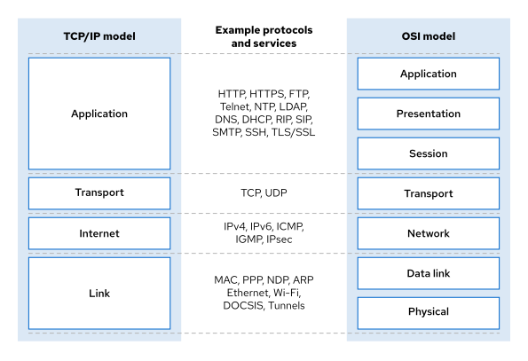
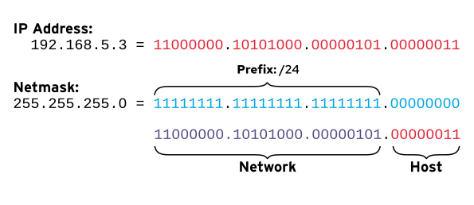
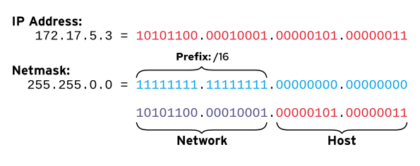
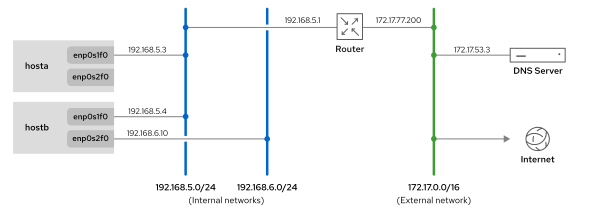
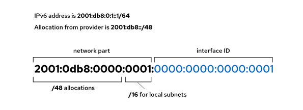

Quản trị hệ thống Red Hat I
---------------------------

# Chương 17. Giới thiệu về Mạng máy tính

## Khái niệm mạng
### Mục tiêu
Mô tả các khái niệm cơ bản về địa chỉ mạng và định tuyến cho máy chủ.

### Mô hình mạng TCP/IP
Mô hình mạng TCP/IP là một tập hợp các giao thức truyền thông bốn lớp mô tả cách thức dữ liệu được đóng gói, định địa chỉ, truyền tải,
định tuyến và nhận giữa các máy tính trên mạng. Giao thức này được quy định bởi [RFC 1122: Yêu cầu đối với các máy chủ Internet -
Các lớp truyền thông](https://datatracker.ietf.org/doc/html/rfc1122).

Bốn lớp của mô hình mạng TCP/IP là: lớp ứng dụng, lớp vận chuyển, lớp internet và lớp liên kết.
**Application**  
Mỗi ứng dụng đều có các thông số kỹ thuật riêng cho việc giao tiếp để máy khách và máy chủ có thể liên lạc với nhau
trên các nền tảng khác nhau. Các giao thức phổ biến bao gồm SSH (truy cập từ xa), HTTPS (web an toàn), FTP (chia sẻ tệp) và SMTP
(gửi thư điện tử).

**Transport**  
Giao thức điều khiển truyền dẫn (TCP) và giao thức dữ liệu người dùng (UDP) là các giao thức cơ bản ở lớp vận chuyển. TCP cung cấp
phương thức truyền thông đáng tin cậy, hướng kết nối, đảm bảo việc truyền tải và thứ tự dữ liệu. Ngược lại, UDP là một giao thức dữ
liệu không hướng kết nối, cung cấp tốc độ truyền thông nhanh hơn nhưng độ tin cậy thấp hơn.

Các giao thức ứng dụng, chẳng hạn như HTTP hoặc DNS, sử dụng các cổng TCP hoặc UDP cụ thể để giao tiếp. Danh sách đầy đủ các cổng đã
đăng ký và được biết đến này có thể được tìm thấy trong tệp /etc/services. Khi dữ liệu được gửi qua mạng, sự kết hợp giữa địa chỉ IP và
cổng dịch vụ tạo thành một socket. Mỗi gói mạng bao gồm cả socket nguồn (xác định người gửi) và socket đích (xác định người nhận). Do
đó, việc xác định thông tin socket mạng là rất cần thiết để giám sát và lọc lưu lượng hiệu quả.

**Internet**  
Lớp internet, còn được gọi là lớp mạng, chịu trách nhiệm truyền các gói dữ liệu từ máy chủ nguồn đến máy chủ đích trên các mạng được
kết nối với nhau. Các giao thức chính ở lớp này bao gồm IPv4 và IPv6. Mỗi máy chủ trên mạng có một địa chỉ IP duy nhất và một tiền tố,
cùng nhau xác định địa chỉ mạng của nó (ví dụ: 192.168.3.19/24). Bộ định tuyến đóng vai trò quan trọng ở lớp này bằng cách kết nối các
mạng khác nhau và chuyển tiếp lưu lượng truy cập giữa chúng.

**Link**  
Lớp liên kết, hay lớp truy cập phương tiện, cung cấp kết nối đến các phương tiện vật lý. Các loại mạng phổ biến nhất là Ethernet có dây
(802.3) và Wi-Fi không dây (802.11). Mỗi thiết bị vật lý đều có địa chỉ Kiểm soát truy cập phương tiện (MAC), còn được gọi là địa chỉ
phần cứng, để xác định đích đến của các gói dữ liệu trên phân đoạn mạng cục bộ.

Mặc dù TCP/IP là tiêu chuẩn cho mạng máy tính, mô hình Kết nối Hệ thống Mở (OSI) vẫn là tài liệu tham khảo phổ biến trong giảng dạy do
cấu trúc chi tiết hơn của nó. Tính chi tiết này đặc biệt hữu ích cho việc nghiên cứu chuyên sâu, chẳng hạn như phân biệt các chức năng
của giao thức (ví dụ: NFS) trong lớp ứng dụng của TCP/IP. Bạn có thể thấy các tham chiếu đến "Lớp 2" cho Ethernet, "Lớp 3" cho IP hoặc
"Lớp 4" cho TCP; những con số này tương ứng trực tiếp với các lớp trong mô hình OSI.

Sơ đồ sau đây so sánh mô hình OSI bảy lớp với mô hình TCP/IP bốn lớp.

**Hình 17.1: So sánh mô hình mạng TCP/IP và OSI**  


### Đặt tên giao diện mạng
Mỗi thiết bị mạng trong hệ thống được nhận dạng và cấu hình bằng cách sử dụng tên duy nhất của nó. Trong Red Hat Enterprise Linux 7 trở
lên, hệ thống tạo ra các tên giao diện mạng nhất quán và duy trì sau khi khởi động lại. Các tên này không dựa trên thứ tự phát hiện, mà
dựa trên thông tin từ phần mềm nhúng (firmware), cấu trúc liên kết bus Peripheral Component Interconnect (PCI) và loại thiết bị mạng.

Tên giao diện mạng bắt đầu bằng loại giao diện:

* Tên giao diện Ethernet bắt đầu bằng en.
* Tên giao diện WLAN bắt đầu bằng wl.
* Tên giao diện WWAN bắt đầu bằng ww.

Phần còn lại của tên giao diện dựa trên thông tin từ phần mềm điều khiển của máy chủ, hoặc được xác định bởi vị trí của thiết bị trong
cấu trúc liên kết PCI.

* `oN` biểu thị một thiết bị tích hợp có chỉ số duy nhất N từ firmware của máy chủ. Tên `eno1` là thiết bị Ethernet tích hợp số 1.
* `sN` biểu thị một thiết bị trong khe cắm nóng PCI `N`. Ví dụ, `ens3` là một card Ethernet trong khe cắm nóng PCI số 3.
* `pMsN` biểu thị một thiết bị PCI trên bus `M` trong khe cắm `N`. Ví dụ, `enp2s3`.

Giao diện `wlp4s0` là một card WLAN trên bus PCI 4 ở khe cắm 0. Nếu card là thiết bị đa chức năng (chẳng hạn như card Ethernet có nhiều
cổng, hoặc thiết bị có cả chức năng Ethernet và một chức năng khác), thì bạn có thể thấy fN trong tên thiết bị. Giao diện `enp0s1f0` là
chức năng 0 của card Ethernet trên bus 0 ở khe cắm 1. Giao diện card thứ hai sẽ được đặt tên là `enp0s1f1`, là chức năng 1 của cùng
thiết bị đó.

Với việc đặt tên cố định, bạn có thể yên tâm rằng tên giao diện mạng của mình sẽ giữ nguyên trên hệ thống, ngay cả sau khi bạn thêm
hoặc bớt phần cứng. Tên của thiết bị được tạo dựa trên thông tin phần cứng duy nhất, thay vì quay trở lại quy ước đặt tên `eth0` kém dự
đoán hơn.

> **Lưu ý**: Các phiên bản trước của Red Hat Enterprise Linux sử dụng các tên như `eth0`, `eth1` và `eth2` cho mỗi giao diện mạng.
Tên giao diện `eth0` là cổng mạng đầu tiên được phát hiện, `eth1` là giao diện thứ hai, v.v. Tuy nhiên, khi các thiết bị được thêm vào
và loại bỏ, cơ chế đặt tên cho các thiết bị có thể thay đổi giao diện nào được gán cho tên nào. Hơn nữa, tiêu chuẩn Peripheral
Component Interconnect Express (PCIe) không đảm bảo thứ tự phát hiện các thiết bị PCIe khi khởi động, điều này có thể làm thay đổi tên
thiết bị một cách bất ngờ do các biến thể trong quá trình khởi động thiết bị hoặc hệ thống.

### Mạng IPv4
Quản trị viên hệ thống cần có hiểu biết cơ bản về mạng IPv4 để quản lý mạng trên máy chủ. Mặc dù IPv6 đã vượt qua IPv4 về mức độ sử
dụng trong mạng di động, IPv4 vẫn là sơ đồ địa chỉ phổ biến nhất trong mạng doanh nghiệp.

#### Địa chỉ IPv4
Địa chỉ IPv4 là một số 32 bit, được biểu diễn dưới dạng bốn octet 8 bit ở định dạng thập phân, có giá trị từ 0 đến 255, được phân tách
bởi dấu chấm đơn. Địa chỉ này được chia thành hai phần: tiền tố mạng và định danh máy chủ. Tiền tố mạng xác định một mạng con vật lý
hoặc ảo duy nhất. Định danh máy chủ đại diện cho một máy chủ cụ thể trên mạng con đó. Tất cả các máy chủ trên cùng một mạng con đều có
cùng tiền tố mạng và có thể giao tiếp trực tiếp với nhau mà không cần bộ định tuyến. Cổng mạng kết nối các mạng khác nhau, và bộ định
tuyến mạng thường hoạt động như cổng cho một mạng con.

> **Lưu ý**: Mạng IP thường được chia thành nhiều phân đoạn mạng nhỏ hơn. Nói chung, phân đoạn (segment) đề cập đến lớp liên kết vật lý
hoặc ảo, trong khi mạng con (subnet) đề cập đến sơ đồ địa chỉ IP logic được áp dụng cho phân đoạn đó. Chia mạng con là một kỹ thuật để
chia nhỏ vùng mạng lớn thành các phân đoạn nhỏ hơn.

Mặt nạ mạng (netmask) là một mặt nạ nhị phân có độ dài cho biết có bao nhiêu bit thuộc về tiền tố mạng xác định mạng con. Vì địa chỉ
IPv4 luôn dài 32 bit, nên mạng con có mặt nạ mạng dài hơn sẽ có ít bit hơn để xác định máy chủ, điều đó có nghĩa là sẽ có ít máy chủ
hơn. Mạng con có mặt nạ mạng ngắn hơn sẽ có nhiều bit hơn để xác định máy chủ, điều đó có nghĩa là sẽ có nhiều máy chủ hơn trong mạng
con.

Mặt nạ mạng được biểu diễn theo một trong hai dạng, cả hai đều được sử dụng thường xuyên. Dạng đầu tiên, ký hiệu CIDR, thêm dấu gạch
chéo (`/`) và một số nguyên lên đến 32 cho biết số bit trong mặt nạ nhị phân. Ký hiệu thứ hai hiển thị số bit trong mặt nạ nhị phân
dưới dạng bốn byte 8 bit ở định dạng thập phân.

#### Mạng con IPv4
Số lượng địa chỉ máy chủ khả dụng trong một mạng con phụ thuộc vào kích thước tiền tố mạng. Ví dụ, tiền tố mạng /24 để lại 8 bit,
hoặc 255 địa chỉ máy chủ khả dụng trong mạng con. Tiền tố mạng /16 để lại 16 bit, hoặc 65536 địa chỉ máy chủ khả dụng trong mạng con.

* Địa chỉ mạng của một mạng con là địa chỉ thấp nhất có thể trên mạng con đó, trong đó mã định danh máy chủ là toàn bộ các bit nhị
phân 0.
* Địa chỉ quảng bá của một mạng con là địa chỉ cao nhất có thể trên mạng con đó, trong đó mã định danh máy chủ là toàn bộ các bit nhị
phân 1, và là một địa chỉ đặc biệt để quảng bá các gói tin đến tất cả các máy chủ trong mạng con.
* Địa chỉ cổng mặc định của một mạng con có thể là bất kỳ mã định danh máy chủ duy nhất nào trong mạng con, nhưng thường được đặt là
địa chỉ máy chủ khả dụng đầu tiên. Quy ước đánh số cổng mặc định này không bắt buộc, và các mạng con không cần giao tiếp bên ngoài sẽ
không thiết lập cổng mạng.

Các hình minh họa sau đây cho thấy cách sử dụng mặt nạ mạng để xác định phần mạng và phần máy chủ của địa chỉ IP. Một phép toán AND
bitwise được thực hiện cho mỗi bit nhị phân trong địa chỉ IP và mặt nạ mạng tương ứng. Nếu cả hai bit ở vị trí so sánh đều là 1, kết
quả là 1; ngược lại, kết quả là 0.

**Hình 17.2: Tính toán mặt nạ mạng IPv4 cho một mạng nhỏ**  


**Hình 17.3: Tính toán mặt nạ mạng IPv4 cho một mạng lớn hơn**  


#### Ví dụ về tính toán mạng
Trong ví dụ sau, trước tiên hãy xác định mặt nạ mạng (netmask), sau đó thực hiện các phép tính nhị phân. Mặt nạ mạng /24 có nghĩa là
24 bit đầu tiên của địa chỉ xác định địa chỉ mạng (`192.168.1.0`). Trong trường hợp này, có 8 bit, hay 254 địa chỉ, khả dụng cho việc
gán địa chỉ cho máy chủ.

**Bảng 17.1. Địa chỉ IPv4 của 192.168.1.107/24**

| Thành phần       | Ký hiệu thập phân           | Ký hiệu nhị phân                                                          |
|------------------|-----------------------------|---------------------------------------------------------------------------|
| Địa chỉ máy chủ  | 192.168.1.107               | 11000000.10101000.00000001.01101011                                       |
| Mặt nạ mạng      | /24 hoặc 255.255.255.0      | 11111111.11111111.11111111.00000000                                       |
| Địa chỉ mạng     | 192.168.1.0                 | 11000000.10101000.00000001.00000000                                       |
| Phạm vi máy chủ  | 192.168.1.1 - 192.168.1.254 | 11000000.10101000.00000001.00000001 - 11000000.10101000.00000001.11111110 |
| Địa chỉ quảng bá | 192.168.1.255               | 11000000.10101000.00000001.11111111                                       |

Trong ví dụ sau, mặt nạ mạng /19 là một tiền tố mạng hợp lệ chỉ sử dụng một phần của octet. Mặt nạ mạng có độ dài thay đổi cho phép
tạo ra các mạng con với số lượng máy chủ chính xác hơn so với mặt nạ mạng sử dụng toàn bộ octet. Với 19 bit được phân bổ cho mạng, 13
bit còn lại cung cấp 8.190 địa chỉ có thể sử dụng cho từng máy chủ riêng lẻ trong mạng đó.

**Bảng 17.2. Địa chỉ IPv4 của 172.16.181.23/19**

| Thành phần       | Ký hiệu thập phân             | Ký hiệu nhị phân                                                          |
|------------------|-------------------------------|---------------------------------------------------------------------------|
| Địa chỉ máy chủ  | 172.16.181.23                 | 10101100.00010000.10110101.00010111                                       |
| Mặt nạ mạng      | /19 hoặc 255.255.224.0        | 11111111.11111111.11100000.00000000                                       |
| Địa chỉ mạng     | 172.16.160.0                  | 10101100.00010000.10100000.00000000                                       |
| Phạm vi máy chủ  | 172.16.160.1 - 172.16.191.254 | 10101100.00010000.10100000.00000001 - 10101100.00010000.10111111.11111110 |
| Địa chỉ quảng bá | 172.16.191.255                | 10101100.00010000.10111111.11111111                                       |

Trong ví dụ sau, mặt nạ mạng /8 biểu thị một mạng lớn. Chỉ có octet đầu tiên được sử dụng cho tiền tố mạng (10.0.0.0). 24 bit còn lại,
tương ứng với 16.777.214 địa chỉ, được sử dụng cho việc gán địa chỉ cho máy chủ. Địa chỉ broadcast 10.255.255.255 là địa chỉ cuối cùng
của mạng.

**Bảng 17.3. Địa chỉ IPv4 của 10.1.1.18/8**

| Thành phần       | Ký hiệu thập phân         | Ký hiệu nhị phân                                                          |
|------------------|---------------------------|---------------------------------------------------------------------------|
| Địa chỉ máy chủ  | 10.1.1.18                 | 00001010.00000001.00000001.00010010                                       |
| Mặt nạ mạng      | /8 hoặc 255.0.0.0         | 11111111.00000000.00000000.00000000                                       |
| Địa chỉ mạng     | 10.0.0.0                  | 00001010.00000000.00000000.00000000                                       |
| Phạm vi máy chủ  | 10.0.0.1 - 10.255.255.254 | 00001010.00000000.00000000.00000001 - 00001010.11111111.11111111.11111110 |
| Địa chỉ quảng bá | 10.255.255.255            | 00001010.11111111.11111111.11111111                                       |

Việc thực hiện các phép tính nhị phân thủ công mỗi khi cấu hình giao diện mạng rất tốn thời gian và dễ xảy ra lỗi. Red Hat Enterprise
Linux tích hợp công cụ dòng lệnh ipcalc trong kho lưu trữ BaseOS để hỗ trợ các tác vụ chia mạng con.

```
user@host:~$ ipcalc 10.1.1.18/8
Address:	10.1.1.18
Network:	10.0.0.0/8
Netmask:	255.0.0.0 = 8
Broadcast:	10.255.255.255

Address space:	Private Use
HostMin:	10.0.0.1
HostMax:	10.255.255.254
Hosts/Net:	16777214
```

#### Định tuyến IPv4
Các gói mạng di chuyển từ máy chủ này sang máy chủ khác trên một mạng con và thông qua các bộ định tuyến từ mạng này sang mạng khác.
Mỗi máy chủ sử dụng một bảng định tuyến để xác định giao diện mạng nào sẽ được sử dụng để gửi gói tin đến các mạng cụ thể.

Một mục trong bảng định tuyến liệt kê mạng đích, giao diện mạng cần sử dụng và địa chỉ IP của bộ định tuyến sẽ chuyển tiếp gói tin đến
đích cuối cùng. Máy chủ sử dụng mục trong bảng định tuyến khớp với tiền tố mạng của địa chỉ đích để định tuyến gói tin.

Nếu có nhiều mục hợp lệ cho địa chỉ đích, thì máy chủ sẽ sử dụng mục có tiền tố dài hơn. Nếu mạng đích không khớp với mục cụ thể hơn,
thì máy chủ sẽ định tuyến gói tin đến cổng mặc định được chỉ định bởi mục 0.0.0.0/0 trong bảng định tuyến của nó. Tuyến đường mặc định
này phải trỏ đến một bộ định tuyến trên một mạng con cục bộ mà máy chủ có thể truy cập được.

Các mạng được kết nối với nhau bằng các bộ định tuyến, là các thiết bị chuyên dụng được trang bị ít nhất hai giao diện. Nếu bộ định
tuyến nhận được các gói tin không được gửi đến chính nó, thì bộ định tuyến sẽ tham khảo bảng định tuyến của nó để xác định nơi chuyển
tiếp các gói tin. Quyết định chuyển tiếp này có thể bao gồm việc gửi gói tin trực tiếp đến máy chủ đích nếu máy chủ đó nằm trên mạng
con được kết nối trực tiếp với bộ định tuyến, hoặc nó có thể chuyển tiếp gói tin đến một bộ định tuyến khác. Quá trình chuyển tiếp gói
tin lặp đi lặp lại qua nhiều bộ định tuyến này tiếp tục cho đến khi gói tin đến được mạng và máy chủ đích dự định.

Ví dụ, hãy xem xét sơ đồ mạng và bảng định tuyến máy chủ sau:

**Hình 17.4: Ví dụ về cấu trúc mạng (topology)**  


**Bảng 17.4. Ví dụ bảng định tuyến cho máy chủ b**
| Đích                | Giao diện mạng | Bộ định tuyến (nếu cần) |
|---------------------|----------------|-------------------------|
| 192.168.5.0/24      | enp0s1f0       |                         |
| 192.168.6.0/24      | enp0s2f0       |                         |
| 0.0.0.0/0 (default) | enp0s1f0       | 192.168.5.1             |

* Lưu lượng mạng từ máy chủ hostb đến bất kỳ máy chủ nào trong mạng `192.168.6.0/24` đều được truyền trực tiếp qua giao diện enp0s2f0.
    * Lý do của quyết định chuyển tiếp này là vì máy chủ hostb có giao diện được kết nối với mạng đó, do đó không cần bộ định tuyến để
    đến được đích.
* Lưu lượng mạng có đích đến không khớp với bất kỳ mục nào trong bảng định tuyến sẽ được gửi đến tuyến mặc định. Tuyến mặc định, được
chỉ định là 0.0.0.0/0, được hiển thị trong mục thứ ba trong bảng.
    * Ví dụ, tất cả lưu lượng từ máy chủ hostb đến máy chủ DNS có địa chỉ IP `172.17.53.3` được chuyển tiếp đến bộ định tuyến có địa
    chỉ 192.168.5.1, có thể truy cập được qua giao diện `enp0s1f0`. Bộ định tuyến có thể chuyển tiếp gói tin trực tiếp đến đích của nó.

#### Cấu hình địa chỉ IPv4
Máy chủ có thể tự động cấu hình cài đặt mạng IPv4 bằng cách tương tác với máy chủ Giao thức Cấu hình Máy chủ Động (DHCP). Máy khách DHCP phát đi yêu cầu tìm kiếm trên phân đoạn mạng cục bộ của nó để định vị máy chủ DHCP khả dụng. Sau khi nhận được đề nghị từ máy chủ
DHCP, máy khách yêu cầu và được cấp một địa chỉ IPv4 duy nhất, cùng với các tham số mạng khác như mặt nạ mạng con, cổng mặc định và
địa chỉ máy chủ DNS. Việc cấp phát này có hiệu lực trong một khoảng thời gian thuê xác định. Máy khách phải định kỳ yêu cầu gia hạn
thuê để duy trì việc sử dụng liên tục cấu hình mạng đã được cấp.

Ngoài ra, bạn có thể cấu hình máy chủ để sử dụng cấu hình mạng tĩnh. Cài đặt mạng tĩnh được đọc từ các tệp cấu hình cục bộ. Các cài
đặt bạn sử dụng phải phù hợp với mạng con của bạn. Hãy phối hợp với quản trị viên mạng của bạn để tránh xung đột với các máy chủ khác
trong cùng mạng con.

### Mạng IPv6
IPv6 được triển khai rộng rãi trong cả mạng doanh nghiệp và truyền thông di động. Nhiều nhà cung cấp dịch vụ Internet (ISP) sử dụng
IPv6 rộng rãi cho cơ sở hạ tầng nội bộ cốt lõi của họ và để gán địa chỉ động cho các thiết bị của khách hàng. Được thiết kế để khắc
phục tình trạng cạn kiệt địa chỉ của IPv4, IPv6 làm tăng đáng kể số lượng địa chỉ thiết bị duy nhất có sẵn trên toàn cầu.

IPv6 cũng có thể được sử dụng song song với IPv4 ở chế độ kép. Một giao diện mạng có thể có cả địa chỉ IPv6 và IPv4. Red Hat
Enterprise Linux hoạt động ở chế độ kép theo mặc định.

#### Địa chỉ IPv6
Địa chỉ IPv6 là một số 128 bit, thường được biểu diễn dưới dạng tám nhóm bốn chữ số thập lục phân được phân tách bằng dấu hai chấm.
Mỗi chữ số thập lục phân (một nibble) đại diện cho bốn bit, có nghĩa là một quartet đại diện cho 16 bit của địa chỉ IPv6.

```
2001:0db8:0000:0010:0000:0000:0000:0001
```

Để thuận tiện khi viết địa chỉ IPv6, bất kỳ số 0 nào đứng đầu trong một nhóm bốn ký tự được phân tách bằng dấu hai chấm đều có thể
được bỏ qua. Tuy nhiên, mỗi nhóm bốn ký tự phải giữ lại ít nhất một chữ số thập lục phân.

```
2001:db8:0:10:0:0:0:1
```

Để đơn giản hóa hơn nữa địa chỉ IPv6, một hoặc nhiều nhóm 0000 liên tiếp có thể được thay thế bằng dấu hai chấm kép (::). Dấu hai chấm
kép này chỉ có thể xuất hiện một lần trong địa chỉ để tránh gây nhầm lẫn.

```
2001:db8:0:10::1
```

Mặc dù 2001:0db8:0:0010:0:0000:0:1 cũng là một địa chỉ IPv6 hợp lệ, nhưng cách viết của nó khiến nó kém thực tế và khó đọc hơn.

Hãy làm theo những lời khuyên sau để viết các địa chỉ dễ đọc một cách nhất quán:

* Xóa bất kỳ số 0 nào đứng đầu trong một nhóm. Ví dụ, 0010 trở thành 10, và 0000 trở thành 0.
* Sử dụng dấu hai chấm kép (::) để rút ngắn địa chỉ càng nhiều càng tốt.
* Nếu một địa chỉ chứa hai nhóm số 0 liên tiếp có độ dài bằng nhau, thì hãy rút ngắn nhóm số 0 bên trái nhất thành :: và nhóm số 0 bên
phải nhất thành :0: cho mỗi nhóm.
* Mặc dù được phép, nhưng không sử dụng :: để rút ngắn một nhóm số 0 đơn lẻ. Thay vào đó, hãy sử dụng :0:, và dành :: cho các nhóm số
0 liên tiếp.
* Luôn sử dụng chữ cái viết thường (a đến f) cho các chữ số thập lục phân.

> **Quan trọng**: Khi thêm cổng mạng TCP hoặc UDP sau địa chỉ IPv6, hãy luôn đặt địa chỉ IPv6 trong dấu ngoặc vuông để cổng không bị
coi là một phần của địa chỉ. `[2001:db8:0:10::1]:80`

#### Mạng con IPv6
Địa chỉ unicast IPv6 tiêu chuẩn được chia thành hai phần: tiền tố mạng và ID giao diện. Tiền tố mạng xác định mạng con. ID giao diện
xác định một giao diện cụ thể trên mạng con. Hai giao diện mạng trên cùng một mạng con không thể có cùng ID giao diện.

Không giống như IPv4, IPv6 sử dụng mặt nạ mạng con tiêu chuẩn: hầu hết các địa chỉ unicast điển hình sử dụng độ dài tiền tố /64. Điều
này có nghĩa là một nửa địa chỉ 128 bit đại diện cho tiền tố mạng và nửa còn lại là ID giao diện. Với 64 bit dành cho việc xác định
máy chủ, về mặt lý thuyết, một mạng con IPv6 có thể chứa một số lượng thiết bị khổng lồ (lên đến 2^64 máy chủ).

Thông thường, nhà cung cấp dịch vụ Internet (ISP) sẽ phân bổ một tiền tố mạng ngắn hơn cho một tổ chức, thường là /48. Tiền tố của tổ
chức này để lại các bit còn lại trong phần mạng cho tổ chức đó để xác định các mạng con của riêng mình. Ví dụ, với phân bổ /48, có 16
bit khả dụng cho việc chia mạng con (64-48=16), cho phép tạo ra 2^16 hoặc 65.536 mạng con khác nhau trong khối được phân bổ đó.

**Hình 17.5: Các phần của địa chỉ IPv6 và phân chia mạng con**  


Một số địa chỉ có ý nghĩa đặc biệt trong IPv6. Bảng sau liệt kê các địa chỉ đặc biệt và các tiền tố IPv6 thông dụng này.

**Bảng 17.5. Các địa chỉ và mạng IPv6 thông dụng**

| Địa chỉhoặc mạng IPv6 | Mục đích                             | Mô tả                                                                                                                                                                                                                                                                                                                                                                                                                                                                     |
|-----------------------|--------------------------------------|---------------------------------------------------------------------------------------------------------------------------------------------------------------------------------------------------------------------------------------------------------------------------------------------------------------------------------------------------------------------------------------------------------------------------------------------------------------------------|
| ::1/128               | localhost                            | Địa chỉ IPv6 tương đương với địa chỉ 127.0.0.1/8, được thiết lập trên giao diện loopback.                                                                                                                                                                                                                                                                                                                                                                                 |
| ::                    | Địa chỉ không xác định               | Địa chỉ IPv6 tương đương với 0.0.0.0. Đối với một dịch vụ mạng, nó có thể cho biết dịch vụ đó đang lắng nghe trên tất cả các địa chỉ IP đã được cấu hình.                                                                                                                                                                                                                                                                                                                 |
| ::/0                  | Tuyến đường mặc định (internet IPv6) | Địa chỉ IPv6 tương đương với địa chỉ 0.0.0.0/0. Tuyến đường mặc định trong bảng định tuyến khớp với mạng này; bộ định tuyến của mạng này là nơi tất cả lưu lượng truy cập được gửi đến nếu không có tuyến đường tốt hơn.                                                                                                                                                                                                                                                  |
| 2000::/3              | Địa chỉ unicast toàn cầu             | Cơ quan quản lý số hiệu Internet (IANA) hiện đang phân bổ các địa chỉ IPv6 công cộng, có thể định tuyến từ không gian này. Các địa chỉ bao gồm tất cả các mạng có dải địa chỉ từ 2000::/16 đến 3fff::/16.                                                                                                                                                                                                                                                                 |
| fd00::/8              | Địa chỉ cục bộ duy nhất (RFC 4193)   | IPv6 không có sự tương đương trực tiếp với không gian địa chỉ riêng RFC 1918, mặc dù phạm vi mạng này là mạng kín. Một trang web có thể sử dụng các mạng này để tự phân bổ một không gian địa chỉ IP riêng có thể định tuyến bên trong tổ chức. Tuy nhiên, các mạng này không thể được sử dụng trên internet toàn cầu. Trang web phải chọn ngẫu nhiên một dải /48 từ không gian này, nhưng nó có thể chia dải địa chỉ đã phân bổ thành các mạng /64 một cách bình thường. |
| fe80::/10             | Địa chỉ liên kết cục bộ              | Mỗi giao diện IPv6 tự động cấu hình một địa chỉ unicast cục bộ liên kết không thể định tuyến đến các mạng công cộng.                                                                                                                                                                                                                                                                                                                                                      |
| ff00::/8              | Địa chỉ đa hướng                     | Địa chỉ IPv6 tương đương với địa chỉ 224.0.0.0/4. Multicast gửi các gói tin đến nhiều máy chủ cùng một lúc. Chức năng gửi đến nhiều máy chủ này đặc biệt quan trọng, vì IPv6 không sử dụng địa chỉ broadcast.                                                                                                                                                                                                                                                             |

> **Quan trọng**: Bảng trên liệt kê các phân bổ địa chỉ mạng được dành riêng cho các mục đích cụ thể. Các phân bổ này có thể bao gồm
nhiều mạng. Mạng IPv6 được phân bổ từ không gian địa chỉ unicast toàn cầu và unicast cục bộ liên kết, có mặt nạ mạng /64 tiêu chuẩn.

Địa chỉ liên kết cục bộ trong IPv6 là một địa chỉ không thể định tuyến mà hệ thống chỉ sử dụng để liên lạc với các hệ thống khác trên
cùng một liên kết mạng. Để đảm bảo địa chỉ IP là duy nhất, hệ thống sử dụng một phương pháp cụ thể để tính toán ID giao diện của địa
chỉ liên kết cục bộ.

> **Lưu ý**: Ban đầu, ID giao diện cho địa chỉ liên kết cục bộ IPv6 được tạo từ địa chỉ MAC của thiết bị mạng. Việc để lộ địa chỉ MAC
như một phần của địa chỉ IPv6 có thể gây ra một số vấn đề về bảo mật và quyền riêng tư, vì điều này làm cho việc xác định và theo dõi
một máy tính trên mạng trở nên khả thi. Theo mặc định, NetworkManager tạo ra một ID giao diện ngẫu nhiên nhưng ổn định cho giao diện,
theo thuật toán trong RFC 7217. Thuật toán này được điều khiển bởi cài đặt kết nối ipv6.addr-gen-mode, mặc định là stable-privacy. Các
phần mở rộng về quyền riêng tư IPv6 (RFC 4941) là một giải pháp khác cho cùng một vấn đề và được điều khiển bởi các cài đặt khác nhau,
được tắt theo mặc định.

Để hoạt động chính xác, IPv6 dựa vào địa chỉ liên kết cục bộ. Giao diện luôn giữ địa chỉ đó, bất kể bạn gán địa chỉ IPv6 có thể định
tuyến thủ công hay bằng phương pháp tự động.

Với multicast, một hệ thống có thể gửi lưu lượng truy cập đến một địa chỉ IP đặc biệt mà nhiều hệ thống khác nhận được. Multicast khác
với broadcast, vì các gói broadcast không thể định tuyến và chỉ đến được các máy chủ trong mạng con cục bộ. Ngược lại, các gói
multicast được định tuyến đến các máy chủ cụ thể đã thông báo yêu cầu cho các gói multicast được định địa chỉ duy nhất. Các gói
multicast có thể được định tuyến đến các mạng con khác, nếu tất cả các bộ định tuyến trung gian hỗ trợ chuyển tiếp yêu cầu multicast
và định tuyến.

Multicast đóng vai trò lớn hơn trong IPv6 so với IPv4, vì IPv6 không có địa chỉ broadcast. Địa chỉ IPv6 ff02::1 là một địa chỉ
multicast quan trọng được sử dụng làm địa chỉ liên kết cục bộ cho tất cả các nút và hoạt động giống như một địa chỉ broadcast. Bạn có
thể ping địa chỉ này để gửi lưu lượng truy cập đến tất cả các nút trên liên kết.

#### Cấu hình địa chỉ IPv6
IPv4 cung cấp hai phương pháp cấu hình địa chỉ trên các giao diện mạng: gán thủ công bởi quản trị viên hoặc cấu hình động thông qua
DHCP. Ngược lại, IPv6 hỗ trợ cấu hình thủ công cùng với hai phương pháp động: DHCPv6 và SLAAC (Cấu hình địa chỉ tự động không trạng
thái).

##### Cấu hình thủ công
Tương tự như IPv4, bạn có thể chọn ID giao diện cho địa chỉ IPv6 tĩnh và cấu hình chúng thủ công. Lưu ý rằng một số địa chỉ được dành
riêng và không được sử dụng. Trong IPv4, không thể sử dụng hai địa chỉ trên cùng một mạng:

* Địa chỉ thấp nhất là địa chỉ mạng.
* Địa chỉ cao nhất là địa chỉ quảng bá.

Trong IPv6, hai ID giao diện được dành riêng và không thể được sử dụng làm địa chỉ giao diện máy chủ thông thường:

* Mã định danh toàn số 0 0000:0000:0000:0000 (địa chỉ anycast của bộ định tuyến mạng con) mà tất cả các bộ định tuyến trên liên kết sử
dụng. Ví dụ, trên mạng 2001:db8::/64, địa chỉ anycast là 2001:db8::.
* Các mã định danh fdff:ffff:ffff:ff80 đến fdff:ffff:ffff:ffff.

##### Cấu hình tự động với DHCPv6
Không giống như DHCP IPv4, quá trình đàm phán thuê bao DHCPv6 hoạt động mà không sử dụng địa chỉ broadcast. Thay vào đó, một máy chủ
gửi yêu cầu DHCPv6 của nó từ địa chỉ liên kết cục bộ đến địa chỉ đa hướng đặc biệt ff02::1:2 trên cổng UDP 547. Địa chỉ ff02::1:2
này là một địa chỉ đa hướng dành riêng, có phạm vi liên kết, được chỉ định cụ thể cho tất cả các máy chủ DHCPv6 và các tác nhân
chuyển tiếp.

Khi một máy chủ DHCPv6 xử lý yêu cầu của máy khách, nó sẽ gửi phản hồi với thông tin cấu hình cần thiết đến cổng UDP 546 trên địa chỉ
liên kết cục bộ của máy khách.

Gói `kea` trong Red Hat Enterprise Linux 10 cung cấp hỗ trợ cho máy chủ DHCPv6.

##### Cấu hình tự động với SLAAC
Ngoài DHCPv6, IPv6 còn hỗ trợ một phương pháp cấu hình động khác: Cấu hình địa chỉ tự động không trạng thái (SLAAC). Để sử dụng SLAAC,
một máy chủ tự động cấu hình giao diện của nó với địa chỉ liên kết cục bộ fe80::/64 và gửi thông báo yêu cầu bộ định tuyến đến địa chỉ
đa hướng liên kết cục bộ ff02::2. Địa chỉ này được chỉ định cho tất cả các bộ định tuyến trên phân đoạn mạng cục bộ.

Một bộ định tuyến IPv6 trên liên kết cục bộ sẽ phản hồi địa chỉ liên kết cục bộ của máy chủ và cung cấp tiền tố mạng được cấu hình sẵn
của mạng con và các thông tin liên quan khác. Sau đó, máy chủ sử dụng tiền tố mạng được cung cấp này cùng với ID giao diện được tạo tự
động để tạo địa chỉ IPv6 hoàn chỉnh của nó. Để đảm bảo cài đặt mạng luôn được cập nhật, bộ định tuyến thường xuyên gửi các quảng cáo
bộ định tuyến đa hướng để cập nhật hoặc xác nhận thông tin được cung cấp.

Gói `radvd` trong RHEL cung cấp Trình nền quảng cáo bộ định tuyến, thực hiện SLAAC.

> **Quan trọng**: Một hệ thống Red Hat Enterprise Linux 10 được cấu hình cho địa chỉ IPv4 động bằng DHCP thường được cấu hình cho IPv6
động bằng cách sử dụng SLAAC. Các máy chủ có cấu hình IPv6 động có thể bất ngờ nhận thêm địa chỉ IPv6 khi một bộ định tuyến IPv6 mới
được thêm vào mạng. Một số triển khai IPv6 kết hợp SLAAC và DHCPv6. Các triển khai này sử dụng SLAAC để cung cấp thông tin địa chỉ
mạng và sử dụng DHCPv6 để cung cấp nhiều tùy chọn mạng hơn, chẳng hạn như máy chủ DNS và tên miền tìm kiếm.

### Tên máy chủ và phân giải tên
Địa chỉ IP không thân thiện với người dùng trong sinh hoạt hàng ngày; mọi người thường thích sử dụng tên máy chủ hơn là chuỗi số.
Linux cung cấp các cơ chế phân giải tên để ánh xạ các tên máy chủ này đến các địa chỉ IP tương ứng.

Một phương pháp đơn giản để phân giải tên là tạo các mục tĩnh cho tên máy chủ trong tệp `/etc/hosts` của mỗi hệ thống. Phương pháp này
có một nhược điểm đáng kể: bạn phải tự cập nhật tệp hosts trên mỗi hệ thống.

Một giải pháp mạnh mẽ hơn để xử lý việc phân giải tên là Hệ thống Tên miền (DNS). Không giống như các tệp máy chủ tĩnh, DNS hoạt động
như một mạng lưới máy chủ phân tán, tự động ánh xạ tên máy chủ và địa chỉ IP. Để hoạt động, một máy chủ phải được cấu hình để liên hệ
với máy chủ tên, máy chủ này có thể nằm trong một mạng con khác miễn là nó có thể truy cập được qua mạng. Cài đặt máy chủ tên thường
được cung cấp thông qua DHCP hoặc bằng cách chỉ định địa chỉ tĩnh trong tệp `/etc/resolv.conf`.

## Xác thực cấu hình mạng
### Mục tiêu
Kiểm tra và đánh giá cấu hình mạng hiện tại bằng cách sử dụng các tiện ích dòng lệnh.

### Thu thập thông tin mạng
Linux cung cấp các công cụ mạnh mẽ để thu thập thông tin mạng và quản lý các thành phần. Red Hat khuyến nghị sử dụng lệnh `ip` đa năng,
lệnh này được sử dụng rộng rãi và cung cấp thông tin chi tiết toàn diện về các giao diện mạng, bao gồm số liệu thống kê, địa chỉ và
tuyến đường.

#### Xác định các thiết bị mạng
Lệnh `ip link` liệt kê tất cả các giao diện mạng khả dụng trên hệ thống của bạn. Trong ví dụ sau, máy chủ có ba giao diện mạng: `lo`,
là giao diện ảo `loopback` cho phép thiết bị giao tiếp với chính nó, và hai giao diện Ethernet, `ens3` và `ens4`.

```
user@host:~$ ip link show
1: lo: <LOOPBACK,UP,LOWER_UP> mtu 65536 qdisc noqueue state UNKNOWN ...
    link/loopback 00:00:00:00:00:00 brd 00:00:00:00:00:00
2: ens3: <BROADCAST,MULTICAST,UP,LOWER_UP> mtu 1500 qdisc fq_codel state UP ...
    link/ether 52:54:00:00:fa:0a brd ff:ff:ff:ff:ff:ff
    altname enp0s3
    altname enx52540000fa0a
3: ens4: <BROADCAST,MULTICAST,UP,LOWER_UP> mtu 8942 qdisc fq_codel state UP ...
    link/ether 52:54:00:01:fa:1e brd ff:ff:ff:ff:ff:ff
    altname enp0s4
    altname enx52540001fa1e
```

Khi cấu hình giao diện mạng, điều cần thiết là phải xác định giao diện nào kết nối với mạng nào. Địa chỉ MAC là một định danh quan
trọng cho mục đích này. Trong kết quả đầu ra lệnh trước đó, địa chỉ MAC được hiển thị ở dòng bắt đầu bằng cờ `link/ether`.

#### Hiển thị địa chỉ IP
Lệnh `ip` hiển thị cả thông tin về thiết bị và địa chỉ IP. Một giao diện mạng có thể có nhiều địa chỉ IPv4 hoặc IPv6.

```
user@host:~$ ip addr show ens3
2: ens3: <BROADCAST,MULTICAST,UP,LOWER_UP> mtu 1500 qdisc fq_codel state UP ... (1)
    link/ether 52:54:00:00:fa:0a brd ff:ff:ff:ff:ff:ff (2)
    altname enp0s3 (3)
    altname enx52540000fa0a
    inet 172.25.250.10/24 brd 172.25.250.255 scope global noprefixroute ens3 (4)
       valid_lft forever preferred_lft forever
    inet6 2001:db8:0:1:5054:ff:fe00:b/64 scope global (5)
       valid_lft forever preferred_lft forever
    inet6 fe80::5054:ff:fe00:fa0a/64 scope link noprefixroute (6)
       valid_lft forever preferred_lft forever
```

1. Trạng thái giao diện đang hoạt động được biểu thị bằng cờ UP.
2. Chuỗi `link/ether` chỉ định địa chỉ phần cứng (MAC) của thiết bị.
3. Các trường `altname` hiển thị các tên thay thế tham chiếu đến cùng một thiết bị. Trong ví dụ này, thiết bị được định nghĩa với hai
bí danh: `enp0s3` và `enx52540000fa0a`.
4. Chuỗi `inet` hiển thị địa chỉ IPv4, độ dài tiền tố mạng và phạm vi.
5. Chuỗi `inet6` hiển thị địa chỉ IPv6, độ dài tiền tố mạng và phạm vi. Phạm vi toàn cục biểu thị phạm vi không giới hạn, có nghĩa là
địa chỉ có phạm vi toàn cục có thể định tuyến trên internet.
6. Chuỗi `inet6` này cho thấy giao diện có địa chỉ IPv6 với phạm vi liên kết. Địa chỉ có phạm vi liên kết cục bộ chỉ có thể được sử
dụng để truy cập các máy chủ lân cận được kết nối với cùng một liên kết. Địa chỉ này được tạo và gán tự động cho giao diện.

#### Hiển thị số liệu thống kê hiệu năng
Ngoài việc cấu hình, lệnh `ip` còn cung cấp các số liệu thống kê hiệu suất mạng có giá trị. Các bộ đếm giao diện mạng của nó có thể
giúp phát hiện các sự cố mạng, vì chúng ghi lại các số liệu thống kê bao gồm số lượng gói tin nhận được (RX) và truyền đi (TX), lỗi
gói tin và gói tin bị mất.

```
user@host:~$ ip -s link show ens3
2: ens3: <BROADCAST,MULTICAST,UP,LOWER_UP> mtu 1500 qdisc fq_codel state UP ...
    link/ether 52:54:00:00:fa:0a brd ff:ff:ff:ff:ff:ff
    RX:  bytes packets errors dropped  missed   mcast
      10398126   75186      0       3       0       0
    TX:  bytes packets errors dropped carrier collsns
      22214542   68283      0       0       0       0
    altname enp0s3
    altname enx52540000fa0a
```

#### Xác minh kết nối giữa các máy chủ
Lệnh `ping` là một công cụ cơ bản để kiểm tra kết nối IPv4. Lệnh này sẽ chạy liên tục cho đến khi bạn nhấn tổ hợp phím `Ctrl+C`,
trừ khi bạn chỉ định các tùy chọn để giới hạn số lượng gói tin được gửi đi.

```
user@host:~$ ping -c3 192.0.2.254
PING 192.0.2.1 (192.0.2.254) 56(84) bytes of data.
64 bytes from 192.0.2.254: icmp_seq=1 ttl=64 time=4.33 ms
64 bytes from 192.0.2.254: icmp_seq=2 ttl=64 time=3.48 ms
64 bytes from 192.0.2.254: icmp_seq=3 ttl=64 time=6.83 ms

--- 192.0.2.254 ping statistics ---
3 packets transmitted, 3 received, 0% packet loss, time 2003ms
rtt min/avg/max/mdev = 3.485/4.885/6.837/1.424 ms
```

Lệnh `ping6` là lệnh tương đương với lệnh ping trong hệ thống IPv6. Nó giao tiếp qua IPv6 và yêu cầu một địa chỉ IPv6 làm đối số.

```
user@host:~$ ping6 2001:db8:0:1::1
PING 2001:db8:0:1::1(2001:db8:0:1::1) 56 data bytes
64 bytes from 2001:db8:0:1::1: icmp_seq=1 ttl=64 time=18.4 ms
64 bytes from 2001:db8:0:1::1: icmp_seq=2 ttl=64 time=0.178 ms
64 bytes from 2001:db8:0:1::1: icmp_seq=3 ttl=64 time=0.180 ms
^C
--- 2001:db8:0:1::1 ping statistics ---
3 packets transmitted, 3 received, 0% packet loss, time 2001ms
rtt min/avg/max/mdev = 0.178/6.272/18.458/8.616 ms
```

Khi ping các địa chỉ liên kết cục bộ IPv6 hoặc nhóm đaicast tất cả các nút ff02::1, bạn phải chỉ định rõ ràng giao diện mạng bằng cách
sử dụng định danh phạm vi (ví dụ: ff02::1%ens3). Nếu không làm như vậy sẽ dẫn đến mất gói tin và lệnh sẽ hiển thị cảnh báo về việc
thiếu định danh phạm vi.

```
user@host:~$ ping6 -c 1 fe80::f482:dbff:fe25:6a9f%ens4
PING fe80::f482:dbff:fe25:6a9f%ens4(fe80::f482:dbff:fe25:6a9f) 56 data bytes
64 bytes from fe80::f482:dbff:fe25:6a9f: icmp_seq=1 ttl=64 time=22.9 ms

--- fe80::f482:dbff:fe25:6a9f%ens4 ping statistics ---
1 packets transmitted, 1 received, 0% packet loss, time 0ms
rtt min/avg/max/mdev = 22.903/22.903/22.903/0.000 ms
```

Bạn cũng có thể truy cập các dịch vụ như SSH bằng cách sử dụng địa chỉ liên kết cục bộ trên mạng cục bộ.

```
user@host:~$ ssh fe80::f482:dbff:fe25:6a9f%ens4
user@fe80::f482:dbff:fe25:6a9f%ens4's password:
Last login: Thu Jun  5 15:20:10 2014 from host.example.com
[user@server ~]$
```

Lệnh `ping6 ff02::1` rất hữu ích để phát hiện các máy chủ IPv6 khác trên mạng cục bộ. Đây là một địa chỉ đa hướng phạm vi liên kết
đáng chú ý, tương ứng với tất cả các nút trên phân đoạn mạng cục bộ.

```
user@host:~$ ping6 ff02::1%ens4
PING ff02::1%ens4(ff02::1) 56 data bytes
64 bytes from fe80::78cf:7fff:fed2:f97b: icmp_seq=1 ttl=64 time=22.7 ms
64 bytes from fe80::f482:dbff:fe25:6a9f: icmp_seq=1 ttl=64 time=30.1 ms (DUP!)
64 bytes from fe80::78cf:7fff:fed2:f97b: icmp_seq=2 ttl=64 time=0.183 ms
64 bytes from fe80::f482:dbff:fe25:6a9f: icmp_seq=2 ttl=64 time=0.231 ms (DUP!)
^C
--- ff02::1%ens4 ping statistics ---
2 packets transmitted, 2 received, +2 duplicates, 0% packet loss, time 1001ms
rtt min/avg/max/mdev = 0.183/13.320/30.158/13.374 ms
```

### Khắc phục sự cố định tuyến
Việc định tuyến mạng rất phức tạp, và đôi khi lưu lượng truy cập không hoạt động như bạn mong đợi. Bạn có thể sử dụng nhiều công cụ
chẩn đoán để khắc phục sự cố liên quan đến bộ định tuyến một cách hiệu quả.

#### Hiển thị bảng định tuyến
Để xem bảng định tuyến của máy chủ, hãy sử dụng lệnh `ip route`.

```
user@host:~$ ip route
default via 192.0.2.254 dev ens3 proto static metric 1024 (1)
192.0.2.0/24 dev ens3 proto kernel scope link src 192.0.2.2 (2)
10.0.0.0/8 dev ens4 proto kernel scope link src 10.0.0.11 (3)
```

1. Tất cả các gói tin không dành cho mạng `192.0.2.0/24` hoặc `10.0.0.0/8` sẽ được gửi đến bộ định tuyến mặc định tại `192.0.2.254`,
bằng cách sử dụng giao diện `ens3`.
2. Tất cả các gói tin dành cho mạng `192.0.2.0/24` sẽ được gửi trực tiếp đến đích thông qua thiết bị `ens3`.
3. Tất cả các gói tin dành cho mạng `10.0.0.0/8` sẽ được gửi trực tiếp đến đích thông qua thiết bị `ens4`.

Để hiển thị bảng định tuyến IPv6, hãy sử dụng lệnh `ip -6 route`.

```
user@host:~$ ip -6 route
2001:db8:0:1::/64 dev ens3 proto kernel metric 101 pref medium (1)
fe80::/64 dev ens3 proto kernel metric 1024 pref medium (2)
fe80::/64 dev ens4 proto kernel metric 1024 pref medium
default via 2001:db8:0:1::ffff dev ens3 proto static metric 101 pref medium (3)
```

1. Giao diện `ens3` được kết nối với mạng `2001:db8:0:1::/64`.
2. Trên các hệ thống có nhiều giao diện mạng, mỗi giao diện có địa chỉ liên kết cục bộ đều có một tuyến đường đến mạng `fe80::/64`.
3. Tuyến đường IPv6 mặc định (`::/0`) sử dụng cổng mặc định tại `2001:db8:0:1::ffff` và có thể truy cập được thông qua thiết bị `ens3`.

#### Theo dõi lộ trình lưu lượng mạng
Để theo dõi đường dẫn mạng đến máy chủ từ xa thông qua nhiều bộ định tuyến, hãy sử dụng lệnh `traceroute` hoặc `tracepath`. Các công
cụ này rất hữu ích để xác định các sự cố với bộ định tuyến của riêng bạn hoặc các bộ định tuyến trung gian.

Cả hai lệnh đều sử dụng gói UDP để theo dõi theo mặc định; tuy nhiên, nhiều mạng chặn lưu lượng UDP và ICMP. Lệnh `traceroute` có các
tùy chọn để theo dõi đường dẫn bằng gói UDP (mặc định), ICMP (-I) hoặc TCP (-T). Hãy nhớ rằng lệnh `traceroute` thường không được cài
đặt theo mặc định.

```
user@host:~$ tracepath access.redhat.com
...output omitted...
 4:  71-32-28-145.rcmt.qwest.net                          48.853ms asymm  5
 5:  dcp-brdr-04.inet.qwest.net                          100.732ms asymm  7
 6:  206.111.0.153.ptr.us.xo.net                          96.245ms asymm  7
 7:  207.88.14.162.ptr.us.xo.net                          85.270ms asymm  8
 8:  ae1d0.cir1.atlanta6-ga.us.xo.net                     64.160ms asymm  7
 9:  216.156.108.98.ptr.us.xo.net                        108.652ms
10:  bu-ether13.atlngamq46w-bcr00.tbone.rr.com           107.286ms asymm 12
...output omitted...
```

Mỗi dòng trong kết quả của lệnh tracepath thể hiện một bộ định tuyến hoặc một chặng mà gói tin đi qua giữa nguồn và đích cuối cùng. 
Lệnh này xuất ra thông tin cho mỗi chặng khi có sẵn, bao gồm thời gian khứ hồi (round trip timing - RTT) và bất kỳ thay đổi nào về
kích thước đơn vị truyền tải tối đa (maximum transmission unit - MTU). Cờ asymmetric có nghĩa là lưu lượng truy cập đến bộ định tuyến
đó đã quay trở lại từ bộ định tuyến đó bằng các tuyến đường khác nhau (bất đối xứng). Các bộ định tuyến này dành cho lưu lượng truy
cập đi ra, không phải cho lưu lượng truy cập quay trở lại.

Các lệnh `tracepath6` và `traceroute -6` là các lệnh tương đương với `tracepath` và `traceroute` trong hệ thống IPv6.

```
user@host:~$ tracepath6 2001:db8:0:2::451
 1?: [LOCALHOST]                        0.091ms pmtu 1500
 1:  2001:db8:0:1::ba                   0.214ms
 2:  2001:db8:0:1::1                    0.512ms
 3:  2001:db8:0:2::451                  0.559ms reached
     Resume: pmtu 1500 hops 3 back 3
```

Lệnh `mtr` tương tác cung cấp một cách khác để theo dõi đường dẫn mạng đến máy chủ đích. Nó có thể chạy liên tục nếu không có tùy chọn
nào được chỉ định, hoặc hoạt động ở chế độ báo cáo khi sử dụng tùy chọn `-r`. Khi ở chế độ báo cáo, bạn phải xác định số lượng gói tin
cần gửi bằng tùy chọn `-c`.

```
user@host:~$ mtr -r -c 5 access.redhat.com
Start: 2025-05-29T22:41:52+0000
HOST: servera                     Loss%   Snt   Last   Avg  Best  Wrst StDev
  1.|-- classroom.lab.example.com  0.0%     5    0.4   0.4   0.3   0.5   0.1
  2.|-- 72.32.49.3                 0.0%     5    1.0   1.3   0.9   2.3   0.6
  3.|-- 72.32.28.27                0.0%     5    1.3   1.5   1.3   1.7   0.2
  4.|-- aggr172b-54-cored.dfw3.ra  0.0%     5    1.0   1.0   0.8   1.0   0.1
  5.|-- dcpe3-cored.dfw3.rackspac  0.0%     5    1.9   2.1   1.9   2.5   0.2
  6.|-- 10.25.1.101                0.0%     5    2.0   2.0   2.0   2.1   0.1
  7.|-- equinix-dfw2.netarch.akam  0.0%     5   15.8  15.9   6.3  27.9   9.0
...output omitted...
```

#### Khắc phục sự cố cổng và dịch vụ
Các ứng dụng sử dụng socket làm điểm cuối giao tiếp, được xác định bởi địa chỉ IP, giao thức và số cổng. Ví dụ, dịch vụ thư điện tử
Postfix có thể lắng nghe trên cổng TCP 25 và một địa chỉ IP cụ thể, tạo thành một socket. Các dịch vụ thường lắng nghe trên các cổng
chuẩn được chỉ định, trong khi các ứng dụng khách tự động chọn một cổng ngẫu nhiên, tạm thời cho các kết nối đi ra của chúng.
Tệp `/etc/services` cung cấp một thư mục chứa các tên dịch vụ quen thuộc được ánh xạ tới các cổng chuẩn được chỉ định.

Lệnh `ss`, hiển thị số liệu thống kê socket, đã thay thế công cụ `netstat` trước đó (từ gói `net-tools`), mặc dù lệnh `netstat` vẫn có
thể quen thuộc với các quản trị viên hệ thống giàu kinh nghiệm.

```
user@host:~$ ss -tan
State      Recv-Q     Send-Q      Local Address:Port         Peer Address:Port
LISTEN     0          100             127.0.0.1:25                0.0.0.0:* (1)
LISTEN     0          128               0.0.0.0:22                0.0.0.0:* (2)
LISTEN     0          4096              0.0.0.0:111               0.0.0.0:*
ESTAB      0          52          172.25.250.10:22           172.25.250.9:57560 (3)
LISTEN     0          100                 [::1]:25                   [::]:* (4)
LISTEN     0          4096                    *:9090                    *:* (5)
LISTEN     0          128                  [::]:22                   [::]:* (6)
LISTEN     0          4096                 [::]:111                  [::]:*
```

1. Dịch vụ thư SMTP lắng nghe trên cổng 25 chỉ sử dụng giao diện loopback IPv4 (127.0.0.1). Do đó, dịch vụ này không thể truy cập được
trên mạng.
2. Dịch vụ SSH đang lắng nghe trên cổng 22 bằng cách sử dụng tất cả các địa chỉ IPv4 (0.0.0.0).
3. Kết nối SSH được thiết lập này bắt nguồn từ một máy khách có địa chỉ 172.25.250.9.
4. Dịch vụ thư cũng lắng nghe trên thiết bị loopback IPv6 (::1).
5. Bảng điều khiển web RHEL đang lắng nghe trên cổng 9090. Ký tự dấu sao (`*`) đại diện cho tất cả khi tham chiếu đến các địa chỉ hoặc
cổng IPv4.
6. Daemon SSH cũng lắng nghe trên IPv6. Cú pháp dấu hai chấm kép (::) đại diện cho tất cả các giao diện IPv6.

**Bảng 17.6. Các tùy chọn cho ss và netstat**

| Tùy chọn | Mô tả                                                                                                                                                                                                                                                                                                                                                                                 |
|----------|---------------------------------------------------------------------------------------------------------------------------------------------------------------------------------------------------------------------------------------------------------------------------------------------------------------------------------------------------------------------------------------|
| -n       | Hiển thị số thay vì tên cho các giao diện và cổng.                                                                                                                                                                                                                                                                                                                                    |
| -t       | Hiển thị các socket TCP.                                                                                                                                                                                                                                                                                                                                                              |
| -u       | Hiển thị các socket UDP.                                                                                                                                                                                                                                                                                                                                                              |
| -l       | Chỉ hiển thị các socket lắng nghe.                                                                                                                                                                                                                                                                                                                                                    |
| -a       | Hiển thị tất cả các socket (đang lắng nghe và đã thiết lập).                                                                                                                                                                                                                                                                                                                          |
| -p       | Hiển thị tiến trình sử dụng socket.                                                                                                                                                                                                                                                                                                                                                   |
| -A inet  | Hiển thị các kết nối đang hoạt động (nhưng không hiển thị các socket đang lắng nghe) cho họ địa chỉ `inet`. Tức là, bỏ qua các socket miền UNIX cục bộ. Đối với lệnh `ss`, cả kết nối IPv4 và IPv6 đều được hiển thị. Đối với lệnh `netstat`, chỉ các kết nối IPv4 được hiển thị. (Lệnh `netstat -A inet6` hiển thị các kết nối IPv6, và lệnh `netstat -46` hiển thị cả IPv4 và IPv6 cùng lúc.) |

