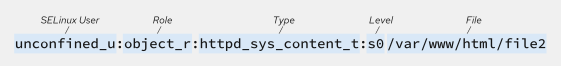
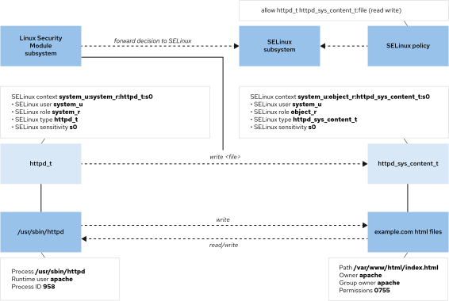
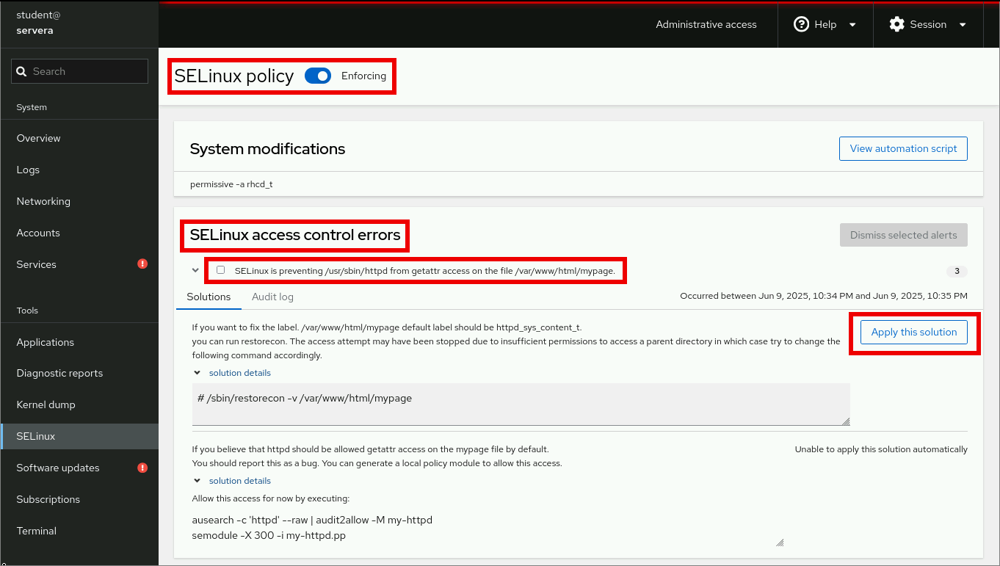

Quản trị hệ thống Red Hat 2
---------------------------

# Chương 6. Quản lý bảo mật với SELinux
## Vận hành SELinux
### Mục tiêu
Mô tả cách thức hoạt động của SELinux, đồng thời kiểm soát chế độ SELinux mặc định và chế độ hiện tại.

### Kiến trúc SELinux
Security Enhanced Linux (SELinux) là một tính năng bảo mật quan trọng của Linux. Việc truy cập vào các tệp, cổng (port) và các tài
nguyên khác được kiểm soát ở mức độ chi tiết. Các tiến trình chỉ được phép truy cập những tài nguyên mà chính sách SELinux hoặc các
thiết lập Boolean của chúng quy định.

Các quyền hạn tệp (file permissions) kiểm soát quyền truy cập tệp của một người dùng hoặc nhóm người dùng cụ thể. Tuy nhiên, các quyền
hạn này không ngăn được việc một người dùng có thẩm quyền truy cập tệp lại sử dụng tệp đó cho một mục đích không mong muốn.

Ví dụ: nếu có quyền ghi vào tệp, các trình soạn thảo hoặc chương trình khác vẫn có thể mở và sửa đổi một tệp dữ liệu có cấu trúc vốn
được thiết kế để chỉ một chương trình cụ thể được phép ghi vào. Những thao tác này có thể dẫn đến hỏng tệp hoặc gây ra vấn đề về bảo
mật dữ liệu. Quyền hạn tệp không ngăn chặn được các hành vi truy cập không mong muốn như vậy, bởi vì chúng không kiểm soát cách thức
tệp được sử dụng mà chỉ quy định ai được phép đọc, ghi hoặc thực thi tệp đó.

SELinux bao gồm các chính sách dành riêng cho từng ứng dụng do chính các nhà phát triển ứng dụng đó định nghĩa; các chính sách này xác
định những hành động và quyền truy cập nào được cho phép đối với từng tệp thực thi nhị phân, tệp cấu hình và tệp dữ liệu mà ứng dụng sử
dụng. Loại chính sách này được gọi là "chính sách có mục tiêu" (targeted policy), vì một chính sách sẽ quy định các hoạt động của một
ứng dụng cụ thể. Các chính sách này khai báo những nhãn (label) đã được định nghĩa trước và được cấu hình cho từng chương trình, tệp
tin cũng như cổng mạng riêng lẻ.

### Cách sử dụng SELinux
SELinux thực thi một tập hợp các quy tắc truy cập xác định rõ ràng những hành động được phép giữa các tiến trình và tài nguyên. Bất kỳ
hành động nào không được quy định trong quy tắc truy cập đều không được phép thực hiện. Do chỉ các hành động đã được xác định mới được
cho phép, nên ngay cả những ứng dụng có thiết kế bảo mật kém vẫn được bảo vệ khỏi các hành vi lợi dụng có ác ý. Các ứng dụng hoặc dịch
vụ có chính sách chuyên biệt (targeted policy) sẽ chạy trong một phạm vi bị giới hạn (confined domain), trong khi ứng dụng không có
chính sách sẽ chạy mà không bị giới hạn và không có sự bảo vệ nào từ SELinux. Các chính sách chuyên biệt riêng lẻ có thể được vô hiệu
hóa để hỗ trợ quá trình phát triển cũng như gỡ lỗi ứng dụng và chính sách bảo mật.

SELinux có các chế độ hoạt động sau:

* Enforcing (Thực thi): SELinux thực thi các chính sách bảo mật trên toàn bộ hệ thống. Đây là chế độ mặc định và được khuyến nghị sử
dụng trong Red Hat Enterprise Linux.
* Permissive (Cho phép): SELinux tải các chính sách và hoạt động, nhưng thay vì thực thi các quy tắc kiểm soát truy cập, nó chỉ ghi lại
các vi phạm truy cập. Chế độ này hữu ích cho việc kiểm thử và khắc phục sự cố đối với các ứng dụng và quy tắc.
* Disabled (Vô hiệu hóa): SELinux bị tắt và các vi phạm liên quan đến SELinux sẽ không bị xử lý hay ghi lại. Chế độ này cũng không thực
hiện gán nhãn ngữ cảnh bảo mật cho các tệp hoặc thư mục, gây khó khăn cho việc kích hoạt lại SELinux trong tương lai. Việc vô hiệu hóa
SELinux là điều không được khuyến khích.

> Quan trọng: RHEL không còn hỗ trợ việc thiết lập tùy chọn SELINUX=disabled trong tệp /etc/selinux/config.

### Các khái niệm về SELinux
Mục tiêu chính của SELinux là bảo vệ dữ liệu người dùng khỏi việc sử dụng sai mục đích bởi các ứng dụng hoặc dịch vụ hệ thống đã bị xâm
nhập. Hầu hết các quản trị viên Linux đều quen thuộc với mô hình bảo mật phân quyền tệp tin tiêu chuẩn dựa trên người dùng (user), nhóm
(group) và mọi người (world) — thường được gọi là Kiểm soát truy cập tùy ý (Discretionary Access Control - DAC) — vì quản trị viên có
thể thiết lập quyền truy cập tệp tin theo nhu cầu. SELinux cung cấp thêm một lớp bảo mật dựa trên đối tượng, được định nghĩa bằng các
quy tắc chi tiết. Lớp bảo mật này được gọi là Kiểm soát truy cập bắt buộc (Mandatory Access Control - MAC). Các chính sách MAC áp dụng
cho tất cả người dùng và không thể bị bỏ qua đối với những người dùng cụ thể thông qua các thiết lập cấu hình tùy ý.

Ví dụ, cổng tường lửa mở trên máy chủ web cho phép truy cập ẩn danh từ xa tới máy khách web. Tuy nhiên, một kẻ tấn công truy cập vào
cổng đó có thể cố gắng xâm nhập hệ thống thông qua một lỗ hổng bảo mật hiện có. Nếu lỗ hổng đó làm ảnh hưởng đến quyền hạn của người
dùng và nhóm `apache`, kẻ tấn công có thể truy cập trực tiếp vào nội dung thư mục gốc của tài liệu (`/var/www/html`), các thư mục hệ
thống như `/tmp` và `/var/tmp`, hoặc các tệp và thư mục khác có thể truy cập được.

Các chính sách SELinux là những quy tắc bảo mật xác định cách các tiến trình cụ thể truy cập vào các tệp, thư mục và cổng liên quan.
Mỗi thực thể tài nguyên—chẳng hạn như tệp, tiến trình, thư mục hoặc cổng—đều có một nhãn ngữ cảnh (context label) SELinux. Nhãn ngữ
cảnh này khớp với một quy tắc chính sách SELinux đã định nghĩa để cho phép tiến trình truy cập vào tài nguyên mang nhãn đó. Theo mặc
định, chính sách SELinux không cho phép bất kỳ quyền truy cập nào trừ khi có một quy tắc cụ thể cấp quyền đó. Khi không có quy tắc cho
phép nào được định nghĩa, mọi hành động truy cập đều bị từ chối.

Các nhãn SELinux bao gồm các trường: người dùng (user), vai trò (role), loại (type) và cấp độ bảo mật (security level). Chính sách
"Targeted" (chính sách mục tiêu) — được kích hoạt mặc định trên RHEL — định nghĩa các quy tắc dựa trên ngữ cảnh loại (type context).
Tên của ngữ cảnh loại thường kết thúc bằng hậu tố `_t`.

**Hình 6.1: Ngữ cảnh tệp SELinux**  


#### Các khái niệm về quy tắc truy cập chính sách
Ví dụ, một tiến trình máy chủ web được gán nhãn ngữ cảnh kiểu `httpd_t`. Các tệp và thư mục của máy chủ web nằm trong thư mục
`/var/www/html/` và các vị trí khác được gán nhãn ngữ cảnh kiểu `httpd_sys_content_t`. Các tệp tạm trong thư mục `/tmp` và
`/var/tmp` mang nhãn ngữ cảnh kiểu `tmp_t`. Các cổng của máy chủ web mang nhãn ngữ cảnh kiểu `http_port_t`.

Một tiến trình máy chủ web Apache chạy với ngữ cảnh kiểu `httpd_t`. Một quy tắc chính sách cho phép máy chủ Apache truy cập các tệp và
thư mục được gán nhãn ngữ cảnh kiểu `httpd_sys_content_t`. Theo mặc định, các tệp trong thư mục `/var/www/html` có ngữ cảnh kiểu
`httpd_sys_content_t`. Chính sách máy chủ web mặc định không có quy tắc cho phép sử dụng các tệp mang nhãn `tmp_t` (như trong thư mục
`/tmp` và `/var/tmp`), do đó việc truy cập bị từ chối. Khi SELinux được kích hoạt, một người dùng có ý đồ xấu lợi dụng tiến trình
Apache đã bị xâm nhập vẫn không thể truy cập các tệp trong thư mục `/tmp`.

Một tiến trình máy chủ MariaDB chạy với ngữ cảnh kiểu `mysqld_t`. Theo mặc định, các tệp trong thư mục `/data/mysql` có ngữ cảnh kiểu
`mysqld_db_t`. Máy chủ MariaDB có thể truy cập các tệp mang nhãn `mysqld_db_t`, nhưng không có quy tắc nào cho phép truy cập các tệp
dành cho các dịch vụ khác, chẳng hạn như các tệp mang nhãn `httpd_sys_content_t`.

**Hình 6.2: Quy trình ra quyết định của SELinux**  


Nhiều lệnh liệt kê tài nguyên sử dụng tùy chọn `-Z` để quản lý các ngữ cảnh SELinux. Ví dụ: các lệnh `ps`, `ls`, `cp` và `mkdir` đều sử
dụng tùy chọn `-Z`.

Trong ví dụ dưới đây, hãy sử dụng tùy chọn -Z của lệnh ps để xem các ngữ cảnh SELinux của các tiến trình:

```console
root@host:~# ps axZ
LABEL                          PID TTY  STAT  TIME COMMAND
system_u:system_r:init_t:s0      1 ?    Ss    0:03 /usr/lib/systemd/systemd...
system_u:system_r:kernel_t:s0    2 ?    S     0:00 [kthreadd]
system_u:system_r:kernel_t:s0    3 ?    S     0:00 [pool_workqueue_release]
system_u:system_r:kernel_t:s0    4 ?    I<    0:00 [kworker/R-rcu_gp]
system_u:system_r:kernel_t:s0    5 ?    I<    0:00 [kworker/R-sync_wq]
...output omitted...
```

Trong ví dụ sau, hãy sử dụng tùy chọn `-Z` của lệnh `ps` để xem ngữ cảnh SELinux của dịch vụ `httpd`:

```console
root@host:~# ps -ZC httpd
LABEL                               PID TTY          TIME CMD
system_u:system_r:httpd_t:s0       6780 ?        00:00:00 httpd
system_u:system_r:httpd_t:s0       6781 ?        00:00:00 httpd
system_u:system_r:httpd_t:s0       6782 ?        00:00:00 httpd
system_u:system_r:httpd_t:s0       6783 ?        00:00:00 httpd
system_u:system_r:httpd_t:s0       6789 ?        00:00:00 httpd
```

Trong ví dụ sau, hãy sử dụng lệnh `ls` với tùy chọn `-Z` để xem ngữ cảnh SELinux của thư mục `/var/www`:

```console
root@host:~# ls -Z /var/www
system_u:object_r:httpd_sys_script_exec_t:s0 cgi-bin
system_u:object_r:httpd_sys_content_t:s0 html
```

#### Thay đổi chế độ SELinux
Sử dụng lệnh `getenforce` để xem chế độ SELinux hiện tại:

```console
root@host:~# getenforce
Enforcing
```

Sử dụng lệnh `setenforce` để thay đổi chế độ SELinux:

```console
root@host:~# setenforce
usage:  setenforce [ Enforcing | Permissive | 1 | 0 ]
```

Sử dụng lệnh `setenforce` để chuyển sang chế độ `permissive`:

```console
root@host:~# setenforce 0
```

Sử dụng lệnh `getenforce` để xem chế độ SELinux hiện tại:

```console
root@host:~# getenforce
Permissive
```

Ngoài ra, bạn có thể thiết lập chế độ SELinux ngay khi khởi động hệ thống bằng tham số kernel. Hãy truyền tham số kernel `enforcing=0`
để khởi động hệ thống ở chế độ *permissive* (cho phép), hoặc truyền tham số `enforcing=1` để khởi động ở chế độ *enforcing* (thực
thi). Bạn có thể vô hiệu hóa SELinux bằng cách truyền tham số kernel `selinux=0`, hoặc kích hoạt SELinux bằng tham số `selinux=1`.

Red Hat khuyến nghị khởi động lại máy chủ khi chuyển chế độ SELinux từ *permissive* sang *enforcing*. Việc khởi động lại đảm bảo rằng
các dịch vụ vốn được khởi chạy ở chế độ *permissive* sẽ bị áp dụng các quy tắc kiểm soát (bị giới hạn quyền hạn) trong lần khởi động
tiếp theo.

#### Thiết lập chế độ SELinux mặc định
Để cấu hình SELinux một cách cố định, hãy sử dụng tệp `/etc/selinux/config`. Trong ví dụ mặc định dưới đây, cấu hình thiết lập SELinux
ở chế độ *enforcing* (thực thi). Các dòng chú thích liệt kê những giá trị hợp lệ khác, chẳng hạn như chế độ *permissive* (cho phép) và
*disabled* (vô hiệu hóa).

```ini
# This file controls the state of SELinux on the system.
# SELINUX= can take one of these three values:
#     enforcing - SELinux security policy is enforced.
#     permissive - SELinux prints warnings instead of enforcing.
#     disabled - No SELinux policy is loaded.
...output omitted...

SELINUX=enforcing
# SELINUXTYPE= can take one of these three values:
#     targeted - Targeted processes are protected,
#     minimum - Modification of targeted policy. Only selected processes are protected.
#     mls - Multi Level Security protection.
SELINUXTYPE=targeted
```

Hệ thống đọc tệp này khi khởi động và kích hoạt SELinux tương ứng. Các tham số nhân `selinux=0|1` và `enforcing=0|1` sẽ ghi đè lên cấu
hình này.

## Quản lý ngữ cảnh tệp SELinux
## Mục tiêu
Kiểm soát các ngữ cảnh tệp SELinux trong chính sách hệ thống để thay đổi ngữ cảnh của tệp dựa trên các thiết lập chính sách,
cũng như thiết lập thủ công các ngữ cảnh phi tiêu chuẩn.

### Ngữ cảnh SELinux ban đầu
Tất cả các tài nguyên như tiến trình, tệp tin và cổng (port) đều được gán nhãn ngữ cảnh SELinux. SELinux duy trì một cơ sở dữ liệu
dạng tệp chứa các chính sách gán nhãn tệp tin tại thư mục `/etc/selinux/targeted/contexts/files`. Các tệp tin mới sẽ nhận nhãn mặc
định khi tên của chúng khớp với một chính sách gán nhãn hiện có.

Khi tên của tệp tin mới không khớp với bất kỳ chính sách gán nhãn nào, tệp tin đó sẽ kế thừa nhãn của thư mục cha. Nhờ cơ chế kế thừa
nhãn, mọi tệp tin đều được gán nhãn ngay khi tạo ra, bất kể có chính sách cụ thể nào dành cho tệp tin đó hay không.

Khi tệp tin được tạo tại các vị trí mặc định đã có chính sách gán nhãn, hoặc khi có chính sách cho một vị trí tùy chỉnh, các tệp tin
mới sẽ được gán đúng ngữ cảnh SELinux. Tuy nhiên, nếu tệp tin được tạo tại một vị trí không nằm trong quy hoạch chính sách gán nhãn,
nhãn được kế thừa có thể không phù hợp với mục đích sử dụng của tệp tin mới đó.

Ngoài ra, việc sao chép tệp tin sang vị trí mới có thể làm thay đổi ngữ cảnh SELinux của tệp tin đó; ngữ cảnh mới sẽ được xác định bởi
chính sách gán nhãn tại vị trí mới hoặc thông qua cơ chế kế thừa từ thư mục cha nếu không có chính sách nào tồn tại. Ngữ cảnh SELinux
của tệp tin có thể được bảo toàn trong quá trình sao chép để giữ lại nhãn ngữ cảnh đã được xác định tại vị trí gốc. Ví dụ: lệnh `cp -p`
bảo toàn tất cả các thuộc tính tệp tin trong quá trình sao chép (nếu có thể), trong khi lệnh `cp --preserve=context` chỉ bảo toàn các
ngữ cảnh SELinux.

Lệnh `ls -Z` được sử dụng để hiển thị ngữ cảnh SELinux của một tệp tin hoặc thư mục.

> **Lưu ý**: Việc sao chép một tệp luôn tạo ra một inode cho tệp đó, và các thuộc tính của inode này—bao gồm cả ngữ cảnh SELinux—phải
> được thiết lập ngay từ đầu như đã đề cập trước đó.  
> Tuy nhiên, việc di chuyển tệp thường không tạo ra inode mới nếu thao tác diễn ra trong cùng một hệ thống tệp; thay vào đó, hệ thống
> chỉ chuyển tên tệp của inode hiện có sang một vị trí mới. Do các thuộc tính của inode hiện có không cần phải khởi tạo lại, tệp được
> di chuyển bằng lệnh `mv` sẽ giữ nguyên ngữ cảnh SELinux của nó, trừ khi bạn thiết lập ngữ cảnh mới cho tệp bằng tùy chọn `-Z`.  
> Sau khi sao chép hoặc di chuyển tệp, hãy kiểm tra để đảm bảo tệp có ngữ cảnh SELinux phù hợp và thiết lập lại cho đúng nếu cần thiết.

Ví dụ sau đây minh họa cách thức hoạt động của quy trình này.

Tạo hai tệp trong thư mục /tmp.

```console
root@host:~# touch /tmp/file1 /tmp/file2
```

Cả hai tệp đều nhận loại ngữ cảnh `user_tmp_t` nhờ cơ chế kế thừa ngữ cảnh từ thư mục cha.

```console
root@host:~# ls -Z /tmp/file*
unconfined_u:object_r:user_tmp_t:s0 /tmp/file1
unconfined_u:object_r:user_tmp_t:s0 /tmp/file2
```

Thư mục `/var/www/html` có ngữ cảnh `httpd_sys_content_t`.

```console
root@host:~# ls -Zd /var/www/html/
system_u:object_r:httpd_sys_content_t:s0 /var/www/html/
```

Di chuyển một tệp từ thư mục `/tmp` sang thư mục `/var/www/html`.

```console
root@host:~# mv /tmp/file1 /var/www/html/
```

Sao chép tệp còn lại vào cùng thư mục.

```console
root@host:~# cp /tmp/file2 /var/www/html/
```

Tệp tin được di chuyển vẫn giữ nguyên nhãn gốc, trong khi tệp tin được sao chép lại nhận nhãn của thư mục đích. Vai trò người dùng
SELinux là `unconfined_u`, vai trò SELinux là `object_r`, và mức độ nhạy cảm (ở mức thấp nhất có thể) là `s0`. Các cấu hình và tính
năng SELinux nâng cao sử dụng những giá trị này.

```console
root@host:~# ls -Z /var/www/html/file*
unconfined_u:object_r:user_tmp_t:s0 /var/www/html/file1
unconfined_u:object_r:httpd_sys_content_t:s0 /var/www/html/file2
```

### Thay đổi ngữ cảnh SELinux
Bạn có thể quản lý ngữ cảnh SELinux của các tệp tin bằng cách sử dụng các lệnh `semanage fcontext`, `restorecon` và `chcon`.

Phương pháp được khuyến nghị để thay đổi ngữ cảnh của một tệp tin là tạo chính sách ngữ cảnh tệp bằng lệnh `semanage fcontext`, sau đó
áp dụng ngữ cảnh đã chỉ định trong chính sách đó cho tệp tin bằng lệnh `restorecon`. Phương pháp này đảm bảo rằng bạn có thể gán lại
đúng ngữ cảnh cho tệp tin bằng lệnh `restorecon` bất cứ khi nào cần thiết. Ưu điểm của phương pháp này là bạn không cần phải ghi nhớ
ngữ cảnh chính xác là gì và có thể điều chỉnh ngữ cảnh cho một nhóm tệp tin cùng lúc.

Lệnh `chcon` thay đổi trực tiếp ngữ cảnh SELinux của tệp tin mà không tham chiếu đến chính sách SELinux của hệ thống. Lệnh `chcon` rất
hữu ích cho việc thử nghiệm và gỡ lỗi; tuy nhiên, việc thay đổi ngữ cảnh thủ công theo cách này chỉ mang tính tạm thời. Mặc dù các ngữ
cảnh tệp tin được thay đổi thủ công vẫn được giữ nguyên sau khi khởi động lại hệ thống, chúng có thể bị thay thế nếu bạn chạy lệnh 
restorecon` để gán lại nhãn cho nội dung của hệ thống tệp.

> **Quan trọng**: Khi hệ thống SELinux thực hiện gán lại nhãn (relabel), tất cả các tệp tin trên hệ thống sẽ được gán nhãn theo các
giá trị mặc định trong chính sách. Khi bạn sử dụng lệnh `restorecon` trên một tệp tin, bất kỳ ngữ cảnh nào mà bạn đã thay đổi thủ công
cho tệp tin đó sẽ bị thay thế nếu nó không khớp với các quy tắc trong chính sách SELinux.

Ví dụ sau đây tạo một thư mục với ngữ cảnh SELinux là `default_t`, được kế thừa từ thư mục cha `/`.

Tạo thư mục `/virtual`

```console
root@host:~# mkdir /virtual
```

Xem ngữ cảnh tệp của thư mục /virtual.

```console
root@host:~# ls -Zd /virtual
unconfined_u:object_r:default_t:s0 /virtual
```

Lệnh `chcon` thiết lập ngữ cảnh tệp của thư mục `/virtual` thành kiểu `httpd_sys_content_t`.

```console
root@host:~# chcon -t httpd_sys_content_t /virtual
```

Xem ngữ cảnh tệp đã cập nhật của thư mục `/virtual`.

```console
root@host:~# ls -Zd /virtual
unconfined_u:object_r:httpd_sys_content_t:s0 /virtual
```

Lệnh `restorecon` đặt lại ngữ cảnh về giá trị mặc định là `default_t`. Hãy chú ý đến thông báo "Relabeled".

```console
root@host:~# restorecon -v /virtual
Relabeled /virtual from unconfined_u:object_r:httpd_sys_content_t:s0 to unconfined_u:object_r:default_t:s0
```

Xem ngữ cảnh tệp đã cập nhật của thư mục `/virtual`.

```console
root@host:~# ls -Zd /virtual
unconfined_u:object_r:default_t:s0 /virtual
```

### Định nghĩa các chính sách ngữ cảnh tệp mặc định của SELinux
Lệnh `semanage fcontext` cho phép hiển thị và sửa đổi các chính sách quy định ngữ cảnh tệp tin mặc định. Bạn có thể liệt kê tất cả các
quy tắc chính sách về ngữ cảnh tệp tin bằng cách chạy lệnh `semanage fcontext -l`. Các quy tắc này sử dụng cú pháp biểu thức chính quy
mở rộng để xác định đường dẫn và tên tệp tin.

Khi xem các chính sách, biểu thức chính quy mở rộng phổ biến nhất là `(/.*)?`, thường được thêm vào sau tên thư mục. Ký hiệu này được
gọi một cách hài hước là "cướp biển" (pirate), vì trông nó giống một khuôn mặt có miếng che mắt và một bàn tay dạng móc câu đặt bên
cạnh.

Cú pháp này được mô tả là "một chuỗi ký tự bắt đầu bằng dấu gạch chéo (/) theo sau là bất kỳ số lượng ký tự nào, trong đó chuỗi này có
thể tồn tại hoặc không". Biểu thức này khớp với chính thư mục đó (ngay cả khi thư mục trống) và cũng khớp với hầu hết mọi tên tệp tin
được tạo bên trong thư mục đó.

Ví dụ: quy tắc sau đây quy định rằng thư mục `/var/www/cgi-bin` cùng mọi tệp tin nằm trong đó hoặc trong các thư mục con của nó (và
các thư mục con của các thư mục con đó, v.v.) sẽ mang ngữ cảnh SELinux là `system_u:object_r:httpd_sys_script_exec_t:s0`, trừ khi có
một quy tắc cụ thể hơn ghi đè lên quy tắc này.

```
/var/www/cgi-bin(/.*)?  all files  system_u:object_r:httpd_sys_script_exec_t:s0
```

> **Lưu ý**: Tùy chọn `all files` trong ví dụ trước là loại tệp mặc định mà lệnh `semanage` sử dụng khi bạn không chỉ định loại tệp cụ
> thể.  
> Tùy chọn này áp dụng cho tất cả các loại tệp có thể dùng với lệnh `semanage`; chúng tương ứng với các loại tệp tiêu chuẩn đã được đề
> cập trong bài học "Kiểm soát quyền truy cập tệp" (RH0020L).  
> Bạn có thể tìm hiểu thêm thông tin trong trang hướng dẫn (man page) `semanage-fcontext(8)`.

#### Các thao tác cơ bản với ngữ cảnh tệp tin
Bảng dưới đây cung cấp thông tin tham khảo về các tùy chọn của lệnh `semanage fcontext` dùng để thêm, xóa hoặc liệt kê các chính sách
ngữ cảnh tệp tin SELinux:

**Bảng 6.1. Lệnh semanage fcontext**

| Tùy chọn     | Mô tả                                                 |
|--------------|-------------------------------------------------------|
| -a, --add    | Thêm một bản ghi cho loại đối tượng được chỉ định.    |
| -d, --delete | Xóa một bản ghi thuộc loại đối tượng được chỉ định.   |
| -l, --list   | Liệt kê các bản ghi của loại đối tượng được chỉ định. |

Để quản lý các ngữ cảnh SELinux, hãy cài đặt các gói `policycoreutils` và `policycoreutils-python-utils`; các gói này chứa các lệnh
`restorecon` và `semanage`.

Để đặt lại ngữ cảnh chính sách mặc định cho tất cả các tệp trong một thư mục, trước tiên hãy sử dụng lệnh `semanage fcontext -l` để
xác định vị trí và kiểm tra xem chính sách phù hợp với ngữ cảnh tệp mong muốn có tồn tại hay không. Sau đó, sử dụng lệnh `restorecon`
với tên thư mục có chứa ký tự đại diện (wildcard) để đặt lại tất cả các tệp theo cơ chế đệ quy.

Trong ví dụ dưới đây, hãy quan sát các ngữ cảnh tệp trước và sau khi sử dụng các lệnh `semanage` và `restorecon`.

Trước tiên, hãy kiểm tra ngữ cảnh SELinux của các tệp:

```console
root@host:~# ls -Z /var/www/html/file*
unconfined_u:object_r:user_tmp_t:s0 /var/www/html/file1
unconfined_u:object_r:httpd_sys_content_t:s0 /var/www/html/file2
```

Sau đó, sử dụng lệnh `semanage fcontext -l` để liệt kê các ngữ cảnh tệp SELinux mặc định:

```console
root@host:~# semanage fcontext -l
...output omitted...
/var/www(/.*)?       all files    system_u:object_r:httpd_sys_content_t:s0
...output omitted...
```

Kết quả đầu ra của lệnh `semanage` cho thấy tất cả các tệp và thư mục con trong thư mục `/var/www` đều có ngữ cảnh
`httpd_sys_content_t` theo mặc định. Việc chạy lệnh `restorecon` trên thư mục có sử dụng ký tự đại diện sẽ khôi phục
ngữ cảnh mặc định cho tất cả các tệp và thư mục con đó.

```console
root@host:~# restorecon -Rv /var/www/
Relabeled /var/www/html/file1 from unconfined_u:object_r:user_tmp_t:s0 to unconfined_u:object_r:httpd_sys_content_t:s0
```

Xem ngữ cảnh tệp của các tệp `/var/www/html/file*`.

```console
root@host:~# ls -Z /var/www/html/file*
unconfined_u:object_r:httpd_sys_content_t:s0 /var/www/html/file1
unconfined_u:object_r:httpd_sys_content_t:s0 /var/www/html/file2
```

Ví dụ sau đây sử dụng lệnh `semanage` để thêm chính sách ngữ cảnh cho một thư mục mới.

Trước tiên, hãy tạo thư mục `/virtual`.

```console
root@host:~# mkdir /virtual
```

Tạo tệp `/virtual/index.html`.

```console
root@host:~# touch /virtual/index.html
```

Xem ngữ cảnh SELinux cho thư mục `/virtual`.

```console
root@host:~# ls -Zd /virtual/
unconfined_u:object_r:default_t:s0 /virtual
```

Xem ngữ cảnh SELinux cho tệp `/virtual/index.html`.

```console
root@host:~# ls -Z /virtual/
unconfined_u:object_r:default_t:s0 index.html
```

Sử dụng lệnh `semanage fcontext` để thêm chính sách ngữ cảnh tệp SELinux cho thư mục.

```console
root@host:~# semanage fcontext -a -t httpd_sys_content_t '/virtual(/.*)?'
```

Sử dụng lệnh `restorecon` trên thư mục có ký tự đại diện để thiết lập ngữ cảnh mặc định cho thư mục đó và tất cả các tệp tin bên trong.

```console
root@host:~# restorecon -RFvv /virtual
Relabeled /virtual from unconfined_u:object_r:default_t:s0 to system_u:object_r:httpd_sys_content_t:s0
Relabeled /virtual/index.html from unconfined_u:object_r:default_t:s0 to system_u:object_r:httpd_sys_content_t:s0
```

Xem ngữ cảnh SELinux cho thư mục `/virtual`.

```console
root@host:~# ls -Zd /virtual/
drwxr-xr-x. root root system_u:object_r:httpd_sys_content_t:s0 /virtual/
```

Xem ngữ cảnh SELinux cho tệp `/virtual/index.html`.

```console
root@host:~# ls -Z /virtual/
-rw-r--r--. root root system_u:object_r:httpd_sys_content_t:s0 index.html
```

Sử dụng lệnh `semanage fcontext` với tùy chọn `-C` để xem các tùy chỉnh cục bộ đối với chính sách mặc định.

```console
root@host:~# semanage fcontext -l -C
SELinux fcontext     type         Context

/virtual(/.*)?       all files    system_u:object_r:httpd_sys_content_t:s0
```

## Tinh chỉnh chính sách SELinux bằng cách điều chỉnh các biến Boolean
### Mục tiêu
Tinh chỉnh hệ thống bằng cách thay đổi hành vi của chính sách hệ thống SELinux thông qua việc kích hoạt và vô hiệu hóa các biến
Boolean của SELinux.

### Các biến Boolean SELinux
Nhà phát triển ứng dụng hoặc dịch vụ sẽ viết một chính sách SELinux (targeted policy) để xác định các hành vi được phép của ứng dụng
đó. Nhà phát triển có thể đưa các hành vi tùy chọn vào chính sách SELinux; các hành vi này có thể được kích hoạt khi hệ thống cụ thể
cho phép thực hiện chúng. Các biến Boolean của SELinux cho phép bật hoặc tắt các hành vi tùy chọn này trong chính sách. Nhờ các biến
Boolean, bạn có thể tinh chỉnh hành vi của ứng dụng một cách linh hoạt.

Các hành vi tùy chọn này mang tính đặc thù cho từng ứng dụng và cần được xác định cũng như lựa chọn cho mỗi ứng dụng cụ thể. Thông tin
về các biến Boolean dành riêng cho dịch vụ thường được ghi trong trang hướng dẫn (man page) SELinux của dịch vụ đó.

Ví dụ: dịch vụ máy chủ web httpd có trang man httpd(8) và trang man httpd_selinux(8) để mô tả chính sách SELinux của nó, bao gồm các
loại tiến trình (process types), ngữ cảnh tệp (file contexts) và các hành vi có thể kích hoạt qua biến Boolean. Các trang man của
SELinux được cung cấp bởi gói phần mềm `selinux-policy-doc`.

Hãy sử dụng lệnh `getsebool` để liệt kê các biến Boolean hiện có cho các chính sách trên hệ thống và xem trạng thái hiện tại của
chúng. Sử dụng lệnh `setsebool` để bật hoặc tắt trạng thái hoạt động của các hành vi này. Lệnh `setsebool -P` giúp lưu lại thiết lập
vĩnh viễn bằng cách ghi vào tệp chính sách. Chỉ những người dùng có đặc quyền mới có thể thiết lập các biến Boolean của SELinux.

Trong ví dụ dưới đây, lệnh `getsebool` được sử dụng để liệt kê tất cả các biến Boolean hiện có cùng với trạng thái của chúng:

```console
root@host:~# getsebool -a
abrt_anon_write --> off
abrt_handle_event --> off
abrt_upload_watch_anon_write --> on
...output omitted...
```

#### Ví dụ về Boolean chính sách Httpd
Chính sách dịch vụ httpd bao gồm biến Boolean `httpd_enable_homedirs`, cho phép chia sẻ các thư mục home với dịch vụ httpd. Thông
thường, thư mục home cục bộ của người dùng chỉ có thể được truy cập khi người dùng đăng nhập vào hệ thống cục bộ. Ngoài ra, các thư
mục home cũng có thể được chia sẻ và truy cập thông qua giao thức chia sẻ tệp từ xa, chẳng hạn như NFS. Trong cả hai trường hợp này,
theo mặc định, các thư mục home không được chia sẻ thông qua dịch vụ httpd và người dùng không thể truy cập chúng bằng trình duyệt.

Trong ví dụ dưới đây, hãy liệt kê trạng thái của biến Boolean `httpd_enable_homedirs`:

```console
root@host:~# getsebool httpd_enable_homedirs
httpd_enable_homedirs --> off
```

Bạn có thể bật tính năng chia sẻ và cho phép người dùng truy cập thư mục cá nhân (home directory) của họ thông qua trình duyệt. Khi
được kích hoạt, dịch vụ httpd sẽ chia sẻ các thư mục cá nhân có gắn nhãn ngữ cảnh tệp tin là `user_home_dir_t`. Nhờ đó, người dùng có
thể truy cập và quản lý các tệp tin trong thư mục cá nhân của mình ngay trên trình duyệt.

#### Quản lý chính sách Boolean
Việc thiết lập các biến Boolean của SELinux bằng lệnh `setsebool` mà không sử dụng tùy chọn `-P` chỉ mang tính tạm thời; các thiết lập
này sẽ trở lại giá trị cố định sau khi khởi động lại hệ thống. Bạn có thể xem thêm thông tin bằng lệnh `semanage boolean -l`; lệnh này
liệt kê các biến Boolean từ các tệp chính sách, bao gồm trạng thái cố định, giá trị mặc định, giá trị hiện tại và mô tả ngắn gọn.

Trong ví dụ dưới đây, hãy liệt kê biến Boolean `httpd_enable_homedirs`:

```console
root@host:~# semanage boolean -l | grep httpd_enable_homedirs
httpd_enable_homedirs          (off   ,  off)  Allow httpd to enable homedirs
```

Trong ví dụ sau, hãy kích hoạt biến Boolean `httpd_enable_homedirs`:

```console
root@host:~# setsebool httpd_enable_homedirs on
```

Trong ví dụ sau, hãy liệt kê biến Boolean `httpd_enable_homedirs`:

```console
root@host:~# semanage boolean -l | grep httpd_enable_homedirs
httpd_enable_homedirs          (on   ,  off)  Allow httpd to enable homedirs
```

Trong ví dụ sau, hãy xác minh rằng biến Boolean httpd_enable_homedirs đã được bật:

```console
root@host:~# getsebool httpd_enable_homedirs
httpd_enable_homedirs --> on
```

Ví dụ trước đã tạm thời đặt giá trị hiện tại cho biến Boolean `httpd_enable_homedirs` thành `on` cho đến khi hệ thống khởi động lại.

Để thay đổi thiết lập mặc định, hãy sử dụng lệnh `setsebool -P` để lưu lại thiết lập này một cách vĩnh viễn:

```console
root@host:~# setsebool -P httpd_enable_homedirs on
```

Xem thông tin về Boolean từ tệp chính sách:

```console
root@host:~# semanage boolean -l | grep httpd_enable_homedirs
httpd_enable_homedirs          (on   ,   on)  Allow httpd to enable homedirs
```

Để chỉ liệt kê các biến Boolean cố định có cài đặt tùy chỉnh so với chính sách gốc, hãy sử dụng lệnh `semanage boolean -l -C`.

```console
root@host:~# semanage boolean -l -C
SELinux boolean                State  Default Description

httpd_enable_homedirs          (on   ,   on)  Allow httpd to enable homedirs
```

## Điều tra và khắc phục các vấn đề về SELinux
### Mục tiêu
Điều tra các vấn đề có khả năng liên quan đến SELinux bằng cách sử dụng các công cụ phân tích nhật ký SELinux và diễn giải kết quả đầu
ra của chúng.

### Khắc phục sự cố SELinux
Khi các ứng dụng gặp sự cố bất ngờ do SELinux từ chối quyền truy cập, có sẵn các phương pháp và công cụ để giải quyết vấn đề này. Việc
bắt đầu bằng cách tìm hiểu một số khái niệm và cơ chế hoạt động cơ bản khi SELinux được kích hoạt sẽ rất hữu ích. 

* SELinux bao gồm các chính sách có mục tiêu cụ thể (targeted policies), trong đó xác định rõ ràng các hành động được phép thực hiện. 
* Một mục trong chính sách xác định sự tương tác giữa một tiến trình có gắn nhãn và một tài nguyên có gắn nhãn. 
* Chính sách quy định loại tiến trình cũng như ngữ cảnh của tệp hoặc cổng thông qua việc sử dụng các nhãn. 
* Mục chính sách xác định một loại tiến trình, một nhãn tài nguyên và hành động cụ thể được cho phép. 
* Hành động có thể là một lời gọi hệ thống (system call), một hàm nhân (kernel function) hoặc một quy trình lập trình cụ thể khác. 
* Nếu không có mục nào được tạo cho mối quan hệ cụ thể giữa tiến trình, tài nguyên và hành động, thì hành động đó sẽ bị từ chối. 
* Khi một hành động bị từ chối, nỗ lực thực hiện hành động đó sẽ được ghi lại cùng với thông tin ngữ cảnh.

Red Hat Enterprise Linux cung cấp các chính sách SELinux chuyên biệt và ổn định cho hầu hết mọi dịch vụ trong bản phân phối. Do đó,
hiếm khi xảy ra lỗi truy cập SELinux đối với các dịch vụ RHEL thông thường nếu chúng được cấu hình đúng cách. Các vấn đề về quyền truy
cập SELinux thường phát sinh khi dịch vụ được triển khai sai hoặc khi các ứng dụng mới có chính sách chưa hoàn thiện. Hãy cân nhắc các
nguyên tắc khắc phục sự cố sau đây trước khi thực hiện những thay đổi lớn đối với cấu hình SELinux:

* Hầu hết các trường hợp bị từ chối truy cập đều cho thấy SELinux đang hoạt động chính xác bằng cách ngăn chặn các hành động không hợp
lệ. 
* Việc đánh giá các hành động bị từ chối đòi hỏi người thực hiện phải nắm rõ các hành động thông thường và hợp lệ của dịch vụ. 
* Vấn đề SELinux phổ biến nhất là ngữ cảnh (context) không chính xác trên các tệp tin mới tạo, mới sao chép hoặc mới di chuyển. 
* Ngữ cảnh tệp tin có thể được khắc phục khi chính sách hiện có tham chiếu đến vị trí của chúng. 
* Các tính năng chính sách Boolean tùy chọn được ghi lại trong các trang hướng dẫn (man pages) của SELinux. 
* Việc triển khai các tính năng Boolean thường đòi hỏi phải thiết lập thêm các cấu hình không thuộc phạm vi SELinux. 
* Các chính sách SELinux không thay thế hay vô hiệu hóa các quyền hạn tệp tin (file permissions) hoặc các hạn chế trong danh sách kiểm
soát truy cập (ACL).

Khi một ứng dụng hoặc dịch vụ thông dụng gặp lỗi — trong khi dịch vụ đó được xác nhận là đã có chính sách SELinux hoạt động bình
thường — trước tiên, hãy tham khảo trang hướng dẫn (man page) `_selinux` của dịch vụ đó để xác định nhãn loại ngữ cảnh (context type
label) chính xác. Sau đó, hãy kiểm tra các thuộc tính của tiến trình và tệp tin bị ảnh hưởng để xác nhận rằng các nhãn đã được thiết
lập đúng.

### Giám sát các vi phạm SELinux
Dịch vụ khắc phục sự cố SELinux, thuộc gói `setroubleshoot-server`, cung cấp các công cụ để chẩn đoán những vấn đề liên quan đến
SELinux. Khi SELinux từ chối một thao tác, thông báo Access Vector Cache (AVC) sẽ được ghi lại vào tệp nhật ký bảo mật
`/var/log/audit/audit.log`. Dịch vụ này giám sát các sự kiện AVC và gửi bản tóm tắt sự kiện đến tệp `/var/log/messages`.

Bản tóm tắt AVC bao gồm mã định danh duy nhất (UUID) của sự kiện. Hãy sử dụng lệnh `sealert -l UUID` để xem chi tiết báo cáo đầy đủ về
một sự kiện cụ thể, hoặc lệnh `sealert -a /var/log/audit/audit.log` để xem tất cả các sự kiện hiện có.

Hãy xem xét chuỗi lệnh ví dụ sau đây trên một máy chủ web Apache tiêu chuẩn.

Tạo tệp `/root/mypage`.

```console
root@host:~# touch /root/mypage
```

Di chuyển tệp `/root/mypage` vào thư mục `/var/www/html`.

```console
root@host:~# mv /root/mypage /var/www/html
```

Khởi động dịch vụ `httpd`.

```console
root@host:~# systemctl start httpd
```

Hãy thử truy cập máy chủ Apache tại địa chỉ http://localhost/mypage.

```console
root@host:~# curl http://localhost/mypage
<!DOCTYPE HTML PUBLIC "-//IETF//DTD HTML 2.0//EN">
<html><head>
<title>403 Forbidden</title>
</head><body>
<h1>Forbidden</h1>
<p>You don't have permission to access this resource.</p>
</body></html>
```

Máy chủ web không hiển thị nội dung và trả về lỗi từ chối quyền truy cập. Một sự kiện AVC được ghi lại vào các tệp
`/var/log/audit/audit.log` và `/var/log/messages`. Hãy lưu ý lệnh sealert và UUID được gợi ý trong thông báo sự kiện tại tệp
`/var/log/messages`.

Xem các thông báo nhật ký từ tệp `/var/log/audit/audit.log`.

```console
root@host:~# tail /var/log/audit/audit.log
...output omitted...
type=AVC msg=audit(1749508506.271:159): avc:  denied  { getattr } for  pid=1984 comm="httpd" path="/var/www/html/mypage" dev="sda3" ino=8805547 scontext=system_u:system_r:httpd_t:s0 tcontext=unconfined_u:object_r:admin_home_t:s0 tclass=file permissive=0
...output omitted..._
```

Xem các thông điệp nhật ký từ tệp `/var/log/messages`.

```console
root@host:~# tail /var/log/messages
...output omitted...
Jun  9 22:35:06 servera setroubleshoot[2175]: SELinux is preventing /usr/sbin/httpd from getattr access on the file /var/www/html/mypage. For complete SELinux messages run: sealert -l a0bca4b2-46a9-4252-b0cd-6de0dfcdd454
...output omitted...
```

Kết quả đầu ra của lệnh `sealert` mô tả sự kiện, bao gồm tiến trình bị ảnh hưởng, tệp tin được truy cập, cũng như hành động đã bị từ
chối. Thông tin này bao gồm các khuyến nghị để sửa lại nhãn (label) của tệp tin nếu cần thiết. Ngoài ra, còn có hướng dẫn về cách tạo
chính sách mới để cho phép hành động đã bị từ chối đó. Chỉ nên áp dụng các khuyến nghị này khi chúng phù hợp với tình huống cụ thể của
bạn.

> **Lưu ý quan trọng**: Kết quả đầu ra của lệnh `sealert` bao gồm một chỉ số độ tin cậy, cho biết mức độ tin cậy rằng lời khuyên được
đưa ra sẽ giúp khắc phục tình trạng từ chối (denial). Tuy nhiên, lời khuyên đó có thể không phù hợp với trường hợp cụ thể của bạn.  
> Ví dụ: nếu sự cố từ chối AVC xảy ra do tệp tin nằm sai vị trí, lệnh `sealert` có thể đề xuất điều chỉnh nhãn ngữ cảnh (context
> label) của tệp hoặc tạo một chính sách cho vị trí và thao tác đó. Mặc dù về mặt kỹ thuật thì đề xuất này đúng, nhưng nó lại không
> phải là giải pháp phù hợp cho tình huống của bạn. Nếu nguyên nhân gốc rễ là do vị trí hoặc tên tệp tin không chính xác, thì giải
> pháp đúng đắn là di chuyển hoặc đổi tên tệp tin, sau đó khôi phục lại nhãn ngữ cảnh chính xác cho tệp đó.

```console
root@host:~# sealert -l a0bca4b2-46a9-4252-b0cd-6de0dfcdd454
SELinux is preventing /usr/sbin/httpd from getattr access on the file /var/www/html/mypage.

*****  Plugin restorecon (99.5 confidence) suggests   ************************

If you want to fix the label.
/var/www/html/mypage default label should be httpd_sys_content_t.
Then you can run restorecon. The access attempt may have been stopped due to insufficient permissions to access a parent directory in which case try to change the following command accordingly.
Do
# /sbin/restorecon -v /var/www/html/mypage

*****  Plugin catchall (1.49 confidence) suggests   **************************

If you believe that httpd should be allowed getattr access on the mypage file by default.
Then you should report this as a bug.
You can generate a local policy module to allow this access.
Do
allow this access for now by executing:
# ausearch -c 'httpd' --raw | audit2allow -M my-httpd
# semodule -X 300 -i my-httpd.pp


Additional Information:
Source Context                system_u:system_r:httpd_t:s0
Target Context                unconfined_u:object_r:admin_home_t:s0
Target Objects                /var/www/html/mypage [ file ]
Source                        httpd
Source Path                   /usr/sbin/httpd
...output omitted...

Raw Audit Messages
type=AVC msg=audit(1749508506.271:159): avc:  denied  { getattr } for  pid=1984 comm="httpd" path="/var/www/html/mypage" dev="sda3" ino=8805547 scontext=system_u:system_r:httpd_t:s0 tcontext=unconfined_u:object_r:admin_home_t:s0 tclass=file permissive=0

type=SYSCALL msg=audit(1749508506.271:159): arch=x86_64 syscall=newfstatat success=no exit=EACCES a0=ffffff9c a1=7fd554011a70 a2=7fd562de19f0 a3=100 items=0 ppid=1982 pid=1984 auid=4294967295 uid=48 gid=48 euid=48 suid=48 fsuid=48 egid=48 sgid=48 fsgid=48 tty=(none) ses=4294967295 comm=httpd exe=/usr/sbin/httpd subj=system_u:system_r:httpd_t:s0 key=(null)

Hash: httpd,httpd_t,admin_home_t,file,getattr
```

Trong ví dụ này, tệp tin được truy cập nằm đúng vị trí nhưng lại không có ngữ cảnh tệp tin SELinux chính xác. Phần "Raw Audit
Messages" hiển thị thông tin từ mục sự kiện trong tệp /var/log/audit/audit.log. Hãy sử dụng lệnh `restorecon /var/www/html/mypage`
để thiết lập nhãn ngữ cảnh chính xác. Để sửa lỗi cho nhiều tệp tin theo kiểu đệ quy, hãy sử dụng lệnh `restorecon -R` trên thư mục cha.

Sử dụng lệnh `ausearch` để tìm kiếm các sự kiện AVC trong tệp nhật ký /var/log/audit/audit.log. Sử dụng tùy chọn `-m` để chỉ định loại
thông báo AVC và tùy chọn `-ts` để cung cấp mốc thời gian (ví dụ: "recent" - gần đây).

```console
root@host:~# ausearch -m AVC -ts recent
----
time->Mon Jun  9 22:35:06 2025
type=PROCTITLE msg=audit(1749508506.271:159): proctitle=2F7573722F7362696E2F6874747064002D44464F524547524F554E44
type=SYSCALL msg=audit(1749508506.271:159): arch=c000003e syscall=262 success=no exit=-13 a0=ffffff9c a1=7fd554011a70 a2=7fd562de19f0 a3=100 items=0 ppid=1982 pid=1984 auid=4294967295 uid=48 gid=48 euid=48 suid=48 fsuid=48 egid=48 sgid=48 fsgid=48 tty=(none) ses=4294967295 comm="httpd" exe="/usr/sbin/httpd" subj=system_u:system_r:httpd_t:s0 key=(null)
type=AVC msg=audit(1749508506.271:159): avc:  denied  { getattr } for  pid=1984 comm="httpd" path="/var/www/html/mypage" dev="sda3" ino=8805547 scontext=system_u:system_r:httpd_t:s0 tcontext=unconfined_u:object_r:admin_home_t:s0 tclass=file permissive=0
```

### Khắc phục sự cố SELinux bằng Web Console
Bảng điều khiển web của RHEL bao gồm các công cụ để khắc phục sự cố SELinux. Hãy chọn SELinux từ menu bên trái. Cửa sổ chính sách
SELinux hiển thị trạng thái thực thi hiện tại. Mục các lỗi kiểm soát truy cập SELinux liệt kê các vấn đề SELinux hiện có.

**Hình 6.3: Chính sách SELinux và các lỗi trong bảng điều khiển web**  


Nhấp vào ký tự `>` để hiển thị chi tiết sự kiện. Nhấp vào "Solution details" (Chi tiết giải pháp) để xem toàn bộ thông tin sự kiện và
các khuyến nghị. Bạn có thể nhấp vào "Apply this solution" (Áp dụng giải pháp này).

Sau khi khắc phục sự cố, sự kiện đó sẽ không còn hiển thị trong mục lỗi kiểm soát truy cập SELinux. Nếu thông báo "No SELinux alerts"
(Không có cảnh báo SELinux nào) xuất hiện, nghĩa là bạn đã khắc phục xong tất cả các sự cố SELinux hiện tại.
