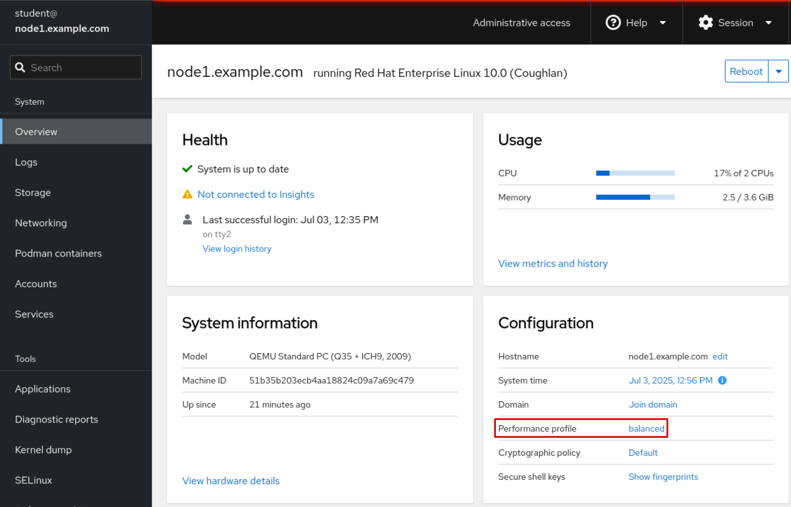
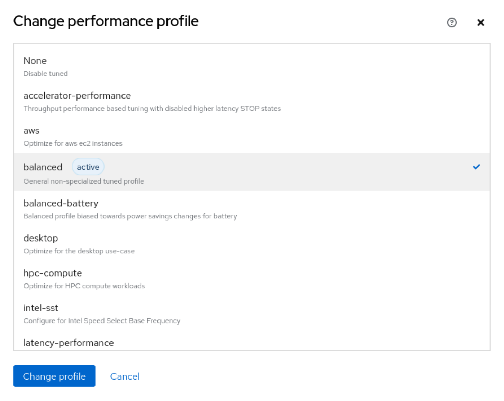

Quản trị hệ thống Red Hat 2
---------------------------

# Chương 9. Tối ưu hóa hiệu năng hệ thống
## Thiết lập hồ sơ tinh chỉnh
### Mục tiêu
Tối ưu hóa hiệu năng hệ thống bằng cách chọn cấu hình phù hợp nhất cho tiến trình nền (daemon) điều chỉnh hệ thống.

### Tinh chỉnh hệ thống
Các quản trị viên hệ thống luôn tìm cách tối ưu hóa hiệu năng phần cứng bằng cách tinh chỉnh các thiết lập hệ thống để đáp ứng những
nhu cầu khác nhau. TuneD là một công cụ mạnh mẽ dành cho Red Hat Enterprise Linux giúp đơn giản hóa quy trình này. Công cụ này tự động
tối ưu hóa hiệu năng và hiệu quả sử dụng năng lượng của hệ thống thông qua việc áp dụng các cấu hình tinh chỉnh được thiết lập sẵn, phù
hợp với các yêu cầu khối lượng công việc cụ thể; nhờ đó, hệ thống luôn vận hành ở trạng thái tối ưu, bất kể đó là máy chủ hiệu năng cao
hay máy tính xách tay cần tiết kiệm điện năng.

TuneD hoạt động liên tục dưới dạng một tiến trình nền (daemon). Nó có thể áp dụng các tinh chỉnh theo phương thức tĩnh hoặc động. Trên
Red Hat Enterprise Linux, tinh chỉnh tĩnh là chế độ hoạt động mặc định của TuneD.

#### Chế độ tinh chỉnh tĩnh mặc định
Cấu hình tinh chỉnh tĩnh thiết lập các tham số nhân (kernel) và những cài đặt hệ thống khác theo quy định trong các hồ sơ tinh chỉnh.
Khi dịch vụ TuneD khởi động hoặc khi bạn chuyển sang một hồ sơ khác, các cài đặt này sẽ được áp dụng ngay lập tức. Do TuneD được thiết
lập để tự động chạy khi khởi động hệ thống theo mặc định, các cài đặt này sẽ được áp dụng mỗi khi hệ thống của bạn khởi động. Các cài
đặt này giữ nguyên trạng thái cố định và tạo ra một nền tảng ổn định cho hiệu năng tổng thể mà không cần điều chỉnh thêm, ngay cả khi
mức độ hoạt động của hệ thống thay đổi.

#### Cấu hình Tinh chỉnh Động
Mặc dù cơ chế tinh chỉnh tĩnh (static tuning) mang lại nền tảng vững chắc và có thể dự đoán được, TuneD cũng cung cấp khả năng tinh
chỉnh động (dynamic tuning). Tính năng này cho phép tiến trình nền (daemon) `tuned` liên tục giám sát hoạt động của hệ thống và điều
chỉnh các thiết lập khi hành vi vận hành thay đổi. Khi kích hoạt tính năng này, việc tinh chỉnh hệ thống sẽ liên tục thích ứng với khối
lượng công việc hiện tại, đồng thời vẫn dựa trên các thiết lập ban đầu của cấu hình (profile) đã chọn.

Để thực hiện việc giám sát và điều chỉnh này, tiến trình nền `tuned` sử dụng các mô-đun chuyên biệt lần lượt là các "monitor plug-in"
(mô-đun giám sát) và "tuning plug-in" (mô-đun tinh chỉnh).

Các monitor plug-in thực hiện phân tích hệ thống và thu thập dữ liệu theo thời gian thực, chẳng hạn như tải CPU, hoạt động I/O của ổ
đĩa và lưu lượng mạng.

Sau đó, các tuning plug-in sẽ sử dụng thông tin này để thực hiện tinh chỉnh động. Ví dụ, plug-in `net` có thể thay đổi linh hoạt tốc độ
của giao diện mạng dựa trên mức độ sử dụng giao diện đó.

Tính năng tinh chỉnh động bị vô hiệu hóa theo mặc định trên Red Hat Enterprise Linux nhằm đảm bảo hiệu năng ổn định và có thể dự đoán
được. Bạn có thể kích hoạt tính năng này bằng cách thay đổi giá trị của biến `dynamic_tuning` thành `1` trong tệp cấu hình
`/etc/tuned/tuned-main.conf`. Khi tinh chỉnh động được kích hoạt, tiến trình nền `tuned` sẽ định kỳ giám sát hệ thống và điều chỉnh các
thiết lập dựa trên hành vi vận hành thực tế.

Bạn có thể kiểm soát tần suất thực hiện các cập nhật này bằng cách thiết lập biến `update_interval` (tính bằng giây) trong tệp cấu hình
`/etc/tuned/tuned-main.conf`.

```ini
...output omitted...
# Dynamicaly tune devices, if disabled only static tuning will be used.
dynamic_tuning = 1
...output omitted...
# Update interval for dynamic tunings (in seconds).
# It must be multiply of the sleep_interval.
update_interval = 10
...output omitted...
```

### Cài đặt và kích hoạt Dịch vụ Tinh chỉnh
Trong Red Hat Enterprise Linux, công cụ TuneD thường được cài đặt sẵn.

Hãy sử dụng lệnh sau để cài đặt gói tuned:

```console
root@host:~$ dnf install tuned
...output omitted...
Is this ok [y/N]: y
...output omitted...
```

Sử dụng lệnh sau để kích hoạt dịch vụ tuned:

```console
root@host:~$ systemctl enable --now tuned
Created symlink /etc/systemd/system/multi-user.target.wants/tuned.service → /usr/lib/systemd/system/tuned.service.
```

Ứng dụng TuneD cung cấp các cấu hình thuộc các nhóm sau:

* Các cấu hình tiết kiệm năng lượng
* Các cấu hình tăng cường hiệu năng

Các cấu hình tối ưu hóa hiệu năng có thể tập trung vào những khía cạnh sau:

* Độ trễ thấp đối với hệ thống lưu trữ và mạng
* Thông lượng cao đối với hệ thống lưu trữ và mạng
* Hiệu năng máy ảo
* Hiệu năng máy chủ ảo hóa (host)

Bảng dưới đây liệt kê các cấu hình tinh chỉnh được cung cấp kèm theo Red Hat Enterprise Linux 10:

**Bảng 9.1. Các cấu hình tinh chỉnh được cung cấp kèm theo Red Hat Enterprise Linux 10**

| Cấu hình đã tinh chỉnh  | Mục đích                                                                                                                                                              |
|-------------------------|-----------------------------------------------------------------------------------------------------------------------------------------------------------------------|
| accelerator-performance | Tăng cường tinh chỉnh dựa trên hiệu suất.                                                                                                                             |
| aws                     | Tối ưu hóa cho các instance Amazon Web Services (AWS) EC2.                                                                                                            |
| balanced                | Cấu hình được tinh chỉnh tổng quát, không chuyên biệt.                                                                                                                |
| balanced-battery        | Cấu hình cân bằng giúp tiết kiệm điện năng.                                                                                                                           |
| desktop                 | Tối ưu hóa cho trường hợp sử dụng trên máy tính để bàn.                                                                                                               |
| hpc-compute             | Tối ưu hóa cho các khối lượng công việc tính toán hiệu năng cao (HPC).                                                                                                |
| intel-sst               | Cấu hình cho Intel Speed Select Base Frequency.                                                                                                                       |
| latency-performance     | Tối ưu hóa để đạt hiệu năng ổn định, có thể dự đoán được, nhưng phải đánh đổi bằng mức tiêu thụ điện năng cao hơn.                                                    |
| network-latency         | Tối ưu hóa để đạt hiệu năng ổn định, có thể dự đoán được (deterministic performance) nhưng tiêu thụ nhiều điện năng hơn, tập trung vào hiệu năng mạng có độ trễ thấp. |
| network-throughput      | Tối ưu hóa lưu lượng mạng dạng luồng (streaming); việc này thường chỉ cần thiết đối với các CPU đời cũ hoặc mạng có tốc độ từ 40 Gbps trở lên.                        |
| optimize-serial-console | Tối ưu hóa cho việc sử dụng bảng điều khiển nối tiếp (serial console).                                                                                                |
| powersave               | Tối ưu hóa để tiêu thụ ít điện năng.                                                                                                                                  |
| throughput-performance  | Cấu hình tinh chỉnh có khả năng ứng dụng rộng rãi, mang lại hiệu suất tuyệt vời trên nhiều tác vụ máy chủ phổ biến.                                                   |
| virtual-guest           | Tối ưu hóa để chạy bên trong máy ảo khách.                                                                                                                            |
| virtual-host            | Tối ưu hóa để chạy các máy ảo KVM (Kernel-based Virtual Machine).                                                                                                     |

Ứng dụng TuneD lưu trữ các cấu hình được cài đặt sẵn—còn được gọi là cấu hình hệ thống hoặc cấu hình mặc định của nhà sản xuất—trong
thư mục `/usr/lib/tuned/profiles`. Các cấu hình này không dành cho việc chỉnh sửa trực tiếp.

Mỗi cấu hình nằm trong một thư mục riêng, chứa tệp cấu hình chính `tuned.conf` và (tùy chọn) các tệp liên quan khác.

Ví dụ sau đây liệt kê các cấu hình có trong thư mục `/usr/lib/tuned/profiles`:

```console
root@host:~# ls /usr/lib/tuned/profiles/
accelerator-performance  hpc-compute          optimize-serial-console
aws                      intel-sst            powersave
balanced                 latency-performance  throughput-performance
balanced-battery         network-latency      virtual-guest
desktop                  network-throughput   virtual-host
```

Ví dụ sau đây liệt kê nội dung của thư mục /usr/lib/tuned/profiles/virtual-guest:

```console
root@host:~# ls /usr/lib/tuned/profiles/virtual-guest/
tuned.conf
```

Tệp cấu hình tuned.conf có dạng như sau:

```ini
#
# tuned configuration
#

[main]
summary=Optimize for running inside a virtual guest
include=throughput-performance

[vm]
# If a workload mostly uses anonymous memory and it hits this limit, the entire
# working set is buffered for I/O, and any more write buffering would require
# swapping, so it's time to throttle writes until I/O can catch up.  Workloads
# that mostly use file mappings may be able to use even higher values.
#
# The generator of dirty data starts writeback at this percentage (system default
# is 20%)
dirty_ratio = 30

[sysctl]
# Filesystem I/O is usually much more efficient than swapping, so try to keep
# swapping low.  It's usually safe to go even lower than this on systems with
# server-grade storage.
vm.swappiness = 30
```

Phần `[main]` trong tệp có thể chứa phần tóm tắt về cấu hình tinh chỉnh (tuning profile). Phần này cũng hỗ trợ chỉ thị `include` –
một tính năng cho phép kế thừa cấu hình. Một cấu hình TuneD (cấu hình con) có thể kế thừa tất cả các thiết lập từ một cấu hình khác
(cấu hình cha). Với mô hình cấu hình dựa trên sự kế thừa này, khi tạo các cấu hình tinh chỉnh, bạn có thể sử dụng một cấu hình có sẵn
làm nền tảng, sau đó thêm hoặc sửa đổi các tham số cụ thể để đáp ứng nhu cầu của mình.

Để tạo hoặc tùy chỉnh các cấu hình tinh chỉnh, hãy sao chép thư mục cấu hình tương ứng từ `/usr/lib/tuned/profiles` sang
`/etc/tuned/profiles` và thực hiện các thay đổi cần thiết. Nếu các thư mục cấu hình có cùng tên tồn tại ở cả hai vị trí, thư mục nằm
trong `/etc/tuned/profiles` sẽ được ưu tiên áp dụng. Do đó, tuyệt đối không được sửa đổi trực tiếp các tệp trong thư mục hệ thống
`/usr/lib/tuned/profiles`.

Các phần còn lại trong tệp `tuned.conf` sử dụng các trình bổ trợ (plug-in) tinh chỉnh để thay đổi các tham số hệ thống. Ví dụ, trong
trường hợp đã nêu trước đó, phần [sysctl] sẽ sửa đổi tham số kernel `vm.swappiness` thông qua trình bổ trợ tinh chỉnh `sysctl`.
Tham số `vm.swappiness` quy định mức độ tích cực của kernel trong việc chuyển các tiến trình từ bộ nhớ vật lý sang không gian swap.

Để kiểm tra giá trị của tham số này trên hệ thống của bạn, hãy sử dụng lệnh `sysctl`:

```console
root@host:~# sysctl vm.swappiness
vm.swappiness = 30
```

Tham số này chấp nhận các giá trị từ 0 đến 100. Một giá trị thấp hơn, chẳng hạn như 30, sẽ được thiết lập bằng cách kích hoạt cấu hình
"virtual-guest" nhằm giảm xu hướng sử dụng không gian swap của kernel.

### Quản lý hồ sơ từ dòng lệnh
Lệnh `tuned-adm` là công cụ chính để quản lý ứng dụng TuneD và các cấu hình (profile) của nó.

Lệnh này hỗ trợ các tác vụ tinh chỉnh sau:

* Truy vấn các thiết lập đang có hiệu lực. 
* Liệt kê tất cả các cấu hình tinh chỉnh hiện có. 
* Nhận đề xuất cấu hình tinh chỉnh phù hợp cho hệ thống. 
* Chuyển đổi trực tiếp giữa các cấu hình tinh chỉnh. 
* Hủy kích hoạt tất cả các thiết lập của TuneD.

Bạn có thể xác định cấu hình điều chỉnh đang hoạt động bằng lệnh `tuned-adm active`.

```console
root@host:~# tuned-adm active
Current active profile: throughput-performance
```

Lệnh `tuned-adm verify` kiểm tra xem các thiết lập hệ thống hiện tại có khớp với cấu hình đang được kích hoạt hay không.

```console
root@host:~# tuned-adm verify
Verification succeeded, current system settings match the preset profile.
See TuneD log file ('/var/log/tuned/tuned.log') for details.
```

Lệnh `tuned-adm list` liệt kê tất cả các cấu hình tinh chỉnh hiện có, bao gồm cả các cấu hình tích hợp sẵn và cấu hình do người dùng
tự tạo.

```console
root@host:~# tuned-adm list
Available profiles:
- accelerator-performance     - Throughput performance based tuning with ...
- aws                         - Optimize for aws ec2 instances
- balanced                    - General non-specialized tuned profile
- balanced-battery            - Balanced profile biased towards power savings ...
- desktop                     - Optimize for the desktop use-case
...output omitted...
Current active profile: throughput-performance
```

Để biết thông tin về một cấu hình tinh chỉnh cụ thể, hãy sử dụng lệnh `tuned-adm profile_info` theo sau là tên của cấu hình đó.

```console
root@host:~# tuned-adm profile_info network-latency
Profile name:
network-latency

Profile summary:
Optimize for deterministic performance at the cost of increased power consumption, focused on low latency network performance
...output omitted...
```

Nếu không chỉ định cấu hình cụ thể, lệnh `tuned-adm profile_info` sẽ hiển thị thông tin về cấu hình tinh chỉnh đang được kích hoạt.

Để chuyển sang một cấu hình khác phù hợp hơn với các yêu cầu tinh chỉnh hiện tại của hệ thống, hãy sử dụng lệnh `tuned-adm profile`
kèm theo tên cấu hình. Lệnh này sẽ thay đổi cấu hình tinh chỉnh đang hoạt động một cách cố định.

```console
root@host:~# tuned-adm profile virtual-guest
```

Lệnh `tuned-adm recommend` đề xuất một cấu hình tối ưu hóa dựa trên các đặc điểm khác nhau của hệ thống. Các đặc điểm này bao gồm
những yếu tố như việc hệ thống có phải là máy ảo hay không, cùng các danh mục được xác định trước trong quá trình cài đặt hệ thống.

Hệ thống cũng sử dụng cơ chế này để xác định cấu hình mặc định sau khi hoàn tất quá trình cài đặt ban đầu.

```console
root@host:~# tuned-adm recommend
virtual-guest
```

Để hoàn tác các thiết lập do cấu hình hiện tại áp dụng, bạn có hai tùy chọn: chuyển sang một cấu hình khác hoặc vô hiệu hóa daemon
TuneD. Để tắt toàn bộ hoạt động của TuneD, hãy sử dụng lệnh `tuned-adm off`.

```
root@host:~# tuned-adm off
```

### Quản lý hồ sơ bằng Web Console
Để quản lý các cấu hình hiệu năng hệ thống thông qua bảng điều khiển web, bạn cần đăng nhập và nâng cao quyền hạn của mình. Sau đó,
bạn có thể thực thi các lệnh thay đổi cấu hình hiệu năng hệ thống; các lệnh này đòi hỏi quyền quản trị do chúng ảnh hưởng đến các tham
số cốt lõi của hệ thống.

Bạn có thể chuyển sang chế độ truy cập quản trị trong bảng điều khiển web bằng cách nhấp vào nút "Limited access" (Truy cập hạn chế)
hoặc "Turn on administrative access" (Bật quyền truy cập quản trị). Sau đó, hệ thống sẽ yêu cầu bạn nhập mật khẩu.

Với tư cách là người dùng có đặc quyền, hãy nhấp vào tùy chọn menu "Overview" (Tổng quan) trên thanh điều hướng bên trái. Trường
"Performance profile" (Cấu hình hiệu năng) sẽ hiển thị cấu hình đang được kích hoạt.

**Hình 9.1: Hồ sơ hiệu suất hoạt động**  


Để chọn một cấu hình khác, hãy nhấp vào liên kết hiển thị cấu hình hiện tại. Trong giao diện thay đổi cấu hình hiệu năng, hãy cuộn qua
danh sách và nhấp vào cấu hình bạn muốn chọn. Sau đó, nhấp vào nút Thay đổi cấu hình để áp dụng thay đổi.

**Hình 9.2: Chọn cấu hình hiệu năng ưu tiên**  


Để xác minh các thay đổi, hãy quay lại trang Tổng quan chính và xác nhận rằng trường "Hồ sơ hiệu suất" (Performance profile) hiển thị
hồ sơ đã chọn.

#### Bật Web Console
Bắt đầu từ Red Hat Enterprise Linux 10, bảng điều khiển web được cài đặt sẵn. Bạn có thể cài đặt bảng điều khiển web bằng cách cài đặt
gói `cockpit`:

```console
root@host:~# dnf install cockpit
...output omitted...
Is this ok [y/N]: y
...output omitted...
Complete!
```

Kích hoạt và khởi động unit `cockpit.socket` để truy cập bảng điều khiển web:

```console
root@host:~# systemctl enable --now cockpit.socket
Created symlink '/etc/systemd/system/sockets.target.wants/cockpit.socket' → '/usr/lib/systemd/system/cockpit.socket'.
```

Nếu bạn đang sử dụng cấu hình tường lửa tùy chỉnh, bạn phải mở cổng 9090 hoặc thêm dịch vụ cockpit để cho phép các kết nối đến bảng
điều khiển web.

```console
root@host:~# firewall-cmd --add-service=cockpit --permanent
success
```

Cập nhật dịch vụ firewalld với các thay đổi:

```console
root@host:~# firewall-cmd --reload
success
```

Để truy cập bảng điều khiển web, hãy mở URL https://servername:9090 và thay thế `servername` bằng tên máy chủ (hostname) hoặc địa chỉ
IP của máy chủ.

Theo mặc định, dịch vụ Cockpit sử dụng chứng chỉ TLS tự ký để bảo mật kết nối. Khi kết nối lần đầu, trình duyệt web có thể hiển thị
cảnh báo bảo mật do chứng chỉ này không được các Tổ chức cấp chứng chỉ (CA) thương mại tin cậy. Bạn có thể yên tâm bỏ qua cảnh báo này.

Hãy đăng nhập vào bảng điều khiển web bằng tên người dùng và mật khẩu của hệ thống.

## Tạo ảnh hưởng đến việc lập lịch tiến trình
### Mục tiêu
Mô tả các công cụ dòng lệnh dùng để tăng hoặc giảm mức ưu tiên lập lịch CPU cho các tiến trình cụ thể.

### Đa nhiệm ưu tiên
Các máy tính hiện đại, từ máy trạm cá nhân đến những siêu máy tính khổng lồ, đều được trang bị các bộ vi xử lý (CPU) đa nhân và đa
luồng. Với thiết kế này, CPU có thể thực thi đồng thời nhiều luồng lệnh, giúp tăng đáng kể hiệu năng xử lý. Các siêu máy tính hiệu
năng cao còn nâng khả năng này lên một tầm cao mới, cho phép xử lý song song hàng triệu luồng trên hàng trăm hoặc hàng nghìn CPU.

Bất chấp những tiến bộ đó, tình trạng quá tải CPU vẫn là một thách thức lớn đối với mọi loại hệ thống. Dù là người dùng chạy quá nhiều
ứng dụng trên máy tính để bàn hay máy chủ doanh nghiệp phải xử lý hàng nghìn yêu cầu mỗi giây, hệ thống thường xuyên rơi vào tình
huống số lượng luồng tiến trình vượt quá khả năng xử lý tức thời của các CPU hiện có.

Để giải quyết các tình huống đòi hỏi cao này, Linux và các hệ điều hành khác sử dụng kỹ thuật được gọi là "chia sẻ thời gian"
(time-slicing) hay đa nhiệm. Chức năng này do bộ lập lịch tiến trình (process scheduler) đảm nhiệm; đây là một thành phần của nhân hệ
điều hành (kernel) có nhiệm vụ phân bổ thời gian CPU cho các tác vụ.

Trên các hệ thống CPU đa nhân hiện đại, bộ lập lịch có thể thực thi đồng thời nhiều luồng trên các nhân hoặc luồng phần cứng khác
nhau. Tuy nhiên, khả năng thực thi song song các luồng không phải lúc nào cũng có sẵn. Trước đây, trên các hệ thống chỉ có một CPU,
việc thực thi đồng thời thực sự nhiều chương trình là điều bất khả thi; thay vào đó, hệ điều hành tạo ra ảo giác về sự đồng thời.
Bằng cách luân chuyển nhanh chóng giữa các tiến trình đang chờ chạy và cấp cho mỗi tiến trình một khoảng thời gian ngắn (time-slice),
bộ lập lịch đảm bảo rằng tất cả các ứng dụng đang hoạt động đều có vẻ như đang được xử lý. Khái niệm cơ bản về chia sẻ thời gian này
vẫn còn nguyên giá trị ngay cả trong môi trường đa nhân hiện đại.

Việc nhân hệ điều hành chủ động ngắt một tiến trình đang chạy để chuyển sang thực thi một tiến trình khác trên CPU được gọi là cơ chế 
"chiếm quyền điều khiển" (preemption). Đa nhiệm có cơ chế chiếm quyền điều khiển giúp ngăn chặn tình trạng một chương trình ngốn nhiều
tài nguyên CPU độc chiếm bộ vi xử lý, qua đó tránh làm hệ thống bị treo hoặc không phản hồi.

#### Các chính sách lập lịch tiến trình
Thay vì phân bổ thời gian CPU một cách ngẫu nhiên, bộ lập lịch của nhân hệ điều hành (kernel) hoạt động dựa trên các chính sách lập
lịch tinh vi nhằm đảm bảo mọi tiến trình đều nhận được một phần thời gian CPU khả dụng.

Ví dụ, các chính sách lập lịch đặc biệt có thể được áp dụng cho những tác vụ thời gian thực đòi hỏi tính cấp bách về mặt thời gian và
có độ ưu tiên cao.

Các ví dụ về chính sách thời gian thực trong mã nguồn nhân hệ điều hành bao gồm SCHED_FIFO (vào trước - ra trước) và SCHED_RR (lập
lịch xoay vòng - round-robin). Tuy nhiên, hầu hết các ứng dụng hoặc tiến trình mà bạn khởi chạy đều mặc định sử dụng chính sách
SCHED_NORMAL – chính sách lập lịch chia sẻ thời gian tiêu chuẩn. Để tuân thủ tiêu chuẩn POSIX, SCHED_OTHER cũng được chấp nhận là
tên gọi khác (bí danh) cho chính sách SCHED_NORMAL.

Bắt đầu từ phiên bản Red Hat Enterprise Linux 10, thuật toán triển khai chính sách SCHED_NORMAL có tên là Earliest Eligible Virtual
Deadline First (EEVDF); thuật toán này thay thế cho Completely Fair Scheduler (CFS) vốn được sử dụng trong các phiên bản RHEL trước đó.

EEVDF kế thừa các khái niệm về sự công bằng từ CFS, đồng thời bổ sung thêm khái niệm về "thời hạn" (deadline). Mỗi tác vụ sẽ được gán
một "thời hạn ảo hợp lệ" (eligible virtual deadline) dựa trên lượng thời gian CPU mà tác vụ đó được cấp và mức độ ưu tiên của nó. Sau
đó, bộ lập lịch sẽ chọn tác vụ có thời hạn ảo hợp lệ sớm nhất để thực thi tiếp theo. Nhờ tích hợp cơ chế tính toán thời hạn, EEVDF
mang lại khả năng xử lý độ trễ và độ phản hồi tốt hơn so với CFS.

### Các giá trị Nice trong Linux
Các cơ chế tính toán thời hạn (deadline) tinh vi trong EEVDF giúp quản lý linh hoạt tính công bằng và khả năng phản hồi trên toàn hệ
thống. Tuy nhiên, người dùng vẫn có thể tác động đến mức độ ưu tiên tương đối hoặc phần thời gian CPU được cấp cho một tiến trình cụ
thể thông qua giá trị "nice" của nó.

Giá trị "nice" là một tham số thuộc chính sách mặc định SCHED_NORMAL; người dùng có thể thiết lập giá trị này để quy định mức độ
"nhường nhịn" (hoặc "ít nhường nhịn") của một tiến trình đối với các tiến trình khác bằng cách điều chỉnh mức độ sẵn sàng nhường lại
thời gian CPU. Giá trị này nằm trong khoảng từ -20 (ít "nhường nhịn" nhất, tương ứng với mức ưu tiên cao nhất) đến +19 (rất "nhường
nhịn", tương ứng với mức ưu tiên thấp nhất). Theo mặc định, hầu hết các tiến trình đều khởi chạy với giá trị "nice" bằng 0.

Một tiến trình có giá trị "nice" thấp hơn (ví dụ: -10) sẽ đòi hỏi phần thời gian CPU lớn hơn tương ứng. Ngược lại, một tiến trình có
giá trị "nice" cao hơn (ví dụ: +10) sẽ yêu cầu phần thời gian ít hơn.

Trong bộ lập lịch EEVDF, giá trị "nice" này ảnh hưởng trực tiếp đến trọng số của tác vụ, từ đó tác động đến việc tính toán thời hạn ảo
hợp lệ (eligible virtual deadline) của tác vụ đó. Trọng số cao hơn (có được từ giá trị "nice" thấp hơn) sẽ dẫn đến thời hạn sớm hơn,
cho phép tiến trình được thực thi sớm hơn và thường xuyên hơn.

> Quan trọng: Các giá trị "nice" chỉ ảnh hưởng đến các tiến trình không thuộc loại thời gian thực (SCHED_NORMAL) và không nâng mức ưu
> tiên của tiến trình lên cao hơn các tác vụ thời gian thực (ví dụ: các tác vụ SCHED_FIFO hoặc SCHED_RR). Các tác vụ thời gian thực
> thuộc nhóm lập lịch có độ ưu tiên cao hơn và luôn được ưu tiên xử lý so với các tiến trình thông thường.

Trên một hệ thống không bị quá tải CPU, tác động của các giá trị "nice" có thể ít rõ rệt hơn, bởi vì ngay cả các tác vụ có độ ưu tiên
thấp hơn cũng có thể nhận được đủ thời gian xử lý do không có sự tranh chấp tài nguyên.

#### Quyền sửa đổi giá trị nice
Người dùng có đặc quyền có thể giảm giá trị "nice" của một tiến trình, khiến nó trở nên kém "nhường nhịn" hơn và làm tăng mức độ ưu
tiên của nó. Kết quả là bộ lập lịch EEVDF sẽ lên lịch cho tiến trình này sớm hơn và thường xuyên hơn, giúp nó chiếm dụng được nhiều
thời gian CPU hơn.

Ngược lại, người dùng không có đặc quyền chỉ có thể tăng giá trị "nice" cho các tiến trình của chính họ; việc này khiến các tiến trình
trở nên "nhường nhịn" hơn và do đó làm giảm mức độ ưu tiên của chúng. Hệ quả là các tiến trình này có thể được lên lịch ít thường
xuyên hơn và nhận được ít thời gian CPU hơn. Người dùng không có đặc quyền không thể giảm giá trị "nice" của tiến trình để nâng cao
mức độ ưu tiên, cũng như không thể điều chỉnh giá trị "nice" cho tiến trình của người dùng khác.

#### Xem mức độ ưu tiên của tiến trình
Các lệnh `top` và `ps` thường được sử dụng để kiểm tra mức độ ưu tiên của các tiến trình đang chạy.

Lệnh `top` cung cấp cái nhìn trực quan, biến đổi liên tục về các tiến trình đang chạy và mức độ sử dụng tài nguyên hệ thống thông qua
việc liên tục cập nhật hiển thị.

Ngược lại, lệnh `ps` hiển thị trạng thái tĩnh của các tiến trình tại thời điểm lệnh được thực thi.

##### Kiểm tra tiến trình một cách linh hoạt
Lệnh `top` hiển thị từng tiến trình cùng với các chỉ số chính, bao gồm giá trị độ ưu tiên (PR) và giá trị nice (NI).

Cột PR hiển thị biểu diễn của lệnh `top` về độ ưu tiên lập lịch được kernel tính toán cho một tiến trình, và cung cấp cái nhìn thống
nhất về cả các tiến trình thời gian thực và tiến trình thông thường trên cùng một thang đo.

```
top - 13:27:06 up 3 min,  3 users,  load average: 0.45, 0.49, 0.22
Tasks: 250 total,   1 running, 249 sleeping,   0 stopped,   0 zombie
%Cpu(s):  0.0 us,  4.3 sy,  0.0 ni, 95.7 id,  0.0 wa,  0.0 hi,  0.0 si,  0.0 st
MiB Mem :   5662.9 total,   4358.2 free,   1041.5 used,    511.4 buff/cache
MiB Swap:      0.0 total,      0.0 free,      0.0 used.   4621.5 avail Mem

    PID USER      PR  NI    VIRT    RES    SHR S  %CPU  %MEM     TIME+ COMMAND
   4201 student   30  10  232212   2912   2400 R 100.0   0.1   8:08.03 sha1sum
   4203 student   39  19  232212   2992   2480 R  90.9   0.1   8:03.72 sha1sum
   4163 student   20   0  232212   2904   2392 R  81.8   0.1   8:37.92 sha1sum
   2189 student   20   0  232016   4944   2896 R   8.3   0.1   0:00.02 top
      1 root      20   0   49516  41284  10312 S   0.0   0.7   0:02.11 systemd
      2 root      20   0       0      0      0 S   0.0   0.0   0:00.00 kthreadd
      3 root      20   0       0      0      0 S   0.0   0.0   0:00.00 pool_wor ...
      4 root       0 -20       0      0      0 I   0.0   0.0   0:00.00 kworker/R ...
...output omitted...
```

Đối với các tiến trình không phải thời gian thực (SCHED_NORMAL), độ ưu tiên có thể được tính bằng công thức: PR = 20 + nice_value.

Như đã thấy trong kết quả của lệnh trước, tiến trình đầu tiên có giá trị nice là 10, tương ứng với giá trị PR là 30 (20 + 10 = 30).

Sơ đồ sau đây cho thấy cách các tiến trình thông thường với giá trị nice và các tiến trình thời gian thực được ánh xạ vào một cột PR
duy nhất trong kết quả đầu ra của lệnh top.

**Hình 9.3: Các giá trị độ ưu tiên (priority) và giá trị nice do lệnh `top` hiển thị.**  


> **Lưu ý**: Đối với các tiến trình thời gian thực (real-time), giá trị PR trong lệnh `top` được tính theo cách khác. Công thức là:
> PR = -1 - real_time_priority. Phạm vi giá trị cho độ ưu tiên thời gian thực là từ 1 (độ ưu tiên RT thấp nhất) đến 99 (độ ưu tiên RT
> cao nhất). Phép tính này luôn cho kết quả là số âm đối với các tiến trình thời gian thực trong cột PR. Ngoài ra, đôi khi lệnh `top`
> có thể hiển thị chuỗi "rt" trong cột PR, tương ứng với giá trị -100 (độ ưu tiên lập lịch cao nhất có thể đối với các tiến trình thời
> gian thực).

##### Kiểm tra tĩnh các tiến trình
Lệnh `ps` cung cấp ảnh chụp nhanh về các tiến trình đang chạy trên hệ thống của bạn.

Ví dụ sau đây minh họa cách sử dụng lệnh `ps` để hiển thị các cột cụ thể cho các tiến trình `sha1sum` đang chạy:

```console
user@host:~$ ps -o pid,priority,nice,cls,pcpu,comm -C sha1sum
    PID PRI  NI CLS %CPU COMMAND
   2176  20   0  TS 99.2 sha1sum
   2183  30  10  TS 99.1 sha1sum
   2185 -11   -  RR 99.3 sha1sum
```

Trong cột CLS (lớp lập lịch - scheduling class), TS là viết tắt của "time sharing" (chia sẻ thời gian), cho biết tiến trình được quản
lý bởi chính sách mặc định SCHED_NORMAL. Các giá trị CLS phổ biến khác, chẳng hạn như FF (vào trước, ra trước - FIFO) và RR (xoay vòng
- round robin), biểu thị các tiến trình thời gian thực. Do các tiến trình thời gian thực không sử dụng giá trị nice, cột NI của chúng
hiển thị dấu gạch ngang (-).

Lệnh ps cũng hỗ trợ sắp xếp các tiến trình dựa trên một trường được chọn.

Ví dụ sau đây sắp xếp tất cả các tiến trình trên hệ thống theo giá trị nice theo thứ tự giảm dần:

```console
user@host:~$ ps -eo pid,priority,nice,cls,pcpu,comm --sort=-nice | head
    PID PRI  NI CLS %CPU COMMAND
     60  39  19  TS  0.0 khugepaged
   2185  39  19  TS 99.2 sha1sum
   2183  30  10  TS 99.4 sha1sum
     59  25   5  TS  0.0 ksmd
    895  21   1  TS  0.0 rtkit-daemon
      1  20   0  TS  0.2 systemd
      2  20   0  TS  0.0 kthreadd
      3  20   0  TS  0.0 pool_workqueue_release
      8  20   0  TS  0.0 kworker/0:0-events_freezable
```

#### Khởi chạy một tiến trình với giá trị nice cụ thể
Theo mặc định, khi một tiến trình được tạo ra, nó sẽ kế thừa giá trị "nice" từ tiến trình cha. Khi một tiến trình được khởi chạy từ
dòng lệnh, nó kế thừa giá trị "nice" từ tiến trình shell. Thông thường, các tiến trình mới sẽ chạy với giá trị "nice" mặc định là 0.

Ví dụ dưới đây khởi chạy một tiến trình tiêu tốn nhiều tài nguyên CPU từ shell dưới dạng tác vụ chạy ngầm (background job), sau đó
hiển thị giá trị "nice" của tiến trình có tên tương ứng.

```console
user@host:~$ sha1sum /dev/zero &
[1] 2794
user@host:~$ ps -o pid,nice,comm -C sha1sum
    PID  NI COMMAND
   2794   0 sha1sum
```

Tất cả người dùng đều có thể sử dụng lệnh `nice` để khởi chạy các lệnh với giá trị nice mặc định hoặc cao hơn.

Ví dụ sau đây khởi chạy cùng một lệnh với giá trị nice mặc định là 10, đồng thời hiển thị giá trị nice của các tiến trình có cùng tên:

```console
user@host:~$ nice sha1sum /dev/zero &
[2] 2810
user@host:~$ ps -o pid,nice,comm -C sha1sum
    PID  NI COMMAND
   2794   0 sha1sum
   2810  10 sha1sum
```

Sử dụng tùy chọn `-n` của lệnh `nice` để áp dụng giá trị nice do người dùng xác định khi khởi chạy một tiến trình.

Ví dụ sau đây khởi chạy một tác vụ nền khác với giá trị nice là 15 và hiển thị kết quả:

```console
user@host:~$ nice -n 15 sha1sum /dev/zero &
[3] 2814
user@host:~$ ps -o pid,nice,comm -C sha1sum
    PID  NI COMMAND
   2794   0 sha1sum
   2810  10 sha1sum
   2814  15 sha1sum
```

> **Quan trọng**: Khi chạy các tiến trình tiêu tốn nhiều tài nguyên CPU, đặc biệt là trong quá trình thử nghiệm, hãy đảm bảo kết thúc
> chúng để tránh làm chậm hệ thống hoặc gây cạn kiệt tài nguyên:
> 
> ```
> user@host:~$ pkill sha1sum
> [1]   Terminated              sha1sum /dev/zero
> [2]-  Terminated              nice sha1sum /dev/zero
> [3]+  Terminated              nice -n 15 sha1sum /dev/zero
> ```

#### Thay đổi giá trị Nice của một tiến trình đang chạy
Bạn có thể thay đổi giá trị "nice" của một tiến trình đang chạy bằng cách sử dụng lệnh `renice`.

Ví dụ sau đây minh họa cách sử dụng lệnh `renice` bằng cách xác định tiến trình thông qua ID tiến trình (PID) và tăng giá trị "nice"
của nó lên 19.

```console
user@host:~$ renice -n 19 3033
3033 (process ID) old priority 10, new priority 19
```

Một nỗ lực sau đó nhằm giảm giá trị nice xuống lại mức 10 sẽ thất bại, vì người dùng không có đặc quyền không thể giảm giá trị nice:

```console
user@host:~$ renice -n 10 3033
renice: failed to set priority for 3033 (process ID): Permission denied
```

Để khắc phục tạm thời, người dùng có thể kết thúc và khởi động lại tiến trình nhằm khôi phục mức độ ưu tiên mặc định của nó.

Ngoài ra, bạn có thể sử dụng lệnh `top` để thay đổi giá trị "nice" của một tiến trình đang chạy. Tại giao diện tương tác của `top`,
hãy nhấn phím **R** để truy cập lệnh `renice`. Sau đó, nhập ID của tiến trình và nhập giá trị "nice" mới.
