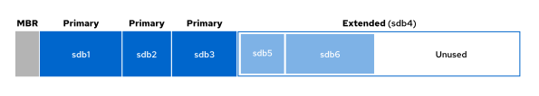
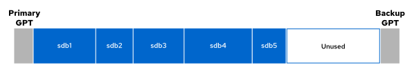

Quản trị hệ thống Red Hat 2
---------------------------

# Chương 10. Quản lý lưu trữ cơ bản
## Tạo và quản lý hệ thống tập tin trên các phân vùng tiêu chuẩn
### Mục tiêu
Quản lý bộ nhớ lưu trữ bằng cách tạo các phân vùng, định dạng chúng với các hệ thống tệp và gắn kết các hệ thống tệp đó để sử dụng.

### Phân vùng ổ đĩa
Phân vùng ổ đĩa là quá trình chia ổ cứng thành nhiều phân vùng lưu trữ logic. Bạn có thể sử dụng các phân vùng để phân chia không gian
lưu trữ tùy theo các yêu cầu khác nhau; việc phân chia này mang lại nhiều lợi ích:

* Giới hạn dung lượng khả dụng dành cho các ứng dụng hoặc người dùng. 
* Tách biệt hệ điều hành và các tệp chương trình khỏi tệp tin của người dùng. 
* Tạo một khu vực riêng biệt cho việc hoán đổi bộ nhớ (memory swapping). 
* Giới hạn mức sử dụng dung lượng ổ đĩa nhằm cải thiện hiệu suất của các công cụ chẩn đoán và quá trình tạo ảnh sao lưu
(backup imaging).

Trên các hệ thống x86, hai cơ chế phân vùng chính là **Master Boot Record (MBR)** và **GUID Partition Table (GPT)**.

#### Sơ đồ phân vùng Master Boot Record (MBR)
Cơ chế phân vùng Master Boot Record (MBR) là tiêu chuẩn trên các hệ thống sử dụng firmware BIOS (Basic Input/Output System). Cơ chế này
hỗ trợ tối đa bốn phân vùng chính (primary partition). Trên các hệ thống Linux, nhờ có phân vùng mở rộng (extended partition) và phân
vùng logic (logical partition), bạn có thể tạo tới 15 phân vùng. Với kích thước phân vùng 32-bit, các ổ đĩa được phân vùng theo chuẩn
MBR có thể đạt dung lượng lên tới 2 TiB.

**Hình 10.1: Phân vùng MBR của thiết bị lưu trữ /dev/sdb**  


Giới hạn kích thước đĩa và phân vùng ở mức 2 TiB hiện là một hạn chế phổ biến và gây nhiều bất tiện. Do đó, cơ chế MBR truyền thống
đang dần được thay thế bằng cơ chế phân vùng GUID Partition Table (GPT).

#### Sơ đồ phân vùng GUID Partition Table (GPT)
Đối với các hệ thống sử dụng firmware UEFI (Unified Extensible Firmware Interface), GPT (GUID Partition Scheme) là chuẩn phân vùng ổ
đĩa giúp khắc phục những hạn chế của chuẩn MBR. GPT cho phép tạo tối đa 128 phân vùng. Chuẩn này sử dụng 64 bit cho địa chỉ khối logic,
hỗ trợ các phân vùng và ổ đĩa có dung lượng lên tới 8 zebibyte (ZiB) hay 8 tỷ tebibyte (TiB).


**Hình 10.2: Phân vùng GPT của thiết bị lưu trữ /dev/sdb**  


Cấu trúc GPT cung cấp các tính năng và lợi ích bổ sung so với cấu trúc MBR. Cấu trúc GPT sử dụng Mã định danh duy nhất toàn cầu (GUID)
để định danh từng ổ đĩa và phân vùng. Cấu trúc này tạo ra cơ chế dự phòng cho bảng phân vùng, với bảng phân vùng chính nằm ở đầu ổ đĩa
và bảng phân vùng phụ (dự phòng) nằm ở cuối ổ đĩa. Ngoài ra, cấu trúc này còn sử dụng mã kiểm tra (checksum) để phát hiện lỗi trong
phần đầu (header) của GPT và bảng phân vùng.

#### Quản lý phân vùng
Người quản trị có thể sử dụng chương trình chỉnh sửa phân vùng để thay đổi các phân vùng của đĩa, chẳng hạn như tạo và xóa phân vùng,
cũng như thay đổi loại phân vùng.

Red Hat Enterprise Linux cung cấp lệnh `parted` như một công cụ chỉnh sửa phân vùng dòng lệnh tiêu chuẩn. Bạn có thể sử dụng công cụ
`parted` với các thiết bị lưu trữ sử dụng sơ đồ phân vùng MBR hoặc GPT.

Đối số đầu tiên của lệnh `parted` là tên thiết bị đại diện cho toàn bộ thiết bị lưu trữ hoặc đĩa cần chỉnh sửa, theo sau là các lệnh
con.

Ví dụ dưới đây sử dụng lệnh con `print` để hiển thị bảng phân vùng trên đĩa tương ứng với thiết bị khối `/dev/sda` (đĩa QEMU đầu tiên
mà hệ thống phát hiện được):

```console
root@host:~# parted /dev/sda print
Model: QEMU QEMU HARDDISK (scsi)
Disk /dev/sda: 53.7GB
Sector size (logical/physical): 512B/512B
Partition Table: msdos
Disk Flags:

Number  Start   End     Size    Type     File system  Flags
 1      1049kB  10.7GB  10.7GB  primary  xfs          boot
 2      10.7GB  53.7GB  42.9GB  primary  xfs
```

Để bắt đầu phiên làm việc tương tác, hãy thực thi lệnh `parted` với tư cách là người dùng root và chỉ định tên thiết bị đĩa làm đối số:

```console
root@host:~# parted /dev/sda
GNU Parted 3.6
Using /dev/sda
Welcome to GNU Parted! Type 'help' to view a list of commands.
```

Sử dụng lệnh con `print` để hiển thị bảng phân vùng:

```
(parted) print
Model: QEMU QEMU HARDDISK (scsi)
Disk /dev/sda: 53.7GB
Sector size (logical/physical): 512B/512B
Partition Table: msdos
Disk Flags:

Number  Start   End     Size    Type     File system  Flags
 1      1049kB  10.7GB  10.7GB  primary  xfs          boot
 2      10.7GB  53.7GB  42.9GB  primary  xfs
```

Để thoát khỏi phiên phân vùng tương tác, hãy sử dụng lệnh `quit`:

```
(parted) quit
root@host:~#
```

Theo mặc định, lệnh `parted` hiển thị kích thước theo lũy thừa của 10 (KB, MB, GB). Bạn có thể thay đổi đơn vị kích thước bằng tham số
`unit`; tham số này chấp nhận các giá trị sau:

* s cho sector (cung từ)
* B cho byte
* MiB, GiB, hoặc TiB (lũy thừa của 2)
* MB, GB, hoặc TB (lũy thừa của 10)

Ví dụ sau đây hiển thị bảng phân vùng cho thiết bị `/dev/sda` tính theo sector:

```console
root@host:~# parted /dev/sda unit s print
Model: QEMU QEMU HARDDISK (scsi)
Disk /dev/sda: 104857600s
Sector size (logical/physical): 512B/512B
Partition Table: msdos
Disk Flags:

Number  Start      End         Size       Type     File system  Flags
 1      2048s      20971486s   20969439s  primary  xfs          boot
 2      20971520s  104857535s  83886016s  primary  xfs
```

Bạn có thể chỉ định nhiều lệnh con trên cùng một dòng, chẳng hạn như các lệnh con `unit` và `print` trong ví dụ trước.

#### Ghi bảng phân vùng lên đĩa mới
Để phân vùng một ổ đĩa mới, trước tiên hãy tạo nhãn đĩa. Nhãn đĩa xác định sơ đồ phân vùng sẽ được sử dụng.

Sử dụng lệnh `parted` để tạo nhãn đĩa MBR:

```console
root@host:~# parted /dev/sdb mklabel msdos
```

Sử dụng lệnh parted để ghi nhãn đĩa GPT:

```console
root@host:~# parted /dev/sdb mklabel gpt
```

> **Cảnh báo**: Lệnh con `mklabel` sẽ xóa sạch bảng phân vùng hiện có. Hãy sử dụng lệnh con `mklabel` để tái sử dụng đĩa mà không cần
quan tâm đến dữ liệu hiện có. Nếu nhãn mới làm thay đổi ranh giới phân vùng, toàn bộ dữ liệu trong các hệ thống tập tin hiện tại sẽ
không thể truy cập được nữa.

#### Tạo phân vùng MBR
Các hướng dẫn sau đây dùng để tạo phân vùng đĩa MBR. Hãy chỉ định thiết bị đĩa mà bạn muốn tạo phân vùng trên đó.

Để bắt đầu phiên làm việc tương tác, hãy chạy lệnh `parted` với quyền root và chỉ định tên thiết bị đĩa làm đối số:

```console
root@host:~# parted /dev/sdb
GNU Parted 3.6
Using /dev/sdb
Welcome to GNU Parted! Type 'help' to view a list of commands.
(parted)
```

Sử dụng lệnh con `mkpart` để tạo phân vùng. Lệnh con `help mkpart` hiển thị cú pháp và các tùy chọn khả dụng cho từng tham số:

```
(parted) help mkpart
  mkpart PART-TYPE [FS-TYPE] START END     make a partition

        PART-TYPE is one of: primary, logical, extended
        FS-TYPE is one of: udf, btrfs, nilfs2, ext4, ext3, ext2, f2fs, fat32, fat16,
        hfsx, hfs+, hfs, jfs, swsusp, linux-swap(v1), linux-swap(v0), ntfs, reiserfs,
        hp-ufs, sun-ufs, xfs, apfs2, apfs1, asfs, amufs5, amufs4, amufs3, amufs2,
        amufs1, amufs0, amufs, affs7, affs6, affs5, affs4, affs3, affs2, affs1, affs0,
        linux-swap, linux-swap(new), linux-swap(old)
        START and END are disk locations, such as 4GB or 10%.  Negative values count
        from the end of the disk.  For example, -1s specifies exactly the last sector.

        'mkpart' makes a partition without creating a new file system on the partition.
        FS-TYPE may be specified to set an appropriate partition ID.
```

Tạo phân vùng chính hoặc phân vùng mở rộng.

```
(parted) mkpart
Partition type?  primary/extended? primary
```

> **Lưu ý**: Nếu bạn cần nhiều hơn bốn phân vùng trên một ổ đĩa sử dụng kiểu phân vùng MBR, hãy tạo ba phân vùng chính (primary
partition) và một phân vùng mở rộng (extended partition). Phân vùng mở rộng đóng vai trò như một vùng chứa, cho phép bạn tạo nhiều
phân vùng logic (logical partition) bên trong đó.

Tiếp theo, bạn được yêu cầu nhập nhãn cho loại hệ thống tệp. Để liệt kê các loại hệ thống tệp được hỗ trợ, hãy nhấn phím Tab hai lần:

```
File system type?  [ext2]? Tab Tab
affs0  affs4  amufs  amufs3  apfs2  ext3  fat32  hp-ufs  linux-swap(old)  ntfs  udf
affs1  affs5  amufs0  amufs4  asfs  ext4  hfs  jfs  linux-swap(v0)  reiserfs  xfs
affs2  affs6  amufs1  amufs5  btrfs  f2fs  hfs+  linux-swap  linux-swap(v1)  sun-ufs
affs3  affs7  amufs2  apfs1   ext2   fat16  hfsx  linux-swap(new)  nilfs2  swsusp
```

Nhập loại hệ thống tệp sẽ sử dụng cho phân vùng, chẳng hạn như `xfs` hoặc `ext4`. Giá trị này chỉ được dùng làm nhãn loại phân vùng và
không thực hiện việc tạo hệ thống tệp.

```
File system type?  [ext2]? xfs
```

Xác định sector đĩa nơi phân vùng bắt đầu.

```
Start? 2048s
```

Hậu tố `s` biểu thị giá trị theo đơn vị sector (cung từ), hoặc bạn có thể sử dụng các hậu tố MiB, GiB, TiB, MB, GB hay TB. Lệnh
`parted` mặc định sử dụng hậu tố MB. Lệnh này sẽ làm tròn các giá trị được cung cấp để đảm bảo tuân thủ các giới hạn của đĩa.

Khi khởi chạy, lệnh `parted` sẽ truy xuất cấu trúc liên kết (topology) của đĩa từ thiết bị, chẳng hạn như kích thước khối vật lý của
đĩa. Lệnh `parted` đảm bảo rằng vị trí bắt đầu do bạn chỉ định sẽ căn chỉnh phân vùng chính xác với cấu trúc đĩa nhằm tối ưu hóa hiệu
suất. Nếu vị trí bắt đầu dẫn đến tình trạng phân vùng bị lệch (không căn chỉnh đúng), lệnh `parted` sẽ hiển thị cảnh báo. Đối với hầu
hết các loại đĩa, việc chọn sector bắt đầu là bội số của 2048 được coi là an toàn.

Hãy chỉ định sector trên đĩa nơi phân vùng kết thúc. Bạn có thể xác định điểm kết thúc dưới dạng kích thước hoặc vị trí kết thúc cụ
thể. Khi bạn cung cấp vị trí kết thúc, lệnh `parted` sẽ cập nhật bảng phân vùng trên đĩa với các thông tin chi tiết về phân vùng mới.

```
End? 1000MB
```

Thoát khỏi lệnh parted:

```
(parted) quit
Information: You may need to update /etc/fstab.

root@host:~#
```

Sau khi phân vùng được tạo, hệ thống sẽ phát hiện phân vùng mới và tạo tệp thiết bị tương ứng trong thư mục `/dev`.

Hãy chạy lệnh `udevadm settle` để chờ cho đến khi tệp thiết bị đại diện cho phân vùng đó xuất hiện trong thư mục `/dev`.

```console
root@host:~# udevadm settle
```

Thay vì sử dụng chế độ tương tác, bạn có thể tạo phân vùng bằng một lệnh duy nhất không cần tương tác:

```console
root@host:~# parted /dev/sdb mkpart primary xfs 2048s 1000MB
```

#### Tạo các phân vùng GPT
Phương thức GPT cũng sử dụng lệnh `parted` để tạo các phân vùng. Hãy chỉ định thiết bị đĩa mà bạn muốn tạo phân vùng trên đó.

Để bắt đầu phiên làm việc tương tác, hãy thực thi lệnh `parted` với quyền root và chỉ định tên thiết bị đĩa làm đối số:

```console
root@host:~# parted /dev/sdb
GNU Parted 3.6
Using /dev/sdb
Welcome to GNU Parted! Type 'help' to view a list of commands.
(parted)
```

Sử dụng lệnh con `mkpart` để bắt đầu tạo phân vùng. Với sơ đồ GPT, mỗi phân vùng đều được đặt tên.

```
(parted) mkpart
Partition name?  []? userdata
```

Nhập loại hệ thống tệp sẽ sử dụng cho phân vùng, chẳng hạn như xfs hoặc ext4. Giá trị này chỉ được dùng làm nhãn loại phân vùng và
không thực hiện việc tạo hệ thống tệp.

```
File system type?  [ext2]? xfs
```

Xác định cung đĩa nơi phân vùng bắt đầu:

```
Start? 2048s
```

Hãy chỉ định sector đĩa nơi phân vùng kết thúc. Khi bạn cung cấp vị trí kết thúc, lệnh `parted` sẽ cập nhật phân vùng GPT trên đĩa với
các thông tin chi tiết mới của phân vùng.

```
End? 1000MB
```

Thoát khỏi lệnh parted.

```
(parted) quit
Information: You may need to update /etc/fstab.

root@host:~#
```

Chạy lệnh `udevadm settle`. Lệnh này chờ hệ thống phát hiện phân vùng mới và tạo tệp thiết bị tương ứng trong thư mục `/dev`.

```console
root@host:~# udevadm settle
```

Thay vì sử dụng chế độ tương tác, bạn có thể tạo phân vùng chỉ bằng một lệnh duy nhất:

```console
root@host:~# parted /dev/sdb mkpart userdata xfs 2048s 1000MB
```

#### Xóa phân vùng
Các hướng dẫn sau đây áp dụng cho cả hai kiểu phân vùng MBR và GPT. Hãy chỉ định ổ đĩa chứa phân vùng cần xóa.

Chạy lệnh `parted` với thiết bị ổ đĩa là đối số duy nhất:

```
root@host:~# parted /dev/sdb
GNU Parted 3.6
Using /dev/sdb
Welcome to GNU Parted! Type 'help' to view a list of commands.
(parted)
```

Xác định số thứ tự của phân vùng cần xóa:

```
(parted) print
Model: QEMU QEMU HARDDISK (scsi)
Disk /dev/sdb: 5369MB
Sector size (logical/physical): 512B/512B
Partition Table: gpt
Disk Flags:

Number  Start   End     Size   File system  Name       Flags
 1      1049kB  1000MB  999MB  xfs          userdata
```

Xóa phân vùng. Lệnh con rm sẽ xóa ngay lập tức phân vùng khỏi bảng phân vùng trên đĩa.

```
(parted) rm 1
```

Thoát khỏi lệnh parted:

```
(parted) quit
Information: You may need to update /etc/fstab.

root@host:~#
```

Thay vì sử dụng chế độ tương tác, bạn có thể xóa phân vùng bằng một lệnh duy nhất:

```console
root@host:~# parted /dev/sdb rm 1
```

### Tạo hệ thống tập tin
Sau khi công cụ phân vùng tạo phân vùng dưới dạng một thiết bị khối (block device) mới, bước tiếp theo là tạo hệ thống tệp trên đó.
Red Hat Enterprise Linux hỗ trợ nhiều loại hệ thống tệp, trong đó XFS là loại mặc định được khuyến nghị.

Với tư cách là người dùng root, hãy sử dụng lệnh `mkfs.xfs` để định dạng phân vùng bằng hệ thống tệp XFS:

```console
root@host:~# mkfs.xfs /dev/sdb1
meta-data=/dev/sdb1         isize=512    agcount=4, agsize=60992 blks
         =                  sectsz=512   attr=2, projid32bit=1
         =                  crc=1        finobt=1, sparse=1, rmapbt=1
         =                  reflink=1    bigtime=1 inobtcount=1 nrext64=1
         =                  exchange=0
data     =                  bsize=4096   blocks=243968, imaxpct=25
         =                  sunit=0      swidth=0 blks
naming   =version 2         bsize=4096   ascii-ci=0, ftype=1, parent=0
log      =internal log      bsize=4096   blocks=1566, version=2
         =                  sectsz=512   sunit=0 blks, lazy-count=1
realtime =none              extsz=4096   blocks=0, rtextents=0
Discarding blocks...Done.
```

Để thêm hệ thống tệp `ext4`, hãy sử dụng lệnh `mkfs.ext4`.

### Gắn hệ thống tệp
Sau khi thêm hệ thống tệp, bước cuối cùng là gắn (mount) hệ thống tệp đó vào một thư mục trong cấu trúc thư mục. Khi gắn hệ thống tệp
vào hệ thống phân cấp thư mục, các tiện ích ở không gian người dùng (user-space utilities) có thể truy cập hoặc ghi tệp trên thiết bị.

#### Gắn thủ công các hệ thống tập tin
Sử dụng lệnh `mount` để gắn thủ công một thiết bị vào thư mục điểm gắn (mount point).

Lệnh `mount` yêu cầu phải có thiết bị và điểm gắn, đồng thời có thể bao gồm các tùy chọn gắn hệ thống tệp. Các tùy chọn hệ thống tệp
giúp tùy chỉnh cách thức hoạt động của hệ thống tệp đó.

```console
root@host:~# mount /dev/sdb1 /mnt
```

Bạn cũng có thể sử dụng lệnh `mount` để xem các hệ thống tệp đang được gắn (mount), các điểm gắn và các tùy chọn của chúng. Để hiển
thị kết quả của lệnh `mount`, không thêm dấu gạch chéo (/) ở cuối tên phân vùng.

```console
root@host:~# mount | grep sdb1
/dev/sdb1 on /mnt type xfs (rw,relatime,seclabel,attr2,inode64,logbufs=8,logbsize=32k,noquota)
```

#### Gắn kết hệ thống tệp một cách bền vững
Việc gắn (mount) hệ thống tệp theo cách thủ công là một phương pháp hiệu quả để xác minh rằng thiết bị đã được định dạng có thể truy
cập được và hoạt động đúng như mong đợi. Tuy nhiên, khi máy chủ khởi động lại, hệ thống sẽ không tự động gắn lại hệ thống tệp đó.

Để cấu hình cho hệ thống tự động gắn hệ thống tệp trong quá trình khởi động, bạn cần thêm một mục vào tệp `/etc/fstab`. Tệp cấu hình
này liệt kê các hệ thống tệp cần được gắn khi hệ thống khởi động.

Tệp `/etc/fstab` là tệp sử dụng khoảng trắng để phân tách dữ liệu, với mỗi dòng bao gồm sáu trường thông tin.

```console
root@host:~# cat /etc/fstab
UUID=a8063676-44dd-409a-b584-68be2c9f5570   /        xfs   defaults   0 0
UUID=7a20315d-ed8b-4e75-a5b6-24ff9e1f9838   /dbdata  xfs   defaults   0 0
```

Trường đầu tiên xác định thiết bị. Ví dụ này sử dụng UUID để chỉ định thiết bị. Các hệ thống tệp sẽ tạo và lưu trữ UUID trong siêu
khối (super block) của phân vùng ngay khi được tạo. Ngoài ra, bạn cũng có thể sử dụng tệp thiết bị, chẳng hạn như `/dev/sdb1`.

Trường thứ hai là điểm gắn kết (mount point) – thư mục cụ thể nơi thiết bị khối có thể được truy cập. Điểm gắn kết này phải tồn tại;
nếu chưa có, hãy tạo nó bằng lệnh `mkdir`.

Trường thứ ba hiển thị loại hệ thống tệp, ví dụ như `xfs` hoặc `ext4`.

Trường thứ tư là danh sách các tùy chọn được áp dụng cho thiết bị, các tùy chọn này được phân tách bằng dấu phẩy. Tùy chọn `defaults`
bao gồm một tập hợp các tùy chọn thường được sử dụng. Các tùy chọn khác có sẵn được mô tả trong trang hướng dẫn (man page) của lệnh
`mount(8)`.

Trường thứ năm được lệnh `dump` sử dụng để sao lưu thiết bị. Các ứng dụng sao lưu khác thường không sử dụng trường này.

Trường cuối cùng – trường xác định thứ tự `fsck` – quy định việc có chạy lệnh `fsck` khi khởi động hệ thống để kiểm tra tính toàn vẹn
của hệ thống tệp hay không. Giá trị trong trường này cho biết thứ tự thực thi của lệnh `fsck`. Đối với hệ thống tệp XFS, hãy đặt
trường này là 0, vì XFS không sử dụng lệnh `fsck` để kiểm tra trạng thái hệ thống tệp. Đối với hệ thống tệp ext4, hãy đặt giá trị là 1
cho hệ thống tệp gốc (root) và 2 cho các hệ thống tệp ext4 khác. Với cách thiết lập này, lệnh `fsck` sẽ xử lý hệ thống tệp gốc trước,
sau đó kiểm tra đồng thời các hệ thống tệp nằm trên các đĩa riêng biệt, và kiểm tra tuần tự các hệ thống tệp nằm trên cùng một đĩa.

> **Lưu ý**: Một mục nhập không chính xác trong tệp `/etc/fstab` có thể khiến máy không khởi động được. Hãy kiểm tra tính hợp lệ của
> mục nhập bằng cách ngắt kết nối (unmount) thủ công hệ thống tệp mới, sau đó sử dụng lệnh `mount` để đọc tệp `/etc/fstab` và gắn kết
> (remount) lại hệ thống tệp với các tùy chọn gắn kết được quy định trong mục nhập đó. Nếu lệnh `mount` báo lỗi, hãy sửa lại lỗi đó
> trước khi khởi động lại máy.  
> Ngoài ra, bạn có thể sử dụng lệnh `findmnt` với tùy chọn `--verify` để kiểm tra tệp `/etc/fstab` và xác định khả năng sử dụng của
> phân vùng.

Khi thêm hoặc xóa một mục trong tệp /etc/fstab, hãy chạy lệnh `systemctl daemon-reload` hoặc khởi động lại máy chủ để đảm bảo rằng
tiến trình nền systemd tải và sử dụng cấu hình mới.

```console
root@host:~# systemctl daemon-reload
```

Red Hat khuyến nghị sử dụng UUID để mount (gắn) hệ thống tập tin một cách cố định. Tên thiết bị khối (block device) có thể thay đổi
trong một số trường hợp nhất định, chẳng hạn như khi nhà cung cấp dịch vụ đám mây thay đổi lớp lưu trữ bên dưới của máy ảo, hoặc khi
các ổ đĩa được phát hiện theo thứ tự khác trong quá trình khởi động hệ thống. Tên tập tin thiết bị khối có thể thay đổi, nhưng UUID
vẫn giữ nguyên trong superblock của hệ thống tập tin.

Hãy sử dụng lệnh `lsblk` với tùy chọn `--fs` để quét các thiết bị khối được kết nối với máy và lấy thông tin UUID của hệ thống tập tin.

```console
root@host:~# lsblk --fs
NAME  FSTYPE  FSVER   LABEL    UUID            FSAVAIL FSUSE% MOUNTPOINTS
sda1
└─sda
sda2  xfs             boot     49dd...75fdf    312M    37%    /boot
└─sda
sda3  xfs             root     8a90...ce0da    4.8G    48%    /
sdb
sdc
sdd
sr0   iso9660 Joliet Extension config-2 2025-06-24-19-28-21-00
```

## Quản lý không gian trao đổi - swap space
### Mục tiêu
Tạo và kích hoạt không gian swap để bổ sung cho bộ nhớ vật lý.

### Khái niệm không gian swap
Swap space (không gian trao đổi) là một vùng trên đĩa cứng nằm dưới sự quản lý của hệ thống con quản lý bộ nhớ thuộc nhân (kernel)
Linux. Nhân hệ điều hành sử dụng swap space để bổ sung cho RAM hệ thống bằng cách lưu trữ các trang bộ nhớ không hoạt động. Bộ nhớ ảo
của hệ thống bao gồm sự kết hợp giữa RAM hệ thống và swap space.

Khi mức sử dụng bộ nhớ của hệ thống vượt quá giới hạn xác định, nhân hệ điều hành sẽ rà soát RAM để tìm các trang bộ nhớ nhàn rỗi đang
được cấp phát cho các tiến trình. Nhân hệ điều hành sẽ ghi các trang nhàn rỗi này vào vùng swap và tái cấp phát các trang RAM đó cho
những tiến trình khác. Nếu một chương trình cần truy cập vào một trang dữ liệu đang nằm trên đĩa, nhân hệ điều hành sẽ tìm một trang
bộ nhớ nhàn rỗi khác, ghi trang đó xuống đĩa, rồi nạp lại trang cần thiết từ vùng swap vào bộ nhớ.

Do các vùng swap nằm trên đĩa cứng nên tốc độ của swap chậm hơn nhiều so với RAM. Mặc dù swap space giúp bổ sung cho RAM hệ thống, bạn
không nên coi đây là giải pháp lâu dài để khắc phục tình trạng thiếu hụt RAM cho khối lượng công việc của mình.

#### Tính toán không gian swap
Quản trị viên nên xác định dung lượng vùng swap dựa trên khối lượng công việc liên quan đến bộ nhớ của hệ thống. Các nhà cung cấp ứng
dụng đôi khi đưa ra khuyến nghị về cách tính toán dung lượng vùng swap. Bảng dưới đây cung cấp hướng dẫn dựa trên tổng dung lượng bộ
nhớ vật lý.

**Bảng 10.1. Khuyến nghị về RAM và vùng Swap**

| RAM               | Không gian swap        | Không gian swap nếu cho phép chế độ ngủ đông (hibernation) |
|-------------------|------------------------|------------------------------------------------------------|
| 2 GB hoặc ít hơn  | Dung lượng RAM gấp đôi | Dung lượng RAM gấp ba lần                                  |
| Từ 2 GB đến 8 GB  | Giống như RAM          | Dung lượng RAM gấp đôi                                     |
| Từ 8 GB đến 64 GB | Ít nhất 4 GB           | Dung lượng RAM gấp 1,5 lần                                 |
| Hơn 64 GB         | Ít nhất 4 GB           | Không khuyến nghị sử dụng chế độ ngủ đông.                 |

Tính năng ngủ đông (hibernation) trên máy tính xách tay và máy tính để bàn sử dụng không gian swap để lưu trữ nội dung bộ nhớ RAM
trước khi tắt hệ thống. Khi bật lại hệ thống, nhân hệ điều hành (kernel) sẽ khôi phục nội dung RAM từ không gian swap mà không cần
thực hiện quy trình khởi động lại toàn bộ. Đối với các hệ thống này, dung lượng không gian swap cần phải lớn hơn dung lượng RAM.

Để biết thêm thông tin về việc xác định kích thước không gian swap, vui lòng tham khảo bài viết trong cơ sở tri thức (Knowledgebase)
có tiêu đề: ["What Is the Recommended Swap Size for Red Hat Platforms?"](https://access.redhat.com/solutions/15244)
(Kích thước swap được khuyến nghị cho các nền tảng Red Hat là bao nhiêu?).

### Tạo không gian swap
Để tạo vùng swap, hãy thực hiện các bước sau:

* Tạo một phân vùng có kiểu hệ thống tệp là linux-swap. 
* Ghi chữ ký swap lên thiết bị.

#### Tạo phân vùng swap
Sử dụng lệnh `parted` để tạo một phân vùng có kích thước phù hợp và thiết lập loại hệ thống tệp (file-system type) của nó là
`linux-swap`. Trước đây, các công cụ dựa vào loại hệ thống tệp của phân vùng để quyết định có kích hoạt thiết bị hay không; tuy nhiên,
yêu cầu này hiện không còn nữa. Mặc dù các tiện ích không còn sử dụng loại hệ thống tệp của phân vùng, nhưng quản trị viên vẫn có thể
xác định mục đích của phân vùng dựa trên loại hệ thống tệp đó.

Ví dụ sau đây tạo một phân vùng có dung lượng 256 MB.

Sử dụng lệnh `parted` để mở phiên làm việc tương tác nhằm phân chia ổ đĩa:

```
root@host:~# parted /dev/sdb
GNU Parted 3.6
Using /dev/sdb
Welcome to GNU Parted! Type 'help' to view a list of commands.
```

Sử dụng lệnh con `print` để hiển thị bảng phân vùng:

```
(parted) print
Model: QEMU QEMU HARDDISK (scsi)
Disk /dev/sdb: 5369MB
Sector size (logical/physical): 512B/512B
Partition Table: gpt
Disk Flags:

Number  Start   End     Size    File system  Name  Flags
 1      1049kB  1001MB  1000MB               data
```

Sử dụng lệnh con mkpart để tạo một phân vùng có tên là `swap1`:

```
(parted) mkpart
Partition name?  []? swap1
```

Thiết lập kiểu phân vùng `linux-swap`:

```
File system type?  [ext2]? linux-swap
```

Xác định vị trí bắt đầu cho phân vùng:

```
Start? 1001MB
```

Xác định vị trí kết thúc của phân vùng:

```
End? 1257MB
```

Sử dụng lệnh con print để xác minh phân vùng mới được tạo:

```
(parted) print
Model: QEMU QEMU HARDDISK (scsi)
Disk /dev/sdb: 5369MB
Sector size (logical/physical): 512B/512B
Partition Table: gpt
Disk Flags:

Number  Start   End     Size    File system     Name   Flags
 1      1049kB  1001MB  1000MB                  data
 2      1001MB  1257MB  256MB   linux-swap(v1)  swap1
```

Thoát khỏi lệnh parted:

```
(parted) quit
Information: You may need to update /etc/fstab.

root@host:~#
```

Thay vì sử dụng chế độ tương tác, bạn có thể tạo phân vùng bằng một lệnh duy nhất không cần tương tác:

```console
root@host:~# parted /dev/sdb mkpart swap1 linux-swap 1001MB 1257MB
```

Sau khi tạo phân vùng, hãy chạy lệnh `udevadm` để hệ thống nhận diện phân vùng mới và tạo tệp thiết bị tương ứng trong thư mục /dev:

```console
root@host:~# udevadm settle
```

#### Định dạng vùng swap
Lệnh mkswap ghi một chữ ký swap lên thiết bị. Khác với các tiện ích định dạng khác, lệnh mkswap chỉ ghi một khối dữ liệu duy nhất tại
phần đầu của thiết bị và để nguyên phần còn lại mà không định dạng, nhờ đó kernel có thể sử dụng phần này để lưu trữ các trang bộ nhớ.

```console
root@host:~# mkswap /dev/sdb2
Setting up swapspace version 1, size = 244 MiB (255848448 bytes)
no label, UUID=39e2667a-9458-42fe-9665-c5c854605881
```

### Kích hoạt không gian swap
Sử dụng lệnh `swapon` để kích hoạt một vùng swap đã được định dạng.

Sử dụng lệnh `swapon` với thiết bị làm tham số, hoặc sử dụng tùy chọn `-a` của lệnh `swapon` để kích hoạt tất cả các vùng swap được
liệt kê trong tệp `/etc/fstab`. Lệnh `swapon` không kích hoạt vùng swap một cách vĩnh viễn.

```console
root@host:~# swapon /dev/sdb2
```

Sử dụng tùy chọn `--show` của lệnh `swapon` hoặc lệnh `free` để kiểm tra các không gian swap hiện có.

```console
root@host:~# free
              total        used        free      shared  buff/cache   available
Mem:        1873036      135044     1536040       16748      201952     1575680
Swap:        249852           0      249852
```

#### Hủy kích hoạt không gian swap
Bạn có thể vô hiệu hóa một vùng swap bằng cách sử dụng lệnh `swapoff`. Nếu có các trang dữ liệu đang nằm trong vùng swap đó, lệnh
`swapoff` sẽ cố gắng chuyển chúng sang các vùng swap đang hoạt động khác hoặc đưa trở lại bộ nhớ. Nếu lệnh `swapoff` không thể ghi dữ
liệu sang các vị trí khác, nó sẽ thất bại và báo lỗi, đồng thời vùng swap đó vẫn tiếp tục hoạt động.

#### Kích hoạt vĩnh viễn không gian swap
Hãy tạo một mục trong tệp `/etc/fstab` để đảm bảo rằng không gian swap vẫn hoạt động khi hệ thống khởi động.

Ví dụ sau đây minh họa một dòng điển hình trong tệp `/etc/fstab`, dựa trên không gian swap đã được tạo trước đó.

```
UUID=39e2667a-9458-42fe-9665-c5c854605881   swap   swap   defaults   0 0
```

Ví dụ này sử dụng UUID của phân vùng làm trường đầu tiên. Khi định dạng thiết bị, lệnh `mkswap` sẽ hiển thị UUID của phân vùng. Bạn
cũng có thể sử dụng lệnh `lsblk --fs` để xem UUID của phân vùng. Ngoài ra, bạn có thể sử dụng tên thiết bị thay vì UUID của phân vùng.

Trường thứ hai thường dành cho điểm gắn kết (mount point). Tuy nhiên, đối với các thiết bị swap (vốn không thể truy cập thông qua cấu
trúc thư mục), trường này sẽ sử dụng giá trị giữ chỗ là `swap`. Trang hướng dẫn (man page) `fstab(5)` sử dụng giá trị giữ chỗ là
`none`; tuy nhiên, việc sử dụng giá trị `swap` sẽ cung cấp thông báo lỗi chi tiết và hữu ích hơn nếu xảy ra sự cố.

Trường thứ ba là loại hệ thống tệp (file-system type). Loại hệ thống tệp dành cho không gian swap là `swap`.

Trường thứ tư dành cho các tùy chọn. Ví dụ này sử dụng tùy chọn `defaults`. Tùy chọn `defaults` bao gồm tùy chọn tự động gắn kết
(auto mount), giúp kích hoạt không gian swap một cách tự động khi hệ thống khởi động.

Hai trường cuối cùng là cờ dump và thứ tự kiểm tra hệ thống tệp (fsck order). Không gian swap không yêu cầu sao lưu hay kiểm tra hệ
thống tệp, do đó các trường này cần được đặt là 0.

Khi thêm hoặc xóa một mục trong tệp `/etc/fstab`, hãy chạy lệnh `systemctl daemon-reload` hoặc khởi động lại máy chủ để tiến trình nền
`systemd` ghi nhận cấu hình mới.

```console
root@host:~# systemctl daemon-reload
```

#### Thiết lập độ ưu tiên cho không gian swap
Theo mặc định, hệ thống sử dụng các vùng swap (swap space) theo thứ tự ưu tiên. Kernel sẽ sử dụng vùng swap có độ ưu tiên cao nhất cho
đến khi nó đầy, sau đó mới bắt đầu sử dụng vùng swap có độ ưu tiên thấp hơn.

Độ ưu tiên mặc định cho các vùng swap là thấp, và các vùng swap mới được tạo sẽ có độ ưu tiên thấp hơn so với những vùng đã được tạo
trước đó. Khi các vùng swap có cùng độ ưu tiên, kernel sẽ ghi dữ liệu vào chúng theo cơ chế xoay vòng (round-robin).

Để thiết lập độ ưu tiên, hãy sử dụng tùy chọn `pri` trong tệp `/etc/fstab`. Kernel sẽ ưu tiên sử dụng vùng swap có độ ưu tiên cao nhất
trước. Giá trị ưu tiên mặc định là -2.

Ví dụ dưới đây minh họa ba vùng swap được định nghĩa trong tệp `/etc/fstab`. Kernel sẽ sử dụng mục cuối cùng trước tiên vì độ ưu tiên
của nó được đặt là 10. Khi vùng này đầy, hệ thống sẽ chuyển sang sử dụng mục thứ hai (có độ ưu tiên là 4). Cuối cùng, hệ thống sẽ sử
dụng mục đầu tiên, vốn có độ ưu tiên mặc định là -2.

```
UUID=af30cbb0-3866-466a-825a-58889a49ef33   swap   swap   defaults  0 0
UUID=39e2667a-9458-42fe-9665-c5c854605881   swap   swap   pri=4     0 0
UUID=fbd7fa60-b781-44a8-961b-37ac3ef572bf   swap   swap   pri=10    0 0
```

Sử dụng tùy chọn `--show` của lệnh `swapon` để hiển thị các mức ưu tiên của vùng swap.
