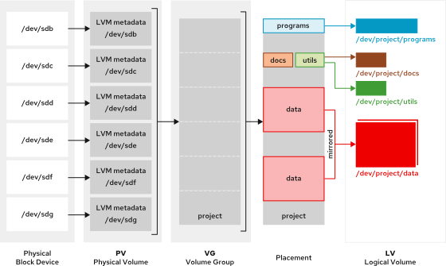

Quản trị hệ thống Red Hat 2
---------------------------

# Chương 11. Quản lý lưu trữ bằng Logical Volume Manager
## Tạo các volume logic
### Mục tiêu
Mô tả cách thức hoạt động của Logical Volume Manager (LVM), đồng thời sử dụng LVM để tạo một volume logic, định dạng volume đó bằng một
hệ thống tập tin và thực hiện mount volume.

### Tổng quan về Trình quản lý Volume Logic (LVM)
Sử dụng hệ thống LVM để tạo các phân vùng lưu trữ logic (logical volume) như một lớp nằm trên hệ thống lưu trữ vật lý. Hệ thống lưu trữ
này mang lại sự linh hoạt cao hơn so với việc sử dụng trực tiếp bộ nhớ vật lý. LVM ẩn đi cấu hình phần cứng lưu trữ khỏi lớp phần mềm,
đồng thời cho phép bạn thay đổi kích thước các phân vùng mà không cần dừng ứng dụng hay ngắt kết nối (unmount) hệ thống tập tin. LVM
cung cấp các công cụ dòng lệnh toàn diện để quản lý lưu trữ.

**Các thiết bị vật lý**  
Các volume logic sử dụng các thiết bị vật lý để lưu trữ dữ liệu. Các thiết bị này có thể là phân vùng đĩa, toàn bộ ổ đĩa, thiết bị RAID
(Redundant Array of Independent Disks) hoặc đĩa SAN (Storage Area Network). Bạn cần khởi tạo thiết bị để trở thành một volume vật lý
LVM. Một volume vật lý LVM phải sử dụng toàn bộ thiết bị vật lý đó.

**Các Physical Volume (PV)**  
LVM sử dụng thiết bị vật lý bên dưới làm Physical Volume (PV) của LVM. Các công cụ LVM chia nhỏ PV thành các Physical Extent (PE) để
tạo ra những phần dữ liệu nhỏ đóng vai trò là khối lưu trữ cơ sở nhất trên PV đó.

**Nhóm ổ đĩa (Volume Groups - VG)**  
Nhóm ổ đĩa là một vùng chứa dữ liệu (storage pool) được tạo thành từ một hoặc nhiều ổ đĩa vật lý (PV). Về mặt chức năng, nó tương đương
với một ổ đĩa vật lý hoàn chỉnh. Mỗi PV chỉ được phép thuộc về một VG duy nhất. LVM tự động thiết lập kích thước PE (Physical Extent),
mặc dù người dùng vẫn có thể tự chỉ định kích thước này. Một VG có thể bao gồm cả phần dung lượng chưa sử dụng và nhiều ổ đĩa logic
(logical volume).

**Các Logical Volume (LV)**  
Các Logical Volume được tạo ra từ các physical extent (PE) còn trống trong một Volume Group (VG) và đóng vai trò là thiết bị lưu trữ
cho các ứng dụng, người dùng và hệ điều hành. LV là tập hợp các logical extent (LE) được ánh xạ tới các physical extent. Theo mặc định,
mỗi LE được ánh xạ tới một PE. Việc thiết lập các tùy chọn cụ thể cho LV sẽ thay đổi cơ chế ánh xạ này; chẳng hạn, tính năng mirroring
(nhân bản) sẽ khiến mỗi LE được ánh xạ tới hai PE.

#### Quy trình làm việc của Logical Volume Manager
Việc tạo bộ lưu trữ LVM đòi hỏi phải thiết lập các cấu trúc theo một quy trình làm việc hợp lý. 

* Xác định các thiết bị vật lý sẽ trở thành các volume vật lý (physical volume) và khởi tạo chúng dưới dạng volume vật lý LVM. 
* Tạo một volume group (nhóm volume) từ nhiều volume vật lý. 
* Tạo các logical volume (volume logic) từ dung lượng khả dụng trong volume group. 
* Định dạng logical volume bằng một hệ thống tập tin và mount (gắn) nó, kích hoạt nó làm không gian swap, hoặc chuyển giao volume thô
(raw volume) cho cơ sở dữ liệu hay máy chủ lưu trữ để sử dụng cho các cấu trúc nâng cao.

**Hình 11.1: Quy trình làm việc của Logical Volume Manager**  


> Lưu ý: Các ví dụ ở đây sử dụng tên thiết bị `/dev/sdb` cùng các phân vùng lưu trữ của nó. Tên thiết bị trên hệ thống của bạn có thể
> sẽ khác. Hãy sử dụng các lệnh `lsblk`, `blkid` hoặc `cat /proc/partitions` để xác định các thiết bị trên hệ thống của bạn.

### Thiết lập bộ lưu trữ LVM
Việc tạo một logical volume (phân vùng logic) bao gồm các bước: tạo các phân vùng thiết bị vật lý, physical volume (phân vùng vật lý)
và volume group (nhóm phân vùng). Sau khi tạo xong logical volume, hãy định dạng và mount (gắn) nó để có thể sử dụng làm bộ nhớ lưu trữ.

#### Chuẩn bị các thiết bị vật lý
> **Lưu ý**: Việc phân vùng là tùy chọn. Bạn có thể sử dụng toàn bộ thiết bị vật lý thô làm một volume vật lý.

Sử dụng lệnh parted để đặt nhãn cho phân vùng.

```console
root@host:~# parted /dev/sdb mklabel gpt mkpart primary 1MiB 769MiB
...output omitted...
```

Sử dụng lệnh parted để tạo phân vùng trên thiết bị vật lý.

```console
root@host:~# parted /dev/sdb mkpart secondary 770MiB 1026MiB
```

Thiết lập phân vùng đầu tiên thành loại phân vùng Linux LVM.

```console
root@host:~# parted /dev/sdb set 1 lvm on
```

Thiết lập phân vùng thứ hai thành loại phân vùng Linux LVM.

```console
root@host:~# parted /dev/sdb set 2 lvm on
```

Sử dụng lệnh `udevadm settle` để đăng ký phân vùng mới với kernel.

```console
root@host:~# udevadm settle
```

#### Tạo các Volume vật lý
Sử dụng lệnh `pvcreate` để gán nhãn cho phân vùng vật lý thành một volume vật lý (PV) của LVM. Bạn có thể gán nhãn cho nhiều thiết bị
cùng lúc bằng cách liệt kê tên các thiết bị (cách nhau bằng dấu cách) làm đối số cho lệnh `pvcreate`.

Ví dụ này gán nhãn cho các thiết bị `/dev/sdb1` và `/dev/sdb2` thành các PV sẵn sàng để tạo volume group.

```console
root@host:~# pvcreate /dev/sdb1 /dev/sdb2
  Physical volume "/dev/sdb1" successfully created.
  Physical volume "/dev/sdb2" successfully created.
  Creating devices file /etc/lvm/devices/system.devices
```

#### Tạo Nhóm Volume
Lệnh `vgcreate` tạo một nhóm ổ đĩa (volume group) từ một hoặc nhiều ổ đĩa vật lý (physical volume). Tham số đầu tiên là tên của nhóm ổ
đĩa, theo sau là một hoặc nhiều ổ đĩa vật lý được cấp phát cho nhóm này.

Ví dụ này tạo nhóm ổ đĩa `vg01` bằng cách sử dụng các ổ đĩa vật lý `/dev/sdb1` và `/dev/sdb2`.

```console
root@host:~# vgcreate vg01 /dev/sdb1 /dev/sdb2
  Volume group "vg01" successfully created
```

#### Tạo một Logical Volume
Lệnh `lvcreate` tạo một volume logic từ các PE có sẵn trong một volume group. Hãy sử dụng lệnh `lvcreate` để thiết lập tên và kích
thước cho LV, cũng như tên của VG sẽ chứa volume logic này.

Ví dụ này tạo một LV có tên `lv01` với kích thước 300 MiB bên trong VG có tên `vg01`.

```
root@host:~# lvcreate -n lv01 -L 300M vg01
  Logical volume "lv01" created.
```

Lệnh này có thể thất bại nếu nhóm volume (volume group) không có đủ các physical extent (đơn vị phân bổ vật lý) trống. Kích thước của
LV sẽ được làm tròn lên giá trị bội số gần nhất của kích thước PE nếu kích thước được chỉ định không khớp chính xác.

Tùy chọn `-L` của lệnh `lvcreate` yêu cầu kích thước được tính bằng byte, mebibyte (megabyte nhị phân), gibibyte (gigabyte nhị phân)
hoặc các đơn vị tương đương. Ngược lại, tùy chọn `-l` (chữ thường) yêu cầu kích thước được xác định dựa trên số lượng physical extent.

Dưới đây là hai cách để tạo cùng một LV với cùng kích thước:

* `lvcreate -n lv01 -L 128M vg01` : Tạo LV có kích thước 128 MiB, được làm tròn lên bội số PE gần nhất. 
* `lvcreate -n lv01 -l 32 vg01` : Tạo LV có kích thước 32 PE (với mỗi PE là 4 MiB), tổng cộng là 128 MiB.

#### Tạo hệ thống tệp trên Logical Volume
Xác định logical volume bằng cách sử dụng tên truyền thống `/dev/vgname/lvname` hoặc tên kernel device mapper
`/dev/mapper/vgname-lvname`.

Sử dụng lệnh `mkfs` để tạo hệ thống tập tin trên logical volume mới.

```console
root@host:~# mkfs -t xfs /dev/vg01/lv01
...output omitted...
```

Tạo điểm gắn bằng cách sử dụng lệnh `mkdir`.

```console
root@host:~# mkdir /mnt/data
```

Để hệ thống tệp luôn khả dụng một cách bền vững, hãy thêm một mục vào tệp `/etc/fstab`.

```
/dev/vg01/lv01 /mnt/data xfs defaults 0 0
```

Cập nhật daemon systemd với tệp cấu hình /etc/fstab mới.

```console
root@host:~# systemctl daemon-reload
```

Gắn LV bằng cách sử dụng lệnh mount.

```console
root@host:~# mount /mnt/data/
```

> **Lưu ý**: Bạn có thể mount (gắn) một logical volume dựa trên tên hoặc UUID, vì LVM xác định các PV bằng cách tìm kiếm UUID. Quá
trình này vẫn thực hiện thành công ngay cả khi VG được tạo bằng tên, bởi vì PV luôn chứa UUID.

### Hiển thị trạng thái thành phần LVM
LVM cung cấp nhiều tiện ích để hiển thị thông tin trạng thái của PV, VG và LV. Hãy sử dụng các lệnh `pvdisplay`, `vgdisplay` và
`lvdisplay` để xem thông tin trạng thái của các thành phần LVM.

Các lệnh tương ứng là `pvs`, `vgs` và `lvs` cũng thường được sử dụng; chúng hiển thị một phần thông tin trạng thái, với mỗi thực thể
được trình bày trên một dòng.

#### Hiển thị thông tin về Physical Volume
Lệnh `pvdisplay` hiển thị thông tin về các PV. Hãy sử dụng lệnh này mà không cần tham số để liệt kê thông tin của tất cả các PV trên hệ
thống. Việc cung cấp tên PV làm tham số cho lệnh sẽ hiển thị thông tin cụ thể về PV đó.

Sử dụng lệnh `pvdisplay` để hiển thị thông tin cho PV `/dev/sdb1`:

```console
root@host:~# pvdisplay /dev/sdb1
  --- Physical volume ---
  PV Name               /dev/sdb1                         (1)
  VG Name               vg01                              (2)
  PV Size               768.00 MiB / not usable 4.00 MiB  (3)
  Allocatable           yes
  PE Size               4.00 MiB                          (4)
  Total PE              191
  Free PE               116                               (5)
  Allocated PE          75
  PV UUID               evAimq-gs8W-6X9C-3H6q-ndDk-pvTx-QEZ9Jc
```

1. `PV Name` hiển thị tên thiết bị.
2. `VG Name` hiển thị nhóm volume (volume group) mà PV được cấp phát vào.
3. `PV Size` hiển thị kích thước vật lý của PV, bao gồm cả phần không gian không sử dụng được.
4. `PE Size` hiển thị kích thước của physical extent (đơn vị phân bổ vật lý).
5. `Free PE` hiển thị kích thước PE còn trống trong VG để tạo LV hoặc mở rộng các LV hiện có.


#### Hiển thị thông tin nhóm ổ đĩa
Lệnh vgdisplay hiển thị thông tin về các nhóm ổ đĩa (volume group). Để liệt kê thông tin về tất cả các VG, hãy sử dụng lệnh mà không
cần tham số. Hãy cung cấp tên VG làm tham số để liệt kê thông tin cụ thể về VG đó.

Sử dụng lệnh `vgdisplay` để hiển thị thông tin cho nhóm ổ đĩa `vg01`:

```console
root@host:~# vgdisplay vg01
  --- Volume group ---
  VG Name               vg01                (1)
  System ID
  Format                lvm2
  Metadata Areas        2
  Metadata Sequence No  2
  VG Access             read/write
  VG Status             resizable
  MAX LV                0
  Cur LV                1
  Open LV               1
  Max PV                0
  Cur PV                2
  Act PV                2
  VG Size               1016.00 MiB         (2)
  PE Size               4.00 MiB
  Total PE              254                 (3)
  Alloc PE / Size       75 / 300.00 MiB
  Free  PE / Size       179 / 716.00 MiB    (4)
  VG UUID               F5a4lm-Ln8v-cYM0-YJth-f7fj-lQYZ-1AP8Zu
```

1. `VG Name` hiển thị tên của nhóm volume (volume group).
2. `VG Size` hiển thị tổng dung lượng của nhóm lưu trữ (storage pool) khả dụng để cấp phát cho các LV.
3. `Total PE` hiển thị tổng dung lượng của các đơn vị PE.
4. `Free PE /` Size hiển thị dung lượng còn trống trong VG để tạo hoặc mở rộng các LV.

#### Hiển thị thông tin về volume logic
Lệnh lvdisplay hiển thị thông tin về các volume logic (LV). Hãy sử dụng lệnh này mà không kèm tham số để liệt kê thông tin của tất cả
các LV. Việc cung cấp tên LV làm tham số sẽ hiển thị thông tin cụ thể của LV đó.

Sử dụng lệnh `lvdisplay` để hiển thị thông tin cho volume `/dev/vg01/lv01`.

```console
root@host:~# lvdisplay /dev/vg01/lv01
  --- Logical volume ---
  LV Path                /dev/vg01/lv01         (1)
  LV Name                lv01
  VG Name                vg01                   (2)
  LV UUID                7Toe5z-ozzv-aW4I-mJYQ-2VOV-MiP2-hNGFCf
  LV Write Access        read/write
  LV Creation host, time servera, 2025-06-18 18:49:54 +0000
  LV Status              available
  # open                 1
  LV Size                300.00 MiB             (3)
  Current LE             75                     (4)
  Segments               1
  Allocation             inherit
  Read ahead sectors     auto
  - currently set to     8192
  Block device           253:0
```

1. `LV Path` hiển thị tên thiết bị của LV.
2. `VG Name` hiển thị VG được sử dụng để tạo LV này.
3. `LV Size` hiển thị tổng dung lượng của LV. Hãy sử dụng các công cụ quản lý hệ thống tập tin để xác định dung lượng trống và dung
lượng đã sử dụng của LV.
4. `Current LE` hiển thị số lượng logical extent mà LV này đang sử dụng.

## Mở rộng Logical Volume
### Mục tiêu
Tăng dung lượng lưu trữ cho một volume logic và mở rộng hệ thống tập tin hoặc không gian swap của nó để sử dụng phần dung lượng bổ
sung này.

### Tăng dung lượng lưu trữ của một Logical Volume
Một lợi ích của việc sử dụng logical volume (LV) là khả năng tăng kích thước mà không gây gián đoạn dịch vụ (downtime). Bạn có thể
thêm các physical extent (đơn vị phân bổ vật lý) còn trống từ volume group (VG) vào LV để mở rộng dung lượng LV và hệ thống tập tin.
Hãy sử dụng lệnh `vgdisplay` để xác nhận rằng volume group có đủ dung lượng trống cho việc mở rộng LV.

Sử dụng lệnh `lvextend` để mở rộng LV:

```console
root@host:~# lvextend -L +500M /dev/vg01/lv01
  Size of logical volume vg01/lv01 changed from 512.00 MiB (128 extents) to 1012.00 MiB (253 extents).
  Logical volume vg01/lv01 successfully resized.
```

Lệnh này tăng kích thước của volume logic lv01 thêm 500 MiB. Dấu cộng (`+`) đặt trước kích thước có nghĩa là cộng giá trị này vào kích
thước hiện tại; ngược lại, nếu không có dấu cộng, giá trị đó sẽ xác định kích thước cuối cùng của LV.

Tùy chọn `-l` của lệnh `lvextend` yêu cầu tham số là số lượng PE.

Tùy chọn `-L` của lệnh `lvextend` yêu cầu kích thước được chỉ định theo đơn vị byte, mebibyte, gibibyte hoặc các đơn vị tương tự.

#### Mở rộng hệ thống tệp XFS theo kích thước của Logical Volume
Lệnh `xfs_growfs` giúp mở rộng hệ thống tập tin để chiếm dụng phần LV đã được mở rộng. Hệ thống tập tin đích phải được mount trước khi
bạn sử dụng lệnh `xfs_growfs`. Bạn có thể tiếp tục sử dụng hệ thống tập tin trong quá trình thay đổi kích thước.

Sử dụng lệnh `xfs_growfs` để mở rộng hệ thống tập tin XFS:

```console
root@host:~# xfs_growfs /mnt/data/
...output omitted...
data blocks changed from 131072 to 259072
```

> **Quan trọng**: Luôn chạy lệnh `xfs_growfs` sau khi thực thi lệnh `lvextend`. Hãy sử dụng tùy chọn `-r` của lệnh `lvextend` để thực
> hiện hai bước này một cách liên tục. Hệ thống tệp XFS cần được mount (gắn kết) trước khi thay đổi kích thước; nếu hệ thống tệp chưa
> được mount, tùy chọn `-r` sẽ tạo một thư mục điểm mount tạm thời để thực hiện thao tác.  
> Ngoài ra, sau khi mở rộng LV, bạn có thể thay đổi kích thước hệ thống tệp bằng cách sử dụng lệnh `fsadm`. Lệnh này có phạm vi áp
> dụng rộng hơn vì nó hỗ trợ nhiều loại hệ thống tệp khác nhau.

#### Mở rộng hệ thống tệp EXT4 theo kích thước của Logical Volume
Các bước mở rộng LV sử dụng hệ thống tệp ext4 cũng tương tự như đối với LV sử dụng hệ thống tệp XFS, ngoại trừ bước thay đổi kích
thước hệ thống tệp.

Lệnh `resize2fs` mở rộng hệ thống tệp để chiếm dụng phần LV mới được mở rộng. Bạn có thể tiếp tục sử dụng hệ thống tệp trong quá trình
thay đổi kích thước.

```console
root@host:~# resize2fs /dev/vg01/lv01
resize2fs 1.47.1 (20-May-2024)
Resizing the filesystem on /dev/vg01/lv01 to 259072 (4k) blocks.
The filesystem on /dev/vg01/lv01 is now 259072 (4k) blocks long.
```

Lệnh `xfs_growfs` được sử dụng để mở rộng hệ thống tập tin XFS. Lệnh này thường nhận điểm gắn (mount point) làm tham số; ngoài ra, nó
cũng có thể sử dụng tên thiết bị một cách gián tiếp bằng cách gắn thiết bị đó rồi chỉ định điểm gắn tương ứng.

Ngược lại, lệnh `resize2fs` dùng để thay đổi kích thước các hệ thống tập tin ext2, ext3 hoặc `ext4` và nhận tên thiết bị làm tham số.
Lệnh `xfs_growfs` chỉ hỗ trợ thay đổi kích thước khi hệ thống đang hoạt động (online), trong khi lệnh `resize2fs` hỗ trợ cả hai chế
độ: khi hệ thống đang hoạt động (online) và khi hệ thống không hoạt động (offline). Mặc dù bạn có thể tăng hoặc giảm kích thước hệ
thống tập tin `ext4`, nhưng với hệ thống tập tin XFS, bạn chỉ có thể tăng kích thước mà thôi.

#### Mở rộng các volume logic của không gian swap
Bạn có thể mở rộng các LV (Logical Volume) được sử dụng làm không gian swap; tuy nhiên, quy trình này khác với việc mở rộng hệ thống
tệp ext4 hoặc XFS. Các LV được sử dụng làm không gian swap cần phải ở trạng thái ngoại tuyến (offline) để có thể mở rộng.

Sử dụng lệnh `swapoff` để vô hiệu hóa không gian swap trên LV:

```console
root@host:~# swapoff -v /dev/vg01/swap
swapoff /dev/vg01/swap
```

Sử dụng lệnh `lvextend` để mở rộng LV:

```console
root@host:~# lvextend -L +300M /dev/vg01/swap
  Size of logical volume vg01/swap changed from 500.00 MiB (125 extents) to 800.00 MiB (200 extents).
  Logical volume vg01/swap successfully resized.
```

Sử dụng lệnh `mkswap` để định dạng LV thành vùng swap:

```console
root@host:~# mkswap /dev/vg01/swap
mkswap: /dev/vg01/swap: warning: wiping old swap signature.
Setting up swapspace version 1, size = 800 MiB (838856704 bytes)
no label, UUID=690ef204-9d59-4b3c-b145-eb8ba591ead8
```

Sử dụng lệnh `swapon` để kích hoạt không gian swap trên LV:

```console
root@host:~# swapon /dev/vg01/swap
```

> **Quan trọng**: Hãy lưu ý các vấn đề có thể phát sinh khi thực hiện thao tác này trên hệ thống đang hoạt động.  
> Đôi khi, không có đủ bộ nhớ vật lý để chứa dữ liệu được giải phóng từ vùng swap (thông qua việc đẩy dữ liệu từ swap trở lại bộ nhớ)
> khi vùng swap bị tắt. Trong những trường hợp đó, bạn có thể gặp lỗi thiếu bộ nhớ (OOM) và hệ thống có thể hoạt động không như mong
> đợi.  
> Hãy đảm bảo rằng vùng swap không đang được sử dụng ở mức cao khi thực hiện thao tác này. Một giải pháp thay thế là tạo thêm một vùng
> swap dựa trên LV (Logical Volume) với kích thước mong muốn, kích hoạt nó, rồi sau đó vô hiệu hóa volume cũ. Sau khi LV cũ đã được vô
> hiệu hóa hoàn toàn, bạn có thể xóa LV đó để thu hồi các extent cho VG (Volume Group).

## Thay thế các Physical Volume và quản lý LVM
### Mục tiêu
Thay thế các volume vật lý (physical volume) có dung lượng nhỏ hoặc bị lỗi trong một volume group, đồng thời loại bỏ các volume logic
(logical volume), volume group hoặc volume vật lý không còn được sử dụng.

### Thay thế một Physical Volume trong một Volume Group
Bạn có thể gặp tình huống cần thay thế một PV trong VG do lỗi phần cứng, thiếu dung lượng hoặc các lý do khác. LVM cung cấp các công
cụ dòng lệnh để thực hiện thao tác này một cách an toàn, ngay cả khi các LV đang hoạt động và đã được mount.

#### Mở rộng dung lượng lưu trữ của nhóm ổ đĩa
Bạn có thể cần thêm dung lượng đĩa để mở rộng một VG. Bạn có thể thêm các physical volume (ổ đĩa vật lý) vào VG để tăng dung lượng khả
dụng của nó.

Hãy chuẩn bị thiết bị vật lý và tạo physical volume nếu nó chưa tồn tại.

```console
root@host:~# pvcreate /dev/sdb3
  Physical volume "/dev/sdb3" successfully created.
```

Lệnh `vgextend` thêm PV mới vào VG. Lệnh này mở rộng VG `vg01` thêm dung lượng của PV `/dev/sdb3`.

```console
root@host:~# vgextend vg01 /dev/sdb3
  Volume group "vg01" successfully extended
```

#### Giảm dung lượng lưu trữ của nhóm ổ đĩa
Việc giảm dung lượng lưu trữ của một VG bao gồm việc loại bỏ các PV không sử dụng khỏi VG đó. Lệnh `pvmove` di chuyển dữ liệu từ các
extent trên một PV sang các extent trên một PV khác (có đủ số lượng extent trống) nằm trong cùng VG. Bạn vẫn có thể tiếp tục sử dụng
LV thuộc VG đó trong quá trình giảm dung lượng lưu trữ.

Hãy sử dụng tùy chọn `-A` của lệnh `pvmove` để tự động sao lưu metadata của VG sau khi thực hiện thay đổi. Tùy chọn này sử dụng lệnh
`vgcfgbackup` để thực hiện việc sao lưu metadata một cách tự động.

```console
root@host:~# pvmove -A y /dev/sdb1
  /dev/sdb1: Moved: 2.74%
  ...output omitted...
  /dev/sdb1: Moved: 100.00%
```

> **Cảnh báo**: Trước khi sử dụng lệnh `pvmove`, hãy sao lưu dữ liệu được lưu trữ trên tất cả các LV trong VG. Việc mất điện đột ngột
trong quá trình thực hiện có thể khiến VG rơi vào trạng thái không nhất quán, dẫn đến nguy cơ mất dữ liệu trên các LV.

Sử dụng lệnh `vgreduce` để loại bỏ một PV khỏi một VG.

```console
root@host:~# vgreduce vg01 /dev/sdb1
  Removed "/dev/sdb1" from volume group "vg01"
```

### Xóa bộ lưu trữ LVM
Sử dụng các lệnh `lvremove`, `vgremove` hoặc `pvremove` để xóa thành phần LVM không còn cần thiết nữa.

> **Cảnh báo**: Các lệnh `lvremove`, `vgremove` và `pvremove` là những thao tác có tính phá hủy và không thể khôi phục. Chỉ sử dụng
> các lệnh này khi bạn chắc chắn rằng thành phần LVM đó không còn cần thiết hoặc không còn được sử dụng nữa.

#### Chuẩn bị hệ thống tệp
Di chuyển tất cả dữ liệu cần lưu giữ sang một hệ thống tệp khác. Sử dụng lệnh `umount` để ngắt kết nối hệ thống tệp, sau đó xóa các
mục trong `/etc/fstab` có liên quan đến hệ thống tệp này.

```console
root@host:~# umount /mnt/data
```

#### Xóa Logical Volume
Sử dụng lệnh `lvremove` để xóa một logical volume (LV) không còn cần thiết. Hãy ngắt kết nối (unmount) hệ thống tập tin của LV trước
khi chạy lệnh này. Lệnh sẽ yêu cầu xác nhận trước khi thực hiện xóa LV.

```console
root@host:~# lvremove /dev/vg01/lv01
Do you really want to remove active logical volume vg01/lv01? [y/n]: y
  Logical volume "lv01" successfully removed.
```

Các extents vật lý của LV được giải phóng và sẵn sàng để gán cho các LV hiện có hoặc LV mới trong volume group.

#### Xóa Nhóm Volume
Sử dụng lệnh `vgremove` để xóa một nhóm volume (volume group) không còn cần thiết nữa.

```console
root@host:~# vgremove vg01
  Volume group "vg01" successfully removed
```

Các ổ vật lý (PV) của VG được giải phóng và sẵn sàng để gán cho các VG hiện có hoặc VG mới trên hệ thống.

#### Xóa các Volume vật lý
Sử dụng lệnh `pvremove` để xóa các volume vật lý (PV) không còn cần thiết. Hãy sử dụng danh sách các thiết bị PV được phân tách bằng
dấu cách nếu bạn cần xóa nhiều thiết bị cùng lúc. Lệnh này sẽ xóa siêu dữ liệu PV khỏi phân vùng (hoặc đĩa).

```console
root@host:~# pvremove /dev/sdb2 /dev/sdb3
  Labels on physical volume "/dev/sdb2" successfully wiped.
  Labels on physical volume "/dev/sdb3" successfully wiped.
```

Phân vùng hiện đã sẵn sàng để phân bổ lại hoặc định dạng lại.
