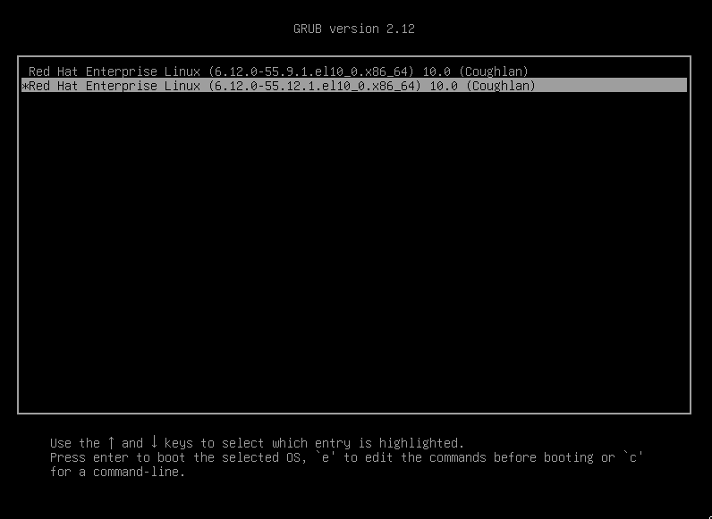
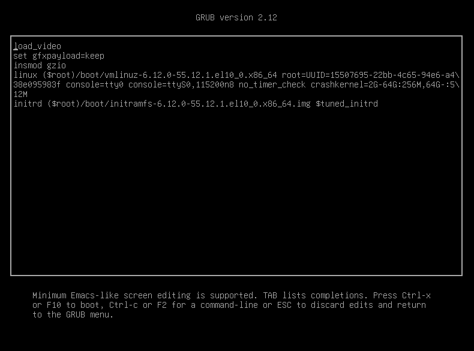

Quản trị hệ thống Red Hat 2
---------------------------

# Chương 12. Kiểm soát và khắc phục sự cố quy trình khởi động
## Quản lý Bộ nạp khởi động và Dòng lệnh Kernel
### Mục tiêu
Mô tả cách boot loader lựa chọn và nạp hệ điều hành, cách cài đặt lại boot loader, cũng như cách sửa đổi cấu hình boot loader và các
tham số dòng lệnh của kernel.

### Bộ nạp khởi động
Các hệ thống máy tính hiện đại là sự kết hợp phức tạp giữa phần cứng và phần mềm. Quá trình chuyển từ trạng thái chưa xác định (khi máy
đang tắt) sang trạng thái hệ thống đã khởi động và hiển thị màn hình đăng nhập đòi hỏi sự phối hợp của nhiều thành phần phần cứng và
phần mềm.

Khi máy tính được bật, hệ thống khởi động dạng firmware sẽ được nạp từ chip ROM trên bo mạch chủ. Trên các máy tính kiến trúc x86 hiện
đại, hệ thống này thường là UEFI (Unified Extensible Firmware Interface) hoặc BIOS (Basic Input/Output System). BIOS phổ biến hơn ở các
máy được sản xuất trước năm 2020, trong khi UEFI là hệ thống thường thấy nhất trên các bo mạch chủ hiện nay.

Nhiệm vụ của hệ thống khởi động dạng firmware là nạp chương trình khởi động (boot loader) từ ổ đĩa và chuyển quyền kiểm soát quá trình
khởi động cho chương trình này. Boot loader là các chương trình được thiết kế để giao tiếp với hệ thống khởi động dạng firmware, thiết
lập các thông số hệ thống cho quá trình khởi động, và sau đó kích hoạt nhân hệ điều hành (kernel) để tiếp tục quá trình khởi tạo hệ
thống. Boot loader mặc định cho Red Hat Enterprise Linux 10 là GRUB2 (GRand Unified Bootloader phiên bản 2).

#### GRUB2 với UEFI
Trong hệ thống UEFI, firmware khởi động sẽ đọc các thiết lập từ bộ nhớ NVRAM (nonvolatile RAM) để xác định ổ đĩa và ứng dụng EFI
(Extensible Firmware Interface) cần nạp. Ổ đĩa này thường chứa một phân vùng hệ thống EFI, vốn thường được gắn (mount) vào thư mục
`/boot/efi`. GRUB2 tạo ra các tập tin mà hệ thống UEFI có thể nạp được. Sau khi ứng dụng EFI của bộ nạp khởi động GRUB2 được nạp,
hệ thống sẽ chuyển sang giai đoạn khởi động tiếp theo.

#### GRUB2 với BIOS
Trong hệ thống BIOS, firmware khởi động sẽ đọc một sector khởi động (boot sector) được định dạng đặc biệt trên đĩa để lấy tệp ảnh bộ
nạp khởi động `boot.img`. Tệp ảnh bộ nạp khởi động này sẽ nạp tệp ảnh `core.img` từ vùng MBR chưa được phân vùng nằm trước phân vùng
đầu tiên. Tệp ảnh `core.img` tiếp tục nạp các mô-đun bổ sung có khả năng khởi tạo hệ thống tệp, và hệ thống sẽ chuyển sang giai đoạn
khởi động tiếp theo. GRUB2 thực hiện tạo và cài đặt các tệp ảnh này vào vùng MBR trên đĩa.

#### Các giai đoạn khởi động tiếp theo
Sau khi GRUB2 đã khởi tạo hoàn tất và nạp các ổ đĩa, nó sẽ hiển thị menu khởi động cho người dùng.

**Hình 12.1: Menu GRUB2**  


Từ menu khởi động này, bạn có thể chọn kernel đã được cấu hình sẵn để khởi động, cũng như áp dụng các tham số kernel cho quá trình khởi
động. Gói kernel Linux thường tự động tạo các mục menu khởi động này khi bạn cài đặt một phiên bản mới.

Để chỉnh sửa một mục khởi động trong menu GRUB2, bạn có thể sử dụng trình soạn thảo tích hợp sẵn. Bạn có thể truy cập trình soạn thảo
này trong GRUB2 bằng cách nhấn phím `E`.

**Hình 12.2: Trình chỉnh sửa GRUB2**  


Các thay đổi được thực hiện trong trình chỉnh sửa GRUB2 chỉ áp dụng cho phiên khởi động hiện tại. Để các thay đổi này được duy trì cho
những lần khởi động sau, bạn có thể thực hiện chúng bằng cách sử dụng lệnh `grubby`.

### Điều khiển GRUB2 từ hệ thống đã khởi động
Bạn có thể sửa đổi cấu hình mặc định của GRUB2 bằng cách sử dụng lệnh `grubby`. Lệnh `grubby` cho phép thực hiện nhiều tác vụ khác
nhau, chẳng hạn như thêm hoặc xóa các tham số kernel, thay đổi mục mặc định trong menu khởi động và xem thông tin về các mục hiện có
trong menu khởi động.

Để xem thông tin về một mục hiện có, bạn có thể sử dụng tùy chọn `--info` của lệnh `grubby`.

```console
user@host:~$ grubby --info 1
index=1 1
kernel="/boot/vmlinuz-6.12.0-55.12.1.el10_0.x86_64" 2
args="console=tty0 ... crashkernel=2G-64G:256M,64G-:512M $tuned_params" 3
root="UUID=15507695-22bb-4c65-94e6-a438e095983f" 4
initrd="/boot/initramfs-6.12.0-55.12.1.el10_0.x86_64.img $tuned_initrd" 5
title="Red Hat Enterprise Linux (6.12.0-55.12.1.el10_0.x86_64) 10.0 (Coughlan)" 6
id="b70d796f931842cb9776f658cd068435-6.12.0-55.12.1.el10_0.x86_64" 7
```

1. Giá trị `index` là số thứ tự của mục trong danh sách menu khởi động, bắt đầu từ 0.
2. Giá trị `kernel` là đường dẫn đến nhân Linux mà GRUB2 sẽ nạp.
3. Giá trị `args` là danh sách các tham số được truyền cho nhân Linux.
4. Giá trị `root` là thiết bị khối chứa nhân Linux và ảnh initramfs.
5. Giá trị `initrd` là đường dẫn đến ảnh hệ thống tệp RAM ban đầu, nơi diễn ra các giai đoạn khởi động sớm của Linux.
6. Giá trị `title` là tên hiển thị cho mục khởi động trong menu khởi động GRUB2.
7. Giá trị `id` là mã định danh duy nhất cho mục khởi động này.

Để thay đổi mục khởi động mặc định sao cho GRUB2 tự động chọn mục đó khi khởi động, bạn có thể sử dụng lệnh `grubby` với tùy chọn
`--set-default-index`.

```console
root@host:~# grubby --set-default-index 0
The default is /boot/loader/entries/ffffffffffffffffffffffffffffffff-6.12.0-55.9.1.el10_0.x86_64.conf with index 0 and kernel /boot/vmlinuz-6.12.0-55.9.1.el10_0.x86_64
```

#### Các tham số dòng lệnh của kernel
Bạn có thể truyền các tham số khác nhau cho nhân Linux để cấu hình hệ thống trong quá trình khởi động. Trong một số trường hợp, tham số
dòng lệnh là cách duy nhất để thay đổi cấu hình, chẳng hạn như xác định cách nhân hệ thống phản ứng khi xảy ra sự cố (crash). Các tham
số dòng lệnh của nhân và cơ chế hoạt động cụ thể sẽ phụ thuộc vào phiên bản nhân Linux mà bạn đã cài đặt.

Để thêm tham số dòng lệnh hoặc thực hiện các thay đổi khác liên quan đến nhân, bạn có thể sử dụng tùy chọn `--update-kernel` của lệnh
`grubby`.

Ví dụ sau đây thêm tham số dòng lệnh `rhgb quiet` để ẩn các thông báo khởi động của nhân bằng cách sử dụng tùy chọn `--args`:

```console
root@host:~# grubby --update-kernel /boot/vmlinuz-6.12.0-55.9.1.el10_0.x86_64 \
--args="rhgb quiet"
```

Để loại bỏ đối số dòng lệnh, hãy thêm đối số `rhgb quiet` bằng cách sử dụng tùy chọn `--remove-args`:

```console
root@host:~# grubby --update-kernel /boot/vmlinuz-6.12.0-55.9.1.el10_0.x86_64 \
--remove-args="rhgb quiet"
```

## Khám phá quy trình khởi động và chọn target khởi động
## Mục tiêu
Mô tả quy trình khởi động của hệ thống Red Hat Enterprise Linux, thay đổi target khởi động mặc định và khởi động thủ công hệ thống vào
một target khác với target mặc định.

### Khởi tạo hệ thống trong Red Hat Enterprise Linux 10
Sau khi hệ thống được cấp điện và trình nạp khởi động (boot loader) bắt đầu hoạt động, quy trình khởi tạo hệ thống sẽ diễn ra.

Danh sách dưới đây cung cấp cái nhìn tổng quan về quy trình khởi tạo hệ thống trong Red Hat Enterprise Linux 10.

* Bộ nạp khởi động (boot loader) tải kernel và ảnh initramfs từ đĩa rồi đưa chúng vào bộ nhớ. Ảnh initramfs là một tệp lưu trữ chứa
các mô-đun kernel cho mọi phần cứng cần thiết khi khởi động, các tập lệnh khởi tạo, và nhiều thành phần khác. Trong RHEL 10, ảnh
initramfs chứa một hệ thống tệp gốc có khả năng khởi động, bao gồm kernel đang chạy và một unit systemd. Bạn có thể sử dụng lệnh
`lsinitrd` để kiểm tra ảnh initramfs và giải nén nội dung của nó.
* Bộ nạp khởi động chuyển quyền điều khiển cho kernel, kèm theo các tùy chọn được chỉ định trên dòng lệnh kernel và vị trí của ảnh
`initramfs` trong bộ nhớ.
* Kernel khởi tạo tất cả các phần cứng mà nó tìm thấy trình điều khiển (driver) trong ảnh initramfs, sau đó thực thi tập lệnh
`/sbin/init` từ ảnh initramfs với tư cách là tiến trình có PID 1. Bạn có thể thay thế tập lệnh này bằng cách sử dụng tham số kernel
`init=`. Trong RHEL 10, tập lệnh `/sbin/init` là một liên kết tượng trưng (symbolic link) trỏ đến unit systemd.
* Unit systemd từ ảnh initramfs thực thi tất cả các unit thuộc target `initrd.target`. Unit này bao gồm việc gắn (mount) hệ thống tệp
gốc vào thư mục `/sysroot` (được liệt kê trong tệp `/etc/fstab` trên đĩa).
* Kernel thực hiện chuyển đổi (pivot) hệ thống tệp gốc từ ảnh initramfs sang hệ thống tệp gốc nằm trong thư mục `/sysroot`. Sau đó,
unit systemd tự thực thi lại bằng cách sử dụng bản sao của unit systemd đã được cài đặt trên đĩa.
* Tiếp theo, unit systemd nắm quyền kiểm soát hoàn toàn quá trình khởi động. Unit systemd tìm kiếm target mặc định—được cấu hình trên
hệ thống hoặc được truyền vào từ dòng lệnh kernel. Sau đó, unit systemd khởi động (và dừng) các unit để tuân theo cấu hình của target
đó, đồng thời tự động giải quyết các phụ thuộc giữa các unit.
* Các target này thường khởi động giao diện đăng nhập dạng văn bản hoặc màn hình đăng nhập đồ họa, qua đó hoàn tất quá trình khởi động.

### Chọn một Target systemd
Một systemd target là tập hợp các systemd unit mà hệ thống cần khởi động để đạt được trạng thái mong muốn.

Bảng dưới đây liệt kê các target quan trọng nhất.

**Bảng 12.1. Các target thường được sử dụng**

| Target            | Mục đích                                                                                                                |
|-------------------|-------------------------------------------------------------------------------------------------------------------------|
| graphical.target  | Target này hỗ trợ nhiều người dùng và cung cấp các phương thức đăng nhập dạng đồ họa cũng như dạng văn bản.             |
| multi-user.target | Target này hỗ trợ nhiều người dùng và chỉ cung cấp phương thức đăng nhập dựa trên văn bản.                              |
| rescue.target     | Target này cung cấp một hệ thống dành cho người dùng duy nhất để cho phép sửa chữa hệ thống của bạn.                    |
| emergency.target  | Target này khởi động hệ thống tối giản nhất để sửa chữa hệ thống của bạn khi đơn vị rescue.target không khởi động được. |

Một target có thể là một phần của target khác. Ví dụ, unit `graphical.target` bao gồm unit `multi-user.target`, vốn phụ thuộc vào unit
`basic.target` và các unit khác.

Bạn có thể xem các mối quan hệ phụ thuộc này bằng lệnh sau:

```console
user@host:~$ systemctl list-dependencies graphical.target | grep target
graphical.target
* └─multi-user.target
*   ├─basic.target
*   │ ├─paths.target
*   │ ├─slices.target
*   │ ├─sockets.target
*   │ ├─sysinit.target
*   │ │ ├─cryptsetup.target
*   | | ├─integritysetup.target
*   │ │ ├─local-fs.target
...output omitted...
```

Để liệt kê các target có sẵn, hãy sử dụng lệnh sau:

```console
user@host:~$ systemctl list-units --type=target --all
  UNIT                      LOAD      ACTIVE   SUB    DESCRIPTION
  ---------------------------------------------------------------------------
  basic.target              loaded    active   active Basic System
...output omitted...
  cloud-config.target       loaded    active   active Cloud-config availability
  cloud-init.target         loaded    active   active Cloud-init target
  cryptsetup-pre.target     loaded    inactive dead   Local Encrypted Volumes (Pre)
  cryptsetup.target         loaded    active   active Local Encrypted Volumes
...output omitted...
```

#### Chọn target trong thời gian chạy
Trên hệ thống đang hoạt động, quản trị viên có thể chuyển sang một target khác bằng cách sử dụng lệnh `systemctl isolate`.

```console
root@host:~# systemctl isolate multi-user.target
```

Việc cô lập một target sẽ dừng tất cả các dịch vụ mà target đó không yêu cầu (cũng như các phụ thuộc của chúng) và khởi động bất kỳ
dịch vụ cần thiết nào chưa được chạy.

Không phải target nào cũng có thể được cô lập. Bạn chỉ có thể cô lập các target có thiết lập tùy chọn `AllowIsolate=yes` trong tệp
unit của chúng.

Ví dụ, bạn có thể cô lập target đồ họa (graphical target):

```console
user@host:~$ systemctl cat graphical.target
# /usr/lib/systemd/system/graphical.target
...output omitted...
[Unit]
Description=Graphical Interface
Documentation=man:systemd.special(7)
Requires=multi-user.target
Wants=display-manager.service
Conflicts=rescue.service rescue.target
After=multi-user.target rescue.service rescue.target display-manager.service
AllowIsolate=yes
```

Tuy nhiên, bạn không thể cô lập đích cryptsetup:

```console
user@host:~$ systemctl cat cryptsetup.target
# /usr/lib/systemd/system/cryptsetup.target
...output omitted...
[Unit]
Description=Local Encrypted Volumes
Documentation=man:systemd.special(7)
```

#### Đặt target mặc định
Khi hệ thống khởi động, unit systemd sẽ kích hoạt target `default.target`. Thông thường, tệp `default.target` trong thư mục `/etc/systemd/system` là một liên kết tượng trưng (symbolic link) trỏ đến `graphical.target` hoặc `multi-user.target`.

Thay vì chỉnh sửa liên kết tượng trưng này theo cách thủ công, lệnh `systemctl` cung cấp hai lệnh con để quản lý nó: `get-default` và
`set-default`.

Hãy sử dụng lệnh `systemctl` để xem target mặc định:

```console
root@host:~# systemctl get-default
multi-user.target
```

Sử dụng lệnh `systemctl` để đặt `graphical.target` làm đích mặc định:

```console
root@host:~# systemctl set-default graphical.target
Removed '/etc/systemd/system/default.target'.
Created symlink '/etc/systemd/system/default.target' → '/usr/lib/systemd/system/graphical.target'.
```

Sử dụng lệnh `systemctl` để kiểm tra target mặc định:

```console
root@host:~# systemctl get-default
graphical.target
```

#### Sử dụng các target khẩn cấp và cứu hộ.
Bằng cách thêm tùy chọn `systemd.unit=rescue.target` hoặc `systemd.unit=emergency.target` vào dòng lệnh kernel từ bộ nạp khởi động
(boot loader), hệ thống sẽ chuyển sang chế độ shell cứu hộ (rescue shell) hoặc khẩn cấp (emergency shell) thay vì thực hiện quy trình
khởi động thông thường. Cả hai chế độ shell này đều yêu cầu mật khẩu người dùng root.

Chế độ emergency target sẽ gắn (mount) hệ thống tập tin gốc ở chế độ chỉ đọc (read-only). Tại thời điểm này, người dùng root không thể
thay đổi tập tin `/etc/fstab` cho đến khi ổ đĩa được gắn lại ở chế độ đọc/ghi (read/write) bằng lệnh `mount -o remount,rw /`.

Ngược lại, chế độ rescue target sẽ chờ cho đến khi đơn vị `sysinit.target` hoàn tất quá trình xử lý; nhờ đó, nhiều thành phần hệ thống
hơn sẽ được khởi tạo, chẳng hạn như dịch vụ ghi nhật ký (logging service) hoặc việc gắn các hệ thống tập tin với quyền truy cập
đọc/ghi.

Quản trị viên có thể sử dụng các chế độ shell này để khắc phục những sự cố ngăn cản hệ thống khởi động như mong muốn, ví dụ như lỗi
vòng lặp phụ thuộc giữa các dịch vụ hoặc mục cấu hình không chính xác trong tập tin `/etc/fstab`. Sau khi thoát khỏi các chế độ shell
này, hệ thống sẽ tiếp tục thực hiện quy trình khởi động tiêu chuẩn.

#### Chọn target khác khi khởi động
Để chọn một target khác khi khởi động, hãy thêm tùy chọn `systemd.unit=target.target` vào dòng lệnh kernel từ trình nạp khởi động
(boot loader).

Ví dụ, để khởi động hệ thống vào rescue shell (nơi bạn có thể thay đổi cấu hình hệ thống mà hầu như không có dịch vụ nào đang chạy),
hãy thêm tùy chọn sau vào dòng lệnh kernel từ trình nạp khởi động:

```
systemd.unit=rescue.target
```

Thay đổi cấu hình này chỉ áp dụng cho một lần khởi động duy nhất và là công cụ hữu ích để khắc phục sự cố trong quá trình khởi động.

Để sử dụng phương pháp này nhằm chọn một đích khác, hãy thực hiện các bước sau:

1. Khởi động hoặc khởi động lại hệ thống.
2. Tại menu GRUB2, hãy ngắt quá trình đếm ngược bằng cách nhấn bất kỳ phím nào (trừ phím Enter, vì phím này sẽ kích hoạt quá trình
khởi động thông thường).
3. Di chuyển con trỏ đến mục kernel cần khởi động.
4. Nhấn phím E để chỉnh sửa mục hiện tại.
5. Di chuyển con trỏ đến dòng bắt đầu bằng từ `linux`; đây là dòng lệnh kernel.
6. Thêm `systemd.unit=target.target` vào cuối dòng; ví dụ: `systemd.unit=emergency.target`.
7. Nhấn tổ hợp phím `Ctrl+X` để khởi động với các thay đổi này.

### Tắt nguồn và Khởi động lại
Để tắt hoặc khởi động lại hệ thống đang chạy từ dòng lệnh, bạn có thể sử dụng lệnh `systemctl`.

Lệnh `systemctl poweroff` sẽ dừng tất cả các dịch vụ đang chạy, ngắt kết nối (unmount) tất cả các hệ thống tập tin (hoặc chuyển chúng
sang chế độ chỉ đọc nếu không thể ngắt kết nối), và sau đó tắt hệ thống.

Lệnh `systemctl reboot` sẽ dừng tất cả các dịch vụ đang chạy, ngắt kết nối tất cả các hệ thống tập tin, và sau đó khởi động lại hệ
thống.

Bạn cũng có thể sử dụng các phiên bản ngắn gọn hơn của những lệnh này là `poweroff` và `reboot`; đây là các liên kết tượng trưng
(symbolic link) trỏ đến các lệnh `systemctl` tương ứng.

> **Lưu ý**: Các lệnh `systemctl halt` và `halt` cũng có thể được sử dụng để dừng hệ thống. Khác với lệnh `poweroff`, các lệnh này
không thực hiện ngắt nguồn hệ thống; chúng chỉ đưa hệ thống về trạng thái an toàn để có thể ngắt nguồn theo cách thủ công.

## Sửa chữa hệ thống tập tin bị hỏng trong quá trình khởi động
### Mục tiêu
Sửa chữa các hệ thống tập tin bị cấu hình sai hoặc bị hỏng, gây gián đoạn quá trình khởi động.

### Các vấn đề về hệ thống tệp
Trong quá trình khởi động, unit của systemd sẽ thực hiện mount các hệ thống tập tin cố định được định nghĩa trong tập tin /etc/fstab.

Các lỗi trong tập tin /etc/fstab hoặc tình trạng hệ thống tập tin bị hỏng có thể ngăn cản hệ thống hoàn tất quá trình khởi động. Trong
một số trường hợp lỗi, hệ thống sẽ dừng quy trình khởi động và mở một shell khẩn cấp yêu cầu mật khẩu của người dùng root.

Danh sách dưới đây mô tả một số vấn đề thường gặp khi mount hệ thống tập tin trong quá trình phân tích tập tin /etc/fstab lúc khởi
động:

**Hệ thống tập tin bị lỗi**  
Unit systemd sẽ cố gắng sửa chữa hệ thống tập tin. Nếu sự cố không thể được tự động khắc phục, hệ thống sẽ mở một shell khẩn cấp.

**Thiết bị lưu trữ, UUID thiết bị hoặc điểm gắn (mount point) không tồn tại**  
Đơn vị systemd (systemd unit) bị quá thời gian chờ thiết bị lưu trữ sẵn sàng. Nếu thiết bị không phản hồi, hệ thống sẽ mở một shell
khẩn cấp.

#### Kiểm tra và sửa lỗi hỏng hệ thống tệp
Red Hat Enterprise Linux 10 cung cấp các công cụ để kiểm tra và khắc phục sự cố hệ thống tệp. Đối với các lỗi nhỏ được phát hiện trong
quá trình khởi động, các tiện ích này sẽ cố gắng tự động sửa chữa hệ thống tệp. Với các hệ thống tệp có cơ chế ghi nhật ký
(journaling) như XFS và ext4, đôi khi chỉ cần thực hiện thao tác phát lại nhật ký (replay the journal) – một quy trình thường diễn ra
rất nhanh chóng. Trong trường hợp hệ thống tệp bị hỏng nghiêm trọng hơn, quản trị viên hệ thống có thể sử dụng các công cụ này để kiểm
tra và sửa chữa theo cách thủ công.

Công cụ giúp duy trì trạng thái ổn định cho hệ thống tệp trong quá trình khởi động thường được gọi chung là công cụ kiểm tra hệ thống
tệp, hay lệnh `fsck`. Tuy nhiên, công cụ dùng để sửa chữa hệ thống tệp XFS lại không tuân theo quy tắc đặt tên này. Mặc dù hệ thống có
chứa tệp nhị phân `fsck.xfs`, nhưng mục đích duy nhất của nó chỉ là đáp ứng các yêu cầu khi khởi động, sau đó nó sẽ thoát ngay lập tức
với mã thoát là 0.

Lệnh `xfs_repair` có thể kiểm tra và khắc phục các sự cố trên hệ thống tệp XFS mà quy trình sửa chữa tự động không thể giải quyết được.

```console
root@host:~# xfs_repair block-device
```

Để thực hiện các thao tác kiểm tra và sửa chữa trên hệ thống tệp ext4, hãy sử dụng lệnh `fsck.ext4`; đây là một liên kết cứng (hard
link) trỏ đến lệnh `e2fsck` – lệnh vốn cũng hỗ trợ các hệ thống tệp ext3 và ext2 cũ hơn. Hãy sử dụng tùy chọn `-p` để tự động sửa chữa
các lỗi nhỏ mà không cần sự can thiệp của người dùng.

```console
root@host:~# fsck.ext4 -p block-device
```

> **Cảnh báo**: Quy trình đúng để sửa chữa hệ thống tệp là thực hiện gắn (mount) và ngắt kết nối (unmount) hệ thống tệp để quá trình
phát lại (replay) các tệp nhật ký diễn ra, nhằm tránh dữ liệu bị hỏng hoặc dữ liệu dư thừa. Ngoài ra, hệ thống tệp phải được ngắt kết
nối trước khi chạy các lệnh `xfs_repair` hoặc `e2fsck` để tránh nguy cơ mất hoặc hỏng dữ liệu.

#### Sửa lỗi hệ thống tệp khi khởi động
Để truy cập hệ thống không thể hoàn tất quá trình khởi động do các vấn đề về hệ thống tập tin, kiến trúc unit của systemd cung cấp một
đích khởi động khẩn cấp (emergency boot target); đích này mở ra một shell khẩn cấp yêu cầu mật khẩu root để truy cập.

Ví dụ sau đây hiển thị thông tin đầu ra của quá trình khởi động khi hệ thống phát hiện lỗi hệ thống tập tin và chuyển sang đích khẩn
cấp:

```
...output omitted...
[*     ] A start job is running for /dev/sda2 (27s / 1min 30s)
[ TIME ] Timed out waiting for device /dev/sda2.
[DEPEND] Dependency failed for /mnt/mountfolder
[DEPEND] Dependency failed for Local File Systems.
[DEPEND] Dependency failed for Mark need to relabel after reboot.
...output omitted...
[  OK  ] Started Emergency Shell.
[  OK  ] Reached target Emergency Mode.
...output omitted...
Give root password for maintenance
(or press Control-D to continue):
```

Unit systemd đã không thể mount thiết bị /dev/sda2 và gặp lỗi quá thời gian chờ (timeout). Do thiết bị không khả dụng, hệ thống sẽ mở
một shell khẩn cấp để cho phép truy cập bảo trì.

Để khắc phục các vấn đề về hệ thống tập tin khi hệ thống mở shell khẩn cấp, trước tiên hãy xác định hệ thống tập tin đang gặp lỗi, sau
đó tìm và sửa lỗi đó. Tiếp theo, hãy tải lại cấu hình của unit systemd để thử lại quá trình tự động mount.

Hãy sử dụng lệnh `mount` để kiểm tra xem những hệ thống tập tin nào đang được unit systemd mount.

```console
root@host:~# mount
...output omitted...
/dev/sda1 on / type xfs (ro,relatime,seclabel,attr2,inode64,noquota)
...output omitted...
```

Tùy thuộc vào giai đoạn khởi động mà hệ thống đang thực hiện khi sự cố xảy ra, hệ thống tập tin gốc (root file system) có thể vẫn đang
được gắn (mount) ở chế độ chỉ đọc (read-only). Nếu hệ thống tập tin gốc được gắn với tùy chọn `ro` (chỉ đọc), bạn sẽ không thể chỉnh
sửa tập tin `/etc/fstab`. Hãy tạm thời gắn lại hệ thống tập tin gốc với tùy chọn `rw` (đọc/ghi) để chỉnh sửa tập tin `/etc/fstab`. Tùy
chọn gắn lại (remount) giúp thay đổi các tham số gắn kết mà không cần phải ngắt kết nối (unmount) hệ thống tập tin.

```console
root@host:~# mount -o remount,rw /
```

Hãy thử gắn (mount) tất cả các hệ thống tập tin được liệt kê trong tệp /etc/fstab bằng cách sử dụng tùy chọn `--all` của lệnh `mount`.
Tùy chọn này xử lý mọi mục hệ thống tập tin nhưng sẽ bỏ qua những hệ thống tập tin đã được gắn trước đó. Lệnh này sẽ hiển thị bất kỳ
lỗi nào phát sinh trong quá trình gắn hệ thống tập tin.

```console
root@host:~# mount --all
mount: /mnt/mountfolder: mount point does not exist.
```

Trong trường hợp thư mục `/mnt/mountfolder` chưa tồn tại, hãy tạo thư mục này trước khi thử thực hiện lại thao tác mount. Các thông
báo lỗi khác cũng có thể xuất hiện, chẳng hạn như lỗi gõ sai nội dung trong các dòng cấu hình, hoặc tên thiết bị hay UUID không chính
xác.

Sau khi đã khắc phục mọi vấn đề trong tệp `/etc/fstab`, hãy yêu cầu tiến trình nền `systemd` cập nhật tệp `/etc/fstab` mới bằng cách
sử dụng lệnh `systemctl daemon-reload`.

```console
root@host:~# systemctl daemon-reload
```

Sau đó, hãy thử gắn lại tất cả các mục.

```console
root@host:~# mount --all
```

Unit systemd xử lý tệp `/etc/fstab` bằng cách chuyển đổi từng mục thành một unit kiểu mount, sau đó khởi chạy unit đó dưới dạng một
dịch vụ. Lệnh `systemctl daemon-reload` yêu cầu unit systemd tái tạo và tải lại toàn bộ cấu hình của các unit.

Nếu lệnh mount với tùy chọn `--all` thực thi thành công mà không gặp lỗi nào, thì bước kiểm tra cuối cùng là xác minh xem các hệ thống
tệp có được mount thành công trong quá trình khởi động hệ thống hay không. Hãy khởi động lại hệ thống và chờ cho quá trình khởi động
hoàn tất.

```console
root@host:~# systemctl reboot
```

Để kiểm tra nhanh tệp `/etc/fstab`, hãy sử dụng tùy chọn `nofail` trong mục cấu hình mount. Việc sử dụng tùy chọn `nofail` cho phép hệ
thống khởi động ngay cả khi quá trình mount hệ thống tệp đó không thành công. Không được sử dụng tùy chọn này cho các hệ thống tệp
trong môi trường vận hành thực tế (production) vốn bắt buộc phải luôn được mount. Với tùy chọn `nofail`, một ứng dụng có thể khởi động
khi dữ liệu hệ thống tệp của nó bị thiếu, dẫn đến những hậu quả có thể rất nghiêm trọng.
