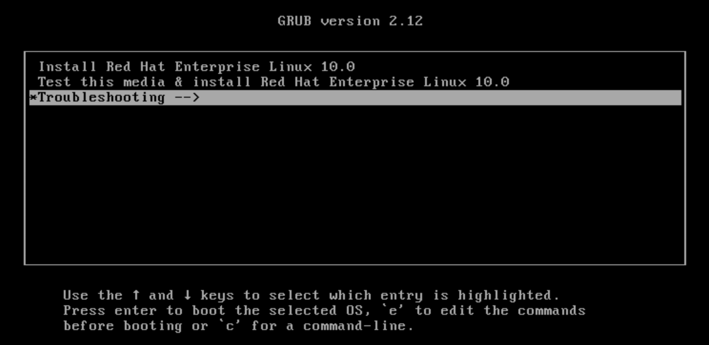
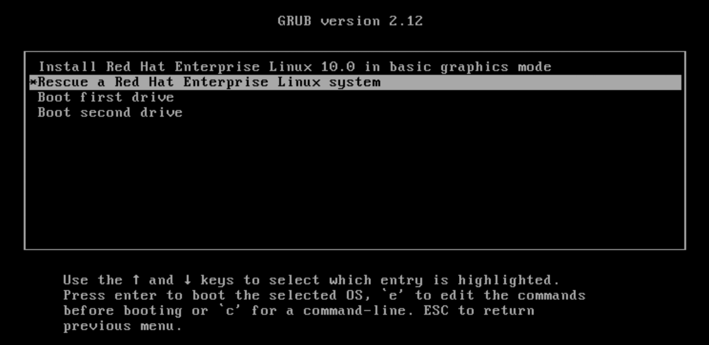
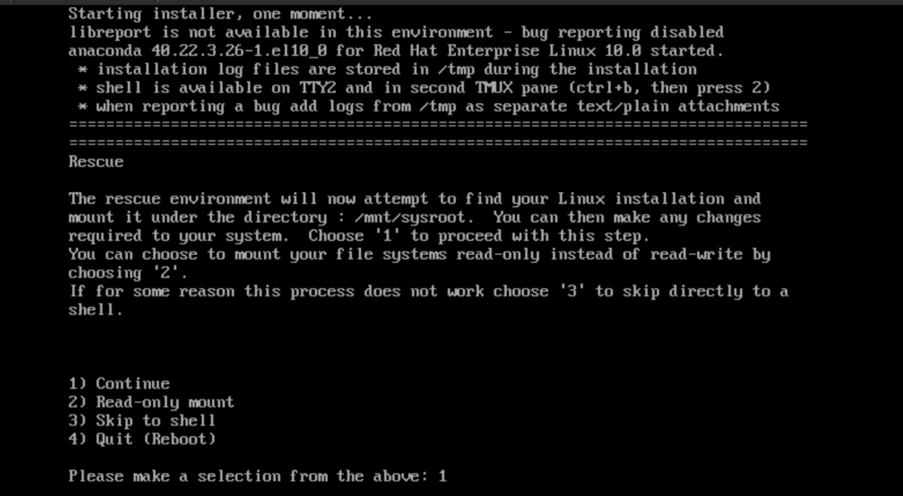

Quản trị hệ thống Red Hat 2
---------------------------

# Chương 13. Khôi phục quyền truy cập Superuser
## Khôi phục quyền truy cập Superuser và đặt lại mật khẩu root
### Mục tiêu
Có được quyền truy cập quản trị vào hệ thống khi không biết mật khẩu siêu người dùng (superuser) hoặc mật khẩu đó đã bị khóa.

### Đặt lại mật khẩu root từ Boot Loader
Một nhiệm vụ mà mọi quản trị viên hệ thống đều cần thực hiện được là đặt lại mật khẩu người dùng root khi bị mất. Công việc này rất đơn
giản nếu quản trị viên vẫn đang đăng nhập—dưới quyền root hoặc là người dùng thường có đầy đủ quyền Sudo. Tuy nhiên, quy trình sẽ phức
tạp hơn một chút khi quản trị viên chưa đăng nhập, vì hệ thống cần được khởi động lại vào một trạng thái đặc biệt gọi là môi trường
khôi phục (rescue environment) hoặc chế độ khôi phục (rescue mode).

Trên RHEL 10, bạn có thể truy cập chế độ khôi phục để thay đổi mật khẩu root bị quên bằng một trong hai phương pháp sau:

* Có phương tiện khôi phục (khuyên dùng)
* Không có phương tiện khôi phục

#### Với phương tiện cứu hộ
Phương pháp được khuyến nghị là sử dụng phương tiện cứu hộ (rescue media); phương pháp này cho phép bạn khởi động một môi trường Red
Hat Enterprise Linux thu gọn từ phương tiện cài đặt (chẳng hạn như đĩa CD-ROM hoặc tệp ISO) thay vì khởi động từ ổ cứng của hệ thống.

Để khởi động vào chế độ cứu hộ, bạn cần có khả năng sử dụng một trong các thiết bị hoặc tệp tin phương tiện cài đặt sau đây để khởi
động hệ thống:

* Đối với máy vật lý, hãy sử dụng phương tiện cài đặt như đĩa CD-ROM hoặc thiết bị lưu trữ USB. 
* Đối với máy ảo, hãy sử dụng các tệp ISO.

Khi sử dụng phương tiện cứu hộ (rescue media), hãy đảm bảo rằng tệp ảnh (image) tương thích với hệ thống. Ví dụ: đối với hệ thống RHEL
10, bạn phải sử dụng tệp ảnh RHEL 10.

Là một phần của phương tiện cài đặt qua mạng, Red Hat cung cấp một tệp ảnh cài đặt tối thiểu: Red Hat Enterprise Linux 10.0 Boot ISO.
Bạn có thể sử dụng tệp ảnh ISO khởi động này làm phương tiện cứu hộ để khởi động lại hệ thống và đặt lại mật khẩu root.

Để sử dụng tệp ảnh này làm phương tiện cứu hộ, hãy thực hiện các bước sau:

* 1 - Khởi động lại hệ thống.
* 2 - Trong quá trình khởi động lại hệ thống, hãy chọn tệp ảnh boot.iso để khởi động. Quy trình chọn phương tiện khởi động thay thế sẽ
khác nhau tùy thuộc vào môi trường của bạn.
* 3 - Từ menu GRUB2, chọn Troubleshooting → Rescue a Red Hat Enterprise Linux system.

**Hình 13.1: Menu GRUB2**  

**Hình 13.2: Chọn chế độ cứu hộ**  


* 4 - Trong menu môi trường khôi phục, hãy chọn **Continue** bằng cách nhấn phím **1**, sau đó nhấn **Enter** để gắn (mount) hệ thống
theo cách thông thường.

**Hình 13.3: Vào chế độ giải cứu**  


* 5 - Tại dấu nhắc shell, hãy chuyển thư mục gốc sang thư mục /mnt/sysroot.

```console
bash-5.2# chroot /mnt/sysroot
```

* 6 - Thay đổi mật khẩu root thành mật khẩu mong muốn.

```console
bash-5.2# passwd root
New password: provide_password
Retype new password: provide_password
passwd: password updated successfully
```

* 7 - Đảm bảo rằng tất cả các tệp chưa được gán nhãn, bao gồm cả tệp /etc/shadow tại thời điểm này, đều được gán lại nhãn trong quá
trình khởi động.

> **Quan trọng**:
Do hệ thống chưa kích hoạt SELinux, bất kỳ tệp nào bạn tạo ra đều không được gán nhãn ngữ cảnh SELinux. Một số công cụ, chẳng hạn như
lệnh `passwd`, sẽ tạo một tệp tạm trước rồi mới thay thế tệp đích cần chỉnh sửa bằng tệp tạm đó; quy trình này vô tình tạo ra một tệp
không có ngữ cảnh SELinux. Chính vì lý do này, khi bạn sử dụng lệnh `passwd` ở chế độ giải cứu (rescue mode), tệp `/etc/shadow` sẽ
không được gán nhãn ngữ cảnh SELinux.

```console
bash-5.2# touch /.autorelabel
```

* 8 - Hãy nhập lệnh `exit` hai lần để khởi động lại hệ thống. Lệnh đầu tiên thoát khỏi chế độ chroot, còn lệnh thứ hai thoát khỏi chế
độ cứu hộ (rescue mode) và khởi động lại hệ thống.

```console
bash-5.2# exit
exit
bash-5.2# exit
```

Tại thời điểm này, hệ thống tiếp tục quá trình khởi động, thực hiện gán lại nhãn SELinux toàn bộ, rồi sau đó khởi động lại một lần nữa.

#### Không cần phương tiện khôi phục
Thay vì sử dụng phương tiện cứu hộ (rescue media), bạn cũng có thể truy cập môi trường cứu hộ bằng cách cấu hình hệ thống để mô phỏng
chế độ cứu hộ. Để đạt được trạng thái hệ thống này, hãy truyền tùy chọn `init /bin/bash` cho kernel, sau đó gắn lại (remount) hệ thống
tập tin gốc ở chế độ đọc/ghi.

> **Cảnh báo**: Phương pháp này tiềm ẩn rủi ro và cần được thực hiện một cách thận trọng.

* 1 - Khởi động lại hệ thống.
* 2 - Ngắt quá trình đếm ngược của bộ nạp khởi động (boot-loader) bằng cách nhấn phím Esc.
* 3 - Khởi động với tham số `init=/bin/bash`.
    * a - Trong menu GRUB2, di chuyển con trỏ đến mục kernel cần khởi động.
    * b - Nhấn phím E để chỉnh sửa mục đã chọn.
    * c - Di chuyển con trỏ đến dòng lệnh kernel (dòng bắt đầu bằng từ khóa `linux`).
    * d - Xóa bất kỳ tùy chọn `console=` nào khỏi dòng đó.
    * e - Di chuyển đến cuối dòng bằng cách nhấn tổ hợp phím Ctrl+E.
    * f - Thêm chuỗi `init=/bin/bash` vào cuối dòng (nhớ thêm một khoảng trắng trước đó).
    * g - Nhấn tổ hợp phím Ctrl+X để khởi động với các thay đổi đã thực hiện.
* 4 - Đợi hệ thống khởi động xong.
* 5 - Hệ thống tập tin gốc (`/`) đang được gắn ở chế độ chỉ đọc. Việc thay đổi mật khẩu root đòi hỏi hệ thống tập tin gốc phải được
gắn ở chế độ đọc/ghi. Hãy gắn lại hệ thống tập tin gốc ở chế độ đọc/ghi:

```console
bash-5.2# mount -o remount,rw /
```

* 6 - Đặt mật khẩu root mới.

```console
bash-5.2# passwd
```

* 7 - Tạo tệp ẩn .autorelabel để gắn nhãn lại ngữ cảnh SELinux cho tất cả các tệp trong lần khởi động hệ thống tiếp theo.

```console
bash-5.2# touch /.autorelabel
```

* 8 - Khởi động lại hệ thống.

```console
bash-5.2# exec /sbin/init
```

Hệ thống tiếp tục quá trình khởi động, thực hiện gán lại nhãn SELinux toàn bộ, rồi khởi động lại một lần nữa.
