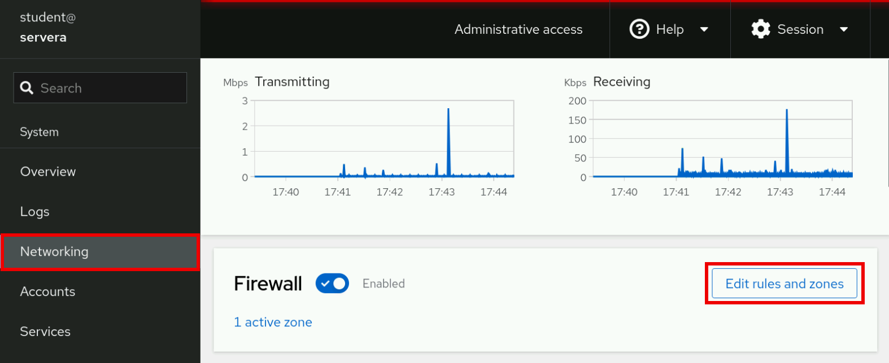
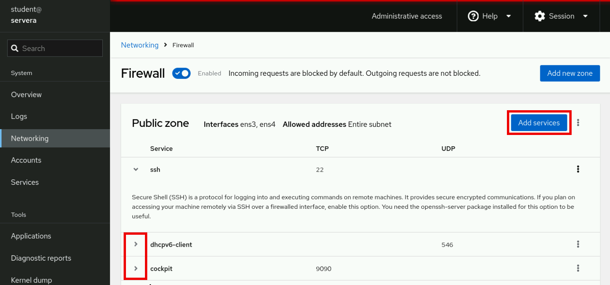
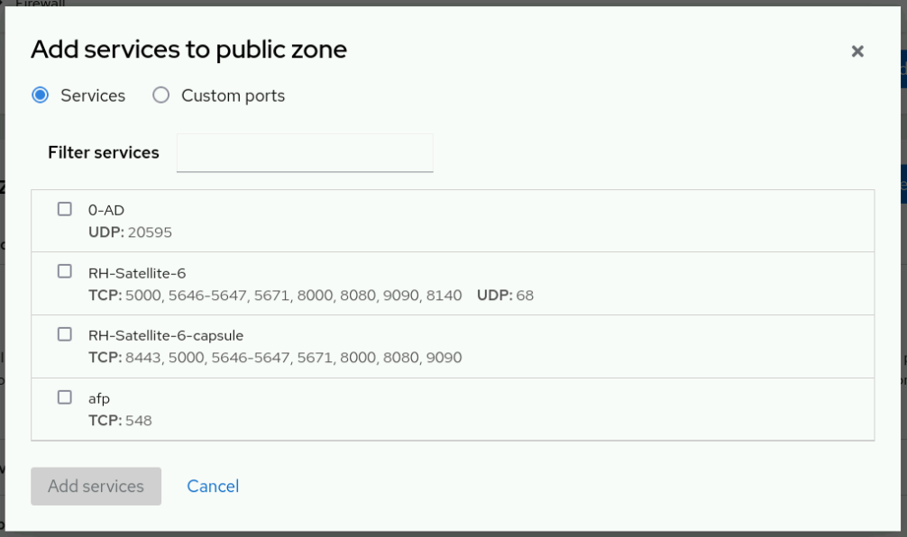
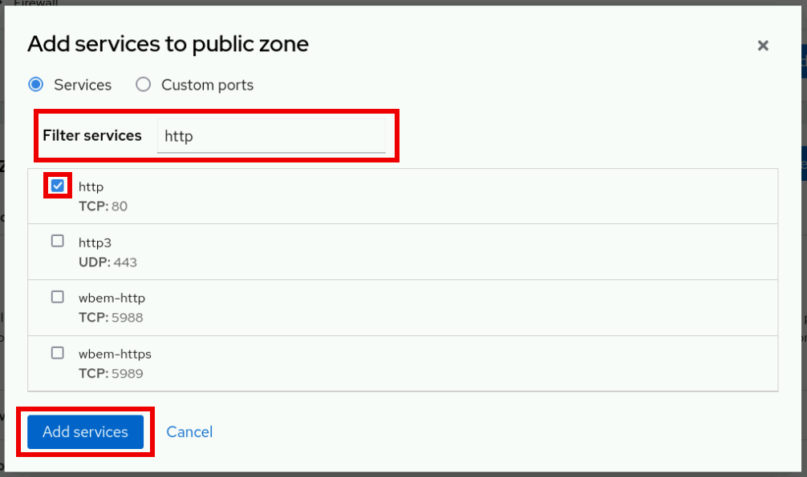
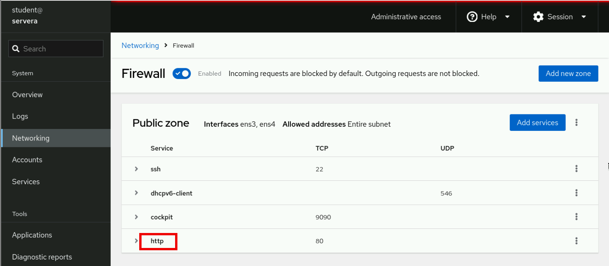

Quản trị hệ thống Red Hat 2
---------------------------

# Chương 14. Quản lý bảo mật mạng
## Quản lý tường lửa máy chủ
### Mục tiêu
Chấp nhận hoặc từ chối các kết nối đến các dịch vụ mạng cục bộ bằng cách sử dụng dịch vụ firewalld.

### Các khái niệm về kiến trúc tường lửa Linux
Nhân Linux cung cấp khung `netfilter` để xử lý lưu lượng mạng, chẳng hạn như lọc gói tin, chuyển đổi địa chỉ mạng và chuyển đổi cổng.
Khung phân loại gói tin `nftables` được xây dựng dựa trên khung `netfilter` để áp dụng các quy tắc tường lửa cho lưu lượng mạng.

Trong Red Hat Enterprise Linux 10, khung nftables đóng vai trò là thành phần cốt lõi của hệ thống tường lửa.

> **Lưu ý**: Khung `nftables` là phiên bản kế nhiệm của các tiện ích như `iptables` và `ip6tables`. Nó mang lại nhiều cải tiến về tính
> tiện dụng, tính năng và hiệu năng so với các công cụ lọc gói tin trước đây. Bạn có thể chuyển đổi các tệp cấu hình `iptables` cũ sang
> định dạng tương đương trong nftables bằng cách sử dụng các tiện ích `iptables-translate` và `ip6tables-translate`.

#### Dịch vụ Tường lửa
Dịch vụ `firewalld` là một trình quản lý tường lửa động và là giao diện người dùng được khuyến nghị cho framework `nftables`. Red Hat
Enterprise Linux 10 có bao gồm gói `firewalld`.

Dịch vụ `firewalld` giúp đơn giản hóa việc quản lý tường lửa bằng cách phân loại lưu lượng mạng thành các vùng (zone). Vùng được gán
cho một gói tin mạng sẽ phụ thuộc vào các tiêu chí như địa chỉ IP nguồn của gói tin hoặc giao diện mạng tiếp nhận gói tin đó. Mỗi vùng
có danh sách riêng các cổng và dịch vụ được thiết lập ở trạng thái mở hoặc đóng.

> **Lưu ý**: Đối với các máy tính thường xuyên thay đổi mạng, dịch vụ NetworkManager có thể tự động thiết lập vùng tường lửa (firewall
zone) cho kết nối. Dịch vụ này rất hữu ích khi chuyển đổi giữa mạng gia đình, mạng công ty hoặc mạng không dây công cộng. Chẳng hạn,
người dùng có thể muốn dịch vụ sshd trên hệ thống của mình cho phép kết nối khi đang ở mạng gia đình hoặc mạng công ty, nhưng lại chặn
kết nối khi sử dụng mạng không dây công cộng tại quán cà phê.

Dịch vụ `firewalld` kiểm tra địa chỉ nguồn của mọi gói tin đi vào hệ thống. Nếu địa chỉ nguồn được gán cho một vùng (zone) cụ thể, các
quy tắc của vùng đó sẽ được áp dụng. Nếu địa chỉ nguồn không được gán cho vùng nào, `firewalld` sẽ liên kết gói tin với vùng tương ứng
của giao diện mạng tiếp nhận và áp dụng các quy tắc của vùng đó. Nếu giao diện mạng không được liên kết với vùng nào, `firewalld` sẽ
chuyển gói tin đến vùng mặc định.

Vùng mặc định không phải là một vùng riêng biệt; bạn cấu hình để chỉ định một trong các vùng hiện có làm vùng mặc định. Ban đầu,
`firewalld` chỉ định vùng `public` làm vùng mặc định và ánh xạ giao diện loopback (`lo`) vào vùng `trusted`.

Hầu hết các vùng đều cho phép lưu lượng truy cập đi qua tường lửa nếu đích đến cục bộ của lưu lượng đó khớp với danh sách các cổng và
giao thức (ví dụ: 631/udp) hoặc cấu hình dịch vụ được định nghĩa trước (ví dụ: dịch vụ ssh). Thông thường, nếu lưu lượng không khớp với
cổng, giao thức hoặc dịch vụ được cho phép, nó sẽ bị từ chối. Một ngoại lệ là vùng `trusted`, vùng này cho phép tất cả lưu lượng truy
cập theo mặc định.

#### Các vùng được xác định trước
Dịch vụ firewalld sử dụng các vùng được định nghĩa sẵn mà bạn có thể tùy chỉnh. Theo mặc định, tất cả các vùng đều cho phép mọi lưu
lượng truy cập đến thuộc về một phiên làm việc hiện có do hệ thống khởi tạo, đồng thời cũng cho phép tất cả lưu lượng truy cập đi.

Bảng dưới đây hiển thị cấu hình vùng ban đầu:

**Bảng 14.1. Cấu hình mặc định của các vùng tường lửa**

| Tên vùng | Cấu hình mặc định                                                                                                                                                                                                                                                                                           |
|----------|-------------------------------------------------------------------------------------------------------------------------------------------------------------------------------------------------------------------------------------------------------------------------------------------------------------|
| trusted  | Cho phép tất cả lưu lượng truy cập đến.                                                                                                                                                                                                                                                                     |
| home     | Từ chối lưu lượng truy cập đến, trừ khi nó liên quan đến lưu lượng truy cập đi hoặc khớp với các dịch vụ được định nghĩa trước như ssh, mdns, ipp-client, samba-client hoặc dhcpv6-client.                                                                                                                  |
| internal | Từ chối lưu lượng truy cập đến, trừ khi nó liên quan đến lưu lượng truy cập đi hoặc khớp với các dịch vụ được định nghĩa sẵn như ssh, mdns, ipp-client, samba-client hoặc dhcpv6-client (tương tự như cấu hình ban đầu của vùng "home").                                                                    |
| work     | Từ chối lưu lượng truy cập đến, trừ khi nó liên quan đến lưu lượng truy cập đi hoặc khớp với các dịch vụ được định nghĩa trước như ssh, ipp-client hoặc dhcpv6-client.                                                                                                                                      |
| public   | Từ chối lưu lượng truy cập đến, trừ khi nó liên quan đến lưu lượng truy cập đi hoặc khớp với các dịch vụ được định nghĩa sẵn như ssh hoặc dhcpv6-client. Đây là vùng mặc định cho các giao diện mạng mới được thêm vào.                                                                                     |
| external | Từ chối lưu lượng truy cập đến, trừ khi nó liên quan đến lưu lượng truy cập đi hoặc khớp với dịch vụ SSH đã được định nghĩa trước. Lưu lượng IPv4 đi được chuyển tiếp qua vùng này sẽ được thực hiện masquerade (ẩn địa chỉ nguồn) để trông như thể nó bắt nguồn từ địa chỉ IPv4 của giao diện mạng đầu ra. |
| dmz      | Từ chối lưu lượng truy cập đến, trừ khi nó liên quan đến lưu lượng truy cập đi hoặc khớp với dịch vụ SSH đã được định nghĩa trước.                                                                                                                                                                          |
| block    | Từ chối mọi lưu lượng truy cập đến, trừ khi chúng liên quan đến lưu lượng truy cập đi.                                                                                                                                                                                                                      |
| drop     | Loại bỏ tất cả lưu lượng truy cập đến trừ khi chúng liên quan đến lưu lượng truy cập đi (thậm chí không phản hồi bằng các thông báo lỗi ICMP).                                                                                                                                                              |

Để xem danh sách các vùng được định nghĩa sẵn hiện có và mục đích sử dụng của chúng, hãy tham khảo trang hướng dẫn (man page)
firewalld.zones(5).

#### Các dịch vụ được xác định trước
Dịch vụ firewalld bao gồm các cấu hình được định nghĩa sẵn cho các dịch vụ phổ biến, giúp đơn giản hóa việc thiết lập các quy tắc tường
lửa.

Ví dụ: thay vì phải tìm hiểu các cổng (port) cần thiết cho máy chủ NFS, bạn có thể sử dụng cấu hình nfs đã được định nghĩa sẵn để tạo
các quy tắc áp dụng cho đúng cổng và giao thức.

Bảng dưới đây liệt kê một số cấu hình dịch vụ được định nghĩa sẵn có thể đang hoạt động trong vùng (zone) firewalld mặc định của bạn:

**Bảng 14.2. Một số dịch vụ tường lửa được định nghĩa sẵn**

| Tên dịch vụ   | Cấu hình                                                                                                                                                             |
|---------------|----------------------------------------------------------------------------------------------------------------------------------------------------------------------|
| ssh           | Máy chủ SSH cục bộ. Lưu lượng truy cập đến cổng 22/tcp.                                                                                                              |
| dhcpv6-client | Máy khách DHCPv6 cục bộ. Lưu lượng truy cập đến cổng UDP 546 trên mạng IPv6 fe80::/64.                                                                               |
| ipp-client    | In ấn qua Giao thức In Internet (IPP) cục bộ. Lưu lượng truy cập tới cổng 631/udp.                                                                                   |
| samba-client  | Máy khách chia sẻ tệp và máy in Windows cục bộ. Lưu lượng truy cập đến các cổng 137/udp và 138/udp.                                                                  |
| mdns          | Phân giải tên cục bộ (link-local) bằng Multicast DNS (mDNS). Lưu lượng truy cập qua cổng UDP 5353 tới các địa chỉ multicast 224.0.0.251 (IPv4) hoặc ff02::fb (IPv6). |
| cockpit       | Giao diện dựa trên nền tảng web của Red Hat Enterprise Linux dùng để quản lý và giám sát các hệ thống cục bộ cũng như từ xa. Lưu lượng truy cập qua cổng TCP 9090.   |

Gói firewalld bao gồm nhiều cấu hình dịch vụ được định nghĩa sẵn. Bạn có thể liệt kê các dịch vụ này bằng lệnh `firewall-cmd` với tùy
chọn `--get-services`.

```console
root@host:~# firewall-cmd --get-services
0-AD RH-Satellite-6 RH-Satellite-6-capsule afp alvr amanda-client amanda-k5-client amqp amqps anno-1602 anno-1800 apcupsd aseqnet audit ausweisapp2 bacula bacula-client bareos-director bareos-filedaemon bareos-storage bb bgp bitcoin bitcoin-rpc bitcoin-testnet bitcoin-testnet-rpc bittorrent-lsd ceph ceph-exporter ceph-mon cfengine checkmk-agent civilization-iv civilization-v cockpit collectd
...output omitted...
```

Nếu các cấu hình dịch vụ được xác định trước không phù hợp với trường hợp sử dụng của bạn, bạn có thể tự thiết lập các cổng và giao
thức cần thiết. Bạn có thể sử dụng giao diện đồ họa của bảng điều khiển web để xem lại các dịch vụ đã được xác định trước, cũng như tự
định nghĩa thêm các cổng và giao thức.

### Cấu hình tiến trình nền Firewalld
Danh sách dưới đây trình bày hai cách để quản trị viên hệ thống tương tác với dịch vụ firewalld:

* Giao diện đồ họa của bảng điều khiển web
* Công cụ dòng lệnh firewall-cmd

#### Cấu hình các dịch vụ tường lửa bằng Bảng điều khiển Web
Để quản lý các dịch vụ tường lửa thông qua bảng điều khiển web, bạn cần đăng nhập và nâng cao quyền hạn bằng cách nhấp vào nút
"Limited access" (Quyền truy cập hạn chế) hoặc "Turn on administrative access" (Bật quyền truy cập quản trị).

Sau đó, hãy nhập mật khẩu khi được yêu cầu. Chế độ quản trị sẽ nâng cao quyền hạn dựa trên cấu hình sudo của người dùng. Hãy nhớ
chuyển lại chế độ truy cập hạn chế sau khi hoàn tất tác vụ hệ thống đòi hỏi quyền quản trị.

Nhấp vào tùy chọn "Networking" (Mạng) trong menu điều hướng bên trái để hiển thị mục "Firewall" (Tường lửa) trên trang mạng chính.
Nhấp vào nút "Edit rules and zones" (Chỉnh sửa quy tắc và vùng) để truy cập trang Tường lửa.

**Hình 14.1: Trang mạng của bảng điều khiển web**  


Trang **Firewall** hiển thị các vùng đang hoạt động cùng các dịch vụ được phép của chúng. Hãy nhấp vào biểu tượng mũi tên (`>`) ở bên
trái tên dịch vụ để xem chi tiết. Để thêm dịch vụ vào một vùng, hãy nhấp vào nút Thêm dịch vụ (Add services) ở góc trên bên phải của
vùng đó.

**Hình 14.2: Trang tường lửa trên bảng điều khiển web**  


Trang **Add Services** vụ hiển thị các dịch vụ được xác định trước hiện có.

**Hình 14.3: Menu thêm dịch vụ trên bảng điều khiển web**  


Để chọn một dịch vụ, hãy cuộn qua danh sách hoặc nhập nội dung vào ô "Filter services" (Lọc dịch vụ).

Trong ví dụ dưới đây, chuỗi "http" được dùng để lọc các tùy chọn và hiển thị những dịch vụ liên quan đến web. Hãy đánh dấu vào ô bên
trái dịch vụ để cho phép dịch vụ đó đi qua tường lửa. Nhấp vào nút "Add services" (Thêm dịch vụ) để hoàn tất quy trình.

**Hình 14.4: Các tùy chọn trong menu thêm dịch vụ của bảng điều khiển web**  


Giao diện quay trở lại trang Tường lửa, tại đây bạn có thể xem lại danh sách các dịch vụ được phép đã cập nhật.

**Hình 14.5: Tổng quan về tường lửa trên bảng điều khiển web**  


#### Cấu hình tường lửa từ dòng lệnh
Lệnh `firewall-cmd` tương tác với tiến trình nền (daemon) `firewalld`.

Lệnh này được cài đặt như một phần của gói `firewalld` và dành cho các quản trị viên thích làm việc trên dòng lệnh, làm việc trên các
hệ thống không có giao diện đồ họa, hoặc để viết kịch bản thiết lập tường lửa.

Hầu hết các lệnh đều tác động lên cấu hình đang chạy (runtime configuration), trừ khi tùy chọn `--permanent` được chỉ định. Nếu tùy
chọn `--permanent` được sử dụng, bạn phải kích hoạt thiết lập đó bằng cách chạy thêm lệnh `firewall-cmd` với tùy chọn `--reload`; thao
tác này sẽ áp dụng cấu hình cố định hiện tại làm cấu hình đang chạy mới. Nhiều lệnh trong số này chấp nhận tùy chọn `--zone=ZONE` để
xác định vùng (zone) mà chúng sẽ tác động. Khi cần chỉ định netmask, hãy sử dụng ký pháp CIDR (Classless Inter-Domain Routing), chẳng
hạn như `192.168.1/24`.

**Bảng dưới đây liệt kê một số lệnh `firewall-cmd`:**

| Các lệnh firewall-cmd                      | Giải thích                                                                                                                                                                     |
|--------------------------------------------|--------------------------------------------------------------------------------------------------------------------------------------------------------------------------------|
| --get-default-zone                         | Truy vấn vùng mặc định hiện tại.                                                                                                                                               |
| --set-default-zone=ZONE                    | Thiết lập vùng mặc định; thao tác này thay đổi cả cấu hình đang chạy lẫn cấu hình cố định.                                                                                     |
| --get-zones                                | Liệt kê tất cả các vùng khả dụng.                                                                                                                                              |
| --get-active-zones                         | Liệt kê tất cả các vùng đang được sử dụng (có giao diện hoặc nguồn gắn liền với chúng), cùng với thông tin về giao diện và nguồn của chúng.                                    |
| --add-source=CIDR [--zone=ZONE]            | Chuyển hướng toàn bộ lưu lượng truy cập từ địa chỉ IP hoặc từ mạng (kèm netmask) đến vùng được chỉ định. Nếu không cung cấp tùy chọn `--zone=`, vùng mặc định sẽ được sử dụng. |
| --remove-source=CIDR [--zone=ZONE]         | Xóa quy tắc định tuyến toàn bộ lưu lượng truy cập từ vùng (zone) bắt nguồn từ địa chỉ IP hoặc mạng đó. Nếu không chỉ định tùy chọn `--zone=`, vùng mặc định sẽ được sử dụng.   |
| --add-interface=INTERFACE [--zone=ZONE]    | Định tuyến toàn bộ lưu lượng từ INTERFACE đến vùng (zone) được chỉ định. Nếu không cung cấp tùy chọn --zone=, vùng mặc định sẽ được sử dụng.                                   |
| --change-interface=INTERFACE [--zone=ZONE] | Gán giao diện vào ZONE thay vì vùng hiện tại của nó. Nếu không có tùy chọn --zone= nào được cung cấp, vùng mặc định sẽ được sử dụng.                                           |
| --list-all [--zone=ZONE]                   | Liệt kê tất cả các giao diện, nguồn, dịch vụ và cổng đã được cấu hình cho ZONE. Nếu không chỉ định tùy chọn --zone=, zone mặc định sẽ được sử dụng.                            |
| --list-all-zones                           | Truy xuất tất cả thông tin cho mọi vùng (giao diện, nguồn, cổng và dịch vụ).                                                                                                   |
| --add-service=SERVICE [--zone=ZONE]        | Cho phép lưu lượng truy cập đến SERVICE. Nếu không có tùy chọn --zone= nào được cung cấp, vùng mặc định sẽ được sử dụng.                                                       |
| --add-port=PORT/PROTOCOL [--zone=ZONE]     | Cho phép lưu lượng truy cập đến các cổng PORT/PROTOCOL. Nếu không chỉ định tùy chọn --zone=, thì vùng mặc định sẽ được sử dụng.                                                |
| --remove-service=SERVICE [--zone=ZONE]     | Xóa SERVICE khỏi danh sách được phép của vùng. Nếu không cung cấp tùy chọn --zone=, vùng mặc định sẽ được sử dụng.                                                             |
| --remove-port=PORT/PROTOCOL [--zone=ZONE]  | Xóa các cổng PORT/PROTOCOL khỏi danh sách được phép của vùng (zone). Nếu không chỉ định tùy chọn --zone=, vùng mặc định sẽ được sử dụng.                                       |
| --reload                                   | Hủy bỏ cấu hình runtime và áp dụng cấu hình cố định.                                                                                                                           |
| --runtime-to-permanent                     | Tạo các quy tắc vĩnh viễn từ cấu hình thời gian chạy.                                                                                                                          |

Ví dụ sau đây đặt vùng mặc định là `dmz`:

```console
root@host:~# firewall-cmd --set-default-zone=dmz
```

Gán toàn bộ lưu lượng từ mạng 192.168.0.0/24 vào vùng nội bộ (internal zone):

```console
root@host:~# firewall-cmd --permanent --zone=internal --add-source=192.168.0.0/24
```

Mở các cổng mạng cho dịch vụ MySQL trên vùng nội bộ:

```console
root@host:~# firewall-cmd --permanent --zone=internal --add-service=mysql
```

Cập nhật các thay đổi cho tiến trình nền `firewalld`:

```console
root@host:~# firewall-cmd --reload
```

Một ví dụ khác: để thêm toàn bộ lưu lượng truy cập đến từ địa chỉ IPv4 đơn lẻ 172.25.25.11 vào vùng public, hãy sử dụng các lệnh sau:

```console
root@host:~# firewall-cmd --permanent --zone=public --add-source=172.25.25.11/32
```

Cập nhật các thay đổi cho tiến trình nền `firewalld`:

```console
root@host:~# firewall-cmd --reload
```

> **Lưu ý**: Trong các trường hợp mà cú pháp cơ bản là chưa đủ, bạn có thể thêm các "rich-rule" để thiết lập những quy tắc phức tạp
> hơn. Nếu ngay cả cú pháp rich-rule vẫn chưa đáp ứng được nhu cầu, bạn có thể sử dụng các quy tắc Cấu hình Trực tiếp (Direct
> Configuration) – loại quy tắc kết hợp giữa cú pháp nft thô và các quy tắc firewalld. Các cấu hình nâng cao này nằm ngoài phạm vi của
> bài học này.

## Gán nhãn cổng SELinux
### Mục tiêu
Xác minh và điều chỉnh các nhãn SELinux trên các cổng mạng cụ thể để các dịch vụ mạng được cấp phép có thể gắn kết (bind) vào các cổng
đó và lắng nghe kết nối từ máy khách.

### Gán nhãn cổng SELinux
Ngoài việc gán nhãn ngữ cảnh cho tệp và loại tiến trình, SELinux còn gán nhãn ngữ cảnh SELinux cho các cổng mạng. SELinux kiểm soát
quyền truy cập mạng bằng cách gán nhãn cho các cổng mạng và thiết lập các quy tắc trong chính sách mục tiêu (targeted policy) của dịch
vụ.

Ví dụ, chính sách mục tiêu dành cho SSH bao gồm cổng 22/TCP với nhãn ngữ cảnh `ssh_port_t`. Trong chính sách HTTP, các cổng mặc định
80/TCP và 443/TCP sử dụng nhãn ngữ cảnh `http_port_t`.

Khi một tiến trình thuộc phạm vi chính sách mục tiêu cố gắng mở cổng để lắng nghe kết nối, SELinux sẽ kiểm tra xem chính sách có chứa
các quy tắc cho phép liên kết tiến trình đó với ngữ cảnh tương ứng hay không. Nhờ đó, SELinux có thể ngăn chặn các dịch vụ trái phép
chiếm dụng những cổng đang được các dịch vụ mạng hợp lệ khác sử dụng.

### Quản lý gán nhãn cổng SELinux
Nếu một dịch vụ cố gắng lắng nghe trên một cổng không chuẩn và cổng đó không được gán nhãn với kiểu SELinux chính xác, thì SELinux có
thể sẽ chặn hành động này. Bạn có thể khắc phục vấn đề này bằng cách thay đổi ngữ cảnh SELinux của cổng đó.

Thông thường, chính sách mục tiêu (targeted policy) đã gán nhãn cho tất cả các cổng dự kiến ​​bằng kiểu chính xác.

Ví dụ: vì cổng 8008/TCP thường được sử dụng cho các ứng dụng web, nên cổng này đã được gán nhãn với ngữ cảnh `http_port_t` – kiểu cổng
mặc định dành cho máy chủ web. Mỗi cổng riêng lẻ chỉ có thể được gán một ngữ cảnh cổng duy nhất.

#### Liệt kê nhãn cổng
Sử dụng lệnh `grep` để lọc số cổng.

```console
root@host:~# grep gopher /etc/services
gopher          70/tcp                          # Internet Gopher
gopher          70/udp
```

Sử dụng lệnh semanage để liệt kê các gán nhãn cổng hiện tại.

```console
root@host:~# semanage port -l
...output omitted...
http_cache_port_t       tcp   8080, 8118, 8123, 10001-10010
http_cache_port_t       udp   3130
http_port_t             tcp   80, 81, 443, 488, 8008, 8009, 8443, 9000
...output omitted...
```

Sử dụng lệnh `grep` để lọc nhãn cổng SELinux dựa trên tên dịch vụ.

```console
root@host:~# semanage port -l | grep ftp
ftp_data_port_t                tcp      20
ftp_port_t                     tcp      21, 989, 990
ftp_port_t                     udp      989, 990
tftp_port_t                    udp      69
```

Một nhãn cổng có thể xuất hiện nhiều lần trong danh sách cho mỗi giao thức mạng được hỗ trợ.

Sử dụng lệnh grep để lọc nhãn cổng SELinux theo số cổng.

```console
root@host:~# semanage port -l | grep -w 70
gopher_port_t                  tcp      70
gopher_port_t                  udp      70
```

#### Quản lý liên kết cổng
Sử dụng lệnh `semanage` để gán nhãn cổng mới, xóa nhãn cổng hoặc sửa đổi các nhãn hiện có.

> **Quan trọng**: Hầu hết các dịch vụ trong RHEL đều cung cấp một mô-đun chính sách SELinux, bao gồm các ngữ cảnh cổng mặc định của
dịch vụ. Bạn không thể thay đổi nhãn cổng mặc định bằng cách sử dụng lệnh `semanage`. Thay vào đó, bạn phải sửa đổi và tải lại mô-đun
chính sách của dịch vụ tương ứng. Việc viết và tạo các mô-đun chính sách nằm ngoài phạm vi của bài học này.

Bạn có thể gán nhãn ngữ cảnh cổng hiện có cho một cổng mới.

Trong lệnh `semanage port`, tùy chọn `-a` dùng để thêm nhãn cổng mới, tùy chọn `-t` chỉ định kiểu (type), và tùy chọn `-p` chỉ định
giao thức.

```console
root@host:~# semanage port -a -t port_label -p tcp|udp PORTNUMBER
```

Trong ví dụ sau, hãy kích hoạt dịch vụ `gopher` để lắng nghe trên cổng 71/TCP:

```console
root@host:~# semanage port -a -t gopher_port_t -p tcp 71
```

Để xem các thay đổi đối với chính sách mặc định, hãy sử dụng tùy chọn `-C` của lệnh `semanage port`.

```console
root@host:~# semanage port -l -C
SELinux Port Type              Proto    Port Number

gopher_port_t                  tcp      71
```

Các chính sách được nhắm mục tiêu bao gồm nhiều loại cổng (port type).

Các trang man (tài liệu hướng dẫn) SELinux dành riêng cho từng dịch vụ được đặt tên theo cú pháp: tên dịch vụ cộng với hậu tố
`_selinux`. Các trang man này chứa thông tin cụ thể về các kiểu (type), biến Boolean và kiểu cổng SELinux liên quan đến dịch vụ đó,
và chúng không được cài đặt theo mặc định.

Để xem danh sách tất cả các trang man SELinux hiện có, hãy cài đặt gói phần mềm này.

```console
root@host:~# dnf -y install selinux-policy-doc
```

Sử dụng tùy chọn `-k` của lệnh man để tìm kiếm chuỗi `_selinux`.

```console
root@host:~# man -k _selinux
```

Sử dụng tùy chọn `-d` của lệnh `semanage` để xóa nhãn cổng.

Trong ví dụ sau, hãy xóa liên kết giữa cổng 71/TCP và kiểu `gopher_port_t`:

```console
root@host:~# semanage port -d -t gopher_port_t -p tcp 71
```

Để thay đổi việc gán cổng khi có sự thay đổi về yêu cầu, hãy sử dụng tùy chọn -m. Tùy chọn này hiệu quả hơn so với việc xóa bỏ cấu
hình gán cũ và thêm cấu hình mới.

Trong ví dụ dưới đây, hãy thay đổi nhãn cổng 71/TCP từ ngữ cảnh `gopher_port_t` sang `http_port_t`:

```console
root@host:~# semanage port -m -t http_port_t -p tcp 71
```

Xác minh các thay đổi bằng cách sử dụng lệnh `semanage`.

```console
root@host:~# semanage port -l -C
SELinux Port Type         Proto    Port Number

http_port_t               tcp      71
root@host:~# semanage port -l | grep http
http_cache_port_t         tcp      8080, 8118, 8123, 10001-10010
http_cache_port_t         udp      3130
http_port_t               tcp      71, 80, 81, 443, 488, 8008, 8009, 8443, 9000
pegasus_http_port_t       tcp      5988
pegasus_https_port_t      tcp      5989
```
