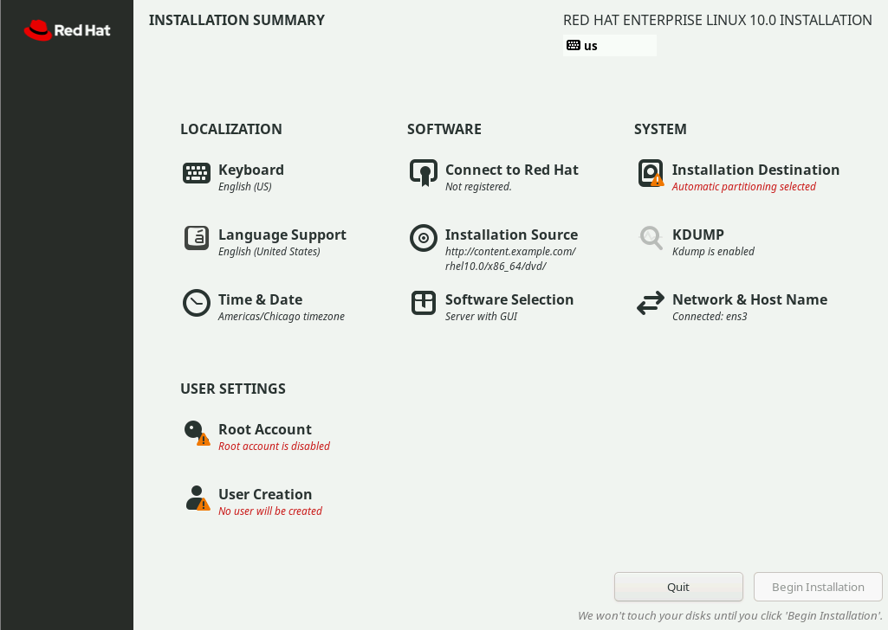
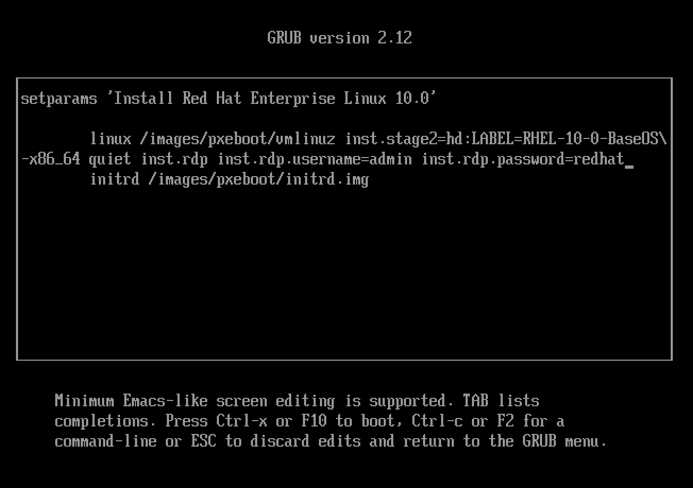
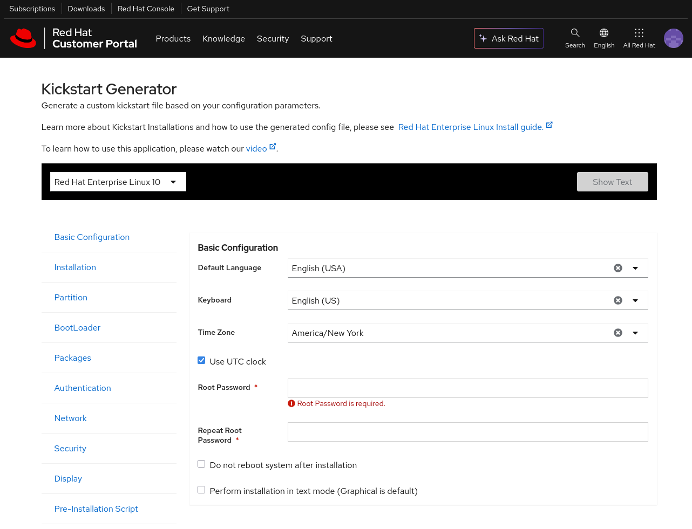
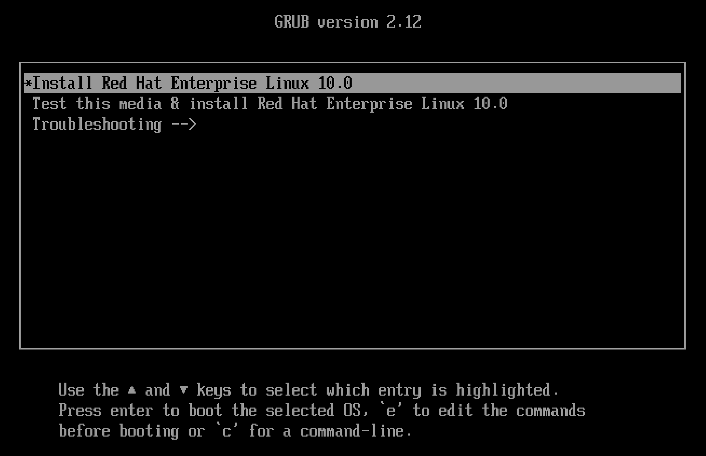
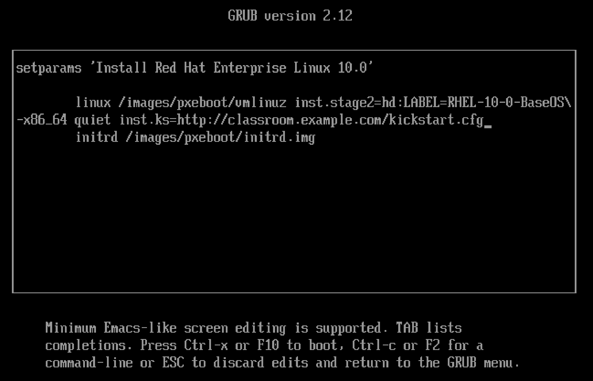

Quản trị hệ thống Red Hat 2
---------------------------

# Chương 16. Cài đặt Red Hat Enterprise Linux
## Cài đặt Red Hat Enterprise Linux theo phương thức tương tác
### Mục tiêu
Mô tả quy trình cài đặt Red Hat Enterprise Linux theo chế độ tương tác và chọn gói phần mềm (package mode).

### Phương tiện cài đặt
Red Hat cung cấp các loại phương tiện cài đặt khác nhau mà bạn có thể tải xuống từ trang web Customer Portal bằng gói đăng ký đang có
hiệu lực của mình.

* Một tệp ảnh nhị phân ở định dạng ISO 9660 chứa chương trình cài đặt Anaconda của Red Hat Enterprise Linux, cùng các kho gói BaseOS và
AppStream. Các kho này chứa những gói cần thiết để hoàn tất quá trình cài đặt mà không cần thêm kho nào khác.
* Một tệp ảnh ISO khởi động có kích thước nhỏ hơn, chỉ chứa trình cài đặt Anaconda và yêu cầu kết nối mạng trong quá trình cài đặt để
tải các gói từ những kho trực tuyến được lưu trữ trên máy chủ HTTP, FTP hoặc NFS.
* Mã nguồn (các chỉ dẫn ngôn ngữ lập trình mà con người có thể đọc được) của Red Hat Enterprise Linux. Các đĩa DVD chứa mã nguồn này
không bao gồm tài liệu hướng dẫn. Tệp ảnh này hỗ trợ việc biên dịch hoặc phát triển phần mềm dựa trên phiên bản Red Hat Enterprise
Linux tương ứng. Việc cung cấp mã nguồn hệ điều hành mang lại sự minh bạch và giúp các nhà phát triển xây dựng phần mềm riêng của họ
trên nền tảng Red Hat Enterprise Linux.

Red Hat Enterprise Linux 10 hỗ trợ các kiến trúc sau:

* Kiến trúc 64-bit của AMD và Intel (x86-64-v3)
* Kiến trúc ARM 64-bit (ARMv8.0-A)
* IBM Power Systems, Little Endian (POWER9)
* IBM Z 64-bit (z14)

Sau khi tải xuống tệp ảnh (image) mong muốn, hãy tạo phương tiện cài đặt có khả năng khởi động bằng cách làm theo hướng dẫn trong tài
liệu ["Cài đặt RHEL tương tác từ phương tiện cài đặt"](https://docs.redhat.com/en/documentation/red_hat_enterprise_linux/10/html-single/interactively_installing_rhel_from_installation_media/index)
(Interactively Installing RHEL from Installation Media).

Ví dụ, để cài đặt RHEL trên máy chủ vật lý (bare-metal server), bạn có thể sao chép một trong các tệp ảnh ISO vào ổ USB và khởi động từ
đó.

#### Tạo hình ảnh tùy chỉnh với RHEL Image Builder
Công cụ tạo ảnh (image builder) của Red Hat Enterprise Linux hỗ trợ việc tạo các bản ảnh Red Hat Enterprise Linux tùy chỉnh. Công cụ
này cho phép quản trị viên xây dựng các bản ảnh hệ thống tùy chỉnh để triển khai trên các nền tảng đám mây hoặc môi trường ảo hóa nhằm
phục vụ các mục đích sử dụng chuyên biệt.

Bạn có thể truy cập công cụ tạo ảnh RHEL thông qua lệnh `composer-cli` hoặc giao diện bảng điều khiển web của Red Hat.

#### Yêu cầu về đĩa và bộ nhớ
Để cài đặt Red Hat Enterprise Linux 10, bạn cần có tối thiểu 10 GiB dung lượng trên phân vùng sẽ cài đặt RHEL.

Yêu cầu tối thiểu về RAM phụ thuộc vào loại hình cài đặt:

| Kiểu cài đặt                                     | Dung lượng RAM tối thiểu được khuyến nghị                                           |
|--------------------------------------------------|-------------------------------------------------------------------------------------|
| Cài đặt từ phương tiện lưu trữ cục bộ (USB, DVD) | 1,5 GiB cho các kiến trúc x86-64-v3, ARMv8.0-A và z14<br>3 GiB cho kiến trúc POWER9 |
| Cài đặt qua mạng NFS                             | 1,5 GiB cho các kiến trúc x86-64-v3, ARMv8.0-A và z14<br>3 GiB cho kiến trúc POWER9 |
| Cài đặt qua mạng bằng HTTP, HTTPS hoặc FTP       | 3 GiB cho kiến trúc x86-64-v3 và z14<br>4 GiB cho kiến trúc ARMv8.0-A và POWER9     |

### Cài đặt Red Hat Enterprise Linux theo cách thủ công
Bằng cách sử dụng DVD nhị phân hoặc tệp ISO khởi động, quản trị viên sẽ cài đặt một hệ thống RHEL mới trên máy chủ vật lý (bare-metal)
hoặc máy ảo. Chương trình Anaconda hỗ trợ hai phương thức cài đặt: thủ công và tự động.

* Quá trình cài đặt thủ công tương tác với người dùng để xác định cách Anaconda cài đặt và cấu hình hệ thống.
* Quá trình cài đặt tự động sử dụng tệp Kickstart để chỉ dẫn Anaconda cách cài đặt hệ thống.

#### Cài đặt RHEL bằng giao diện đồ họa
Anaconda khởi động dưới dạng ứng dụng giao diện đồ họa khi bạn khởi động hệ thống từ đĩa DVD nhị phân hoặc từ tệp ISO khởi động.

Tại màn hình "WELCOME TO RED HAT ENTERPRISE LINUX 10", hãy chọn ngôn ngữ và nhấp vào nút Continue (Tiếp tục). Người dùng cá nhân có thể
chọn ngôn ngữ mong muốn sau khi hoàn tất quá trình cài đặt.

Anaconda hiển thị cửa sổ "INSTALLATION SUMMARY" (Tóm tắt cài đặt); đây là giao diện trung tâm để tùy chỉnh các tham số trước khi bắt
đầu quá trình cài đặt.

**Hình 16.1: Cửa sổ tóm tắt cài đặt**  


Tại cửa sổ này, hãy cấu hình các tham số cài đặt bằng cách chọn các biểu tượng theo bất kỳ thứ tự nào. Hãy chọn một mục để xem hoặc
chỉnh sửa. Trong bất kỳ mục nào, hãy nhấp vào **Done** (Hoàn tất) để quay lại màn hình chính này.

Anaconda đánh dấu các mục bắt buộc bằng biểu tượng cảnh báo hình tam giác kèm theo thông báo. Thanh trạng thái màu cam ở cuối màn hình
nhắc nhở bạn hoàn tất các thông tin cần thiết trước khi quá trình cài đặt bắt đầu.

Hãy hoàn tất các mục sau đây nếu cần:


* `Keyboard`: Thêm bố trí bàn phím.
* `Language Support`: Chọn thêm ngôn ngữ để cài đặt.
* `Time & Date`: Chọn vị trí của hệ thống từ danh sách được cung cấp. Hãy xác định múi giờ địa phương ngay cả khi sử dụng Giao thức
Thời gian Mạng (NTP). Ngoài ra, bạn có thể để NTP ở trạng thái tắt và tự thiết lập ngày giờ theo cách thủ công.
* `Connect to Red Hat`: Đăng ký hệ thống bằng tài khoản Red Hat của bạn và chọn mục đích sử dụng hệ thống. Tính năng "mục đích sử dụng
hệ thống" (system purpose) cho phép quy trình đăng ký tự động gán gói đăng ký (subscription) phù hợp nhất cho hệ thống. Trước tiên, bạn
cần kết nối mạng thông qua biểu tượng Network & Host Name để thực hiện đăng ký. Trừ khi bạn bỏ chọn tùy chọn tương ứng, hệ thống cũng
có thể được tự động đăng ký tham gia Red Hat Insights theo mặc định.
* `Installation Source`: Cung cấp vị trí gói nguồn mà Anaconda yêu cầu để cài đặt. Trường "Installation Source" (Nguồn cài đặt) sẽ tự
động trỏ đến đĩa DVD khi bạn sử dụng đĩa DVD nhị phân.
* `Software Selection`: Chọn môi trường cơ sở để cài đặt và bao gồm các phần mềm bổ sung (nếu có). Môi trường "Minimal Install"
(Cài đặt tối thiểu) chỉ cài đặt các gói cần thiết để vận hành Red Hat Enterprise Linux.
* `Installation Destination`: Bạn cần chọn ít nhất một ổ đĩa có đủ dung lượng để cài đặt Red Hat Enterprise Linux. Để hoàn tất tác vụ
này nhanh chóng, quản trị viên có thể sử dụng tính năng cấu hình lưu trữ tự động; tính năng này mặc định sử dụng Logical Volume
Management (Quản lý Volume Logic). Ngoài ra, chế độ cấu hình tùy chỉnh cũng có sẵn để hỗ trợ người dùng nâng cao tạo ra các bố cục lưu
trữ phức tạp. Lưu ý rằng ngay cả ở chế độ tùy chỉnh, Anaconda vẫn cho phép bạn tự động tạo các phân vùng hoặc volume. Bạn nên để trình
cài đặt tự xác định kích thước, vì trình cài đặt sẽ tính toán dựa trên tổng dung lượng ổ đĩa và bộ nhớ RAM hiện có. Nút tùy chọn mặc
định cho việc phân vùng tự động sẽ phân bổ các thiết bị lưu trữ được chọn bằng cách sử dụng toàn bộ dung lượng khả dụng.
* `KDUMP`: Tính năng kdump (ghi lại dữ liệu khi kernel gặp sự cố) thu thập thông tin về trạng thái bộ nhớ hệ thống tại thời điểm kernel
bị treo hoặc gặp lỗi nghiêm trọng. Các kỹ sư của Red Hat sẽ phân tích tệp kdump để xác định nguyên nhân gây ra sự cố. Hãy sử dụng tùy
chọn này trong Anaconda để bật hoặc tắt kdump.
* `Network & Host Name`: Các kết nối mạng được phát hiện sẽ hiển thị ở bên trái. Hãy chọn một kết nối để xem chi tiết. Theo mặc định,
Anaconda sẽ tự động kích hoạt mạng.
* `Root Account`: Bắt đầu từ Red Hat Enterprise Linux 10, tài khoản root bị vô hiệu hóa theo mặc định. Để kích hoạt tài khoản này, hãy
chọn tùy chọn "Enable root account" (Kích hoạt tài khoản root) và sau đó đặt mật khẩu root.
* `User Creation`: Nếu tài khoản root bị vô hiệu hóa theo mặc định, thì việc tạo một tài khoản không phải root có quyền quản trị là bắt
buộc. Tài khoản không phải root có quyền quản trị này có thể sử dụng lệnh `sudo` để thực thi các lệnh với tư cách là tài khoản root.
Tài khoản này sẽ được thêm vào nhóm `wheel`.

> **Lưu ý**: Theo mặc định, quyền truy cập SSH bằng tài khoản root không cho phép xác thực bằng mật khẩu. Tuy nhiên, việc xác thực
> bằng mật khẩu có thể được cho phép trong Anaconda.

Việc tạo một tài khoản người dùng cục bộ không có quyền root là một khuyến nghị thực hành tốt, nhưng đây là tùy chọn trừ khi tài khoản
root bị khóa. Bạn cũng có thể tạo tài khoản sau khi quá trình cài đặt hoàn tất nếu tài khoản root chưa bị vô hiệu hóa.

Sau khi hoàn tất cấu hình cài đặt, hãy xử lý mọi cảnh báo và nhấp vào **Begin Installation** (Bắt đầu cài đặt). Việc nhấp vào **Quit**
(Thoát) sẽ dừng quá trình cài đặt mà không áp dụng bất kỳ thay đổi nào vào hệ thống.

Khi quá trình cài đặt kết thúc, hãy nhấp vào **Reboot** (Khởi động lại). Anaconda sẽ hiển thị màn hình **Initial Setup** (Thiết lập
ban đầu) khi bạn đăng nhập vào giao diện màn hình đồ họa lần đầu tiên. Hãy chấp nhận thông tin cấp phép và tùy chọn đăng ký hệ thống
với trình quản lý đăng ký (subscription manager); bạn có thể bỏ qua bước đăng ký hệ thống và thực hiện sau.

### Cài đặt RHEL sử dụng Giao thức Máy tính Từ xa (RDP)
Trong Red Hat Enterprise Linux 10, trình cài đặt cung cấp tùy chọn sử dụng Giao thức Máy tính Từ xa (RDP) để điều khiển quá trình cài
đặt. Cần có ứng dụng khách RDP để tương tác từ xa với trình cài đặt Anaconda; phương thức này mang lại hiệu năng tốt hơn so với chế độ
VNC (hiện đã bị loại bỏ).

Để bắt đầu cài đặt ở chế độ RDP, bạn phải cung cấp tùy chọn `inst.rdp` trên dòng lệnh kernel tại giai đoạn boot-loader. Việc khởi động
dịch vụ RDP yêu cầu xác thực; bạn có thể cung cấp thông tin xác thực bằng cách sử dụng các tham số `inst.rdp.username` và
`inst.rdp.password` trên dòng lệnh. Nếu không có thông tin xác thực nào được cung cấp trên dòng lệnh, Anaconda sẽ yêu cầu người dùng
nhập tên người dùng và mật khẩu RDP trước khi khởi động dịch vụ RDP.

**Hình 16.2: Các tùy chọn khởi động RDP**  


Khi trình cài đặt khởi động thành công ở chế độ RDP, nó sẽ hiển thị địa chỉ IP mà ứng dụng khách RDP sử dụng để bắt đầu quá trình cài
đặt. Mặc dù cổng mạng dành cho các kết nối từ ứng dụng khách không được hiển thị, trình cài đặt vẫn sử dụng cổng RDP mặc định là 5900
(TCP). Nhiều ứng dụng khách RDP có thể kết nối với dịch vụ này để cùng phối hợp thực hiện.

#### Khắc phục sự cố cài đặt
Trong quá trình cài đặt Red Hat Enterprise Linux 10, Anaconda cung cấp hai giao diện điều khiển ảo (virtual console). Giao diện đầu
tiên hoạt động ở chế độ văn bản và chạy trình quản lý cửa sổ dòng lệnh tmux, cung cấp sáu cửa sổ riêng biệt hiển thị các thông tin hữu
ích. Bạn có thể truy cập giao diện này bằng cách nhấn tổ hợp phím `Ctrl+Alt+F1`. Giao diện thứ hai, được hiển thị theo mặc định, là
giao diện đồ họa của Anaconda; bạn có thể truy cập giao diện này bằng cách nhấn `Ctrl+Alt+F6`.

Trình quản lý dòng lệnh tmux cung cấp dấu nhắc lệnh (shell prompt) tại cửa sổ thứ hai của giao diện điều khiển ảo đầu tiên. Bạn có thể
sử dụng cửa sổ này để nhập lệnh kiểm tra và khắc phục sự cố hệ thống trong khi quá trình cài đặt vẫn đang diễn ra. Các cửa sổ còn lại
hiển thị thông báo chẩn đoán, tệp nhật ký (log) và các thông tin bổ sung.

Bảng dưới đây liệt kê các tổ hợp phím để truy cập vào các giao diện điều khiển ảo và các cửa sổ dòng lệnh tmux. Trong môi trường tmux,
các phím tắt được thực hiện theo hai bước: nhấn và thả phím `Ctrl+B`, sau đó nhấn phím số tương ứng với cửa sổ muốn truy cập. Ngoài
ra, bạn cũng có thể nhấn `Alt+Tab` để chuyển đổi tiêu điểm (focus) giữa các cửa sổ trong tmux.

| Chuỗi phím  | Nội dung                                                                                                       |
|-------------|----------------------------------------------------------------------------------------------------------------|
| Ctrl+Alt+F1 | Truy cập trình quản lý đa phiên terminal tmux.                                                                 |
| Ctrl+Alt+F6 | Truy cập giao diện đồ họa của Anaconda.                                                                        |
| Ctrl+B 1    | Trong terminal tmux, truy cập trang thông tin chính về quy trình cài đặt.                                      |
| Ctrl+B 2    | Trong terminal tmux, mở một shell với quyền root. Anaconda lưu trữ các tệp nhật ký cài đặt trong thư mục /tmp. |
| Ctrl+B 3    | Trong terminal tmux, hiển thị nội dung của tệp /tmp/anaconda.log.                                              |
| Ctrl+B 4    | Trong terminal tmux, hiển thị nội dung của tệp /tmp/storage.log.                                               |
| Ctrl+B 5    | Trong terminal tmux, hiển thị nội dung của tệp /tmp/program.log.                                               |
| Ctrl+B 6    | Trong terminal tmux, hiển thị nội dung của tệp /tmp/packaging.log.                                             |

> **Lưu ý**: Để đảm bảo khả năng tương thích với các phiên bản Red Hat Enterprise Linux trước đó, các bảng điều khiển ảo từ
> `Ctrl+Alt+F2` đến `Ctrl+Alt+F5` cũng cung cấp shell quyền root trong quá trình cài đặt.

## Tự động hóa việc cài đặt Red Hat Enterprise Linux bằng Kickstart
### Mục tiêu
Mô tả và cấu hình Kickstart để tự động cài đặt Red Hat Enterprise Linux.

### Giới thiệu về Kickstart
Tính năng Kickstart của Red Hat Enterprise Linux giúp tự động hóa quá trình cài đặt hệ thống vốn thường đòi hỏi sự tương tác từ người
dùng. Bạn có thể sử dụng một tệp văn bản duy nhất để cung cấp câu trả lời cho các câu hỏi cài đặt thông thường, chẳng hạn như cấu hình
ổ đĩa, thiết lập mạng, lựa chọn gói phần mềm và thông tin người dùng cần tạo. Tính năng Kickstart tương tự như tệp trả lời (answer
file) được sử dụng trong quá trình cài đặt tự động (unattended installation) của Microsoft Windows.

Tệp Kickstart bắt đầu bằng phần lệnh (command section), nơi xác định các khía cạnh khác nhau của quá trình cài đặt hệ thống đích.
Trình cài đặt sẽ bỏ qua các dòng chú thích bắt đầu bằng ký tự thăng (`#`). Ngoài các lệnh, bạn cũng có thể cung cấp thêm các phần khác.
Mỗi phần này phải bắt đầu bằng một chỉ thị cụ thể có ký tự phần trăm (`%`) ở đầu. Chỉ thị %end đánh dấu sự kết thúc của mỗi phần.

Phần %packages xác định các phần mềm sẽ được cài đặt. Bạn có thể cung cấp danh sách chi tiết từng gói phần mềm theo tên (không bao gồm
thông tin phiên bản); trình cài đặt sẽ tự động xử lý các phụ thuộc cần thiết của các gói đó. Bạn cũng có thể sử dụng ký tự đại diện
(wildcard) để khớp với nhiều gói phần mềm cùng lúc, hoặc định nghĩa các tập hợp gói lớn hơn dưới dạng nhóm (group) hoặc môi trường
(environment). Ký tự @ biểu thị các nhóm gói (theo tên nhóm hoặc ID), còn tổ hợp ký tự @ kết hợp với dấu mũ (`^`), tức là `@^`, biểu
thị các nhóm môi trường (tập hợp của nhiều nhóm gói).

```
%packages
@^graphical-server-environment
vim*
%end
```

Các nhóm thành phần bao gồm các thành phần bắt buộc, mặc định và tùy chọn. Thông thường, Kickstart sẽ cài đặt các thành phần bắt buộc
và mặc định. Để loại trừ một gói hoặc nhóm gói khỏi quá trình cài đặt, hãy đặt dấu gạch nối (-) ở phía trước tên của chúng. Tuy nhiên,
các gói hoặc nhóm gói bị loại trừ vẫn có thể được cài đặt nếu chúng là các phụ thuộc bắt buộc của những gói khác đã được yêu cầu cài đặt.

Tệp cấu hình Kickstart có thể bao gồm các phần `%pre` và `%post` để chạy các tập lệnh tự động nhằm cấu hình thêm cho hệ thống. Các tập
lệnh này có thể sử dụng bất kỳ trình thông dịch nào có sẵn trên hệ thống, chẳng hạn như Bash hoặc Python.

Các tập lệnh `%pre` được thực thi trước khi quá trình phân vùng đĩa diễn ra. Thông thường, bạn sử dụng tập lệnh `%pre` để khởi tạo
thiết bị lưu trữ hoặc thiết bị mạng cần thiết cho các bước cài đặt tiếp theo. Các tập lệnh `%post` được thực thi sau khi quá trình cài
đặt ban đầu đã hoàn tất.

Anaconda thực thi các tập lệnh tiền cài đặt (pre-installation) bên ngoài môi trường chroot – môi trường chứa hệ thống tệp của hệ thống
đích. Do đó, số lượng lệnh khả dụng có thể ít hơn so với các tập lệnh hậu cài đặt (post-installation); các tập lệnh hậu cài đặt chạy
trong môi trường chroot và có quyền truy cập vào tất cả các công cụ trên hệ thống vừa được cài đặt.

Quản trị viên thường sử dụng các tập lệnh `%post` để tự động hóa các thay đổi phổ biến trong quá trình Kickstart. Tuy nhiên, cần lưu ý
rằng việc sao chép các tập lệnh hoặc gói RPM từ phương tiện cài đặt sẽ không thực hiện được trong môi trường chroot được sử dụng ở
giai đoạn cuối của quá trình cài đặt. Vì vậy, các tác vụ này phải được thực hiện trong tập lệnh `%pre`.

Cuối cùng, bạn có thể chỉ định bao nhiêu phần tùy ý và theo bất kỳ thứ tự nào. Ví dụ: bạn có thể có hai phần `%post`, và chúng sẽ được
xử lý theo thứ tự xuất hiện.

#### Các lệnh cài đặt
Các lệnh Kickstart sau đây cấu hình nguồn và phương thức cài đặt.
* `url`: Xác định URL trỏ đến phương tiện cài đặt được lưu trữ trên máy chủ HTTP hoặc FTP từ xa.

```
url --url="http://classroom.example.com/rhel10.0/x86_64/dvd/"
```

* `repo`: Xác định vị trí tìm các gói bổ sung để cài đặt. Tùy chọn này phải trỏ đến một kho lưu trữ DNF hợp lệ.

```
repo --name="appstream" --baseurl=http://classroom.example.com/rhel10.0/x86_64/dvd/AppStream/
```

* `text`: Buộc cài đặt ở chế độ văn bản.

#### Các lệnh về thiết bị và phân vùng
Các lệnh Kickstart sau đây cấu hình các thiết bị và sơ đồ phân vùng.

* `clearpart`: Xóa các phân vùng khỏi hệ thống trước khi tạo phân vùng.

```
clearpart --all --drives=vda,vdb
```

* `part`: Xác định kích thước, định dạng và tên của một phân vùng. Đây là thông tin bắt buộc trừ khi có sử dụng lệnh `autopart` hoặc
`mount`.

```
part /home --fstype=xfs --label=homes --size=4096 --maxsize=8192 --grow
```

* `autopart`: Tự động tạo phân vùng gốc (root), phân vùng swap và phân vùng khởi động phù hợp với kiến trúc hệ thống. Trên các ổ đĩa
có dung lượng đủ lớn (từ 50 GB trở lên), lệnh này cũng tạo thêm một phân vùng /home.

* `ignoredisk`: Ngăn Anaconda sửa đổi các ổ đĩa, và hữu ích khi được sử dụng cùng với lệnh autopart.

```
ignoredisk --drives=sdc
```

* `bootloader`: Xác định vị trí cài đặt bộ nạp khởi động. Bắt buộc.

```
bootloader --location=mbr --boot-drive=sda
```

*  `volgroup, logvol`: Tạo các nhóm volume và volume logic LVM.

```
part pv.01 --size=8192
volgroup myvg pv.01
logvol / --vgname=myvg --fstype=xfs --size=2048 --name=rootvol --grow
logvol /var --vgname=myvg --fstype=xfs --size=4096 --name=varvol
```

* `zerombr`: Khởi tạo các ổ đĩa có định dạng không được nhận diện.

#### Các lệnh mạng
Các lệnh Kickstart sau đây cấu hình các tính năng liên quan đến mạng.

* `network`: Cấu hình thông tin mạng cho hệ thống đích. Kích hoạt các thiết bị mạng trong môi trường trình cài đặt.

```
network --device=enp1s0 --bootproto=dhcp
```

* `firewall`: Xác định cấu hình tường lửa cho hệ thống đích.

```
firewall --enabled --service=ssh,http
```

#### Các lệnh về vị trí và bảo mật
Các lệnh Kickstart sau đây cấu hình các thiết lập về bảo mật, ngôn ngữ và khu vực.

* `lang`: Thiết lập ngôn ngữ sẽ được sử dụng trên hệ thống đã cài đặt. Bắt buộc.

```
lang en_US
```

* `keyboard`: Thiết lập loại bàn phím hệ thống. Bắt buộc.

```
keyboard --vckeymap=us
```

* `timezone`: Xác định múi giờ và việc đồng hồ phần cứng có sử dụng UTC hay không. Bắt buộc.

```
timezone --utc Europe/Amsterdam
```

* `timesource`: Bật hoặc tắt NTP. Nếu bật NTP, bạn phải chỉ định các máy chủ hoặc nhóm máy chủ NTP. Tùy chọn.

```
timesource --ntp-server classroom.example.com
```

* `authselect`: Thiết lập các tùy chọn xác thực. Các tùy chọn được lệnh `authselect` nhận diện cũng hợp lệ đối với lệnh này.
Hãy tham khảo trang hướng dẫn (man page) `authselect(8)`. Tùy chọn này là không bắt buộc.

* `rootpw`: Xác định mật khẩu ban đầu cho người dùng root. Bắt đầu từ RHEL 10, lệnh này là tùy chọn vì tài khoản root bị vô hiệu hóa
theo mặc định.

```
rootpw --lock
```

```
rootpw --plaintext redhat
```

```
rootpw --iscrypted $6$KUnFfrTzO8jv.PiH$YlBbOtXBkWzoMuRfb0.SpbQ....XDR1UuchoMG1
```

* `selinux`: Thiết lập chế độ SELinux cho hệ thống đã cài đặt.

```
selinux --enforcing
```

* `services`: Thay đổi tập hợp các dịch vụ mặc định sẽ chạy trong target systemd mặc định.

```
services --disabled=rsyslog --enabled=NetworkManager,firewalld
```

* `group, user`: Tạo một nhóm hoặc người dùng cục bộ trên hệ thống.

```
group --name=admins --gid=10001
user --name=jdoe --gecos="John Doe" --groups=admins
```

> Lưu ý: Trên RHEL 10, hãy đảm bảo tạo một người dùng thuộc nhóm quản trị `wheel` nếu bạn quyết định giữ tài khoản `root` ở trạng thái
> bị khóa.

#### Các lệnh khác
Các lệnh Kickstart sau đây cấu hình việc ghi lại trạng thái nguồn của máy chủ khi hoàn tất.

* `logging`: Lệnh này xác định cách Anaconda xử lý việc ghi nhật ký trong quá trình cài đặt. Tùy chọn.

```
logging --host=loghost.example.com
```

* `firstboot`: Quyết định xem ứng dụng GNOME Initial Setup có khởi chạy trong lần khởi động hệ thống đầu tiên hay không. Lệnh này yêu
cầu gói initial-setup.

```
firstboot --disabled
```

* `reboot, poweroff, halt`: Xác định thao tác cuối cùng khi quá trình cài đặt hoàn tất. Cài đặt mặc định là tùy chọn dừng (halt),
yêu cầu người dùng nhấn một phím trước khi khởi động lại.

> **Lưu ý**: Có rất nhiều lệnh Kickstart khác. Các lệnh này cũng có thể hỗ trợ những tùy chọn phức tạp, khó ghi nhớ nếu không tham
> khảo tài liệu hướng dẫn. Để biết thêm thông tin, hãy tham khảo tài liệu
> [Kickstart Commands and Options Reference](https://docs.redhat.com/en/documentation/red_hat_enterprise_linux/10/html-single/automatically_installing_rhel/index#kickstart-commands-and-options-reference)
> (Tài liệu tham khảo về các lệnh và tùy chọn Kickstart).

#### Ví dụ về tệp Kickstart
Trong ví dụ dưới đây, phần lệnh của tệp Kickstart được theo sau bởi phần lựa chọn gói, phần bổ sung để cấu hình tính năng kdump của
nhân Linux và tập lệnh hậu cài đặt.

```
# version=RHEL10

# Installation mode
graphical

# Keyboard layouts
keyboard --vckeymap=us --xlayouts='us'

# System language
lang en_US.UTF-8

# System timezone
timezone America/New_York --utc

# Network information
network  --bootproto=dhcp --device=enp1s0 --ipv6=auto --activate
network  --hostname=serverb.lab.example.com

# Use network installation
url --url="http://content.example.com/rhel10.0/x86_64/dvd/"

# Storage commands
zerombr
clearpart --all --initlabel
autopart
ignoredisk --only-use=vda

# Root password
rootpw --iscrypted --allow-ssh $y$j9T$jfY1BtZko.0LZxZLBCGeb7vM$7agy5.gxAgxgk9lGXCak1DPOVb1j7uf8HPb7vWXc46B
user --groups=wheel --name=student --password=$y$j9T$EQF0SpVuDKgpRnc2gmxnUnGV$6BqUu.HhnduZszglv6t1Vy6ptF8GQeQkk8maJXWM/y5 --iscrypted --gecos="student"

%packages
@^minimal-environment
vim-enhanced
-hyperv*
%end

# Configure the kernel crash dumping mechanism
%addon com_redhat_kdump --enable --reserve-mb='auto'
%end

%post
echo "This system was deployed using Kickstart on $(date)" > /etc/motd
%end
```

> Lưu ý: Trong tệp Kickstart, việc thiếu các giá trị bắt buộc sẽ khiến trình cài đặt yêu cầu người dùng nhập thông tin hoặc dừng hoàn
toàn quá trình cài đặt.

### Quy trình cài đặt Kickstart
Hãy thực hiện các bước sau để tự động hóa quá trình cài đặt Red Hat Enterprise Linux bằng tính năng Kickstart:

1. Tạo tệp Kickstart.
2. Lưu tệp Kickstart trên thiết bị lưu trữ rời hoặc máy chủ mạng để trình cài đặt Anaconda có thể truy cập được.
3. Khởi động trình cài đặt Anaconda và trỏ đến tệp Kickstart đó.

#### Tạo tệp Kickstart
Bạn có thể sử dụng một trong hai phương pháp sau để tạo tệp Kickstart:

* Sử dụng trang web Kickstart Generator. 
* Sử dụng trình soạn thảo văn bản để tự tạo phiên bản của riêng bạn.

Trang Kickstart Generator tại https://access.redhat.com/labs/kickstartconfig cung cấp các hộp thoại để người dùng nhập thông tin và
tạo tệp cấu hình Kickstart dựa trên các lựa chọn của người dùng. Mỗi hộp thoại tương ứng với các mục có thể cấu hình trong trình cài
đặt Anaconda.

**Hình 16.3: Công cụ tạo Kickstart trên Cổng thông tin Khách hàng Red Hat**  


Việc tạo một tệp Kickstart từ đầu có thể khá phức tạp, do đó phương pháp được khuyến nghị là bắt đầu bằng cách chỉnh sửa một tệp mẫu
có sẵn. Mỗi quá trình cài đặt đều tạo ra tệp `/root/anaconda-ks.cfg` ghi lại cấu hình Anaconda đã được sử dụng trong quá trình cài đặt
hệ thống máy chủ; tệp này là điểm khởi đầu lý tưởng để tạo tệp Kickstart.

Tiện ích `ksvalidator` giúp kiểm tra các lỗi cú pháp trong tệp Kickstart. Nó đảm bảo rằng các từ khóa và tùy chọn được sử dụng đúng
cách, nhưng không xác thực các đường dẫn URL, các gói phần mềm riêng lẻ, các nhóm gói, hay bất kỳ phần nào của các tập lệnh `%post`
hoặc `%pre`. Ví dụ: nếu chỉ thị `firewall --disabled` bị viết sai chính tả, lệnh `ksvalidator` có thể sẽ báo một trong các lỗi sau:

```console
user@host:~$ ksvalidator /tmp/anaconda-ks.cfg
The following problem occurred on line 10 of the kickstart file:

Unknown command: frewall

user@host:~$ ksvalidator /tmp/anaconda-ks.cfg
The following problem occurred on line 10 of the kickstart file:

no such option: --dsabled
```

Tiện ích `ksverdiff` hiển thị sự khác biệt về cú pháp giữa các phiên bản hệ điều hành khác nhau. Ví dụ, lệnh sau đây hiển thị các thay
đổi về cú pháp Kickstart giữa RHEL 8 và RHEL 9:

```console
user@host:~$ ksverdiff -f RHEL9 -t RHEL10
The following commands were removed in RHEL10:
auth authconfig autostep btrfs method nvdimm

The following commands were deprecated in RHEL10:
vnc

The following commands were added in RHEL10:

The following options were added to the autopart command in RHEL10:
--hibernation
...output omitted...
```

Gói `pykickstart` cung cấp các tiện ích `ksvalidator` và `ksverdiff`.

#### Xuất bản tệp Kickstart
Tệp Kickstart cần phải ở trạng thái sẵn sàng để trình cài đặt Anaconda có thể truy cập. Danh sách dưới đây mô tả một số tùy chọn để
lưu trữ tệp này:

* Máy chủ mạng có thể truy cập được trong quá trình cài đặt thông qua các giao thức FTP, HTTP hoặc NFS. 
* Ổ đĩa USB hoặc đĩa CD-ROM rời. 
* Ổ cứng cục bộ trên hệ thống.

Trình cài đặt cần truy cập vào tệp Kickstart để bắt đầu quá trình cài đặt tự động. Trong môi trường doanh nghiệp, tệp này thường được
cung cấp thông qua máy chủ FTP, HTTP hoặc NFS.

Tệp Kickstart cũng có thể được lưu trữ trên thiết bị lưu trữ di động. Sử dụng ổ đĩa USB có thể thuận tiện hơn so với việc ghi tệp ra
đĩa quang như CD-ROM hoặc DVD.

Để nhanh chóng cài đặt lại một hệ thống đơn lẻ, bạn có thể chọn lưu tệp Kickstart trên một trong các ổ đĩa cục bộ.

#### Khởi động trình cài đặt và trỏ đến tệp Kickstart.
Khi khởi động hệ thống đích bằng phương tiện cài đặt, bạn cần chỉ định vị trí của tệp Kickstart cho trình cài đặt Anaconda bằng cách
truyền tham số `inst.ks=LOCATION` cho kernel.

Hãy tham khảo các ví dụ sau để xác định đúng vị trí tệp Kickstart đã được công bố của bạn:

* inst.ks=http://server/dir/file
* inst.ks=ftp://server/dir/file
* inst.ks=nfs:server:/dir/file
* inst.ks=hd:device:/dir/file
* inst.ks=cdrom:device 

Bạn có thể thêm tham số `inst.ks` thích hợp trong giai đoạn nạp trình khởi động (boot-loader). Tại menu cài đặt, hãy chọn mục
**Install** và nhấn phím **C** để chỉnh sửa các tham số kernel.

**Hình 16.4: Chọn mục menu bộ nạp khởi động để chỉnh sửa**  


Thêm tham số `inst.ks=` vào mà không thay đổi bất kỳ nội dung nào khác. Nhấn Ctrl+X để bắt đầu quá trình khởi động.

**Hình 16.5: Chỉ định vị trí tệp Kickstart**  


Sau khi xác định vị trí tệp Kickstart, trình cài đặt Anaconda sẽ bắt đầu hoạt động. Nếu tệp Kickstart được chỉ định đã bao gồm tất cả
các lệnh cần thiết, Anaconda sẽ không yêu cầu người dùng nhập thêm thông tin.

Trong quá trình cài đặt, bạn vẫn có thể sử dụng các phím tắt tiêu chuẩn của Anaconda (từ Ctrl+Alt+F1 đến Ctrl+Alt+F6) để chuyển đổi
giữa các màn hình và truy cập vào shell quyền root nhằm thực thi các lệnh khắc phục sự cố. Việc sử dụng trực tiếp shell để xem các tệp
nhật ký (log) và thực thi lệnh là công cụ vô cùng hữu ích để chẩn đoán và xử lý các vấn đề hoặc lỗi phát sinh trong quá trình cài đặt.
Ví dụ, cú pháp không chính xác trong tệp Kickstart hoặc cấu hình lưu trữ không thể thực hiện được với các ổ cứng hiện có có thể dẫn
đến lỗi cài đặt. Trình cài đặt cũng sẽ thông báo các lỗi phát sinh từ các tập lệnh (script) chạy sau khi cài đặt bị viết sai cú pháp
hoặc cấu trúc.

Sau khi quá trình cài đặt hoàn tất thành công, bạn có thể cần nhấn nút Reboot (Khởi động lại) để tiếp tục, trừ khi tệp Kickstart đã
được thiết lập để tự động thực hiện lệnh khởi động lại.
