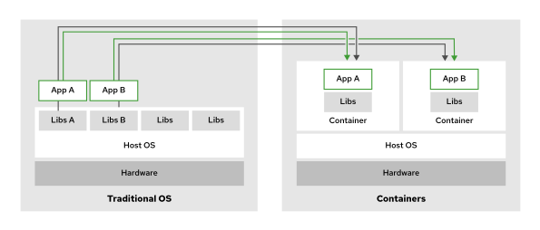
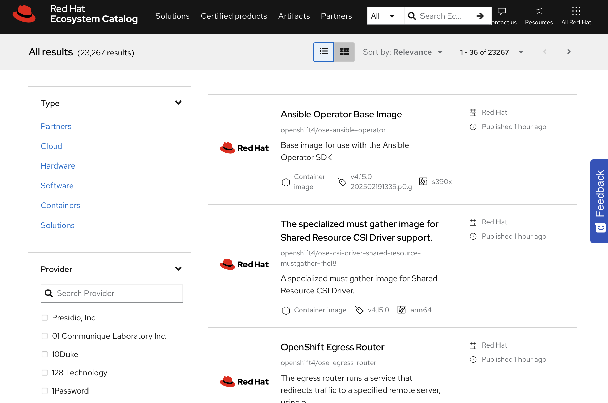

Quản trị hệ thống Red Hat 2
---------------------------

# Chương 17. Quản lý Container bằng Podman
## Giới thiệu về Container
### Mục tiêu
Giải thích các khái niệm về container và các công nghệ cốt lõi trong Red Hat Enterprise Linux.

### Tổng quan về công nghệ container
Trong lĩnh vực điện toán, container là một tiến trình được đóng gói, bao gồm các thành phần phụ thuộc (dependencies) cần thiết để
chương trình có thể vận hành. Bên trong container, các thư viện dành riêng cho ứng dụng hoạt động độc lập với các thư viện của hệ điều
hành máy chủ. Hệ điều hành và nhân (kernel) máy chủ cung cấp các thư viện và hàm chức năng không gắn liền với riêng ứng dụng đang chạy
trong container. Những thư viện và hàm này giúp duy trì sự gọn nhẹ cho container, đồng thời cho phép nó khởi chạy và dừng lại nhanh
chóng khi cần thiết.

Công cụ quản lý container (container engine) tạo ra một hệ thống tệp hợp nhất (union file system) bằng cách kết hợp các lớp (layer) của
ảnh container (container image). Mỗi lớp là một thành phần của ảnh container, đại diện cho một tập hợp cụ thể các tệp hoặc các thay
đổi — chẳng hạn như thư viện hệ thống, tệp nhị phân của ứng dụng hoặc tệp cấu hình. Các lớp được xây dựng chồng lên nhau, tạo thành một
cấu trúc phân lớp hoàn chỉnh cho ảnh container. Do các lớp của ảnh container có đặc tính bất biến (không thể thay đổi), công cụ quản lý
container sẽ bổ sung thêm một lớp có quyền ghi (writable layer) để phục vụ việc sửa đổi tệp trong quá trình vận hành. Theo mặc định,
container có tính chất tạm thời (ephemeral); điều này có nghĩa là công cụ quản lý container sẽ xóa lớp có quyền ghi khi bạn xóa
container đó.

**Hình 17.1: Các ứng dụng chạy trong container so với trên hệ điều hành máy chủ**  


Môi trường bên trong container dựa trên nền tảng Linux, bất kể hệ điều hành của máy chủ là gì. Các container tận dụng những tính năng
của nhân Linux như namespaces, control groups (cgroups), SELinux và chế độ tính toán an toàn (seccomp). Ví dụ, container sử dụng
cgroups để quản lý tài nguyên, chẳng hạn như phân bổ thời gian CPU và bộ nhớ hệ thống. Đặc biệt, namespaces cung cấp khả năng cô lập
các tiến trình bên trong container với nhau cũng như với hệ thống máy chủ. Khi chạy container trên các hệ điều hành không phải Linux,
các tính năng đặc thù của Linux này thường được ảo hóa bởi cơ chế triển khai của công cụ quản lý container (container engine).

Công nghệ container bắt nguồn từ các giải pháp như tiện ích chroot — một phương pháp cô lập môi trường một phần hoặc toàn bộ — và phát
triển thành Open Container Initiative (OCI), một tổ chức quản trị chuyên thiết lập các tiêu chuẩn cho việc tạo và vận hành container.
Hầu hết các công cụ quản lý container đều tuân thủ các thông số kỹ thuật của OCI, nhờ đó các nhà phát triển có thể tự tin xây dựng các
sản phẩm triển khai để chạy dưới dạng container chuẩn OCI.

Các container sử dụng SELinux và chế độ tính toán an toàn (seccomp) để thiết lập ranh giới bảo mật và hạn chế các tính năng khả dụng
bên trong container.

> **Lưu ý**: Để biết thêm thông tin chi tiết về kiến trúc và bảo mật container, vui lòng tham khảo tài liệu chuyên đề (white paper) của
> Red Hat có tựa đề
> [A Layered Approach to Container and Kubernetes Security](https://www.redhat.com/en/resources/container-security-openshift-cloud-devops-whitepaper)
> (Cách tiếp cận theo lớp đối với bảo mật container và Kubernetes).

#### Lợi ích và thách thức khi sử dụng container
Một trong những lợi ích chính là container có thể khởi động chỉ trong vài giây, khiến chúng trở nên lý tưởng cho các môi trường năng
động và có khả năng mở rộng. Chúng cũng rất phù hợp để triển khai các ứng dụng hiện đại, chẳng hạn như ứng dụng "cloud-native" (được
thiết kế riêng cho môi trường đám mây). Container hoạt động rất hiệu quả nhờ sử dụng ít tài nguyên hơn so với máy ảo. Tính di động là
một ưu điểm khác, cho phép chúng vận hành ổn định và đồng nhất trên các môi trường phát triển, kiểm thử và sản xuất. Cơ chế cô lập của
chúng đảm bảo rằng các môi trường ứng dụng luôn tách biệt và có thể dự đoán được hành vi.

Tuy nhiên, việc sử dụng container cũng đặt ra một số thách thức. Việc duy trì dữ liệu lâu dài (data persistence) đòi hỏi phải có cấu
hình bổ sung, chẳng hạn như sử dụng các "volume" để lưu trữ dữ liệu bên ngoài vùng lưu trữ tạm thời của container. Hệ thống mạng trở
nên phức tạp hơn trong các cấu hình bao gồm nhiều container hoặc nhiều máy chủ (host). Quản lý bảo mật cũng là một vấn đề đáng quan
tâm, do các container dùng chung nhân (kernel) của máy chủ và đòi hỏi sự kiểm soát truy cập chặt chẽ. Mặc dù các container chạy ở chế
độ không cần quyền root (rootless containers) giúp tăng cường bảo mật bằng cách cho phép người dùng vận hành mà không cần đặc quyền cao
nhất, nhưng chúng cũng có thể hạn chế khả năng truy cập vào một số chức năng nhất định của hệ thống.

#### Hình ảnh (Image) so với Thể hiện (Instance)
"Container image" (ảnh container) và "container instance" (thể hiện container) là những thuật ngữ thường gặp khi làm việc với
container, và chúng mang ý nghĩa khác nhau. Một container image chứa dữ liệu bất biến, các chỉ dẫn và thư viện dùng để định nghĩa một
ứng dụng. Bạn có thể sử dụng container image để tạo ra các container instance; đây là những phiên bản thực thi của image, bao gồm các
tham chiếu đến mạng, ổ đĩa và những yếu tố cần thiết khác cho quá trình vận hành.

Bạn có thể sử dụng một container image nhiều lần để tạo ra nhiều container instance riêng biệt. Bạn cũng có thể chạy các instance này
trên nhiều máy chủ (host) khác nhau. Ứng dụng bên trong container hoạt động độc lập với môi trường của máy chủ.

> **Lưu ý**: Các image container OCI được định nghĩa bởi đặc tả image-spec, trong khi các instance container OCI được định nghĩa bởi
> đặc tả runtime-spec.

Một cách khác để hình dung về mối quan hệ giữa image (ảnh) và instance (thể hiện) của container là: instance có mối liên hệ với image
cũng giống như object (đối tượng) có mối liên hệ với class (lớp) trong lập trình hướng đối tượng.

#### Kho chứa container
Registry chứa image container là nơi lưu trữ các image container và các thành phần liên quan dành cho các ứng dụng chạy trên nền tảng
container. Tệp `/etc/containers/registries.conf` là tệp cấu hình áp dụng cho toàn hệ thống. Tệp này liệt kê các registry container khả
dụng cho các công cụ như Podman, Buildah và Skopeo.

Red Hat cung cấp các registry sau:

* registry.redhat.io : yêu cầu xác thực
* registry.access.redhat.com : không yêu cầu xác thực
* registry.connect.redhat.com : chứa các image thuộc chương trình Red Hat Partner Connect

### So sánh Container và Máy ảo
Nhìn chung, container đóng vai trò tương tự như máy ảo (VM), trong đó ứng dụng hoạt động trong một môi trường khép kín với hệ thống
mạng được ảo hóa để phục vụ việc giao tiếp. Mặc dù có điểm tương đồng ban đầu này, container lại chiếm ít tài nguyên hơn, đồng thời có
tốc độ khởi động và tắt nhanh hơn so với máy ảo. Xét về mức độ sử dụng bộ nhớ và dung lượng đĩa, máy ảo thường được tính bằng đơn vị
gigabyte, trong khi container được tính bằng megabyte.

Máy ảo tỏ ra hữu ích khi cần một môi trường điện toán hoàn chỉnh và riêng biệt, chẳng hạn như khi ứng dụng đòi hỏi phần cứng chuyên
dụng cụ thể. Ngoài ra, máy ảo là lựa chọn phù hợp hơn khi ứng dụng yêu cầu một hệ điều hành không phải Linux hoặc một nhân (kernel) hệ
điều hành khác với máy chủ (host).

#### Container so với Máy ảo
Máy ảo và container sử dụng các phần mềm khác nhau để quản lý và vận hành. Hypervisor — chẳng hạn như Kernel-based Virtual Machine
(KVM), Xen, VMware và Hyper-V — là các ứng dụng cung cấp chức năng ảo hóa cho máy ảo. Thành phần tương đương với hypervisor trong môi
trường container là container engine, ví dụ như Podman.

|                        | Máy ảo                                            | Containers                                                  |
|------------------------|---------------------------------------------------|-------------------------------------------------------------|
| Chức năng ở cấp độ máy | Hypervisor                                        | Công cụ quản lý container                                   |
| Quản lý                | Giao diện quản lý máy ảo                          | Công cụ quản lý container hoặc phần mềm điều phối container |
| Cấp độ ảo hóa          | Môi trường ảo hóa hoàn toàn                       | Chỉ những phần có liên quan                                 |
| Kích thước             | Được đo bằng gigabyte                             | Được đo bằng megabyte                                       |
| Tính di động           | Thông thường chỉ áp dụng cho cùng một hypervisor. | Bất kỳ engine nào tuân thủ OCI                              |

Bạn có thể quản lý các hypervisor bằng phần mềm quản lý bổ sung. Phần mềm này có thể được tích hợp sẵn cùng hypervisor hoặc là một
công cụ độc lập bên ngoài, chẳng hạn như Virtual Machine Manager (virt-manager) dùng cho KVM. Ngoài ra, bạn có thể quản lý các
container trực tiếp thông qua chính container engine. Hơn nữa, bạn có thể sử dụng các công cụ điều phối container (container
orchestration tools) như Red Hat OpenShift Container Platform (RHOCP) và Kubernetes để vận hành và quản lý container trên quy mô lớn.
RHOCP cho phép quản lý cả container lẫn máy ảo từ một giao diện thống nhất.

Đối với máy ảo (VM), khả năng tương tác qua lại thường rất hạn chế. Một máy ảo chạy trên hypervisor này thường không được đảm bảo sẽ
chạy được trên một hypervisor khác. Ngược lại, các container tuân thủ tiêu chuẩn OCI không phụ thuộc vào một container engine cụ thể
nào để hoạt động; nhiều container engine có thể thay thế trực tiếp cho nhau.

## Chạy Container với Podman
### Mục tiêu
Chạy một image container có sẵn từ registry dưới dạng container bằng cách sử dụng Podman.

### Công cụ quản lý container Podman
Podman là một công cụ mã nguồn mở dùng để quản lý các container cục bộ. Với Podman, bạn có thể tìm kiếm, chạy, xây dựng hoặc triển
khai các container và image container tuân theo tiêu chuẩn Open Container Initiative (OCI).

Một số công cụ quản lý container sử dụng tiến trình nền (daemon) để chuyển tiếp các yêu cầu; điều này tạo ra một điểm lỗi duy nhất
(single point of failure) đối với các tác vụ quản lý container. Ngoài ra, tiến trình nền có thể đòi hỏi quyền hạn cao, điều này có thể
dẫn đến những lo ngại về bảo mật.

Podman được thiết kế theo cơ chế không sử dụng tiến trình nền (daemonless), nghĩa là nó tương tác trực tiếp với các container, image
và registry mà không cần thông qua daemon. Thiết kế này giúp Podman trở thành công cụ phù hợp để sử dụng trong môi trường vận hành
thực tế (production).

Trong Red Hat Enterprise Linux 10, Podman được cài đặt sẵn theo mặc định. Bạn có thể kiểm tra phiên bản Podman đang được cài đặt trên
máy của mình bằng cách sử dụng lệnh `podman -v`. Số phiên bản trên hệ thống của bạn có thể khác biệt.

```console
user@host:~$ podman -v
podman version 5.4.0
```

Podman cung cấp ba cách để tương tác với các container của bạn: Podman CLI, RESTful API và ứng dụng máy tính để bàn có tên Podman
Desktop.

Phần này tập trung vào việc chạy các container bằng cách sử dụng Podman CLI.

### Kho chứa ảnh container
Container image là phiên bản đã được đóng gói của ứng dụng, bao gồm tất cả các thành phần phụ thuộc cần thiết để ứng dụng có thể hoạt
động. Bạn có thể tải xuống container image từ một registry (kho lưu trữ image) và sử dụng nó làm nền tảng để chạy các container của
mình. Các registry phổ biến bao gồm Red Hat Registry, Quay.io, Docker Hub và Amazon Elastic Container Registry (Amazon ECR).

#### Các kho chứa container của Red Hat
Red Hat phân phối các image container thông qua các registry sau:

* registry.redhat.io : yêu cầu xác thực
* registry.access.redhat.com : không yêu cầu xác thực
* registry.connect.redhat.com : chứa các image thuộc chương trình Red Hat Partner Connect

Red Hat Ecosystem Catalog cung cấp khả năng tìm kiếm tập trung cho các kho lưu trữ này tại địa chỉ https://catalog.redhat.com. Bạn có
thể sử dụng Ecosystem Catalog để tìm kiếm các image và xem thông tin chi tiết về kỹ thuật của chúng. Hãy truy cập
https://catalog.redhat.com/search để tìm kiếm các container image.

**Hình 17.2: Danh mục Hệ sinh thái Red Hat**  


Trang chi tiết về image container cung cấp các thông tin liên quan, chẳng hạn như `Containerfile` được sử dụng để tạo image, các gói
phần mềm được cài đặt bên trong image hoặc kết quả quét bảo mật. Bạn cũng có thể thay đổi phiên bản image bằng cách chọn một thẻ (tag)
cụ thể.

#### Kho chứa container Quay.io
Red Hat Registry chỉ lưu trữ các image từ Red Hat và các nhà cung cấp đã được chứng nhận. Để lưu trữ các image tùy chỉnh của mình, bạn
có thể sử dụng registry Quay.io. Việc lưu trữ các image công khai trên Quay.io là miễn phí, và khách hàng trả phí sẽ nhận được thêm
các quyền lợi khác, chẳng hạn như các kho lưu trữ (repository) riêng tư. Các nhà phát triển cũng có thể triển khai một instance Quay
tại chỗ (on-premise) để thiết lập registry image trên cơ sở hạ tầng của riêng mình.

Bạn có thể sử dụng tài khoản nhà phát triển Red Hat của mình để đăng nhập vào registry Quay.io.

#### Đăng nhập vào các Registry chứa Image Container
Thông thường, bạn cung cấp thông tin xác thực để tương tác với một registry container bằng cách sử dụng lệnh `podman login`. Lệnh
`podman login` nhận URL của registry làm tham số, sau đó yêu cầu nhập tên người dùng và mật khẩu.

Ví dụ sau đây minh họa thao tác đăng nhập vào registry `registry.redhat.io` bằng tên người dùng và mật khẩu.

```console
user@host:~$ podman login registry.redhat.io
Username: provide_username
Password: provide_password
Login Succeeded!
```

> **Lưu ý**: Vì lý do bảo mật, lệnh `podman login` không hiển thị mật khẩu của bạn trong phiên tương tác. Mặc dù bạn không nhìn thấy
những gì mình đang gõ, Podman vẫn ghi nhận từng lần nhấn phím. Hãy nhấn phím Enter sau khi đã nhập xong mật khẩu trong phiên tương tác
để bắt đầu quá trình đăng nhập.

Một số registry chứa container có thể không yêu cầu tài khoản được cấp quyền, nghĩa là bạn có thể tải xuống các image container mà
không cần cung cấp thông tin xác thực. Trong trường hợp này, bạn cần cung cấp URL của registry chứa image container và để trống thông
tin tên người dùng cùng mật khẩu.

```console
user@host:~$ podman login registry.access.redhat.com
Username: Enter
Password: Enter
Login Succeeded!
```

#### Kiểm tra các Container Registry đã được cấu hình
Để xem registry chứa image container mặc định trên máy của bạn, bạn có thể sử dụng lệnh `podman info`. Lệnh này hiển thị các thông tin
về hệ điều hành và phần cứng, các registry đã được cấu hình, các plugin đã cài đặt cũng như thông tin về phiên bản.

Ví dụ dưới đây hiển thị một phần nội dung của registry `my_org_registry.example.com` đã được cấu hình cục bộ. Lưu ý rằng kết quả đầu
ra còn hiển thị các registry bổ sung trong trường tìm kiếm (search field), được sử dụng để tìm kiếm các image container.

```console
user@host:~$ podman info
...output omitted...
registries:
  my_org_registry.example.com:
    Blocked: false
    Insecure: true
    Location: my_org_registry.example.com
    MirrorByDigestOnly: false
    Mirrors: null
    Prefix: my_org_registry.example.com
    PullFromMirror: ""
  search:
  - registry.access.redhat.com
  - registry.redhat.io
  - docker.io
  - quay.io
...output omitted...
```

Podman chủ yếu sử dụng hai tệp để lưu trữ cấu hình registry:

* Tệp `/etc/containers/registries.conf` (hoặc thư mục bổ sung `/etc/containers/registries.conf.d`).
Podman sử dụng tệp `registries.conf` để lưu trữ cấu hình registry. 
* Tệp `${XDG_RUNTIME_DIR}/containers/auth.json`. Podman lưu trữ thông tin xác thực trong tệp
`${XDG_RUNTIME_DIR}/containers/auth.json`, trong đó `${XDG_RUNTIME_DIR}` là thư mục dành riêng cho người dùng hiện tại.
Các thông tin xác thực này được mã hóa dưới định dạng base64.

### Chạy và quản lý container
Sau khi xác thực với registry chứa container, bạn có thể bắt đầu chạy các container.

#### Chạy các container
Bạn sử dụng lệnh `podman run` để chạy một container. Lệnh này yêu cầu một tên image làm tham số; image đó có thể được lưu trữ cục bộ
hoặc nằm trên một registry từ xa. Lệnh `podman run` sẽ tải xuống (hoặc "pull") image container và sử dụng nó để khởi chạy container.

Một image có thể chấp nhận các tham số bổ sung, chẳng hạn như các lệnh cần thực thi bên trong container sau khi nó khởi động.

Trong ví dụ dưới đây, bạn chạy một container sử dụng image `ubi10` từ registry `registry.redhat.io` để thực thi lệnh
`echo 'Hello World!'`. Podman sẽ tìm kiếm image, tải nó về, khởi động container và thực thi lệnh được yêu cầu. Lưu ý rằng kết quả đầu
ra của lệnh sẽ hiển thị quá trình tải image từ registry về.

```console
user@host:~$ podman run registry.redhat.io/ubi10 echo 'Hello World!'
Trying to pull registry.redhat.io/ubi10:latest...
...output omitted...
Hello World!
```

Khi container hoàn tất việc thực thi lệnh `echo`, nó sẽ dừng lại vì không còn tiến trình nào khác duy trì hoạt động của nó.

Theo mặc định, container sẽ tiếp tục chạy chừng nào còn tác vụ cần thực hiện và vẫn giữ lại dấu nhắc lệnh (terminal prompt) cho đến
khi hoàn tất. Bạn có thể chạy các container thực hiện một tác vụ nhanh rồi dừng lại (như ví dụ với lệnh `echo`), hoặc chạy container
hoạt động liên tục không có điểm dừng. Để tránh việc cửa sổ dòng lệnh bị chiếm dụng (chặn), bạn có thể sử dụng tùy chọn `--detach`
hoặc `-d`.

Ví dụ dưới đây minh họa cách chạy một container ở chế độ tách biệt (detached mode) để thực thi lệnh `sleep infinity`, nghĩa là
container sẽ chạy liên tục không giới hạn thời gian. Container này sử dụng cùng một image `ubi10`, nhưng lần này Podman sẽ không tải
image về nữa vì nó đã có sẵn trong bộ nhớ cục bộ.

```console
user@host:~$ podman run -d registry.redhat.io/ubi10 sleep infinity
8699...c98b
```

#### Hiển thị các container
Bạn có thể liệt kê các container đang chạy bằng cách sử dụng lệnh `podman ps`. Theo mặc định, lệnh `podman ps` sẽ hiển thị các thông
tin chi tiết sau đây về các container của bạn:

* ID của container
* Tên của image mà container sử dụng
* Lệnh mà container thực thi
* Thời điểm container được tạo
* Trạng thái của container
* Các cổng (port) được mở trên container
* Tên của container

Podman có thể nhận diện các container thông qua mã định danh ngắn UUID (gồm 12 ký tự chữ và số) hoặc mã định danh dài UUID (gồm 64 ký
tự chữ và số). Ví dụ dưới đây hiển thị danh sách các container đang chạy trong môi trường. Cột đầu tiên hiển thị chuỗi "8699…1cae" –
đây chính là ID của container, hay còn gọi là mã định danh ngắn UUID.

```console
user@host:~$ podman ps
CONTAINER ID IMAGE                         COMMAND         ...  NAMES
8699...1cae  registry.redhat.io/ubi10:...  sleep infinity  ...  bold_chebyshev
```

Danh sách này không hiển thị container đã thực thi lệnh `echo` vì container đó đã dừng lại sau khi chạy xong lệnh. Tuy nhiên, việc
dừng một container không đồng nghĩa với việc xóa nó. Mặc dù container đã dừng, Podman vẫn không xóa nó. Bạn có thể liệt kê tất cả các
container (bao gồm cả những container đang chạy và đã dừng) bằng cách thêm tùy chọn `--all` hoặc `-a` vào lệnh `podman ps`:

```console
user@host:~$ podman ps -a
CONTAINER ID ... COMMAND           ... STATUS                   ... NAMES
fad3...00d3 ...  echo Hello World! ... Exited (0) 7 minutes ago ... nervous_nobel
8699...1cae ...  sleep infinity    ... Up 53 seconds            ... bold_chebyshev
```

Nếu bạn không đặt tên cho container khi tạo nó, Podman sẽ tự động tạo một chuỗi ngẫu nhiên làm tên container. Bạn nên đặt một tên duy
nhất để dễ dàng nhận diện các container trong quá trình quản lý vòng đời của chúng. Để đặt tên cho container, hãy sử dụng lệnh
`podman run` kết hợp với tùy chọn `--name`.

Ví dụ dưới đây minh họa việc chạy lệnh `which python` bên trong container có tên `my_python` (được tạo từ image `ubi9/python-312`).
Container sẽ xuất ra kết quả là `/opt/app-root/bin/python` rồi sau đó dừng lại.

```console
user@host:~$ podman run --name my_python \
registry.redhat.io/ubi9/python-312 which python
Trying to pull registry.redhat.io/ubi9/python-312:latest...
Getting image source signatures
...output omitted...
Storing signatures
/opt/app-root/bin/python
```

Lệnh `podman ps` hiện hiển thị `my_python` là tên của container:

```console
user@host:~$ podman ps -a
CONTAINER ID IMAGE                                     COMMAND      ... NAMES
...output omitted...
a57e...fa88 registry.redhat.io/ubi9/python-312:latest which python ... my_python
```

#### Khởi động lại các container
Chạy lệnh `podman restart` để khởi động lại một container đang chạy. Bạn cũng có thể sử dụng lệnh này để khởi động một container đã
dừng.

Lệnh sau đây khởi động lại container có tên là nginx:

```console
user@host:~$ podman restart nginx
1b98a7c275dd
```

#### Dừng và xóa container
Bạn có thể dừng một container một cách an toàn (gracefully) bằng cách sử dụng lệnh `podman stop`. Khi thực thi lệnh `podman stop`,
Podman sẽ gửi tín hiệu SIGTERM tới container. Các tiến trình sử dụng tín hiệu SIGTERM để thực hiện các quy trình dọn dẹp trước khi
dừng lại.

Ví dụ sau đây dừng một container có ID là `1b982aeb75dd`:

```console
user@host:~$ podman stop 1b982aeb75dd
1b982aeb75dd
```

Bạn có thể dừng tất cả các container đang chạy bằng cách sử dụng cờ `--all` hoặc `-a`. Trong ví dụ dưới đây, lệnh này dừng ba
container:

```console
user@host:~$ podman stop --all
4aea81cc0c2a
6b18d10f54ea
77632e81cbc0
```

Nếu một container không phản hồi tín hiệu SIGTERM, Podman sẽ gửi tín hiệu SIGKILL để buộc container đó dừng lại. Theo mặc định, Podman
sẽ chờ 10 giây trước khi gửi tín hiệu SIGKILL.

Bạn có thể gửi tín hiệu SIGKILL tới container bằng cách sử dụng lệnh `podman kill`. Trong ví dụ dưới đây, một container có tên là
`httpd` bị buộc dừng lại:

```console
user@host:~$ podman kill httpd
httpd
```

Sử dụng lệnh `podman rm` để xóa một container đã dừng. Lệnh sau đây xóa một container đã dừng có ID là c58cfd4b90df:

```console
user@host:~$ podman rm c58cfd4b90df
c58cfd4b90df
```

Theo mặc định, bạn không thể xóa các container đang chạy; trước tiên, bạn phải dừng container đó rồi mới xóa được. Bạn có thể thêm cờ
`--force` (hoặc `-f`) để xóa container một cách cưỡng bức:

```console
user@host:~$ podman rm c58cfd4b90df --force
c58cfd4b90df
```

Bạn cũng có thể tự động xóa container khi nó kết thúc bằng cách thêm tùy chọn `--rm` vào lệnh `podman run`:

```console
user@host:~$ podman run --rm registry.redhat.io/ubi10 \
echo 'Hello World!'
Red Hat
```

Sau khi container in chuỗi ký tự, nó sẽ kết thúc và Podman sẽ xóa container đó. Ví dụ sau đây cho thấy container không còn xuất hiện
trong danh sách sau khi chạy lệnh `podman ps` với tùy chọn `--all`:

```console
user@host:~$ podman ps --all
CONTAINER ID  IMAGE          COMMAND   CREATED    STATUS    PORTS   NAMES
```

#### Mở các cổng mạng của container
Nhiều ứng dụng chạy trong container, chẳng hạn như máy chủ web hoặc cơ sở dữ liệu, cần hoạt động liên tục để chờ các kết nối. Bạn cũng
cần đảm bảo rằng các container này có thể mở các cổng dịch vụ ra bên ngoài thông qua giao thức mạng.

Bạn có thể sử dụng lệnh `podman run` với tùy chọn `-p` để ánh xạ một cổng trên máy cục bộ của mình tới một cổng bên trong container.
Bằng cách này, lưu lượng truy cập vào cổng cục bộ sẽ được chuyển tiếp đến cổng bên trong container, cho phép bạn truy cập ứng dụng từ
máy tính của mình.

Ví dụ sau đây tạo một container chạy máy chủ Apache HTTP bằng cách ánh xạ cổng 8080 trên máy `mywebapp.example.com` tới cổng 8080 bên
trong container. Container này không chạy ở chế độ tách biệt (detached mode) để bạn có thể theo dõi kết quả đầu ra ngay trên cửa sổ
dòng lệnh (terminal).

```console
user@host:~$ podman run -p 8080:8080 registry.redhat.io/rhel10/httpd-24:latest
...output omitted...
=> sourcing 10-set-mpm.sh ...
=> sourcing 20-copy-config.sh ...
=> sourcing 40-ssl-certs.sh ...
---> Generating SSL key pair for httpd...
[Mon Jun 09 05:30:25.657414 2025] [ssl:warn] [pid 1:tid 1] AH01909: workstation.lab.example.com:8443:0 server certificate does NOT include an ID which matches the server name
...output omitted...
[Mon Jun 09 05:30:25.734309 2025] [core:notice] [pid 1:tid 1] AH00094: Command line: 'httpd -D FOREGROUND'

Ctrl+C
```

Hiện tại, container đang xử lý các yêu cầu thông qua cổng 8080 trên máy mywebapp.example.com. Bạn có thể truy cập nội dung của máy chủ
HTTP từ một máy khác trong mạng tại địa chỉ mywebapp.example.com:8080, hoặc truy cập trực tiếp từ chính máy mywebapp tại địa chỉ
localhost:8080.

```console
user@host:~$ curl 127.0.0.1:8080
<!DOCTYPE html PUBLIC "-//W3C//DTD XHTML 1.1//EN" "http://www.w3.org/TR/xhtml11/DTD/xhtml11.dtd">

<html xmlns="http://www.w3.org/1999/xhtml" xml:lang="en">
...output omitted...
```

Để tránh việc cửa sổ dòng lệnh bị chặn, hãy chạy container ở chế độ chạy ngầm (detached mode) bằng cách sử dụng lệnh `podman run`
với tùy chọn `-d`:

```console
user@host:~$ podman run -d -p 8080:8080 \
registry.redhat.io/rhel10/httpd-24:latest
b7eb...636a
```

## Tạo và quản lý các image container
### Mục tiêu
Quản lý các image container đã tải xuống và tạo một image container đơn giản.

### Container và Container Image
Hãy nhớ rằng container là một môi trường thực thi biệt lập, nơi các ứng dụng chạy dưới dạng các tiến trình riêng biệt. Sự biệt lập của
môi trường thực thi này đảm bảo rằng các ứng dụng không gây ảnh hưởng đến các container hay tiến trình hệ thống khác. Container image
chứa phiên bản đã được đóng gói của ứng dụng cùng với tất cả các thành phần phụ thuộc cần thiết để ứng dụng vận hành. Image có thể tồn
tại độc lập mà không cần container; tuy nhiên, container lại cần có container image để thiết lập môi trường thực thi và chạy ứng dụng.

### Làm việc với các Container Image
Công cụ Podman thực hiện nhiều thao tác trên các image container.

* Tải (pull) một image từ registry
* Liệt kê các image trong registry
* Kiểm tra nội dung của một image cục bộ hoặc từ xa
* Sao chép các image hoặc các lớp (layer) của image
* Gán thêm tên (tag) cho một image
* Lưu hoặc tải image vào/từ một tệp lưu trữ container
* Chia sẻ image thông qua registry

#### Tìm kiếm, Lấy và Liệt kê Hình ảnh
Bạn có thể chạy một container để triển khai ứng dụng mà không cần thực hiện thao tác tải (pull) image container một cách riêng biệt.
Trong một số trường hợp, có thể bạn không chắc chắn những image nào hiện có trong registry hoặc chưa biết nên sử dụng image nào.

Bạn có thể tìm kiếm các image trong registry bằng cách sử dụng lệnh `podman search` kèm theo URL của registry đó. Hãy đảm bảo rằng URL
bạn chỉ định có chứa dấu gạch chéo (`/`) ở cuối.

```console
user@host:~$ podman search registry.redhat.io/rhel10
NAME                                                  DESCRIPTION
registry.redhat.io/rhel10/buildah                     rhcc_registry.access...
registry.redhat.io/rhel10/toolbox                     rhcc_registry.access...
registry.redhat.io/rhel10/net-snmp                    rhcc_registry.access...
...output omitted...
```

Red Hat cung cấp Universal Base Image (UBI) làm nền tảng cho các ứng dụng container mới. Mỗi hình ảnh Red Hat UBI đều tuân thủ tiêu
chuẩn Open Container Initiative (OCI) và được phép tự do phân phối lại. Để tìm kiếm Universal Base Image, hãy thêm từ khóa `ubi` vào
lệnh `podman search`:

```console
user@host:~$ podman search registry.redhat.io/ubi
NAME                                       DESCRIPTION
registry.redhat.io/ubi8/ubi                Provides the latest release of th...
registry.redhat.io/ubi9/ubi                rhcc_registry.access.redhat.com_u...
registry.redhat.io/ubi10/ubi               rhcc_registry.access.redhat.com_u...
...output omitted...
```

Bạn có thể tải các image container từ các registry bằng cách sử dụng lệnh `podman pull`. Image RHEL 10 dạng container được tham chiếu
theo định dạng `name:tag`, trong đó `name` là tên image và `tag` là thẻ (hay còn gọi là phiên bản) của image đó.

Các thẻ giúp phân biệt những phiên bản khác nhau của cùng một image. Thông thường, thẻ là các số hiệu phiên bản cụ thể, chẳng hạn như
`10.0`. Thẻ `latest` đại diện cho phiên bản mới nhất của image. Nếu không chỉ định thẻ, Podman sẽ mặc định sử dụng thẻ `latest`.

Ví dụ, lệnh sau đây sẽ tải về phiên bản container của Red Hat Enterprise Linux 10 mới nhất. Phiên bản container này là một image
container có khả năng khởi động (bootc).

```console
user@host:~$ podman pull registry.redhat.io/rhel10/rhel-bootc
...output omitted...
a93f...d5b0
```

Lưu ý rằng phiên bản không được chỉ định, do đó phiên bản mới nhất sẽ tự động được tải về. Để tải về một phiên bản cụ thể của image,
hãy chỉ định chính xác phiên bản đó, ví dụ:

```console
user@host:~$ podman pull registry.redhat.io/rhel10/rhel-bootc:10.0
...output omitted...
a93f...d5b0
```

Sau khi chạy lệnh `pull`, image sẽ được lưu trữ cục bộ. Bạn có thể liệt kê tất cả các image trong hệ thống của mình bằng cách sử dụng
lệnh `podman images`:

```console
user@host:~$ podman images
REPOSITORY                    TAG         IMAGE ID      CREATED      SIZE
registry...rhel10/rhel-bootc  10.0        a93f5ef0baa4  3 weeks ago  1.43 GB
registry...rhel10/rhel-bootc  latest      a93f5ef0baa4  3 weeks ago  1.43 GB
```

#### Kiểm tra Image
Bạn có thể kiểm tra nội dung của một image container bằng cách sử dụng lệnh `podman image inspect`. Nội dung sẽ được hiển thị ở định
dạng JSON.

```console
user@host:~$ podman image inspect rhel-bootc:latest
[
     {
          "Id": "a93f...d5b0",
          "Digest": "sha256:510f...c913",
          "RepoTags": [
               "registry.redhat.io/rhel10/rhel-bootc:10.0",
               "registry.redhat.io/rhel10/rhel-bootc:latest"
          ],
          "RepoDigests": [
               "registry.redhat.io/rhel10/rhel-bootc@sha256:510f...c913",
               "registry.redhat.io/rhel10/rhel-bootc@sha256:8578...7556"
          ],
...output omitted...
  }
]
```

Bằng cách sử dụng tùy chọn `--format` kết hợp với mẫu Go (Go template), bạn có thể kiểm tra giá trị của các khóa cụ thể.

Ví dụ sau đây trả về tên của image container:

```console
user@host:~$ podman image inspect rhel-bootc:latest \
--format "{{.Config.Labels.name}}"
rhel10/rhel-bootc
```

Ví dụ sau đây trả về ngày và giờ tạo của hình ảnh container:

```console
user@host:~$ podman image inspect rhel-bootc:latest \
--format "{{.Created}}"
2025-05-15 15:00:38.956441305 +0000 UTC
```

Ví dụ sau đây trả về mô tả của hình ảnh container:

```console
user@host:~$ podman image inspect rhel-bootc:latest \
--format "{{.Config.Labels.description}}"
RHEL bootc container
```

Để kiểm tra một image từ xa, trước tiên hãy kéo image đó từ kho lưu trữ từ xa, ví dụ:

```console
user@host:~$ podman image pull registry.redhat.io/rhel10/rhel-bootc:latest
...output omitted...
a93f...d5b0
```

Tiếp theo, hãy sử dụng lệnh `podman image inspect` để kiểm tra image đã được tải về, ví dụ:

```console
user@host:~$ podman image inspect rhel-bootc:latest
[
     {
          "Id": "a93f...d5b0",
          "Digest": "sha256:510f...c913",
          "RepoTags": [
               "registry.redhat.io/rhel10/rhel-bootc:latest",
               "registry.redhat.io/rhel10/rhel-bootc:10.0"
          ],
          "RepoDigests": [
               "registry.redhat.io/rhel10/rhel-bootc@sha256:510f...c913",
               "registry.redhat.io/rhel10/rhel-bootc@sha256:8578...7556"
          ],
...output omitted...
  }
]
```

> **Lưu ý**: Bạn cũng có thể bỏ qua loại đối tượng (content type) khi sử dụng lệnh `podman inspect`. Nếu không xác định loại,
> Podman sẽ kiểm tra các container, image, volume, network và pod theo thứ tự đó.

#### Gắn thẻ Image
Bạn có thể gán tên và thẻ mới cho một image container bằng cách sử dụng lệnh `podman tag`, theo sau là ID của image hiện tại cùng với
tên và thẻ mới muốn sử dụng cho image container đó.

```console
user@host:~$ podman tag c6222576494f fedora:latest
```

### Tạo Image từ Containerfile
Bạn có thể tạo một image container bằng cách sử dụng Containerfile. Containerfile chứa tất cả các chỉ dẫn cần thiết để xây dựng image.

Mọi Containerfile đều bắt đầu với một image cơ sở làm nền tảng. Trong ví dụ này, image cơ sở Universal Base Image (ubi10) được tải về
bộ nhớ cục bộ từ kho lưu trữ registry.redhat.io:

```console
user@host:~$ podman image pull registry.redhat.io/ubi10/ubi
...output omitted...
da86...50d1
```

Các thư viện, tệp nhị phân và tệp tin bổ sung cần thiết để chạy ứng dụng sau đó có thể được xếp chồng lên trên image cơ sở này. Tệp
Containerfile dưới đây sử dụng image cơ sở ubi10, cài đặt gói máy chủ web httpd, sao chép tệp index.html vào thư mục gốc của máy chủ
web, mở cổng 80 cho tiến trình httpd, và thiết lập điểm vào (entrypoint) để chạy tiến trình httpd ở chế độ foreground.

```
# Use the ubi10 base image
FROM ubi10/ubi

# Install httpd
RUN dnf install -y httpd

# Copy a temporary index.html file to the web server root
COPY index.html /var/www/html/index.html

# Expose port 80 for httpd
EXPOSE 80

# Set the entrypoint to run httpd in the foreground
ENTRYPOINT ["/usr/sbin/httpd", "-DFOREGROUND"]
```

Sử dụng lệnh `podman build` với tệp `Containerfile` để tạo image container thực tế.

```console
user@host:~$ podman build -t my-httpd -f Containerfile
STEP 1/5: FROM ubi10/ubi
STEP 2/5: RUN dnf install -y httpd
--> Using cache 84ad...b195
--> 84ada70bc51a
STEP 3/5: COPY index.html /var/www/html/index.html
--> cd70d8bde15a
STEP 4/5: EXPOSE 80
--> 4df4dd4a9158
STEP 5/5: ENTRYPOINT ["/usr/sbin/httpd", "-DFOREGROUND"]
COMMIT my-httpd
--> 3067a8d97686
Successfully tagged localhost/my-httpd:latest
3067...1366
```

Sử dụng lệnh `podman image list` để liệt kê các image có trong bộ nhớ lưu trữ.

```console
user@host:~$ podman image list
REPOSITORY                                 TAG     ...  SIZE
localhost/my-httpd                         latest  ...  273 MB
...output omitted...
```

Sử dụng lệnh `podman run` để tạo một phiên bản đang chạy của image container với một lớp tạm thời có thể ghi được.

```console
user@host:~$ podman run my-httpd
```

### Chia sẻ image thông qua Registry
Khi một image đã sẵn sàng để chia sẻ với người khác, hãy sử dụng lệnh `podman image push` để đẩy image, danh sách manifest (manifest
list) hoặc chỉ mục image (image index) lên registry.

Lệnh sau đây đẩy image `my-httpd` lên registry `registry.redhat.io` và đặt nó tại thư mục gốc của registry đó:

```console
user@host:~$ podman image push my-httpd registry.redhat.io/my-httpd
```

### Xóa và cắt tỉa image
Lệnh podman rmi xóa một ảnh, cũng như bất kỳ ảnh cha nào chưa được gắn thẻ và không được tham chiếu, khỏi bộ nhớ cục bộ.

Lệnh sau đây xóa ảnh có ID là 4e138cd2375b:

```console
user@host:~$ podman rmi 4e138cd2375b
```

Lệnh `podman image prune` xóa tất cả các image không có thẻ (tag) và không được tham chiếu bởi các image khác khỏi bộ nhớ cục bộ.
Những image này còn được gọi là "dangling image" (image mồ côi).

Lệnh sau đây sẽ xóa tất cả các dangling image khỏi bộ nhớ cục bộ:

```console
user@host:~$ podman image prune
```

Để xóa tất cả các hình ảnh không được container nào sử dụng, hãy thêm tùy chọn `--all`.
