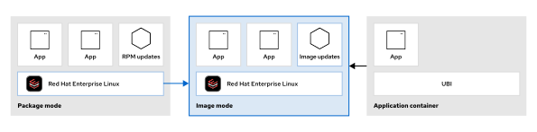
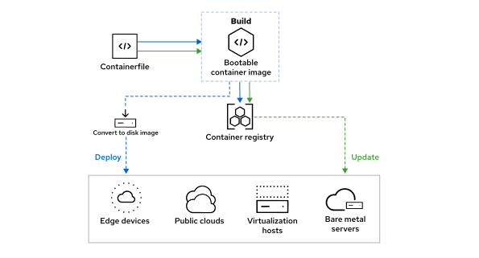
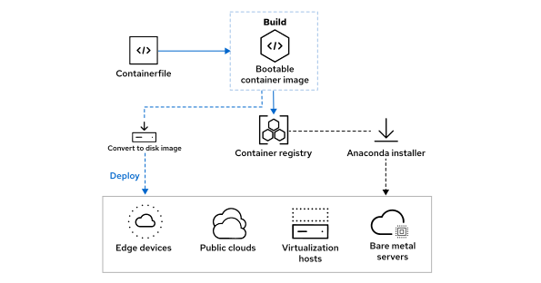
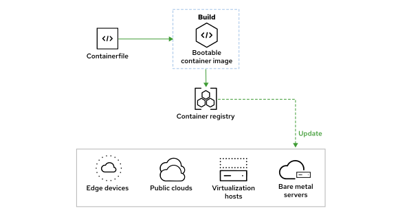
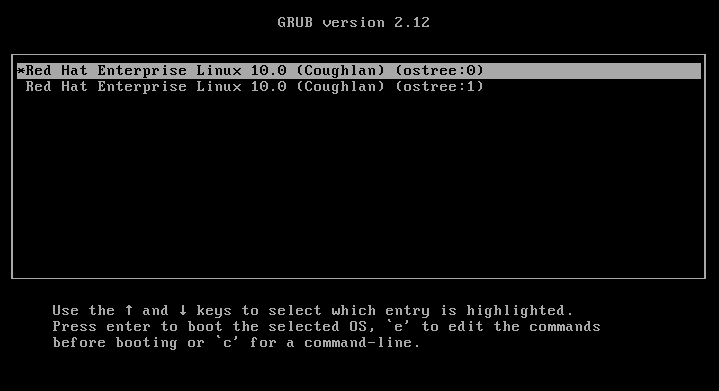

Quản trị hệ thống Red Hat 2
---------------------------

# Chương 18. Làm việc với Red Hat Enterprise Linux dạng ảnh (image-based)
## Chế độ Image cho Red Hat Enterprise Linux
### Mục tiêu
So sánh và đối chiếu chế độ cài đặt theo dạng ảnh (image mode) và chế độ cài đặt theo gói (package mode) cho Red Hat Enterprise Linux.

### Giới thiệu về Chế độ Image
Image mode dành cho Red Hat Enterprise Linux 10 là một phương pháp triển khai và quản lý mới, sử dụng các công cụ native-container để
xây dựng, triển khai và quản lý hệ điều hành. Với phương pháp này, bạn có thể triển khai hệ điều hành từ một image container có khả
năng khởi động (bootc).

**Hình 18.1: Sử dụng các image container để cập nhật hệ điều hành**  


Công nghệ container đã tồn tại nhiều năm và chứng minh được hiệu quả trong việc triển khai các ứng dụng. Kỹ thuật hiệu quả tương tự —
sử dụng các image (ảnh) phân lớp — cũng có thể được áp dụng cho toàn bộ máy chủ (host). Tuy nhiên, image cơ sở (base image) trong
trường hợp này phức tạp hơn so với loại image dùng cho container ứng dụng. Một container image có khả năng khởi động (bootable) cần bao
gồm nhân hệ điều hành (kernel), trình nạp khởi động (boot loader) và các thành phần hệ điều hành khác vốn thường không có trong
container ứng dụng.

Red Hat cung cấp các image cơ sở bootc dành cho kiến trúc AMD/Intel x86_64 và ARM 64-bit. Bạn có thể tự xây dựng image phái sinh từ
image cơ sở này bằng cách bổ sung phần mềm ứng dụng và các thành phần phụ thuộc (dependencies) mà bạn lựa chọn.

### Quy trình làm việc Chế độ Image
Chế độ Image (Image mode) mang đến một phương thức quản trị hệ thống dựa trên nền tảng container. Việc xây dựng image container `bootc`
đóng vai trò là nền tảng cốt lõi. Image này sau đó được triển khai tới các hệ thống đích khác nhau. Các hoạt động quản lý sau giai đoạn
triển khai ban đầu bao gồm việc cập nhật image container gốc, trong đó các hệ thống đích sẽ tải các bản cập nhật hệ điều hành mới từ
registry.

**Hình 18.2: Quy trình làm việc ở chế độ hình ảnh**  


#### Xây dựng - Build
Bạn có thể định nghĩa toàn bộ hệ điều hành của mình bằng cách sử dụng một tệp Containerfile tiêu chuẩn. Tệp này chỉ định hình ảnh bootc
cơ sở làm điểm khởi đầu và cung cấp các hướng dẫn bổ sung để xây dựng hình ảnh khi cần thiết. Bạn có thể sử dụng công cụ Podman để xây
dựng và gắn thẻ cho hình ảnh container.

#### Triển khai - Deploy
Sau khi quá trình build hoàn tất, image container có khả năng khởi động (bootable container image) cần được đẩy lên một registry mà các
hệ thống đích có thể truy cập được. Registry này đóng vai trò là nguồn dữ liệu chuẩn (source of truth) trong quá trình triển khai ban
đầu cũng như trong suốt quá trình quản lý hệ thống về sau.

Trình cài đặt Anaconda cho Red Hat Enterprise Linux hỗ trợ chế độ image để triển khai lên các hệ thống bare-metal cũng như máy ảo thông
qua cơ chế tự động hóa Kickstart.

Đối với môi trường đám mây, Red Hat cung cấp công cụ dạng container mang tên `bootc-image-builder` để hỗ trợ tạo các loại image đĩa
khác nhau từ image `bootc`. Các định dạng được hỗ trợ bao gồm: qcow2 (QEMU), ami (Amazon), vmdk (vSphere) và gce (Google).

#### Quản lý
Trên các hệ thống được triển khai ở chế độ image, công cụ dòng lệnh `bootc` có thể tự thực hiện việc tải các bản cập nhật (được cung
cấp dưới dạng container image) và cài đặt chúng vào hệ thống. Theo mặc định, các hệ thống đích sẽ tự động cập nhật khi một phiên bản
mới hơn của image `bootc` được gắn thẻ (tag) trong container registry. Do các bản cập nhật hoạt động theo cơ chế giao dịch
(transactional), hệ thống luôn cần phải khởi động lại. Lệnh `bootc` cũng hỗ trợ tính năng hoàn tác (rollback) bằng cách cập nhật mục
cấu hình bộ nạp khởi động (boot-loader entry) để trỏ về bản triển khai đã cài đặt trước đó.

### Lợi ích của Chế độ Image
So với phương thức đóng gói truyền thống, chế độ hình ảnh mang lại một số ưu điểm.

**Hạn chế tình trạng lệch cấu trúc hạ tầng**  
Tình trạng lệch cấu trúc hạ tầng (infrastructure drift) là một thách thức trong các môi trường đám mây hiện nay, khi hệ thống dần sai
lệch so với trạng thái dự kiến do các thay đổi cấu hình thủ công. Chế độ Image mode giúp hạn chế tình trạng này bằng cách sử dụng các
công cụ và kỹ thuật container đã được chuẩn hóa và kiểm chứng.

**Hệ điều hành bất biến**  
Ở chế độ ảnh hệ thống (image mode), hệ thống tập tin gốc mặc định là bất biến và các bản cập nhật ứng dụng diễn ra theo cơ chế nguyên
tử (atomic). Các thư mục `/etc` và `/var` được dành riêng để lưu trữ dữ liệu cục bộ của máy có thể thay đổi được. Thiết kế bất biến này
giúp tăng cường tính ổn định và bảo mật.

**Định nghĩa hệ thống được quản lý bằng hệ thống kiểm soát phiên bản**  
Containerfile hiện đóng vai trò là bản thiết kế đơn giản hóa cho hệ điều hành, bao gồm cấu hình hệ thống và các tệp tin ứng dụng. Các
container có khả năng khởi động (bootable containers) được tạo ra bằng cách sử dụng các công cụ hiện có như Podman.

**Khả năng mở rộng tốt hơn**  
Các image container có tốc độ tạo nhanh, và các bản cập nhật sau đó được lưu trữ hiệu quả dưới dạng các lớp image bổ sung. Một tổ chức
có thể duy trì một số lượng image nhất định và triển khai chúng trên nhiều hệ thống trong các môi trường trung tâm dữ liệu quy mô lớn.

**Đơn giản hóa quy trình khắc phục sự cố**  
Các bản cập nhật hệ thống có tính nguyên tử và được cung cấp dưới dạng các image container đã được cập nhật, cho phép hoàn tác
(rollback) khi cần thiết.

## Tạo ảnh cài đặt cho Chế Image
### Mục tiêu
Chuẩn bị một image container có khả năng khởi động để sử dụng với chế độ image (image mode) của Red Hat Enterprise Linux.

### Định dạng Containerfile
Khi sử dụng chế độ image (image mode) cho Red Hat Enterprise Linux, bạn triển khai phần mềm, các thành phần phụ thuộc liên quan và tệp
cấu hình tới các máy chủ bằng cách sử dụng các image container tuân thủ tiêu chuẩn Open Container Initiative (OCI). Các image container
này cung cấp các bản cập nhật hệ điều hành, đồng thời cho phép hoàn tác (roll back) về trạng thái trước đó nếu cần thiết.

Bạn có thể sử dụng các công cụ quen thuộc và sẵn có như Podman để xây dựng image container. Một thành phần quan trọng trong quy trình
xây dựng là Containerfile; đây là tệp được sử dụng rộng rãi để tạo container ứng dụng và mang lại lợi ích nhờ định dạng được chuẩn hóa.

**Hình 18.3: Xây dựng và xuất bản một image từ Containerfile**  


Bằng cách thêm một loạt các chỉ dẫn vào Containerfile, bạn có thể tùy chỉnh image để đáp ứng nhu cầu của mình. Mỗi dòng trong
Containerfile tạo ra một lớp image (image layer), nghĩa là các chỉ dẫn được thực thi một cách độc lập. Trong quá trình build, mỗi chỉ
dẫn chạy trong một container độc lập, sử dụng một image trung gian được tạo ra từ các lệnh trước đó.

Ví dụ về Containerfile dưới đây dùng để build một container ứng dụng điển hình:

```
# Use the ubi10 base image
FROM registry.redhat.io/ubi10 (1)

# Install httpd
RUN dnf install -y httpd (2)

# Copy a temporary index.html file to the web server root
COPY index.html /var/www/html/index.html (3)

# Expose port 80 for httpd
EXPOSE 80 (4)

# Set the entrypoint to run httpd in the foreground
ENTRYPOINT ["/usr/sbin/httpd", "-DFOREGROUND"] (5)
```

1. Red Hat Universal Base Image là nền tảng cho container ứng dụng này.
2. Dịch vụ Apache HTTP được cài đặt chồng lên trên image nền tảng (base image).
3. Tệp index.html được sao chép từ thư mục dự án vào vị trí quy định bên trong container.
4. Chỉ thị EXPOSE xác định cổng mà dịch vụ sẽ lắng nghe khi chạy. Cổng HTTP là TCP/80, được quy định trong tệp cấu hình Apache tiêu
chuẩn đi kèm với gói RPM httpd.
5. Chỉ thị ENTRYPOINT xác định tệp thực thi cần chạy cùng các tham số sẽ được truyền vào tệp đó khi container khởi động.

Mặc dù tệp Containerfile mẫu này đủ để tạo một container ứng dụng, nhưng phương pháp xây dựng một container có khả năng khởi động
(bootable container) lại có phần khác biệt. Quan trọng nhất là image nền phải là một image chuyên dụng, bao gồm các thành phần cần
thiết cho một hệ điều hành hoàn chỉnh, chẳng hạn như kernel, trình nạp khởi động (boot loader) và trình quản lý dịch vụ systemd.
Red Hat cung cấp image nền rhel-bootc; image này tích hợp các công cụ từ các dự án nguồn (upstream) như `OSTree`, `composefs` và
`bootc` nhằm hỗ trợ chế độ image cho RHEL.

> **Quan trọng**: Red Hat Enterprise Linux ở chế độ image (image mode) và image rhel-bootc chịu sự điều chỉnh của Thỏa thuận cấp phép
người dùng cuối (EULA) dành cho Red Hat Enterprise Linux. Do đó, bạn không được phép phân phối lại công khai image cơ sở hoặc bất kỳ
image nào do người dùng tạo ra từ image đó.

Ví dụ, Containerfile dưới đây cài đặt và kích hoạt gói httpd trên nền ảnh rhel-bootc. Hãy lưu ý những điểm khác biệt so với ví dụ về
container ứng dụng trước đó.

```
# Use the rhel-bootc base image
FROM registry.redhat.io/rhel10/rhel-bootc:latest (1)

# Install and enable httpd
RUN dnf -y install httpd mod_ssl && dnf clean all (2)
RUN systemctl enable httpd && firewall-cmd --add-service=https (3)

# Add httpd related files
ADD ./etc/ /etc (4)
COPY ./index.html /var/www/html/index.html (5)
```

1. Dòng `FROM` chỉ dẫn Podman sử dụng image container `rhel-bootc` làm nền tảng.
2. Các dòng `RUN` thực thi chuỗi lệnh bên trong container, đồng thời tạo ra các lớp image mới trong quá trình này.
3. Do image này dành cho RHEL ở chế độ image (image mode), `Containerfile` này kích hoạt dịch vụ `httpd` thay vì cấu hình chỉ thị
`ENTRYPOINT` hoặc `CMD`. Ngoài ra, `Containerfile` này mở tường lửa cho HTTPS thay vì sử dụng chỉ thị `EXPOSE`.
4. Dòng `ADD` đưa một tệp hoặc thư mục vào vị trí đích bên trong container. Ngoài các tệp cục bộ, lệnh `ADD` còn có thể xử lý các tệp
từ mạng hoặc giải nén các tệp từ một tệp lưu trữ (archive).
5. Lệnh `COPY` sao chép một tệp hoặc thư mục từ đường dẫn tương đối đến vị trí đích. Lệnh `COPY` không giải nén các tệp trong tệp lưu
trữ mà sao chép trực tiếp các tệp lưu trữ đó vào container.

> **Lưu ý**: Trang hướng dẫn Containerfile(5) trình bày chi tiết các thông số kỹ thuật đầy đủ cho định dạng Containerfile. Nhiều lệnh
> hỗ trợ các tùy chọn và đối số bổ sung, cho phép bạn tùy biến đáng kể hình ảnh container (container image) được tạo ra.

Một số lệnh trong Containerfile không có tác dụng đối với RHEL ở chế độ image:

* Chỉ thị ENTRYPOINT và CMD được thay thế bằng việc khởi động các dịch vụ thông qua trình quản lý dịch vụ systemd. 
* Chỉ thị ENV được thay thế bằng việc cấu hình dịch vụ systemd. 
* Chỉ thị EXPOSE chỉ mang tính chất ghi chú các cổng ứng dụng. Ở chế độ image, bạn có thể kiểm soát quyền truy cập vào các cổng thông
qua cấu hình tường lửa. 
* Chỉ thị USER được thay thế bằng cơ chế quản lý người dùng tại thời điểm thực thi (runtime).

Mặc dù các lệnh này không ảnh hưởng đến hệ thống RHEL ở chế độ image, bạn vẫn có thể sử dụng các lệnh như ENV để hỗ trợ các bước trung
gian trong Containerfile. Ví dụ: bạn có thể định nghĩa một danh sách các gói phần mềm bằng lệnh ENV, sau đó cài đặt các gói đó ở bước
sau bằng lệnh RUN.

### Xây dựng các image container có khả năng khởi động
Bạn có thể sử dụng lệnh `podman build` để tạo ảnh bootc từ dòng lệnh. Podman sử dụng tệp Containerfile trong thư mục được chỉ định để
tạo ảnh container. Tùy chọn `--squash` giúp gộp tất cả các lớp mới thành một lớp duy nhất, qua đó giảm bớt độ phức tạp và số lượng lớp
của ảnh.

```console
user@host:~$ podman build --squash -t \
registry.example.com/user/webserver-bootc:latest .
...output omitted...
```

Sau khi tạo image, bạn có thể đẩy image đó lên kho lưu trữ image bằng cách sử dụng lệnh `podman push`.

```console
user@host:~$ podman push registry.example.com/user/webserver-bootc:latest
...output omitted...
```

### Kiểm thử Image có khả năng khởi động ở Chế độ Ứng dụng
Để kiểm thử một container có khả năng khởi động trước khi triển khai, hãy sử dụng lệnh `podman run` để khởi chạy container trên máy
cục bộ. Ví dụ sau đây khởi động image container `registry.example.com/user/webserver` và chuyển tiếp cổng 8080 tới cổng 80 bên trong
container:

```console
user@host:~$ podman run -d -p 8080:80 registry.example.com/user/webserver
9622...6a28
```

Sau đó, bạn có thể xác minh rằng container hoạt động đúng như mong đợi. Trong trường hợp này, bạn có thể kiểm tra xem máy chủ web có
thể truy cập được qua cổng 8080 hay không bằng cách sử dụng lệnh `curl`.

```console
user@host:~$ curl http://localhost:8080
Hello image mode for RHEL!
```

Bạn cũng có thể kiểm tra chức năng bằng cách xem các tiến trình đang chạy trong container thông qua lệnh `podman exec`.

```console
user@host:~$ podman exec -l ps -ef
UID    PID ...      TIME CMD
root     1 ... 00:00:00 /sbin/init
root    34 ... 00:00:00 /usr/lib/systemd/systemd-journald
rpc     57 ... 00:00:00 /usr/bin/rpcbind -w -f
dbus    66 ... 00:00:00 /usr/bin/dbus-broker-launch --scope system --audit
root    69 ... 00:00:00 /usr/sbin/NetworkManager --no-daemon
root    75 ... 00:00:00 /usr/lib/systemd/systemd-logind
root    76 ... 00:00:00 /usr/libexec/udisks2/udisksd
root   133 ... 00:00:00 /usr/sbin/gssproxy -D
root   142 ... 00:00:00 /usr/sbin/httpd -DFOREGROUND
root   154 ... 00:00:00 sshd: /usr/sbin/sshd -D [listener] 0 of 10-100 startups
apache 193 ... 00:00:00 /usr/sbin/httpd -DFOREGROUND
apache 194 ... 00:00:00 /usr/sbin/httpd -DFOREGROUND
apache 196 ... 00:00:00 /usr/sbin/httpd -DFOREGROUND
apache 207 ... 00:00:00 /usr/sbin/httpd -DFOREGROUND
root   378 ... 00:00:00 /bin/bash
```

Lưu ý rằng PID 1 là tiến trình init. Tiến trình init này chính là trình quản lý dịch vụ systemd, vốn đã khởi động dịch vụ httpd.

Khi chạy một container dựa trên bootc ở chế độ ứng dụng, nhân (kernel) RHEL đi kèm sẽ không khởi động. Các tiến trình sẽ chạy trong
ngữ cảnh của nền tảng container—trong ví dụ này là podman.

## Cài đặt Red Hat Enterprise Linux bằng chế độ image
### Mục tiêu
Cài đặt Red Hat Enterprise Linux trên máy chủ mới bằng chế độ image.

### Triển khai Container có khả năng khởi động
Một image container có khả năng khởi động (bootable container image) bao gồm nhân hệ điều hành (kernel), trình nạp khởi động (boot
loader) và các thành phần hệ điều hành khác vốn thường không có trong các container ứng dụng. Mặc dù bạn có thể khởi chạy một instance
container từ image bootc để kiểm thử ứng dụng được tích hợp sẵn trong đó, nhưng xét cho cùng, loại image này cần được triển khai trên
một máy chủ khởi động trực tiếp từ chính image đó.

**Hình 18.4: Sử dụng container có khả năng khởi động để triển khai máy chủ**  


Khi nội dung của image được cài đặt trên máy vật lý hoặc máy ảo và hệ thống khởi động, bản thân phần triển khai ở không gian người
dùng (user space) không chạy dưới dạng container. Lúc này, container runtime từng được sử dụng để tạo image đó không còn đóng vai trò
gì nữa. Khi công cụ bootc hoạt động ở chế độ đã triển khai (deployed mode), kernel được cài đặt từ image sẽ thực thi trong quá trình
khởi động, và systemd sẽ chạy với tư cách là Tiến trình số 1 (PID 1) để quản lý mọi dịch vụ, đúng theo cơ chế thường thấy trên Red Hat
Enterprise Linux. Công cụ bootc không phải là một tiến trình nền (daemon) chạy thường trực và không gây thêm bất kỳ gánh nặng hiệu
năng nào trong quá trình vận hành.

#### Triển khai trên bare-metal sử dụng Anaconda Kickstart
Để triển khai các máy chủ bare-metal, phương pháp được khuyến nghị là sử dụng tính năng Kickstart của trình cài đặt Anaconda, vốn hỗ
trợ chế độ image (image mode).

Tệp Kickstart giúp tự động hóa quá trình cài đặt bằng cách cung cấp sẵn các thiết lập cho những tùy chọn cấu hình mà thông thường
trình cài đặt tương tác sẽ yêu cầu người dùng nhập liệu, chẳng hạn như cấu hình lưu trữ, quản lý người dùng và lựa chọn gói phần mềm.

Nhìn chung, tất cả các lệnh và phần tiêu chuẩn của một tệp Kickstart thông thường đều có thể được giữ nguyên và sử dụng trong chế độ
image. Điểm khác biệt đáng chú ý duy nhất nằm ở cách thức chỉ định phần mềm cần cài đặt. Theo cách truyền thống, Anaconda được sử dụng
ở chế độ package (package mode), trong đó phần `%packages` của tệp Kickstart là bắt buộc để xác định các gói phần mềm mà bạn muốn cài
đặt:

```
%packages
@^minimal-environment
vim-enhanced
%end
```

Để sử dụng Kickstart ở chế độ image, bạn phải loại bỏ phần `%packages` và thay thế bằng lệnh `ostreecontainer` nhằm chỉ định registry
và container có khả năng khởi động (bootable container) cần triển khai trên hệ thống đích. Image của container phải được xây dựng dựa
trên image nền `rhel-bootc` chính thức.

```
ostreecontainer --url=registry.lab.example.com:5000/student/webserver-bootc
```

Lệnh này tham chiếu đến dự án libostree – thành phần mà bootc hiện đang phụ thuộc vào để lưu trữ image container cơ sở. Việc sử dụng
OSTree là một lựa chọn về mặt thiết kế, và vai trò của nó có thể sẽ giảm đi trong tương lai.

> **Lưu ý**: Việc sử dụng trực tiếp lệnh rpm-ostree để thực hiện các thay đổi hệ thống hoặc cài đặt nội dung không được hỗ trợ.

Ảnh đĩa RHEL bootc là loại tổng quát và không bao gồm bất kỳ cấu hình nào, chẳng hạn như tài khoản người dùng mặc định. Để tạo tài
khoản người dùng và thiết lập mật khẩu hoặc nạp khóa công khai SSH, bạn có thể sử dụng các lệnh Kickstart tiêu chuẩn. Ví dụ dưới đây
thiết lập mật khẩu root và tạo một tài khoản người dùng có quyền quản trị:

```
rootpw --iscrypted $6$KUnFfrTzO8jv.PiH$YlBbOtXBkWzoMuRfb0.SpbQ....XDR1UuchoMG1
user --name=student --groups=wheel --iscrypted --password=$6$JJlPUjtsQ....F2co
```

Sau khi đã điều chỉnh thành công tệp Kickstart để sử dụng ở chế độ image (image mode), bạn có thể công bố tệp này để đưa vào sử dụng
trong môi trường của mình. Lựa chọn phổ biến nhất là sao chép tệp sang một máy chủ web có thể truy cập được qua mạng nội bộ.

Để khởi động trình cài đặt Anaconda trên hệ thống đích, bạn có thể chọn một trong nhiều phương pháp. Bạn có thể thiết lập dịch vụ PXE
để khởi động qua mạng (một giải pháp nâng cao hơn), hoặc sao chép tệp ISO cài đặt nhị phân RHEL vào ổ USB để khởi động thủ công cho
máy mới. Dù chọn cách nào, khi menu khởi động Anaconda xuất hiện trên hệ thống đích, bạn cần cung cấp tham số `inst.ks=URL` trong dòng
lệnh kernel để chỉ định vị trí của tệp Kickstart cho trình cài đặt.

Nếu tệp Kickstart không được tham chiếu chính xác, Anaconda sẽ khởi động giao diện người dùng đồ họa thông thường; giao diện này hiện
không hỗ trợ chế độ image.

> **Lưu ý**: Để biết thêm thông tin về cách sử dụng Kickstart, hãy tham khảo phần
> [Cài đặt tự động Red Hat Enterprise Linux](https://docs.redhat.com/en/documentation/red_hat_enterprise_linux/10/html-single/automatically_installing_rhel/index).

#### Tạo ảnh đĩa cho môi trường đám mây lai
Tính di động là một yếu tố quan trọng khi sử dụng Red Hat Enterprise Linux ở chế độ image (image mode). Ngoài các hệ thống bare-metal,
các image bootc còn có thể được triển khai trên máy ảo, môi trường đám mây và môi trường biên (edge). Quy trình này bao gồm việc
chuyển đổi image bootc sang một trong các định dạng đĩa gốc (native disk format).

Công cụ bootc-image-builder được cung cấp để tạo image đĩa từ image bootc cho nhiều nền tảng khác nhau:

| Định dạng image  | Môi trường đích          |
|------------------|--------------------------|
| qcow2 (mặc định) | QEMU                     |
| vmdk             | VMware vSphere           |
| vhd              | Microsoft Virtual PC     |
| ami              | Amazon Machine Image     |
| gcd              | Google Compute Engine    |
| raw              | Ổ đĩa thô chưa định dạng |

Để bắt đầu sử dụng công cụ bootc-image-builder, trước tiên bạn cần tải xuống image container của nó từ Red Hat Ecosystem Catalog.
Công cụ này được thiết kế để chạy dưới dạng container và không có sẵn dưới dạng gói RPM trong RHEL.

Các bước dưới đây hướng dẫn cách sử dụng lệnh podman để tải image container cần thiết. Lệnh sudo được sử dụng để nâng quyền, vì công
cụ `bootc-image-builder` cần chạy dưới quyền root khi được khởi chạy để tạo các image đĩa.

* Xác thực với registry:

```console
user@host:~$ sudo podman login registry.redhat.io
Username: provide_username
Password: provide_password
Login Succeeded!
```

* Tải xuống image container bootc-image-builder:

```console
user@host:~$ sudo podman pull registry.redhat.io/rhel10/bootc-image-builder
...output omitted...
8717...d405
```

#### Tạo tệp ảnh đĩa QCOW2
Định dạng ảnh đĩa mặc định mà công cụ `bootc-image-builder` tạo ra là QCOW2. Định dạng đĩa này có thể được sử dụng để triển khai các
máy ảo chạy trên nền tảng ảo hóa KVM (Kernel-based Virtual Machine).

Red Hat Enterprise Linux cung cấp các chức năng ảo hóa thông qua KVM. Các khả năng ảo hóa này còn được mở rộng hơn nữa trong các sản
phẩm OpenShift Virtualization và Red Hat OpenStack Platform.

Ví dụ sau đây minh họa cách tạo ảnh đĩa QCOW2 từ một ảnh container khởi động (bootable container image) tùy chỉnh, được xây dựng dựa
trên ảnh nền `rhel-bootc` chính thức.

Ảnh nền `rhel-bootc` của RHEL là ảnh tổng quát và không chứa sẵn tài khoản người dùng nào. Phương pháp được khuyến nghị để tạo người
dùng là cung cấp một tệp tùy chỉnh chứa thông tin người dùng cần thiết cho công cụ `bootc-image-builder`. Hãy tạo tệp `config.toml`
trong thư mục dự án của bạn để định nghĩa người dùng với nội dung tương tự như ví dụ sau:

```
[[customizations.user]]
name = "user1"
password = "password1"
groups = ["wheel"]

[[customizations.user]]
name = "user2"
password = "password2"
groups = ["wheel"]
```

Tệp cấu hình xây dựng mẫu này sử dụng định dạng dữ liệu TOML; định dạng JSON cũng được hỗ trợ.

Trong quá trình xây dựng ảnh (image), tệp này cần được ánh xạ vào container thông qua đường dẫn `/config.toml`.

Một yêu cầu tiên quyết khác là tạo một thư mục trong dự án được liên kết với thư mục đầu ra bên trong container—nơi công cụ
`bootc-image-builder` sẽ ghi tệp ảnh đĩa định dạng qcow2.

```console
user@host:~$ mkdir output
```

Để bắt đầu quy trình xây dựng, hãy chạy container `bootc-image-builder` với các tham số sau:

```console
user@host:~$ sudo podman run \
--rm \
-it \
--privileged \ (1)
--security-opt label=type:unconfined_t \
-v ./config.toml:/config.toml \  (2)
-v ./output:/output \ (3)
registry.redhat.io/rhel10/bootc-image-builder \
--type qcow2 \ (4)
registry.lab.example.com/user/bootc-httpd:latest (5)
...output omitted...
```

1. Container này phải chạy với quyền root.
2. Tệp tùy chỉnh dùng để tạo tài khoản người dùng được mount vào container `bootc-image-builder` tại đường dẫn quy định là
`/config.toml`.
3. Thư mục đầu ra nằm trong thư mục làm việc hiện tại được mount vào container tại đường dẫn quy định là `/output`.
4. Chỉ định loại ảnh đĩa (disk image).
5. Tham chiếu đến ảnh container có khả năng khởi động (bootable container image) đã được tùy chỉnh để chuyển đổi thành ảnh đĩa.

#### Triển khai máy ảo mới trên KVM
Để kiểm tra image đĩa mới, hãy sao chép nó vào vị trí trên hệ thống tệp mà các hypervisor RHEL mặc định sử dụng để lưu trữ các image:

```console
user@host:~$ sudo cp output/qcow2/disk.qcow2 /var/lib/libvirt/images/
```

Sau đó, hãy tạo một máy ảo bằng cách sử dụng lệnh `virt-install`. Ví dụ dưới đây xác định các thiết lập tối thiểu để tạo máy ảo và
nhập đĩa đã được tạo bởi container `bootc-image-builder`.

```console
user@host:~$ sudo virt-install \
--name bootc-webserver \
--memory 4096 \
--import --disk /var/lib/libvirt/images/disk.qcow2 \
--graphics none \
--osinfo rhel10.0 \
--noautoconsole \
--noreboot
...output omitted...
```

Sau khi định nghĩa thành công máy ảo mới, bạn có thể khởi động nó bằng cách sử dụng lệnh `virsh`.

```console
user@host:~$ sudo virsh start bootc-webserver
...output omitted...
```

## Quản lý các hệ thống dựa trên chế độ Image
### Mục tiêu
Quản lý, kiểm tra, sửa đổi và cập nhật máy chủ sử dụng chế độ image cho Red Hat Enterprise Linux.

### Chế độ Image – Hoạt động Ngày 2
Hoạt động "Day 2" (Day 2 operations) đề cập đến các tác vụ quản lý diễn ra liên tục trên hệ thống sau khi hệ thống đã được triển khai.
Các tác vụ này chiếm phần lớn khối lượng công việc cần thực hiện đối với hệ thống trong suốt vòng đời của nó.

Sau khi xây dựng và triển khai ảnh (image) bootc tới hệ thống đích, bạn có thể thực hiện các hoạt động Day 2 bằng cách tải về và áp
dụng các bản cập nhật. Các hoạt động này bao gồm những bản cập nhật dạng giao dịch (transactional updates) từ một registry container;
chúng được tổ chức theo các lớp (layered), được cài đặt tại chỗ (in-place) và có thể hoàn tác (roll back) nếu cần thiết.

**Hình 18.5: Quản lý hệ điều hành dựa trên chế độ ảnh (image mode)**  


### Xác minh trạng thái hiện tại của hệ thống
Bạn có thể kiểm tra trạng thái hiện tại của hệ thống bằng cách sử dụng lệnh `bootc status`. Lệnh này hiển thị thông tin về việc liệu
có hình ảnh (image) mới nào đang được chuẩn bị sẵn để cập nhật hay không, hình ảnh nào đang được hệ thống sử dụng để khởi động, cũng
như hình ảnh dự phòng để khôi phục (rollback) đã được thiết lập (nếu có). Đối với hệ thống mới được cài đặt, sẽ không có hình ảnh nào
ở trạng thái chờ cập nhật hoặc hình ảnh dự phòng để khôi phục.

```console
root@host:~# bootc status
apiVersion: org.containers.bootc/v1
kind: BootcHost
metadata:
  name: host
spec:
  image:
    image: registry.lab.example.com/user/example-bootc
    transport: registry
  bootOrder: default
status:
  staged: null
  booted:
    image:
      image:
        image: registry.lab.example.com/user/example-bootc
        transport: registry
      version: 10.20250116.0
      timestamp: null
      imageDigest: sha256:87b02be441cda3d66c9c...71b092ce7b2311e2defbb93f
    cachedUpdate: null
    incompatible: false
    pinned: false
    store: ostreeContainer
    ostree:
      checksum: 9981913741c37dbb6400...3b68479d2c33b6f5434aa338
      deploySerial: 0
  rollback: null
  rollbackQueued: false
  type: bootcHost
```

### Nâng cấp hệ thống
Red Hat Enterprise Linux chỉ cần được cài đặt ở chế độ image một lần duy nhất trên hệ thống. Sau khi hệ thống đã được cài đặt, bạn
phải thực hiện mọi thay đổi và cập nhật tiếp theo bằng cách làm theo các bước sau:

1. Chỉnh sửa tệp Containerfile trong thư mục dự án ảnh bootc.
2. Xây dựng lại ảnh container.
3. Đẩy ảnh container mới lên registry với cùng thẻ tên (tag).
4. Cập nhật ảnh trên hệ thống bằng lệnh bootc.
5. Khởi động lại hệ thống để áp dụng các thay đổi.

Khi sử dụng chế độ image cho RHEL, tính năng tự động cập nhật được bật theo mặc định. Dịch vụ systemd `bootc-fetch-apply-updates`
và các tệp đơn vị timer sẽ thường xuyên kiểm tra các bản cập nhật trên registry container và áp dụng chúng vào hệ thống.

```console
root@host:~# systemctl status bootc-fetch-apply-updates.timer
● bootc-fetch-apply-updates.timer - Apply bootc updates
     Loaded: loaded (/usr/lib/systemd/system/bootc-fetch-apply-updates.timer; disabled; preset: disabled)
     Active: active (waiting) since Wed 2025-04-09 13:22:18 EDT; 5min ago
...output omitted...
Apr 09 13:22:18 localhost systemd[1]: Started bootc-fetch-apply-updates.timer - Apply bootc updates.
```

Tuy nhiên, bạn có thể chọn cập nhật hệ thống theo cách thủ công. Việc cập nhật thủ công có thể phù hợp khi áp dụng các bản cập nhật
quan trọng hoặc phức tạp. Ngoài ra, bạn cũng có thể cần tắt tính năng tự động cập nhật nếu sử dụng các quy trình cập nhật tự động,
chẳng hạn như thông qua Ansible.

Để tắt hoàn toàn tính năng tự động cập nhật, bạn có thể vô hiệu hóa đơn vị bộ định thời (timer unit) chịu trách nhiệm kiểm tra các bản
cập nhật image.

```console
root@host:~# systemctl mask bootc-fetch-apply-updates.timer
Created symlink '/etc/systemd/system/bootc-fetch-apply-updates.timer' → '/dev/null'.
```

Để tự động lấy các bản cập nhật từ registry và khởi động vào bản triển khai mới, hãy sử dụng lệnh `bootc upgrade`. Lệnh này thực hiện
việc cập nhật tại chỗ (in-place) theo cơ chế giao dịch, chuyển dữ liệu từ registry chứa image container sang hệ điều hành đã được cài
đặt. Lệnh sẽ truy vấn registry, tải xuống các lớp image đã được cập nhật và cấu hình bản triển khai mới để sử dụng trong lần khởi động
kế tiếp. Khi image cơ sở đã cập nhật được chuẩn bị sẵn theo cách này, hệ thống đang hoạt động sẽ không bị ảnh hưởng. Việc khởi động
lại hệ thống là bắt buộc để áp dụng các thay đổi.

```console
root@host:~# bootc upgrade
layers already present: 69; layers needed: 2 (34.5 MB)
Fetching layers ████████████████████ 2/2
 └ Fetching ████████████████████ 242 B/242 B (0 B/s) layer sha256:e0f434edc580ca
Fetched layers: 32.95 MiB in 36 seconds (945.46 KiB/s)
Pruned images: 0 (layers: 0, objsize: 40.0 MB)
Queued for next boot: registry.lab.example.com/user/example-bootc
  Version: 10.20250116.0
  Digest: sha256:dc6a...27bc
Total new layers: 71    Size: 739.4 MB
Removed layers:   2     Size: 26.9 MB
Added layers:     2     Size: 34.5 MB
```

Bạn có thể sử dụng tùy chọn `--apply` để tự động khởi động lại hệ thống khi có sẵn image đã được chuẩn bị (staged image). Hãy sử dụng
tùy chọn `--check` để xem các bản cập nhật image mà không cần áp dụng chúng.

> **Lưu ý**: Các lệnh `bootc upgrade` và `bootc update` là các bí danh (alias) của nhau.

### Phân tích hệ thống tệp ở chế Image
Trong các hệ thống hoạt động theo cơ chế image (image mode), cấu trúc hệ thống tệp tương tự như cách cài đặt truyền thống ở chỗ các
thư mục như `/home`, `/etc`, `/var` và `/usr` vẫn lưu trữ các loại dữ liệu quen thuộc. Tuy nhiên, các vị trí này được sử dụng theo
cách khác biệt trong cơ chế image; chúng kết hợp các phân vùng bất biến (immutable) và khả biến (mutable) để duy trì tính nhất quán,
ngăn ngừa tình trạng sai lệch cấu hình (drift) mà vẫn đảm bảo dữ liệu được lưu giữ lâu dài.

#### Hệ thống tệp gốc
Chế độ image (image mode) dành cho RHEL sử dụng composefs cho hệ thống tệp gốc theo mặc định. Composefs là một hệ thống tệp lớp phủ
(overlay file system) cho phép tạo ra hệ thống tệp gốc ở trạng thái chỉ đọc thực sự. Dữ liệu được lấy từ một trong các bản triển khai
OSTree nằm trong thư mục `/ostree/repo`. OSTree có khả năng lưu trữ song song nhiều hệ thống tệp trong kho lưu trữ của mình, nhờ đó
cho phép triển khai image hệ thống tệp mới mà không cần xóa bỏ phiên bản cũ. Mô hình này tương tự như cơ chế kiểm soát phiên bản mã
nguồn, nhưng áp dụng cho toàn bộ đối tượng hệ thống tệp thay vì các tệp tin riêng lẻ. Việc kết hợp Composefs với hệ thống dựa trên
OSTree giúp cải thiện cả hiệu năng lẫn tính toàn vẹn của hệ thống tệp.

```console
root@host:~# df -h
Filesystem      Size  Used Avail Use% Mounted on
/dev/sda3       9.0G  1.9G  7.2G  21% /sysroot
composefs       8.4M  8.4M     0 100% /
devtmpfs        4.0M     0  4.0M   0% /dev
tmpfs           983M     0  983M   0% /dev/shm
tmpfs           394M  488K  393M   1% /run
tmpfs           983M     0  983M   0% /tmp
tmpfs           1.0M     0  1.0M   0% /run/credentials/systemd-journald.service
/dev/sda2       960M  153M  808M  16% /boot
tmpfs           1.0M     0  1.0M   0% /run/credentials/getty@tty1.service
tmpfs           197M  4.0K  197M   1% /run/user/1000
```

#### Các thư mục /etc và /var
Các thư mục hệ thống /etc và /var mặc định có tính chất có thể thay đổi (mutable) và bền vững (persistent), nhưng cách thức hoạt động
của chúng lại khác nhau.

Đối với thư mục /etc, image bootc thực hiện quy trình hợp nhất ba chiều (3-way merge) trong quá trình nâng cấp.

Mỗi cây hệ thống tệp (file-system tree) được triển khai từ image bootc đều sở hữu bản sao riêng của thư mục /etc. Các thay đổi cục bộ
của bạn trong thư mục /etc của bản triển khai đang khởi động sẽ được giữ lại và duy trì qua tất cả các lần nâng cấp sau này. Ngược
lại, các tệp không bị sửa đổi trong thư mục /etc sẽ được cập nhật nếu image bootc mới cung cấp các phiên bản mới hơn của chính những
tệp đó.

Unit `ostree-finalize-staged.service` thực hiện các tác vụ này trong quá trình tắt máy và tạo một mục trong bộ nạp khởi động
(boot-loader) cho bản triển khai mới.

Thư mục /var được chia sẻ giữa các bản triển khai hệ thống tệp khác nhau đã được cài đặt trên hệ thống. Thư mục này không bị hợp nhất
trong quá trình nâng cấp.

Theo mặc định, nội dung của thư mục /var được sao chép từ image container trong lần cài đặt ban đầu nhưng không được cập nhật sau đó.
Trong các lần nâng cấp tiếp theo, các tệp hiện có sẽ không bị thay đổi hoặc xóa bỏ, ngay cả khi Containerfile có chứa các chỉ dẫn cụ
thể yêu cầu thực hiện việc đó. Khi bạn thực hiện hoàn tác (roll back) bằng lệnh bootc, nội dung của thư mục /var sẽ không bị hoàn tác
theo.

> **Lưu ý**: Bạn không thể đẩy các thay đổi đối với nội dung trong thư mục /var thông qua việc nâng cấp hoặc hoàn tác (rollback) image.

### Lựa chọn phiên bản và khởi động
Chế độ image (image mode) cho RHEL sử dụng GRUB2 (GRand Unified Bootloader phiên bản 2) làm mặc định, ngoại trừ trên các kiến trúc
s390x. Mỗi bản triển khai OSTree hiện có trên hệ thống đều có một mục menu riêng.

Bộ nạp khởi động GRUB2 sử dụng các mục này để hiển thị một menu tương tác trong quá trình khởi động hệ thống. Trong các mục menu này,
các tham số kernel sẽ xác định bản triển khai OSTree nào được sử dụng cho hệ thống tập tin gốc (root file system). Cơ chế này cho phép
khởi động vào các bản triển khai trước đó nếu một bản nâng cấp cụ thể gây ra sự cố.

**Hình 18.6: Chọn phiên bản triển khai trong quá trình khởi động**  


### Khôi phục hệ thống

Bạn có thể sử dụng lệnh `bootc rollback` để khôi phục hệ thống về phiên bản image khả dụng trước đó. Khi lệnh được thực thi, việc
triển khai tương ứng với tùy chọn rollback sẽ được đưa vào hàng đợi cho lần khởi động tiếp theo, và phiên bản hiện tại sẽ trở thành
phiên bản rollback mới. Menu GRUB2 được cập nhật để hiển thị bản triển khai trước đó ở vị trí đầu tiên. Cuối cùng, nếu có mục đang ở
trạng thái chờ (staged entry), mục đó sẽ bị loại bỏ.

```console
root@host:~# bootc rollback
bootfs is sufficient for calculated new size: 0 bytes
Next boot: rollback deployment
```
